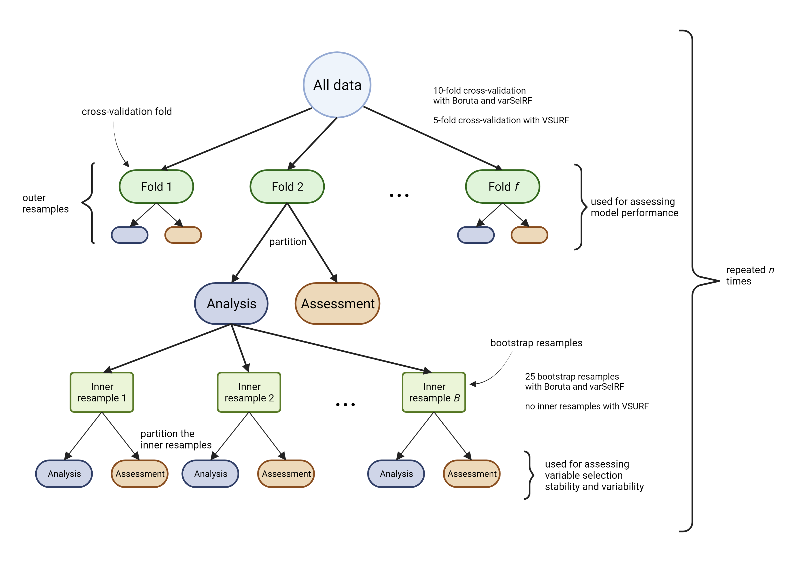

---
output:
  github_document:
    toc: TRUE
---


Boruta summary
=========

# Objective(s)
* Having used resampling to run the Boruta algorithm, look at the results returned
* Note that the Boruta algorithm attempts to find all relevant features related to the outcome. This differs from other algorithms which are designed to find a minimalist set for prediction.

```{r knitr-setup, include=FALSE, eval=TRUE}
options(digits = 3)
require(knitr)
## options
knitr::opts_chunk$set(eval = TRUE, echo = FALSE, cache = TRUE, fig.path = '../Figures/Boruta/', fig.height = 4)
```


---------------------------------------------------------------------------------------


```{r Libraries, eval=TRUE, echo=FALSE, message=FALSE}
library(tidyverse)
library(tidymodels)

library(kableExtra)

tidymodels_prefer()
```


```{r Load-the-Data, eval=TRUE, echo=FALSE}
# Assumes this RData object was saved upon running the script `BorutaVarSel1.R`
load("BorutaResSmall.RData")
```


# Application of the Boruta algorithm
Used a nested resampling approach to evaluating variable selection by the Boruta algorithm. 

The graphic shown below illustrates the scheme.



In our resampling scheme, the outer resample folds were created via 10-fold cross-validation, repeated 10 times, i.e. there were 100 outer splits. Each inner split was 25 bootstrap samples. Therefore, the Boruta algorithm was fit a total of 100*25 = 2500 times.

The inner bootstrap samples were split into analysis and assessment sets. The Boruta algorithm was run on the analysis set, and the variables "confirmed" were used to fit a random forest (RF) model (without tuning) on the (inner) analysis set of the data. The fitted RF model was then evaluated on the inner assessment data, using AUC as the evaluation metric.

The next steps then apply the results of running the Boruta algorithm to the fitting of RF on the outer resamples.

For each of the outer resamples (folds):

* tabulate the frequency (proportion) at which a variable was selected by the Boruta algorithm across the 25 inner bootstrap samples
* create a model formula from the set of variables that were confirmed in each bootstrap sample. That is, we restricted to variables that were confirmed in ALL of 25 of the bootstrap samples
* use the formula to fit a RF to the analysis part of the outer splits (folds), and predict on the (held out) assessment part. Use the default RF settings, no tuning.

The above steps were repeated 10 times (i.e., repeated 10-fold cross-validation) to estimate the outer cross-validated AUC variability.

## The average number of confirmed variables over 25 inner bootstrap resamples
Given that we started with 90 variables, we see that the Boruta algorithm did not drop many of them. We can interpret this as meaning that we started with a set of variables that were already related to the response (a testament that our variable creation schemes were successful in capturing conditions related to FHB).

```{r Boruta-confirmed-vars-per-bootstrap, eval=TRUE, echo=FALSE}
# The average number of confirmed variables over 25 inner bootstraps created per outer split:
Boruta_res %>%
  dplyr::mutate(no_vars = map(confirmed_smry, ~nrow(.x))) %>%
  dplyr::select(no_vars) %>%
  tidyr::unnest(cols = c(no_vars)) %>%
  dplyr::summarise(mean_no_vars = mean(no_vars))
```


## No. times a variable was confirmed across all Boruta runs
Across all the Boruta runs, we have 89 variables confirmed in at least one run.  That is, basically no variables were dropped, given the input data matrix had 90 predictors.

```{r Boruta-number-times-confirmed, eval=TRUE, echo=FALSE}
# This shows that across all the Boruta runs, we have 89 variables confirmed in at least one run.  That is, basically no variables were dropped, given the input data matrix had 90 predictors:
Boruta_res %>%
  dplyr::select(confirmed_smry) %>%
  tidyr::unnest(cols = confirmed_smry) %>%
  dplyr::group_by(var) %>%
  dplyr::summarise(total_count = sum(n)) %>%
  dplyr::arrange(var) %>%
  kable(., row.names = TRUE)
```

## Confirmed in all 2500 Boruta runs
```{r Boruta-confirmed-in-all-runs, eval=TRUE, echo=FALSE}
# The variables that were confirmed in each of the 2500 Boruta runs:
Boruta_res %>%
  dplyr::select(confirmed_smry) %>%
  # flatten out the list of tibbles:
  tidyr::unnest(cols = confirmed_smry) %>%
  dplyr::group_by(var) %>%
  dplyr::summarise(total_count = sum(n)) %>%
  dplyr::filter(total_count == 2500) %>%
  # Arranging by the variable name makes it easier to see the groups (e.g. rh)
  dplyr::arrange(var) %>%
  kable(., row.names = TRUE)
```

## *Not* confirmed in all 2500 Boruta runs
```{r Boruta-NOT-confirmed-in-all-runs, eval=TRUE, echo=FALSE}
# The variable that were **not** confirmed in each of the 2500 Boruta runs:
d <-
  Boruta_res %>%
  dplyr::select(confirmed_smry) %>%
  tidyr::unnest(cols = confirmed_smry) %>%
  dplyr::group_by(var) %>%
  dplyr::summarise(total_count = sum(n)) %>%
  dplyr::filter(total_count < 2500) %>%
  # Sort from those selected the most to the least:
  dplyr::arrange(desc(total_count))

# print(d, n = Inf)

# Perhaps easier to visualize...
d %>%
  # This trick updates the factor levels:
  dplyr::arrange(total_count) %>%
  dplyr::mutate(var = factor(var, levels = var)) %>%   
  ggplot(aes(x = var, y = total_count)) +
  geom_segment(aes(xend = var, yend = 0)) +
  geom_point(size = 4, colour = "orange") +
  coord_flip() +
  theme_bw() +
  xlab("") +
  ylab("Frequency") +
  geom_hline(yintercept = 2475, colour = "gray50", linetype = "dashed")
```

## Additional variables to keep
Based on the above, we propose keeping the top 8 from the group that was not confirmed in each of the 2500 Boruta runs. This then represents those variables confirmed in at least 99% of the Boruta runs (2500*0.99 = 2475).

```{r Boruta-keep-these-vars-too, eval=TRUE, echo=FALSE}
# Based on the table and visualization, perhaps keep the top 8 from the group that was not confirmed in each of the 2500 Boruta runs. This represents those variables confirmed in at least 99% of the Boruta runs (2500*0.99 = 2475):
d %>%
  dplyr::slice(1:8) %>%
  kable(., row.names = TRUE)
```

## Summary
If we want to use these results to suggest a set of variables to move forward with, we have the 69 that were confirmed in each of the 2,500 Boruta runs, as well as 8 additional which were confirmed in at least 2,475 Boruta runs.  That given a total of 77 variables, not much lower than the original set of 90 that we started with.

------------------------------------------

# AUC estimated on the outer cv folds
RECALL: Created a model formula from the set of variables that were confirmed in each bootstrap sample. Restricted to variables that were confirmed in ALL of the bootstrap samples (25 for each outer resample).

Used the formula to fit a RF to the analysis part of the outer splits, and predict on the assessment part. Use the default RF settings, no tuning. The outer splits were cv-folds.

This means fitting 100 different RF models and evaluating their performance (via the AUC metric).

## No. variables per model

Recall: the outer RF models were fit using variables that were returned by Boruta in all 25 of the inner bootstrap resamples.  That is, for a variable to be included in the outer RF model, it had to have been selected in each of the 25 inner bootstraps.  In the output below, we can see that very few variables were dropped (out of the input set of 90).

```{r outer-RF-number-vars, eval=TRUE, echo=FALSE}
# How many variables per outer resample RF model?
N_BOOT <- 25

Boruta_res %>%
  dplyr::mutate(no.vars = purrr::map_dbl(confirmed_smry, function(.confirmed_smry) {zee <- .confirmed_smry %>%
    dplyr::filter(n == N_BOOT) %>% dplyr::pull(var); return(length(zee)) })) %>%
  dplyr::summarise(across(no.vars, list(min = min, max = max, mean = mean, sd = sd, median = median), .names = "{.fn}"))
```


## No. unique models

Not all models returned by the above-described method were unique! This means that, among the bootstrap resamples, the variables that were selected across a group of all 25 inner resamples would again be selected when the algorithm was run on another group of 25 inner resamples created from a different outer fold.  This again points to certain variables being more 'important' than others.

We end up with 50 distinct models. 

```{r outer-RF-distinct-models, eval=TRUE, echo=FALSE}
Boruta_res %>%
  dplyr::mutate(fmla2 = purrr::map(confirmed_smry, function(.confirmed_smry) {zee <- .confirmed_smry %>%
    dplyr::filter(n == N_BOOT) %>% dplyr::pull(var) %>% sort(); return(paste(zee, collapse = " + ")) })) %>%
  dplyr::select(fmla2) %>%
  tidyr::unnest(cols = fmla2) %>%
  dplyr::distinct() %>%
  nrow()
```


## Histogram
Performance of the RF models (at least according to AUC) is rather high.

```{r outer-auc-histogram, eval=TRUE, echo=FALSE}
# RECALL: Created a model formula from the set of variables that were confirmed in each bootstrap sample. Restricted to variables that were confirmed in ALL of the bootstrap samples (N_BOOT)
# Use the formula to fit a RF to the analysis part of the outer splits, and predict on the assessment part. Use the default RF settings, no tuning. The outer splits were cv-folds.

# A histogram of the roc_auc from the fits of the models on the outer analysis splits and their predictions on the assessment part of the splits:
Boruta_res %>%
  dplyr::select(auc2) %>%
  tidyr::unnest(cols = auc2) %>%
  ggplot(., aes(x = .estimate)) +
  geom_histogram(binwidth = 0.01, fill = "grey80", colour = "black") +
  theme_bw() +
  xlab("AUC")
```

## Tabular summary of AUC
One could be suspicious of an estimated (max) AUC of 0.972 on the outer assessment part of the data --- seems too good to be true.  

Nevertheless, does indicate good performance of RF models in predicting FHB epidemics.

```{r outer-auc-tabular-summary}
# Tabular summary of the roc_auc values:
Boruta_res %>%
  dplyr::select(auc2) %>%
  tidyr::unnest(cols = auc2) %>%
  dplyr::summarise(across(.estimate, list(min = min, max = max, mean = mean, sd = sd, median = median), .names = "{.fn}"))
```


# Synopsis

* We had created a variable set consisting of 328 weather-based predictors, but knew that many of them were highly correlated.  

* We used pre-screening algorithms to remove (i) zero variance predictors, (ii) linear combinations of predictors, and (iii) highly correlated predictors (i.e., with a Pearson correlation of at least 0.9).  This left a set of 90 predictors, which were then fed to the Boruta algorithm.

* The Boruta algorithm is designed to return all variables related to the outcome.  Given that only a handful of variables were dropped from the input predictor list, we can be confident that our variable creation efforts have been successfully capturing the signals associated with FHB epidemics.

* Random forests (RF) fit to sets of variables returned by Boruta appear to have high performance in predicting FHB epidemics.  However, on average each RF is using 79 predictors.  Although RF models fit quickly, this is still too many variables to have to maintain and calculate, and so we wonder if this set can be reduced to a minimalist set for predictive purposes. 

* Results do indicate that there could be several equally-competitive RF models.


# Computational environment
```{r SessionInfo, eval=TRUE, echo=FALSE, results='markup'}
R.Version()$version.string
R.Version()$system
sessionInfo()
```