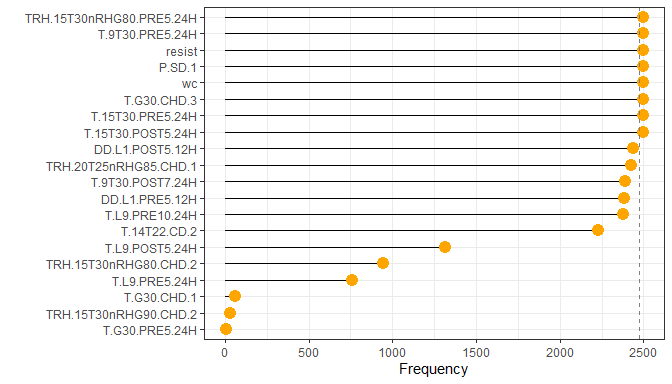
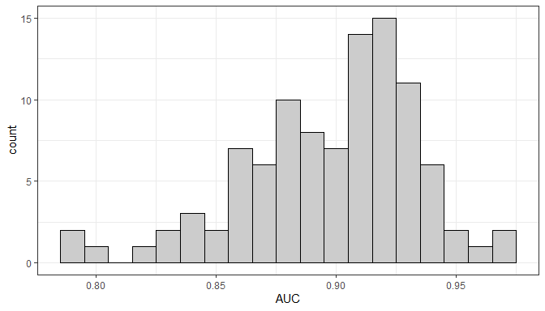

-   <a href="#boruta-summary" id="toc-boruta-summary">Boruta summary</a>
-   <a href="#objectives" id="toc-objectives">Objective(s)</a>
-   <a href="#application-of-the-boruta-algorithm"
    id="toc-application-of-the-boruta-algorithm">Application of the Boruta
    algorithm</a>
    -   <a
        href="#the-average-number-of-confirmed-variables-over-25-inner-bootstrap-resamples"
        id="toc-the-average-number-of-confirmed-variables-over-25-inner-bootstrap-resamples">The
        average number of confirmed variables over 25 inner bootstrap
        resamples</a>
    -   <a href="#no-times-a-variable-was-confirmed-across-all-boruta-runs"
        id="toc-no-times-a-variable-was-confirmed-across-all-boruta-runs">No. times
        a variable was confirmed across all Boruta runs</a>
    -   <a href="#confirmed-in-all-2500-boruta-runs"
        id="toc-confirmed-in-all-2500-boruta-runs">Confirmed in all 2500 Boruta
        runs</a>
    -   <a href="#not-confirmed-in-all-2500-boruta-runs"
        id="toc-not-confirmed-in-all-2500-boruta-runs"><em>Not</em> confirmed in
        all 2500 Boruta runs</a>
    -   <a href="#additional-variables-to-keep"
        id="toc-additional-variables-to-keep">Additional variables to keep</a>
    -   <a href="#summary" id="toc-summary">Summary</a>
-   <a href="#auc-estimated-on-the-outer-cv-folds"
    id="toc-auc-estimated-on-the-outer-cv-folds">AUC estimated on the outer
    cv folds</a>
    -   <a href="#no-variables-per-model"
        id="toc-no-variables-per-model">No. variables per model</a>
    -   <a href="#no-unique-models" id="toc-no-unique-models">No. unique
        models</a>
    -   <a href="#histogram" id="toc-histogram">Histogram</a>
    -   <a href="#tabular-summary-of-auc"
        id="toc-tabular-summary-of-auc">Tabular summary of AUC</a>
-   <a href="#synopsis" id="toc-synopsis">Synopsis</a>
-   <a href="#computational-environment"
    id="toc-computational-environment">Computational environment</a>

# Boruta summary

# Objective(s)

-   Having used resampling to run the Boruta algorithm, look at the
    results returned
-   Note that the Boruta algorithm attempts to find all relevant
    features related to the outcome. This differs from other algorithms
    which are designed to find a minimalist set for prediction.

------------------------------------------------------------------------

# Application of the Boruta algorithm

Used a nested resampling approach to evaluating variable selection by
the Boruta algorithm.

The graphic shown below illustrates the scheme.

In our resampling scheme, the outer resample folds were created via
10-fold cross-validation, repeated 10 times, i.e. there were 100 outer
splits. Each inner split was 25 bootstrap samples. Therefore, the Boruta
algorithm was fit a total of 100\*25 = 2500 times.

The inner bootstrap samples were split into analysis and assessment
sets. The Boruta algorithm was run on the analysis set, and the
variables “confirmed” were used to fit a random forest (RF) model
(without tuning) on the (inner) analysis set of the data. The fitted RF
model was then evaluated on the inner assessment data, using AUC as the
evaluation metric.

The next steps then apply the results of running the Boruta algorithm to
the fitting of RF on the outer resamples.

For each of the outer resamples (folds):

-   tabulate the frequency (proportion) at which a variable was selected
    by the Boruta algorithm across the 25 inner bootstrap samples
-   create a model formula from the set of variables that were confirmed
    in each bootstrap sample. That is, we restricted to variables that
    were confirmed in ALL of 25 of the bootstrap samples
-   use the formula to fit a RF to the analysis part of the outer splits
    (folds), and predict on the (held out) assessment part. Use the
    default RF settings, no tuning.

The above steps were repeated 10 times (i.e., repeated 10-fold
cross-validation) to estimate the outer cross-validated AUC variability.

## The average number of confirmed variables over 25 inner bootstrap resamples

Given that we started with 90 variables, we see that the Boruta
algorithm did not drop many of them. We can interpret this as meaning
that we started with a set of variables that were already related to the
response (a testament that our variable creation schemes were successful
in capturing conditions related to FHB).

    ## # A tibble: 1 x 1
    ##   mean_no_vars
    ##          <dbl>
    ## 1         86.8

## No. times a variable was confirmed across all Boruta runs

Across all the Boruta runs, we have 89 variables confirmed in at least
one run. That is, basically no variables were dropped, given the input
data matrix had 90 predictors.

<table>
<thead>
<tr>
<th style="text-align:left;">
</th>
<th style="text-align:left;">
var
</th>
<th style="text-align:right;">
total_count
</th>
</tr>
</thead>
<tbody>
<tr>
<td style="text-align:left;">
1
</td>
<td style="text-align:left;">
D.A.1
</td>
<td style="text-align:right;">
2500
</td>
</tr>
<tr>
<td style="text-align:left;">
2
</td>
<td style="text-align:left;">
D.A.2
</td>
<td style="text-align:right;">
2500
</td>
</tr>
<tr>
<td style="text-align:left;">
3
</td>
<td style="text-align:left;">
D.A.3
</td>
<td style="text-align:right;">
2500
</td>
</tr>
<tr>
<td style="text-align:left;">
4
</td>
<td style="text-align:left;">
D.MINMAXDIFF.3
</td>
<td style="text-align:right;">
2500
</td>
</tr>
<tr>
<td style="text-align:left;">
5
</td>
<td style="text-align:left;">
D.SD.1
</td>
<td style="text-align:right;">
2500
</td>
</tr>
<tr>
<td style="text-align:left;">
6
</td>
<td style="text-align:left;">
D.SD.2
</td>
<td style="text-align:right;">
2500
</td>
</tr>
<tr>
<td style="text-align:left;">
7
</td>
<td style="text-align:left;">
DD.L1.POST14.12H
</td>
<td style="text-align:right;">
2500
</td>
</tr>
<tr>
<td style="text-align:left;">
8
</td>
<td style="text-align:left;">
DD.L1.POST5.12H
</td>
<td style="text-align:right;">
2440
</td>
</tr>
<tr>
<td style="text-align:left;">
9
</td>
<td style="text-align:left;">
DD.L1.PRE5.12H
</td>
<td style="text-align:right;">
2381
</td>
</tr>
<tr>
<td style="text-align:left;">
10
</td>
<td style="text-align:left;">
INT3
</td>
<td style="text-align:right;">
2500
</td>
</tr>
<tr>
<td style="text-align:left;">
11
</td>
<td style="text-align:left;">
MT10
</td>
<td style="text-align:right;">
2500
</td>
</tr>
<tr>
<td style="text-align:left;">
12
</td>
<td style="text-align:left;">
MT7
</td>
<td style="text-align:right;">
2500
</td>
</tr>
<tr>
<td style="text-align:left;">
13
</td>
<td style="text-align:left;">
P.A.1
</td>
<td style="text-align:right;">
2500
</td>
</tr>
<tr>
<td style="text-align:left;">
14
</td>
<td style="text-align:left;">
P.A.2
</td>
<td style="text-align:right;">
2500
</td>
</tr>
<tr>
<td style="text-align:left;">
15
</td>
<td style="text-align:left;">
P.A.3
</td>
<td style="text-align:right;">
2500
</td>
</tr>
<tr>
<td style="text-align:left;">
16
</td>
<td style="text-align:left;">
P.A.4
</td>
<td style="text-align:right;">
2500
</td>
</tr>
<tr>
<td style="text-align:left;">
17
</td>
<td style="text-align:left;">
P.A.5
</td>
<td style="text-align:right;">
2500
</td>
</tr>
<tr>
<td style="text-align:left;">
18
</td>
<td style="text-align:left;">
P.SD.1
</td>
<td style="text-align:right;">
2499
</td>
</tr>
<tr>
<td style="text-align:left;">
19
</td>
<td style="text-align:left;">
resist
</td>
<td style="text-align:right;">
2499
</td>
</tr>
<tr>
<td style="text-align:left;">
20
</td>
<td style="text-align:left;">
RH.G70.CD.1
</td>
<td style="text-align:right;">
2500
</td>
</tr>
<tr>
<td style="text-align:left;">
21
</td>
<td style="text-align:left;">
RH.G70.CD.2
</td>
<td style="text-align:right;">
2500
</td>
</tr>
<tr>
<td style="text-align:left;">
22
</td>
<td style="text-align:left;">
RH.G70.CD.3
</td>
<td style="text-align:right;">
2500
</td>
</tr>
<tr>
<td style="text-align:left;">
23
</td>
<td style="text-align:left;">
RH.G90.CHD.3
</td>
<td style="text-align:right;">
2500
</td>
</tr>
<tr>
<td style="text-align:left;">
24
</td>
<td style="text-align:left;">
RH.MINMAXDIFF.2
</td>
<td style="text-align:right;">
2500
</td>
</tr>
<tr>
<td style="text-align:left;">
25
</td>
<td style="text-align:left;">
RH.SD.1
</td>
<td style="text-align:right;">
2500
</td>
</tr>
<tr>
<td style="text-align:left;">
26
</td>
<td style="text-align:left;">
RH.SD.2
</td>
<td style="text-align:right;">
2500
</td>
</tr>
<tr>
<td style="text-align:left;">
27
</td>
<td style="text-align:left;">
T.14T22.CD.1
</td>
<td style="text-align:right;">
2500
</td>
</tr>
<tr>
<td style="text-align:left;">
28
</td>
<td style="text-align:left;">
T.14T22.CD.2
</td>
<td style="text-align:right;">
2229
</td>
</tr>
<tr>
<td style="text-align:left;">
29
</td>
<td style="text-align:left;">
T.15T30.POST5.24H
</td>
<td style="text-align:right;">
2495
</td>
</tr>
<tr>
<td style="text-align:left;">
30
</td>
<td style="text-align:left;">
T.15T30.PRE5.24H
</td>
<td style="text-align:right;">
2496
</td>
</tr>
<tr>
<td style="text-align:left;">
31
</td>
<td style="text-align:left;">
T.9T30.POST7.24H
</td>
<td style="text-align:right;">
2392
</td>
</tr>
<tr>
<td style="text-align:left;">
32
</td>
<td style="text-align:left;">
T.9T30.PRE15.24H
</td>
<td style="text-align:right;">
2500
</td>
</tr>
<tr>
<td style="text-align:left;">
33
</td>
<td style="text-align:left;">
T.9T30.PRE5.24H
</td>
<td style="text-align:right;">
2499
</td>
</tr>
<tr>
<td style="text-align:left;">
34
</td>
<td style="text-align:left;">
T.9T30.PRE7.24H
</td>
<td style="text-align:right;">
2500
</td>
</tr>
<tr>
<td style="text-align:left;">
35
</td>
<td style="text-align:left;">
T.A.1
</td>
<td style="text-align:right;">
2500
</td>
</tr>
<tr>
<td style="text-align:left;">
36
</td>
<td style="text-align:left;">
T.A.2
</td>
<td style="text-align:right;">
2500
</td>
</tr>
<tr>
<td style="text-align:left;">
37
</td>
<td style="text-align:left;">
T.A.3
</td>
<td style="text-align:right;">
2500
</td>
</tr>
<tr>
<td style="text-align:left;">
38
</td>
<td style="text-align:left;">
T.A.5
</td>
<td style="text-align:right;">
2500
</td>
</tr>
<tr>
<td style="text-align:left;">
39
</td>
<td style="text-align:left;">
T.A.POST5.24H
</td>
<td style="text-align:right;">
2500
</td>
</tr>
<tr>
<td style="text-align:left;">
40
</td>
<td style="text-align:left;">
T.A.PRE5.24H
</td>
<td style="text-align:right;">
2500
</td>
</tr>
<tr>
<td style="text-align:left;">
41
</td>
<td style="text-align:left;">
T.G30.CHD.1
</td>
<td style="text-align:right;">
58
</td>
</tr>
<tr>
<td style="text-align:left;">
42
</td>
<td style="text-align:left;">
T.G30.CHD.3
</td>
<td style="text-align:right;">
2497
</td>
</tr>
<tr>
<td style="text-align:left;">
43
</td>
<td style="text-align:left;">
T.G30.PRE5.24H
</td>
<td style="text-align:right;">
8
</td>
</tr>
<tr>
<td style="text-align:left;">
44
</td>
<td style="text-align:left;">
T.L9.POST5.24H
</td>
<td style="text-align:right;">
1312
</td>
</tr>
<tr>
<td style="text-align:left;">
45
</td>
<td style="text-align:left;">
T.L9.PRE10.24H
</td>
<td style="text-align:right;">
2377
</td>
</tr>
<tr>
<td style="text-align:left;">
46
</td>
<td style="text-align:left;">
T.L9.PRE5.24H
</td>
<td style="text-align:right;">
759
</td>
</tr>
<tr>
<td style="text-align:left;">
47
</td>
<td style="text-align:left;">
T.SD.1
</td>
<td style="text-align:right;">
2500
</td>
</tr>
<tr>
<td style="text-align:left;">
48
</td>
<td style="text-align:left;">
T.SD.2
</td>
<td style="text-align:right;">
2500
</td>
</tr>
<tr>
<td style="text-align:left;">
49
</td>
<td style="text-align:left;">
TDD.A.2
</td>
<td style="text-align:right;">
2500
</td>
</tr>
<tr>
<td style="text-align:left;">
50
</td>
<td style="text-align:left;">
TDD.A.4
</td>
<td style="text-align:right;">
2500
</td>
</tr>
<tr>
<td style="text-align:left;">
51
</td>
<td style="text-align:left;">
TDD.SD.2
</td>
<td style="text-align:right;">
2500
</td>
</tr>
<tr>
<td style="text-align:left;">
52
</td>
<td style="text-align:left;">
TDD.SD.3
</td>
<td style="text-align:right;">
2500
</td>
</tr>
<tr>
<td style="text-align:left;">
53
</td>
<td style="text-align:left;">
TRH.15T30nRHG80.CHD.1
</td>
<td style="text-align:right;">
2500
</td>
</tr>
<tr>
<td style="text-align:left;">
54
</td>
<td style="text-align:left;">
TRH.15T30nRHG80.CHD.2
</td>
<td style="text-align:right;">
946
</td>
</tr>
<tr>
<td style="text-align:left;">
55
</td>
<td style="text-align:left;">
TRH.15T30nRHG80.POST5.24H
</td>
<td style="text-align:right;">
2500
</td>
</tr>
<tr>
<td style="text-align:left;">
56
</td>
<td style="text-align:left;">
TRH.15T30nRHG80.PRE15.24H
</td>
<td style="text-align:right;">
2500
</td>
</tr>
<tr>
<td style="text-align:left;">
57
</td>
<td style="text-align:left;">
TRH.15T30nRHG80.PRE5.24H
</td>
<td style="text-align:right;">
2499
</td>
</tr>
<tr>
<td style="text-align:left;">
58
</td>
<td style="text-align:left;">
TRH.15T30nRHG90.CHD.1
</td>
<td style="text-align:right;">
2500
</td>
</tr>
<tr>
<td style="text-align:left;">
59
</td>
<td style="text-align:left;">
TRH.15T30nRHG90.CHD.2
</td>
<td style="text-align:right;">
30
</td>
</tr>
<tr>
<td style="text-align:left;">
60
</td>
<td style="text-align:left;">
TRH.15T30nRHG90.POST5.24H
</td>
<td style="text-align:right;">
2500
</td>
</tr>
<tr>
<td style="text-align:left;">
61
</td>
<td style="text-align:left;">
TRH.15T30nRHG90.PRE15.24H
</td>
<td style="text-align:right;">
2500
</td>
</tr>
<tr>
<td style="text-align:left;">
62
</td>
<td style="text-align:left;">
TRH.15T30nRHG90.PRE5.24H
</td>
<td style="text-align:right;">
2500
</td>
</tr>
<tr>
<td style="text-align:left;">
63
</td>
<td style="text-align:left;">
TRH.20T25nRHG85.CHD.1
</td>
<td style="text-align:right;">
2423
</td>
</tr>
<tr>
<td style="text-align:left;">
64
</td>
<td style="text-align:left;">
TRH.5T30nRHG75.CHD.1
</td>
<td style="text-align:right;">
2500
</td>
</tr>
<tr>
<td style="text-align:left;">
65
</td>
<td style="text-align:left;">
TRH.5T30nRHG75.CHD.2
</td>
<td style="text-align:right;">
2500
</td>
</tr>
<tr>
<td style="text-align:left;">
66
</td>
<td style="text-align:left;">
TRH.9T30nRHG80.POST15.24H
</td>
<td style="text-align:right;">
2500
</td>
</tr>
<tr>
<td style="text-align:left;">
67
</td>
<td style="text-align:left;">
TRH.9T30nRHG80.POST5.24H
</td>
<td style="text-align:right;">
2500
</td>
</tr>
<tr>
<td style="text-align:left;">
68
</td>
<td style="text-align:left;">
TRH.9T30nRHG80.PRE14.24H
</td>
<td style="text-align:right;">
2500
</td>
</tr>
<tr>
<td style="text-align:left;">
69
</td>
<td style="text-align:left;">
TRH.9T30nRHG80.PRE5.24H
</td>
<td style="text-align:right;">
2500
</td>
</tr>
<tr>
<td style="text-align:left;">
70
</td>
<td style="text-align:left;">
TRH.9T30nRHG90.CHD.2
</td>
<td style="text-align:right;">
2500
</td>
</tr>
<tr>
<td style="text-align:left;">
71
</td>
<td style="text-align:left;">
TRH.9T30nRHG90.POST7.24H
</td>
<td style="text-align:right;">
2500
</td>
</tr>
<tr>
<td style="text-align:left;">
72
</td>
<td style="text-align:left;">
TRH.9T30nRHG90.PRE15.24H
</td>
<td style="text-align:right;">
2500
</td>
</tr>
<tr>
<td style="text-align:left;">
73
</td>
<td style="text-align:left;">
VPD.A.3
</td>
<td style="text-align:right;">
2500
</td>
</tr>
<tr>
<td style="text-align:left;">
74
</td>
<td style="text-align:left;">
VPD.A.5
</td>
<td style="text-align:right;">
2500
</td>
</tr>
<tr>
<td style="text-align:left;">
75
</td>
<td style="text-align:left;">
VPD.A.POST5.12H
</td>
<td style="text-align:right;">
2500
</td>
</tr>
<tr>
<td style="text-align:left;">
76
</td>
<td style="text-align:left;">
VPD.A.PRE5.12H
</td>
<td style="text-align:right;">
2500
</td>
</tr>
<tr>
<td style="text-align:left;">
77
</td>
<td style="text-align:left;">
VPD.L11.CHD.1
</td>
<td style="text-align:right;">
2500
</td>
</tr>
<tr>
<td style="text-align:left;">
78
</td>
<td style="text-align:left;">
VPD.L20.POST5.12H
</td>
<td style="text-align:right;">
2500
</td>
</tr>
<tr>
<td style="text-align:left;">
79
</td>
<td style="text-align:left;">
VPD.L20.PRE5.12H
</td>
<td style="text-align:right;">
2500
</td>
</tr>
<tr>
<td style="text-align:left;">
80
</td>
<td style="text-align:left;">
VPD.L45.POST5.12H
</td>
<td style="text-align:right;">
2500
</td>
</tr>
<tr>
<td style="text-align:left;">
81
</td>
<td style="text-align:left;">
VPD.L45.PRE15.12H
</td>
<td style="text-align:right;">
2500
</td>
</tr>
<tr>
<td style="text-align:left;">
82
</td>
<td style="text-align:left;">
VPD.L45.PRE5.12H
</td>
<td style="text-align:right;">
2500
</td>
</tr>
<tr>
<td style="text-align:left;">
83
</td>
<td style="text-align:left;">
VPD.L6.CD.1
</td>
<td style="text-align:right;">
2500
</td>
</tr>
<tr>
<td style="text-align:left;">
84
</td>
<td style="text-align:left;">
VPD.L6.CD.3
</td>
<td style="text-align:right;">
2500
</td>
</tr>
<tr>
<td style="text-align:left;">
85
</td>
<td style="text-align:left;">
VPD.SD.1
</td>
<td style="text-align:right;">
2500
</td>
</tr>
<tr>
<td style="text-align:left;">
86
</td>
<td style="text-align:left;">
VPD.SD.2
</td>
<td style="text-align:right;">
2500
</td>
</tr>
<tr>
<td style="text-align:left;">
87
</td>
<td style="text-align:left;">
VPD.SD.3
</td>
<td style="text-align:right;">
2500
</td>
</tr>
<tr>
<td style="text-align:left;">
88
</td>
<td style="text-align:left;">
VPD.SD.4
</td>
<td style="text-align:right;">
2500
</td>
</tr>
<tr>
<td style="text-align:left;">
89
</td>
<td style="text-align:left;">
wc
</td>
<td style="text-align:right;">
2498
</td>
</tr>
</tbody>
</table>

## Confirmed in all 2500 Boruta runs

<table>
<thead>
<tr>
<th style="text-align:left;">
</th>
<th style="text-align:left;">
var
</th>
<th style="text-align:right;">
total_count
</th>
</tr>
</thead>
<tbody>
<tr>
<td style="text-align:left;">
1
</td>
<td style="text-align:left;">
D.A.1
</td>
<td style="text-align:right;">
2500
</td>
</tr>
<tr>
<td style="text-align:left;">
2
</td>
<td style="text-align:left;">
D.A.2
</td>
<td style="text-align:right;">
2500
</td>
</tr>
<tr>
<td style="text-align:left;">
3
</td>
<td style="text-align:left;">
D.A.3
</td>
<td style="text-align:right;">
2500
</td>
</tr>
<tr>
<td style="text-align:left;">
4
</td>
<td style="text-align:left;">
D.MINMAXDIFF.3
</td>
<td style="text-align:right;">
2500
</td>
</tr>
<tr>
<td style="text-align:left;">
5
</td>
<td style="text-align:left;">
D.SD.1
</td>
<td style="text-align:right;">
2500
</td>
</tr>
<tr>
<td style="text-align:left;">
6
</td>
<td style="text-align:left;">
D.SD.2
</td>
<td style="text-align:right;">
2500
</td>
</tr>
<tr>
<td style="text-align:left;">
7
</td>
<td style="text-align:left;">
DD.L1.POST14.12H
</td>
<td style="text-align:right;">
2500
</td>
</tr>
<tr>
<td style="text-align:left;">
8
</td>
<td style="text-align:left;">
INT3
</td>
<td style="text-align:right;">
2500
</td>
</tr>
<tr>
<td style="text-align:left;">
9
</td>
<td style="text-align:left;">
MT10
</td>
<td style="text-align:right;">
2500
</td>
</tr>
<tr>
<td style="text-align:left;">
10
</td>
<td style="text-align:left;">
MT7
</td>
<td style="text-align:right;">
2500
</td>
</tr>
<tr>
<td style="text-align:left;">
11
</td>
<td style="text-align:left;">
P.A.1
</td>
<td style="text-align:right;">
2500
</td>
</tr>
<tr>
<td style="text-align:left;">
12
</td>
<td style="text-align:left;">
P.A.2
</td>
<td style="text-align:right;">
2500
</td>
</tr>
<tr>
<td style="text-align:left;">
13
</td>
<td style="text-align:left;">
P.A.3
</td>
<td style="text-align:right;">
2500
</td>
</tr>
<tr>
<td style="text-align:left;">
14
</td>
<td style="text-align:left;">
P.A.4
</td>
<td style="text-align:right;">
2500
</td>
</tr>
<tr>
<td style="text-align:left;">
15
</td>
<td style="text-align:left;">
P.A.5
</td>
<td style="text-align:right;">
2500
</td>
</tr>
<tr>
<td style="text-align:left;">
16
</td>
<td style="text-align:left;">
RH.G70.CD.1
</td>
<td style="text-align:right;">
2500
</td>
</tr>
<tr>
<td style="text-align:left;">
17
</td>
<td style="text-align:left;">
RH.G70.CD.2
</td>
<td style="text-align:right;">
2500
</td>
</tr>
<tr>
<td style="text-align:left;">
18
</td>
<td style="text-align:left;">
RH.G70.CD.3
</td>
<td style="text-align:right;">
2500
</td>
</tr>
<tr>
<td style="text-align:left;">
19
</td>
<td style="text-align:left;">
RH.G90.CHD.3
</td>
<td style="text-align:right;">
2500
</td>
</tr>
<tr>
<td style="text-align:left;">
20
</td>
<td style="text-align:left;">
RH.MINMAXDIFF.2
</td>
<td style="text-align:right;">
2500
</td>
</tr>
<tr>
<td style="text-align:left;">
21
</td>
<td style="text-align:left;">
RH.SD.1
</td>
<td style="text-align:right;">
2500
</td>
</tr>
<tr>
<td style="text-align:left;">
22
</td>
<td style="text-align:left;">
RH.SD.2
</td>
<td style="text-align:right;">
2500
</td>
</tr>
<tr>
<td style="text-align:left;">
23
</td>
<td style="text-align:left;">
T.14T22.CD.1
</td>
<td style="text-align:right;">
2500
</td>
</tr>
<tr>
<td style="text-align:left;">
24
</td>
<td style="text-align:left;">
T.9T30.PRE15.24H
</td>
<td style="text-align:right;">
2500
</td>
</tr>
<tr>
<td style="text-align:left;">
25
</td>
<td style="text-align:left;">
T.9T30.PRE7.24H
</td>
<td style="text-align:right;">
2500
</td>
</tr>
<tr>
<td style="text-align:left;">
26
</td>
<td style="text-align:left;">
T.A.1
</td>
<td style="text-align:right;">
2500
</td>
</tr>
<tr>
<td style="text-align:left;">
27
</td>
<td style="text-align:left;">
T.A.2
</td>
<td style="text-align:right;">
2500
</td>
</tr>
<tr>
<td style="text-align:left;">
28
</td>
<td style="text-align:left;">
T.A.3
</td>
<td style="text-align:right;">
2500
</td>
</tr>
<tr>
<td style="text-align:left;">
29
</td>
<td style="text-align:left;">
T.A.5
</td>
<td style="text-align:right;">
2500
</td>
</tr>
<tr>
<td style="text-align:left;">
30
</td>
<td style="text-align:left;">
T.A.POST5.24H
</td>
<td style="text-align:right;">
2500
</td>
</tr>
<tr>
<td style="text-align:left;">
31
</td>
<td style="text-align:left;">
T.A.PRE5.24H
</td>
<td style="text-align:right;">
2500
</td>
</tr>
<tr>
<td style="text-align:left;">
32
</td>
<td style="text-align:left;">
T.SD.1
</td>
<td style="text-align:right;">
2500
</td>
</tr>
<tr>
<td style="text-align:left;">
33
</td>
<td style="text-align:left;">
T.SD.2
</td>
<td style="text-align:right;">
2500
</td>
</tr>
<tr>
<td style="text-align:left;">
34
</td>
<td style="text-align:left;">
TDD.A.2
</td>
<td style="text-align:right;">
2500
</td>
</tr>
<tr>
<td style="text-align:left;">
35
</td>
<td style="text-align:left;">
TDD.A.4
</td>
<td style="text-align:right;">
2500
</td>
</tr>
<tr>
<td style="text-align:left;">
36
</td>
<td style="text-align:left;">
TDD.SD.2
</td>
<td style="text-align:right;">
2500
</td>
</tr>
<tr>
<td style="text-align:left;">
37
</td>
<td style="text-align:left;">
TDD.SD.3
</td>
<td style="text-align:right;">
2500
</td>
</tr>
<tr>
<td style="text-align:left;">
38
</td>
<td style="text-align:left;">
TRH.15T30nRHG80.CHD.1
</td>
<td style="text-align:right;">
2500
</td>
</tr>
<tr>
<td style="text-align:left;">
39
</td>
<td style="text-align:left;">
TRH.15T30nRHG80.POST5.24H
</td>
<td style="text-align:right;">
2500
</td>
</tr>
<tr>
<td style="text-align:left;">
40
</td>
<td style="text-align:left;">
TRH.15T30nRHG80.PRE15.24H
</td>
<td style="text-align:right;">
2500
</td>
</tr>
<tr>
<td style="text-align:left;">
41
</td>
<td style="text-align:left;">
TRH.15T30nRHG90.CHD.1
</td>
<td style="text-align:right;">
2500
</td>
</tr>
<tr>
<td style="text-align:left;">
42
</td>
<td style="text-align:left;">
TRH.15T30nRHG90.POST5.24H
</td>
<td style="text-align:right;">
2500
</td>
</tr>
<tr>
<td style="text-align:left;">
43
</td>
<td style="text-align:left;">
TRH.15T30nRHG90.PRE15.24H
</td>
<td style="text-align:right;">
2500
</td>
</tr>
<tr>
<td style="text-align:left;">
44
</td>
<td style="text-align:left;">
TRH.15T30nRHG90.PRE5.24H
</td>
<td style="text-align:right;">
2500
</td>
</tr>
<tr>
<td style="text-align:left;">
45
</td>
<td style="text-align:left;">
TRH.5T30nRHG75.CHD.1
</td>
<td style="text-align:right;">
2500
</td>
</tr>
<tr>
<td style="text-align:left;">
46
</td>
<td style="text-align:left;">
TRH.5T30nRHG75.CHD.2
</td>
<td style="text-align:right;">
2500
</td>
</tr>
<tr>
<td style="text-align:left;">
47
</td>
<td style="text-align:left;">
TRH.9T30nRHG80.POST15.24H
</td>
<td style="text-align:right;">
2500
</td>
</tr>
<tr>
<td style="text-align:left;">
48
</td>
<td style="text-align:left;">
TRH.9T30nRHG80.POST5.24H
</td>
<td style="text-align:right;">
2500
</td>
</tr>
<tr>
<td style="text-align:left;">
49
</td>
<td style="text-align:left;">
TRH.9T30nRHG80.PRE14.24H
</td>
<td style="text-align:right;">
2500
</td>
</tr>
<tr>
<td style="text-align:left;">
50
</td>
<td style="text-align:left;">
TRH.9T30nRHG80.PRE5.24H
</td>
<td style="text-align:right;">
2500
</td>
</tr>
<tr>
<td style="text-align:left;">
51
</td>
<td style="text-align:left;">
TRH.9T30nRHG90.CHD.2
</td>
<td style="text-align:right;">
2500
</td>
</tr>
<tr>
<td style="text-align:left;">
52
</td>
<td style="text-align:left;">
TRH.9T30nRHG90.POST7.24H
</td>
<td style="text-align:right;">
2500
</td>
</tr>
<tr>
<td style="text-align:left;">
53
</td>
<td style="text-align:left;">
TRH.9T30nRHG90.PRE15.24H
</td>
<td style="text-align:right;">
2500
</td>
</tr>
<tr>
<td style="text-align:left;">
54
</td>
<td style="text-align:left;">
VPD.A.3
</td>
<td style="text-align:right;">
2500
</td>
</tr>
<tr>
<td style="text-align:left;">
55
</td>
<td style="text-align:left;">
VPD.A.5
</td>
<td style="text-align:right;">
2500
</td>
</tr>
<tr>
<td style="text-align:left;">
56
</td>
<td style="text-align:left;">
VPD.A.POST5.12H
</td>
<td style="text-align:right;">
2500
</td>
</tr>
<tr>
<td style="text-align:left;">
57
</td>
<td style="text-align:left;">
VPD.A.PRE5.12H
</td>
<td style="text-align:right;">
2500
</td>
</tr>
<tr>
<td style="text-align:left;">
58
</td>
<td style="text-align:left;">
VPD.L11.CHD.1
</td>
<td style="text-align:right;">
2500
</td>
</tr>
<tr>
<td style="text-align:left;">
59
</td>
<td style="text-align:left;">
VPD.L20.POST5.12H
</td>
<td style="text-align:right;">
2500
</td>
</tr>
<tr>
<td style="text-align:left;">
60
</td>
<td style="text-align:left;">
VPD.L20.PRE5.12H
</td>
<td style="text-align:right;">
2500
</td>
</tr>
<tr>
<td style="text-align:left;">
61
</td>
<td style="text-align:left;">
VPD.L45.POST5.12H
</td>
<td style="text-align:right;">
2500
</td>
</tr>
<tr>
<td style="text-align:left;">
62
</td>
<td style="text-align:left;">
VPD.L45.PRE15.12H
</td>
<td style="text-align:right;">
2500
</td>
</tr>
<tr>
<td style="text-align:left;">
63
</td>
<td style="text-align:left;">
VPD.L45.PRE5.12H
</td>
<td style="text-align:right;">
2500
</td>
</tr>
<tr>
<td style="text-align:left;">
64
</td>
<td style="text-align:left;">
VPD.L6.CD.1
</td>
<td style="text-align:right;">
2500
</td>
</tr>
<tr>
<td style="text-align:left;">
65
</td>
<td style="text-align:left;">
VPD.L6.CD.3
</td>
<td style="text-align:right;">
2500
</td>
</tr>
<tr>
<td style="text-align:left;">
66
</td>
<td style="text-align:left;">
VPD.SD.1
</td>
<td style="text-align:right;">
2500
</td>
</tr>
<tr>
<td style="text-align:left;">
67
</td>
<td style="text-align:left;">
VPD.SD.2
</td>
<td style="text-align:right;">
2500
</td>
</tr>
<tr>
<td style="text-align:left;">
68
</td>
<td style="text-align:left;">
VPD.SD.3
</td>
<td style="text-align:right;">
2500
</td>
</tr>
<tr>
<td style="text-align:left;">
69
</td>
<td style="text-align:left;">
VPD.SD.4
</td>
<td style="text-align:right;">
2500
</td>
</tr>
</tbody>
</table>

## *Not* confirmed in all 2500 Boruta runs

<!-- -->

## Additional variables to keep

Based on the above, we propose keeping the top 8 from the group that was
not confirmed in each of the 2500 Boruta runs. This then represents
those variables confirmed in at least 99% of the Boruta runs (2500\*0.99
= 2475).

<table>
<thead>
<tr>
<th style="text-align:left;">
</th>
<th style="text-align:left;">
var
</th>
<th style="text-align:right;">
total_count
</th>
</tr>
</thead>
<tbody>
<tr>
<td style="text-align:left;">
1
</td>
<td style="text-align:left;">
P.SD.1
</td>
<td style="text-align:right;">
2499
</td>
</tr>
<tr>
<td style="text-align:left;">
2
</td>
<td style="text-align:left;">
resist
</td>
<td style="text-align:right;">
2499
</td>
</tr>
<tr>
<td style="text-align:left;">
3
</td>
<td style="text-align:left;">
T.9T30.PRE5.24H
</td>
<td style="text-align:right;">
2499
</td>
</tr>
<tr>
<td style="text-align:left;">
4
</td>
<td style="text-align:left;">
TRH.15T30nRHG80.PRE5.24H
</td>
<td style="text-align:right;">
2499
</td>
</tr>
<tr>
<td style="text-align:left;">
5
</td>
<td style="text-align:left;">
wc
</td>
<td style="text-align:right;">
2498
</td>
</tr>
<tr>
<td style="text-align:left;">
6
</td>
<td style="text-align:left;">
T.G30.CHD.3
</td>
<td style="text-align:right;">
2497
</td>
</tr>
<tr>
<td style="text-align:left;">
7
</td>
<td style="text-align:left;">
T.15T30.PRE5.24H
</td>
<td style="text-align:right;">
2496
</td>
</tr>
<tr>
<td style="text-align:left;">
8
</td>
<td style="text-align:left;">
T.15T30.POST5.24H
</td>
<td style="text-align:right;">
2495
</td>
</tr>
</tbody>
</table>

## Summary

If we want to use these results to suggest a set of variables to move
forward with, we have the 69 that were confirmed in each of the 2,500
Boruta runs, as well as 8 additional which were confirmed in at least
2,475 Boruta runs. That given a total of 77 variables, not much lower
than the original set of 90 that we started with.

------------------------------------------------------------------------

# AUC estimated on the outer cv folds

RECALL: Created a model formula from the set of variables that were
confirmed in each bootstrap sample. Restricted to variables that were
confirmed in ALL of the bootstrap samples (25 for each outer resample).

Used the formula to fit a RF to the analysis part of the outer splits,
and predict on the assessment part. Use the default RF settings, no
tuning. The outer splits were cv-folds.

This means fitting 100 different RF models and evaluating their
performance (via the AUC metric).

## No. variables per model

Recall: the outer RF models were fit using variables that were returned
by Boruta in all 25 of the inner bootstrap resamples. That is, for a
variable to be included in the outer RF model, it had to have been
selected in each of the 25 inner bootstraps. In the output below, we can
see that very few variables were dropped (out of the input set of 90).

    ## # A tibble: 1 x 5
    ##     min   max  mean    sd median
    ##   <dbl> <dbl> <dbl> <dbl>  <dbl>
    ## 1    75    82  79.1  1.42     79

## No. unique models

Not all models returned by the above-described method were unique! This
means that, among the bootstrap resamples, the variables that were
selected across a group of all 25 inner resamples would again be
selected when the algorithm was run on another group of 25 inner
resamples created from a different outer fold. This again points to
certain variables being more ‘important’ than others.

We end up with 50 distinct models.

    ## [1] 50

## Histogram

Performance of the RF models (at least according to AUC) is rather high.

<!-- -->

## Tabular summary of AUC

One could be suspicious of an estimated (max) AUC of 0.972 on the outer
assessment part of the data — seems too good to be true.

Nevertheless, does indicate good performance of RF models in predicting
FHB epidemics.

    ## # A tibble: 1 x 5
    ##     min   max  mean     sd median
    ##   <dbl> <dbl> <dbl>  <dbl>  <dbl>
    ## 1 0.792 0.972 0.898 0.0363  0.905

# Synopsis

-   We had created a variable set consisting of 328 weather-based
    predictors, but knew that many of them were highly correlated.

-   We used pre-screening algorithms to remove (i) zero variance
    predictors, (ii) linear combinations of predictors, and (iii) highly
    correlated predictors (i.e., with a Pearson correlation of at least
    0.9). This left a set of 90 predictors, which were then fed to the
    Boruta algorithm.

-   The Boruta algorithm is designed to return all variables related to
    the outcome. Given that only a handful of variables were dropped
    from the input predictor list, we can be confident that our variable
    creation efforts have been successfully capturing the signals
    associated with FHB epidemics.

-   Random forests (RF) fit to sets of variables returned by Boruta
    appear to have high performance in predicting FHB epidemics.
    However, on average each RF is using 79 predictors. Although RF
    models fit quickly, this is still too many variables to have to
    maintain and calculate, and so we wonder if this set can be reduced
    to a minimalist set for predictive purposes.

-   Results do indicate that there could be several equally-competitive
    RF models.

# Computational environment

    ## [1] "R version 4.1.3 (2022-03-10)"

    ## [1] "x86_64, mingw32"

    ## R version 4.1.3 (2022-03-10)
    ## Platform: x86_64-w64-mingw32/x64 (64-bit)
    ## Running under: Windows 10 x64 (build 19044)
    ## 
    ## Matrix products: default
    ## 
    ## locale:
    ## [1] LC_COLLATE=English_United States.1252 
    ## [2] LC_CTYPE=English_United States.1252   
    ## [3] LC_MONETARY=English_United States.1252
    ## [4] LC_NUMERIC=C                          
    ## [5] LC_TIME=English_United States.1252    
    ## 
    ## attached base packages:
    ## [1] stats     graphics  grDevices utils     datasets  methods   base     
    ## 
    ## other attached packages:
    ##  [1] kableExtra_1.3.4   yardstick_0.0.9    workflowsets_0.2.1 workflows_0.2.6   
    ##  [5] tune_0.2.0         rsample_0.1.1      recipes_0.2.0      parsnip_0.2.1     
    ##  [9] modeldata_0.1.1    infer_1.0.0        dials_0.1.1        scales_1.1.1      
    ## [13] broom_1.0.0        tidymodels_0.2.0   forcats_0.5.1      stringr_1.4.0     
    ## [17] dplyr_1.0.8        purrr_0.3.4        readr_2.1.2        tidyr_1.2.0       
    ## [21] tibble_3.1.6       ggplot2_3.3.5      tidyverse_1.3.1    knitr_1.38        
    ## 
    ## loaded via a namespace (and not attached):
    ##  [1] colorspace_2.0-3   ellipsis_0.3.2     class_7.3-20       fs_1.5.2          
    ##  [5] rstudioapi_0.13    farver_2.1.0       listenv_0.8.0      furrr_0.2.3       
    ##  [9] prodlim_2019.11.13 fansi_1.0.3        lubridate_1.8.0    xml2_1.3.3        
    ## [13] codetools_0.2-18   splines_4.1.3      cachem_1.0.6       jsonlite_1.8.0    
    ## [17] pROC_1.18.0        dbplyr_2.1.1       compiler_4.1.3     httr_1.4.2        
    ## [21] backports_1.4.1    assertthat_0.2.1   Matrix_1.4-0       fastmap_1.1.0     
    ## [25] cli_3.2.0          htmltools_0.5.2    tools_4.1.3        gtable_0.3.0      
    ## [29] glue_1.6.2         Rcpp_1.0.8.3       cellranger_1.1.0   DiceDesign_1.9    
    ## [33] vctrs_0.4.0        svglite_2.1.0      iterators_1.0.14   conflicted_1.1.0  
    ## [37] timeDate_3043.102  gower_1.0.0        xfun_0.30          globals_0.14.0    
    ## [41] rvest_1.0.2        lifecycle_1.0.1    future_1.24.0      MASS_7.3-55       
    ## [45] ipred_0.9-12       hms_1.1.1          parallel_4.1.3     yaml_2.3.5        
    ## [49] memoise_2.0.1      rpart_4.1.16       stringi_1.7.6      highr_0.9         
    ## [53] foreach_1.5.2      lhs_1.1.5          hardhat_0.2.0      lava_1.6.10       
    ## [57] rlang_1.0.2        pkgconfig_2.0.3    systemfonts_1.0.4  evaluate_0.15     
    ## [61] lattice_0.20-45    labeling_0.4.2     tidyselect_1.1.2   parallelly_1.31.0 
    ## [65] plyr_1.8.7         magrittr_2.0.3     R6_2.5.1           generics_0.1.2    
    ## [69] DBI_1.1.2          pillar_1.7.0       haven_2.4.3        withr_2.5.0       
    ## [73] survival_3.2-13    nnet_7.3-17        future.apply_1.8.1 modelr_0.1.8      
    ## [77] crayon_1.5.1       utf8_1.2.2         tzdb_0.3.0         rmarkdown_2.13    
    ## [81] grid_4.1.3         readxl_1.4.0       reprex_2.0.1       digest_0.6.29     
    ## [85] webshot_0.5.2      munsell_0.5.0      GPfit_1.0-8        viridisLite_0.4.0
