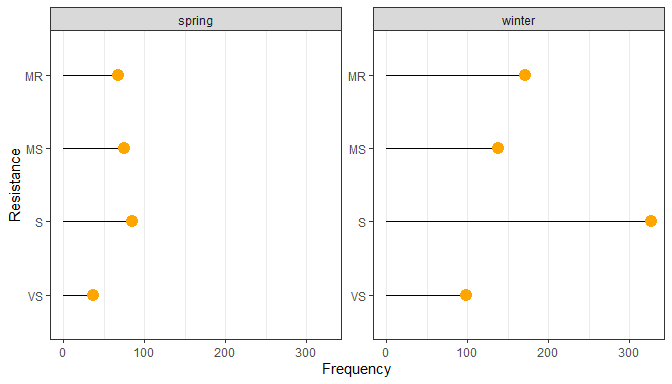

- <a href="#metadata-associated-with-the-fhb-dataset"
  id="toc-metadata-associated-with-the-fhb-dataset">Metadata associated
  with the FHB dataset</a>
- <a href="#basic-summaries-of-the-observational-data-matrix"
  id="toc-basic-summaries-of-the-observational-data-matrix">Basic
  summaries of the observational data matrix</a>
  - <a href="#by-year" id="toc-by-year">By year</a>
  - <a href="#by-state" id="toc-by-state">By state</a>
  - <a href="#by-climate-region" id="toc-by-climate-region">By climate
    region</a>
  - <a href="#by-wheat-type" id="toc-by-wheat-type">By wheat type</a>
  - <a href="#by-resistance-level" id="toc-by-resistance-level">By
    resistance level</a>
  - <a href="#by-maize-residue-presence-absence"
    id="toc-by-maize-residue-presence-absence">By maize residue presence
    (absence)</a>
  - <a href="#by-wheat-type-and-resistance-level"
    id="toc-by-wheat-type-and-resistance-level">By wheat type and resistance
    level</a>
  - <a href="#by-wheat-type-and-climate-region"
    id="toc-by-wheat-type-and-climate-region">By wheat type and climate
    region</a>
- <a href="#parsing-the-global-set-of-variables"
  id="toc-parsing-the-global-set-of-variables">Parsing the global set of
  variables</a>
  - <a href="#type" id="toc-type">Type</a>
  - <a href="#metric" id="toc-metric">Metric</a>
  - <a href="#window-start-day" id="toc-window-start-day">Window start
    day</a>
  - <a href="#window-length" id="toc-window-length">Window length</a>
- <a href="#computational-environment"
  id="toc-computational-environment">Computational environment</a>

<!-- # Objective(s) -->

# Metadata associated with the FHB dataset

------------------------------------------------------------------------

# Basic summaries of the observational data matrix

## By year

<!-- -->

## By state

<!-- -->

## By climate region

<!-- -->

## By wheat type

<!-- -->

## By resistance level

<!-- -->

## By maize residue presence (absence)

<!-- -->

## By wheat type and resistance level

<!-- -->

## By wheat type and climate region

<!-- -->

------------------------------------------------------------------------

------------------------------------------------------------------------

# Parsing the global set of variables

- there are 328 weather-based variables

## Type

- D = dewpoint
- P = barometric pressure
- RH = relative humidity
- T = air temperature
- TDD = temperature-dewpoint depression
- TRH = a combination of temperature and relative humidity conditions
- VPD = vapor pressure deficit

<table>
<thead>
<tr>
<th style="text-align:left;">
type
</th>
<th style="text-align:right;">
n
</th>
</tr>
</thead>
<tbody>
<tr>
<td style="text-align:left;">
D
</td>
<td style="text-align:right;">
9
</td>
</tr>
<tr>
<td style="text-align:left;">
P
</td>
<td style="text-align:right;">
7
</td>
</tr>
<tr>
<td style="text-align:left;">
RH
</td>
<td style="text-align:right;">
59
</td>
</tr>
<tr>
<td style="text-align:left;">
T
</td>
<td style="text-align:right;">
78
</td>
</tr>
<tr>
<td style="text-align:left;">
TDD
</td>
<td style="text-align:right;">
33
</td>
</tr>
<tr>
<td style="text-align:left;">
TRH
</td>
<td style="text-align:right;">
93
</td>
</tr>
<tr>
<td style="text-align:left;">
VPD
</td>
<td style="text-align:right;">
49
</td>
</tr>
</tbody>
</table>

## Metric

- i.e., does the variable summarize a count (e.g., no. of hr) or mean?

<table>
<thead>
<tr>
<th style="text-align:left;">
metric
</th>
<th style="text-align:right;">
n
</th>
</tr>
</thead>
<tbody>
<tr>
<td style="text-align:left;">
count
</td>
<td style="text-align:right;">
219
</td>
</tr>
<tr>
<td style="text-align:left;">
mean
</td>
<td style="text-align:right;">
109
</td>
</tr>
</tbody>
</table>

## Window start day

- the start day of the window which the variable summarizes

<!-- -->

## Window length

- the length (days) of the window the variable summarizes

<!-- -->

------------------------------------------------------------------------

# Computational environment

    ## [1] "R version 4.1.3 (2022-03-10)"

    ## [1] "x86_64, mingw32"

    ## R version 4.1.3 (2022-03-10)
    ## Platform: x86_64-w64-mingw32/x64 (64-bit)
    ## Running under: Windows 10 x64 (build 19045)
    ## 
    ## Matrix products: default
    ## 
    ## locale:
    ## [1] LC_COLLATE=English_United States.1252 
    ## [2] LC_CTYPE=English_United States.1252   
    ## [3] LC_MONETARY=English_United States.1252
    ## [4] LC_NUMERIC=C                          
    ## [5] LC_TIME=English_United States.1252    
    ## 
    ## attached base packages:
    ## [1] stats     graphics  grDevices utils     datasets  methods   base     
    ## 
    ## other attached packages:
    ##  [1] kableExtra_1.3.4 forcats_0.5.1    stringr_1.4.0    dplyr_1.0.8     
    ##  [5] purrr_0.3.4      readr_2.1.2      tidyr_1.2.0      tibble_3.1.6    
    ##  [9] ggplot2_3.3.5    tidyverse_1.3.1  knitr_1.38      
    ## 
    ## loaded via a namespace (and not attached):
    ##  [1] svglite_2.1.0     lubridate_1.8.0   assertthat_0.2.1  digest_0.6.29    
    ##  [5] utf8_1.2.2        R6_2.5.1          cellranger_1.1.0  backports_1.4.1  
    ##  [9] reprex_2.0.1      evaluate_0.15     highr_0.9         httr_1.4.2       
    ## [13] pillar_1.7.0      rlang_1.0.2       readxl_1.4.0      rstudioapi_0.13  
    ## [17] rmarkdown_2.13    labeling_0.4.2    webshot_0.5.2     bit_4.0.4        
    ## [21] munsell_0.5.0     broom_1.0.0       compiler_4.1.3    modelr_0.1.8     
    ## [25] xfun_0.30         pkgconfig_2.0.3   systemfonts_1.0.4 htmltools_0.5.2  
    ## [29] tidyselect_1.1.2  codetools_0.2-18  fansi_1.0.3       viridisLite_0.4.0
    ## [33] crayon_1.5.1      tzdb_0.3.0        dbplyr_2.1.1      withr_2.5.0      
    ## [37] grid_4.1.3        jsonlite_1.8.0    gtable_0.3.0      lifecycle_1.0.1  
    ## [41] DBI_1.1.2         magrittr_2.0.3    scales_1.1.1      cli_3.2.0        
    ## [45] stringi_1.7.6     vroom_1.5.7       farver_2.1.0      fs_1.5.2         
    ## [49] xml2_1.3.3        ellipsis_0.3.2    generics_0.1.2    vctrs_0.4.0      
    ## [53] tools_4.1.3       bit64_4.0.5       glue_1.6.2        hms_1.1.1        
    ## [57] parallel_4.1.3    fastmap_1.1.0     yaml_2.3.5        colorspace_2.0-3 
    ## [61] rvest_1.0.2       haven_2.4.3
