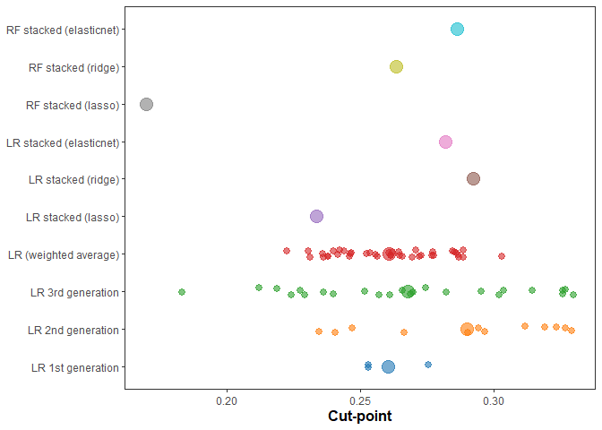
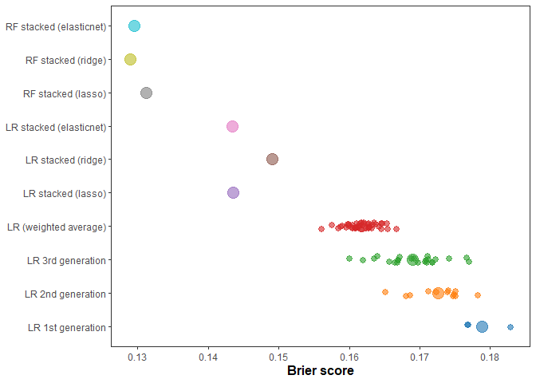
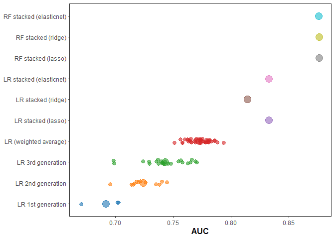
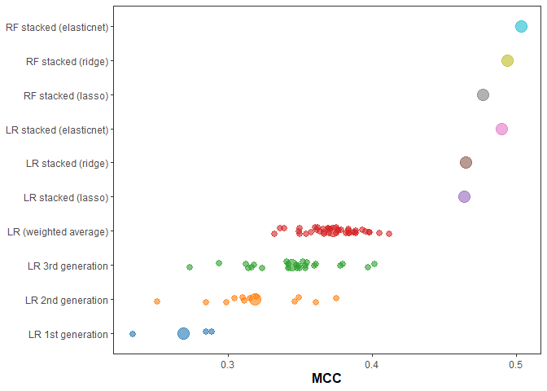
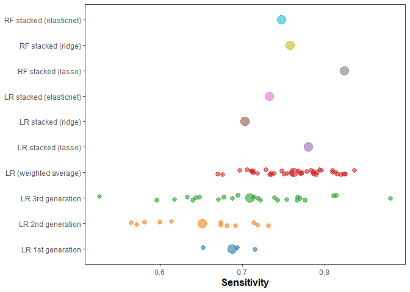
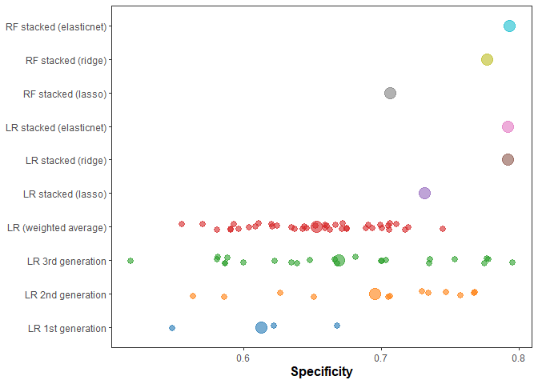
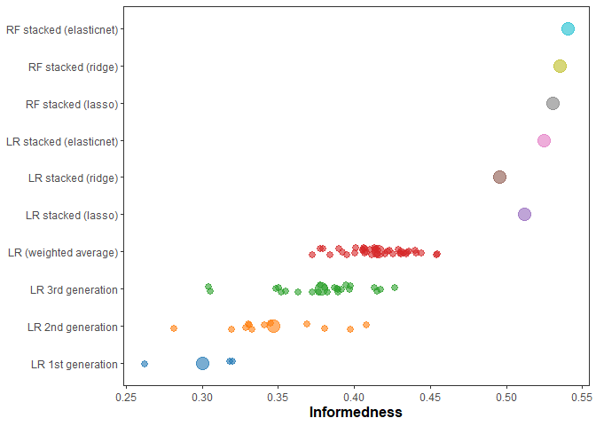
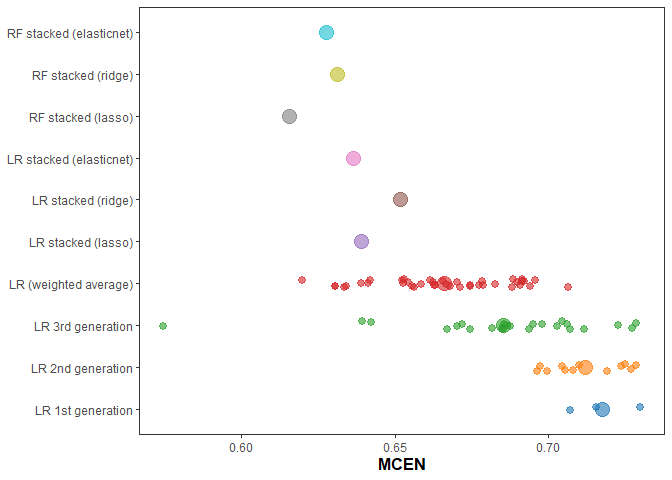
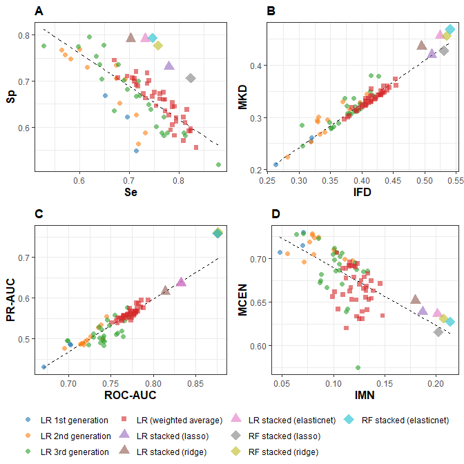

-   <a href="#performance-metrics" id="toc-performance-metrics">Performance
    metrics</a>
-   <a href="#objectives" id="toc-objectives">Objective(s)</a>
-   <a href="#model-performance" id="toc-model-performance">Model
    performance</a>
    -   <a href="#individual-metrics" id="toc-individual-metrics">Individual
        metrics</a>
        -   <a href="#cut-point" id="toc-cut-point">Cut-point</a>
        -   <a href="#brier-score" id="toc-brier-score">Brier score</a>
        -   <a href="#auc" id="toc-auc">AUC</a>
        -   <a href="#pr-auc" id="toc-pr-auc">PR-AUC</a>
        -   <a href="#matthews-correlation-coefficient"
            id="toc-matthews-correlation-coefficient">Matthews correlation
            coefficient</a>
        -   <a href="#sensitivity" id="toc-sensitivity">Sensitivity</a>
        -   <a href="#specificity" id="toc-specificity">Specificity</a>
        -   <a href="#informedness--youden-index"
            id="toc-informedness--youden-index">Informedness = Youden Index</a>
        -   <a href="#imn" id="toc-imn">IMN</a>
        -   <a href="#mcen" id="toc-mcen">MCEN</a>
    -   <a href="#composite-plot" id="toc-composite-plot">Composite plot</a>
-   <a href="#computational-environment"
    id="toc-computational-environment">Computational environment</a>

# Performance metrics

# Objective(s)

-   focuses on showing the performance metrics for the following groups
    of models
    -   [LR models: 1st, 2nd, 3rd gen, weighted average, and stacked
        (lasso, ridge,
        elasticnet)](https://journals.plos.org/ploscompbiol/article?id=10.1371/journal.pcbi.1008831)
    -   RF models: stacked (lasso, ridge, elasticnet) stemming from this
        study

------------------------------------------------------------------------

# Model performance

## Individual metrics

-   the larger symbols are means
    -   stacked models are just one point
-   points (individual models) are jittered to avoid two much crowding
    due to overlap

### Cut-point

<!-- -->

### Brier score

<!-- -->

### AUC

-   area under the ROC curve

<!-- -->

### PR-AUC

-   area under the precision-recall curve

<!-- -->

### Matthews correlation coefficient

<!-- -->

### Sensitivity

<!-- -->

### Specificity

<!-- -->

### Informedness = Youden Index

-   ifd (Powers 2011) = YI

<!-- -->

### IMN

-   normalized expected mutual information (Hughes et al. 2015)
-   same as NMI (Forbes 1995)

<!-- -->

### MCEN

-   modified confusion entropy
-   recall that lower is better

<!-- -->

## Composite plot

<!-- Prep the data for the composite plots -->

<!-- -->

# Computational environment

    ## [1] "R version 4.1.3 (2022-03-10)"

    ## [1] "x86_64, mingw32"

    ## R version 4.1.3 (2022-03-10)
    ## Platform: x86_64-w64-mingw32/x64 (64-bit)
    ## Running under: Windows 10 x64 (build 19044)
    ## 
    ## Matrix products: default
    ## 
    ## locale:
    ## [1] LC_COLLATE=English_United States.1252 
    ## [2] LC_CTYPE=English_United States.1252   
    ## [3] LC_MONETARY=English_United States.1252
    ## [4] LC_NUMERIC=C                          
    ## [5] LC_TIME=English_United States.1252    
    ## 
    ## attached base packages:
    ## [1] stats     graphics  grDevices utils     datasets  methods   base     
    ## 
    ## other attached packages:
    ##  [1] kableExtra_1.3.4 ggsci_2.9        forcats_0.5.1    stringr_1.4.0   
    ##  [5] dplyr_1.0.8      purrr_0.3.4      readr_2.1.2      tidyr_1.2.0     
    ##  [9] tibble_3.1.6     ggplot2_3.3.5    tidyverse_1.3.1  MASS_7.3-55     
    ## [13] knitr_1.38      
    ## 
    ## loaded via a namespace (and not attached):
    ##  [1] lattice_0.20-45   svglite_2.1.0     lubridate_1.8.0   assertthat_0.2.1 
    ##  [5] digest_0.6.29     utf8_1.2.2        R6_2.5.1          cellranger_1.1.0 
    ##  [9] backports_1.4.1   reprex_2.0.1      evaluate_0.15     highr_0.9        
    ## [13] httr_1.4.2        pillar_1.7.0      rlang_1.0.2       readxl_1.4.0     
    ## [17] rstudioapi_0.13   Matrix_1.4-0      rmarkdown_2.13    splines_4.1.3    
    ## [21] labeling_0.4.2    webshot_0.5.2     bit_4.0.4         munsell_0.5.0    
    ## [25] broom_1.0.0       compiler_4.1.3    modelr_0.1.8      xfun_0.30        
    ## [29] pkgconfig_2.0.3   systemfonts_1.0.4 mgcv_1.8-39       htmltools_0.5.2  
    ## [33] tidyselect_1.1.2  gridExtra_2.3     codetools_0.2-18  fansi_1.0.3      
    ## [37] viridisLite_0.4.0 crayon_1.5.1      tzdb_0.3.0        dbplyr_2.1.1     
    ## [41] withr_2.5.0       grid_4.1.3        nlme_3.1-155      jsonlite_1.8.0   
    ## [45] gtable_0.3.0      lifecycle_1.0.1   DBI_1.1.2         magrittr_2.0.3   
    ## [49] scales_1.1.1      cli_3.2.0         stringi_1.7.6     vroom_1.5.7      
    ## [53] farver_2.1.0      fs_1.5.2          xml2_1.3.3        ellipsis_0.3.2   
    ## [57] generics_0.1.2    vctrs_0.4.0       tools_4.1.3       bit64_4.0.5      
    ## [61] glue_1.6.2        hms_1.1.1         parallel_4.1.3    fastmap_1.1.0    
    ## [65] yaml_2.3.5        colorspace_2.0-3  rvest_1.0.2       haven_2.4.3
