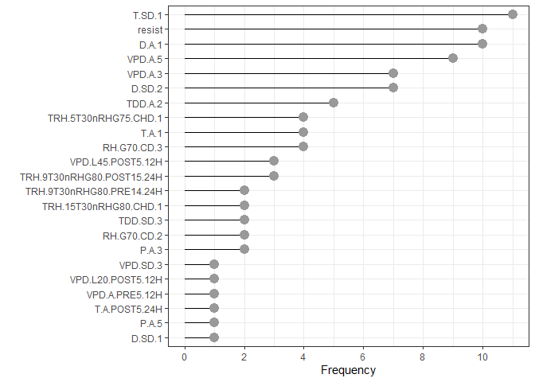
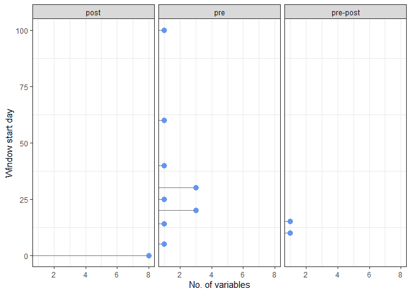
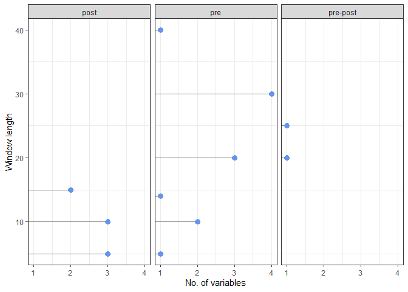

-   <a href="#some-summaries-and-predictor-metadata"
    id="toc-some-summaries-and-predictor-metadata">Some summaries and
    predictor metadata</a>
-   <a href="#objectives" id="toc-objectives">Objective(s)</a>
-   <a href="#base-rf-models" id="toc-base-rf-models">Base RF models</a>
    -   <a href="#lasso" id="toc-lasso">lasso</a>
        -   <a href="#retained-models" id="toc-retained-models">Retained models</a>
        -   <a href="#model-correlations" id="toc-model-correlations">Model
            correlations</a>
    -   <a href="#ridge" id="toc-ridge">ridge</a>
        -   <a href="#retained-models-1" id="toc-retained-models-1">Retained
            models</a>
        -   <a href="#model-correlations-1" id="toc-model-correlations-1">Model
            correlations</a>
    -   <a href="#elasticnet" id="toc-elasticnet">elasticnet</a>
        -   <a href="#retained-models-2" id="toc-retained-models-2">Retained
            models</a>
        -   <a href="#model-correlations-2" id="toc-model-correlations-2">Model
            correlations</a>
    -   <a href="#weights" id="toc-weights">Weights</a>
        -   <a href="#individual" id="toc-individual">Individual</a>
        -   <a href="#means" id="toc-means">Means</a>
    -   <a href="#no-variables-per-model"
        id="toc-no-variables-per-model">No. variables per model</a>
    -   <a href="#no-times-each-variable-was-selected"
        id="toc-no-times-each-variable-was-selected">No times each variable was
        selected</a>
        -   <a href="#table" id="toc-table">Table</a>
        -   <a href="#graph" id="toc-graph">Graph</a>
-   <a href="#metadata" id="toc-metadata">Metadata</a>
    -   <a href="#descriptive-summary" id="toc-descriptive-summary">Descriptive
        summary</a>
    -   <a href="#variable-type" id="toc-variable-type">Variable type</a>
        -   <a href="#all-types" id="toc-all-types">All types</a>
        -   <a href="#by-meta-group" id="toc-by-meta-group">By meta-group</a>
    -   <a href="#metric" id="toc-metric">Metric</a>
    -   <a href="#window-start-day" id="toc-window-start-day">Window start
        day</a>
        -   <a href="#graph-1" id="toc-graph-1">Graph</a>
        -   <a href="#summary-pre-anthesis-variables"
            id="toc-summary-pre-anthesis-variables">Summary (pre-anthesis
            variables)</a>
    -   <a href="#window-end-day" id="toc-window-end-day">Window end day</a>
    -   <a href="#window-length" id="toc-window-length">Window length</a>
        -   <a href="#graph-2" id="toc-graph-2">Graph</a>
        -   <a href="#table-1" id="toc-table-1">Table</a>
    -   <a href="#number-of-variables-by-period"
        id="toc-number-of-variables-by-period">Number of variables by period</a>
        -   <a href="#all-pre-anthesis-variables"
            id="toc-all-pre-anthesis-variables">All pre-anthesis variables</a>
        -   <a href="#all-post-anthesis-variables"
            id="toc-all-post-anthesis-variables">All post-anthesis variables</a>
        -   <a href="#all-pre-post-variables" id="toc-all-pre-post-variables">All
            pre-post variables</a>
    -   <a href="#by-type-of-summary-and-the-time-step-interval"
        id="toc-by-type-of-summary-and-the-time-step-interval">By type of
        summary and the time step interval</a>
        -   <a href="#the-count-daily--variables"
            id="toc-the-count-daily--variables">the count daily <cond> variables</a>
        -   <a href="#the-count-hourly--variables"
            id="toc-the-count-hourly--variables">the count hourly <cond>
            variables</a>
        -   <a href="#the-mean-daily--variables"
            id="toc-the-mean-daily--variables">the mean daily <cond> variables</a>
    -   <a href="#start-and-end-periods" id="toc-start-and-end-periods">Start
        and end periods</a>
-   <a href="#computational-environment"
    id="toc-computational-environment">Computational environment</a>

# Some summaries and predictor metadata

# Objective(s)

-   some summaries of the base RF models that were retained by the three
    metalearners (lasso, ridge, elasticnet), as well as the metadata on
    the variables associated with the base RF models

------------------------------------------------------------------------

<!-- # Stacking -->
<!-- Data setup and partition -->
<!-- Set up the data stack object -->

-   We used lasso, ridge or elasticnet regression as the meta-learner.

-   Out of the 58 RF models, lasso retained 6 RF models, ridge retained
    11, and elasticnet 9. Only 1 varSelRF model was retained (M19) by
    all three meta-learners. The VSURF models retained varied among the
    meta-learners, but overall the following 10 VSURF models were
    retained: M8, M9, M10, M11, M13, M14, M15, M20, M21, M32.

-   That is, even though the meta-learner was fed all 58 RF models, it
    set the coefs for many of them to zero. The meta-learner was then
    trained only with the retained RF models.

------------------------------------------------------------------------

<!-- Model properties  -->

# Base RF models

## lasso

### Retained models

The RF models retained by the `lasso` metalearner

<table>
<thead>
<tr>
<th style="text-align:left;">
</th>
<th style="text-align:left;">
Metalearner
</th>
<th style="text-align:left;">
Model
</th>
<th style="text-align:right;">
Weight
</th>
</tr>
</thead>
<tbody>
<tr>
<td style="text-align:left;">
1
</td>
<td style="text-align:left;">
lasso
</td>
<td style="text-align:left;">
varselrf_M19
</td>
<td style="text-align:right;">
2.920
</td>
</tr>
<tr>
<td style="text-align:left;">
2
</td>
<td style="text-align:left;">
lasso
</td>
<td style="text-align:left;">
vsurf_M21
</td>
<td style="text-align:right;">
1.460
</td>
</tr>
<tr>
<td style="text-align:left;">
3
</td>
<td style="text-align:left;">
lasso
</td>
<td style="text-align:left;">
vsurf_M10
</td>
<td style="text-align:right;">
1.200
</td>
</tr>
<tr>
<td style="text-align:left;">
4
</td>
<td style="text-align:left;">
lasso
</td>
<td style="text-align:left;">
vsurf_M11
</td>
<td style="text-align:right;">
1.000
</td>
</tr>
<tr>
<td style="text-align:left;">
5
</td>
<td style="text-align:left;">
lasso
</td>
<td style="text-align:left;">
vsurf_M8
</td>
<td style="text-align:right;">
0.319
</td>
</tr>
<tr>
<td style="text-align:left;">
6
</td>
<td style="text-align:left;">
lasso
</td>
<td style="text-align:left;">
vsurf_M20
</td>
<td style="text-align:right;">
0.105
</td>
</tr>
</tbody>
</table>

### Model correlations

Pairwise correlations of the predicted probabilities of epidemics for
the base RF models

``` r
# The predicted probs for each of the models in the ensemble. These are the level 1 data.
lasso.probs <-
  fhb_st.lasso$data_stack %>% 
  select(contains(c("varSelRF_M19", "vsurf_M8", "vsurf_M10", "vsurf_M11", "vsurf_M20", "vsurf_M21"))) %>%
  rename_with(., ~str_remove(., ".pred_Nonepi_")) %>%
  rename_with(., ~str_remove(., "_1_1")) %>%
  # prob of Epi
  mutate(across(everything(), ~1-.))

# Using functions in the corrr package. 
# The correlation matrix:
lasso_cor <- 
  lasso.probs %>% 
  correlate(quiet = T) 

# The correlation matrix cleaned up for presentation:
lasso_cor %>%
  shave() %>%
  fashion(decimals = 3)
```

    ##           term varselrf_M19 vsurf_M8 vsurf_M10 vsurf_M11 vsurf_M20 vsurf_M21
    ## 1 varselrf_M19                                                              
    ## 2     vsurf_M8         .940                                                 
    ## 3    vsurf_M10         .925     .909                                        
    ## 4    vsurf_M11         .925     .938      .876                              
    ## 5    vsurf_M20         .894     .911      .896      .911                    
    ## 6    vsurf_M21         .971     .951      .923      .927      .930

``` r
# How many pairwise correlations among the 6 variables:
choose(6, 2)
```

    ## [1] 15

``` r
# The mean of the pairwise correlations:
lasso_cor %>%
  shave() %>%
  stretch(na.rm = T) %>%
  summarise(mean_r = mean(r))
```

    ## # A tibble: 1 x 1
    ##   mean_r
    ##    <dbl>
    ## 1  0.922

``` r
# The highest and lowest correlations (so you have an idea of the range):
lasso_cor %>%
  shave() %>%
  stretch(na.rm = T) %>%
  arrange(r) %>%
  slice(1, n(), with_ties = FALSE)
```

    ## # A tibble: 2 x 3
    ##   x            y             r
    ##   <chr>        <chr>     <dbl>
    ## 1 vsurf_M10    vsurf_M11 0.876
    ## 2 varselrf_M19 vsurf_M21 0.971

## ridge

### Retained models

The RF models retained by the `ridge` metalearner

<table>
<thead>
<tr>
<th style="text-align:left;">
</th>
<th style="text-align:left;">
Metalearner
</th>
<th style="text-align:left;">
Model
</th>
<th style="text-align:right;">
Weight
</th>
</tr>
</thead>
<tbody>
<tr>
<td style="text-align:left;">
1
</td>
<td style="text-align:left;">
ridge
</td>
<td style="text-align:left;">
varselrf_M19
</td>
<td style="text-align:right;">
1.980
</td>
</tr>
<tr>
<td style="text-align:left;">
2
</td>
<td style="text-align:left;">
ridge
</td>
<td style="text-align:left;">
vsurf_M21
</td>
<td style="text-align:right;">
1.210
</td>
</tr>
<tr>
<td style="text-align:left;">
3
</td>
<td style="text-align:left;">
ridge
</td>
<td style="text-align:left;">
vsurf_M10
</td>
<td style="text-align:right;">
1.130
</td>
</tr>
<tr>
<td style="text-align:left;">
4
</td>
<td style="text-align:left;">
ridge
</td>
<td style="text-align:left;">
vsurf_M11
</td>
<td style="text-align:right;">
0.892
</td>
</tr>
<tr>
<td style="text-align:left;">
5
</td>
<td style="text-align:left;">
ridge
</td>
<td style="text-align:left;">
vsurf_M8
</td>
<td style="text-align:right;">
0.557
</td>
</tr>
<tr>
<td style="text-align:left;">
6
</td>
<td style="text-align:left;">
ridge
</td>
<td style="text-align:left;">
vsurf_M13
</td>
<td style="text-align:right;">
0.402
</td>
</tr>
<tr>
<td style="text-align:left;">
7
</td>
<td style="text-align:left;">
ridge
</td>
<td style="text-align:left;">
vsurf_M14
</td>
<td style="text-align:right;">
0.194
</td>
</tr>
<tr>
<td style="text-align:left;">
8
</td>
<td style="text-align:left;">
ridge
</td>
<td style="text-align:left;">
vsurf_M9
</td>
<td style="text-align:right;">
0.156
</td>
</tr>
<tr>
<td style="text-align:left;">
9
</td>
<td style="text-align:left;">
ridge
</td>
<td style="text-align:left;">
vsurf_M32
</td>
<td style="text-align:right;">
0.142
</td>
</tr>
<tr>
<td style="text-align:left;">
10
</td>
<td style="text-align:left;">
ridge
</td>
<td style="text-align:left;">
vsurf_M20
</td>
<td style="text-align:right;">
0.128
</td>
</tr>
<tr>
<td style="text-align:left;">
11
</td>
<td style="text-align:left;">
ridge
</td>
<td style="text-align:left;">
vsurf_M15
</td>
<td style="text-align:right;">
0.055
</td>
</tr>
</tbody>
</table>

### Model correlations

``` r
# The predicted probs for each of the models in the ensemble. These are the level 1 data.
ridge.probs <-
  fhb_st.ridge$data_stack %>% 
  select(contains(c("varselrf_M19", "vsurf_M21", "vsurf_M10", "vsurf_M11", "vsurf_M8", "vsurf_M13", "vsurf_M14", "vsurf_M9", "vsurf_M32", "vsurf_M20", "vsurf_M15"))) %>%
  rename_with(., ~str_remove(., ".pred_Nonepi_")) %>%
  rename_with(., ~str_remove(., "_1_1")) %>%
  # prob of Epi
  mutate(across(everything(), ~1-.))

# The correlation matrix:
ridge_cor <- 
  ridge.probs %>% 
  correlate(quiet = T) 

# The correlation matrix cleaned up for presentation:
ridge_cor %>%
  shave() %>%
  fashion(decimals = 3)
```

    ##            term varselrf_M19 vsurf_M21 vsurf_M10 vsurf_M11 vsurf_M8 vsurf_M13
    ## 1  varselrf_M19                                                              
    ## 2     vsurf_M21         .971                                                 
    ## 3     vsurf_M10         .925      .923                                       
    ## 4     vsurf_M11         .925      .927      .876                             
    ## 5      vsurf_M8         .940      .951      .909      .938                   
    ## 6     vsurf_M13         .946      .962      .929      .924     .933          
    ## 7     vsurf_M14         .940      .971      .913      .916     .953      .949
    ## 8      vsurf_M9         .948      .964      .928      .924     .952      .977
    ## 9     vsurf_M32         .951      .976      .905      .947     .956      .962
    ## 10    vsurf_M20         .894      .930      .896      .911     .911      .952
    ## 11    vsurf_M15         .916      .947      .895      .917     .958      .931
    ##    vsurf_M14 vsurf_M9 vsurf_M32 vsurf_M20 vsurf_M15
    ## 1                                                  
    ## 2                                                  
    ## 3                                                  
    ## 4                                                  
    ## 5                                                  
    ## 6                                                  
    ## 7                                                  
    ## 8       .975                                       
    ## 9       .976     .971                              
    ## 10      .941     .962      .942                    
    ## 11      .964     .955      .958      .927

``` r
# How many pairwise correlations among the 6 variables:
choose(11, 2)
```

    ## [1] 55

``` r
# The mean of the pairwise correlations:
ridge_cor %>%
  shave() %>%
  stretch(na.rm = T) %>%
  summarise(mean_r = mean(r))
```

    ## # A tibble: 1 x 1
    ##   mean_r
    ##    <dbl>
    ## 1  0.939

``` r
# The highest and lowest correlations (so you have an idea of the range):
ridge_cor %>%
  shave() %>%
  stretch(na.rm = T) %>%
  arrange(r) %>%
  slice(1, n(), with_ties = FALSE)
```

    ## # A tibble: 2 x 3
    ##   x         y             r
    ##   <chr>     <chr>     <dbl>
    ## 1 vsurf_M10 vsurf_M11 0.876
    ## 2 vsurf_M13 vsurf_M9  0.977

## elasticnet

### Retained models

The RF models retained by the `elasticnet` metalearner

<table>
<thead>
<tr>
<th style="text-align:left;">
</th>
<th style="text-align:left;">
Metalearner
</th>
<th style="text-align:left;">
Model
</th>
<th style="text-align:right;">
Weight
</th>
</tr>
</thead>
<tbody>
<tr>
<td style="text-align:left;">
1
</td>
<td style="text-align:left;">
elasticnet
</td>
<td style="text-align:left;">
varselrf_M19
</td>
<td style="text-align:right;">
2.250
</td>
</tr>
<tr>
<td style="text-align:left;">
2
</td>
<td style="text-align:left;">
elasticnet
</td>
<td style="text-align:left;">
vsurf_M21
</td>
<td style="text-align:right;">
1.360
</td>
</tr>
<tr>
<td style="text-align:left;">
3
</td>
<td style="text-align:left;">
elasticnet
</td>
<td style="text-align:left;">
vsurf_M10
</td>
<td style="text-align:right;">
1.140
</td>
</tr>
<tr>
<td style="text-align:left;">
4
</td>
<td style="text-align:left;">
elasticnet
</td>
<td style="text-align:left;">
vsurf_M11
</td>
<td style="text-align:right;">
0.943
</td>
</tr>
<tr>
<td style="text-align:left;">
5
</td>
<td style="text-align:left;">
elasticnet
</td>
<td style="text-align:left;">
vsurf_M8
</td>
<td style="text-align:right;">
0.541
</td>
</tr>
<tr>
<td style="text-align:left;">
6
</td>
<td style="text-align:left;">
elasticnet
</td>
<td style="text-align:left;">
vsurf_M13
</td>
<td style="text-align:right;">
0.284
</td>
</tr>
<tr>
<td style="text-align:left;">
7
</td>
<td style="text-align:left;">
elasticnet
</td>
<td style="text-align:left;">
vsurf_M20
</td>
<td style="text-align:right;">
0.097
</td>
</tr>
<tr>
<td style="text-align:left;">
8
</td>
<td style="text-align:left;">
elasticnet
</td>
<td style="text-align:left;">
vsurf_M14
</td>
<td style="text-align:right;">
0.045
</td>
</tr>
<tr>
<td style="text-align:left;">
9
</td>
<td style="text-align:left;">
elasticnet
</td>
<td style="text-align:left;">
vsurf_M9
</td>
<td style="text-align:right;">
0.017
</td>
</tr>
</tbody>
</table>

### Model correlations

``` r
# The predicted probs for each of the models in the ensemble. These are the level 1 data.
en.probs <-
  fhb_st.en$data_stack %>% 
  select(contains(c("varselrf_M19", "vsurf_M21", "vsurf_M10", "vsurf_M11", "vsurf_M8", 'vsurf_M13', "vsurf_M20", "vsurf_M14", "vsurf_M9"))) %>%
  rename_with(., ~str_remove(., ".pred_Nonepi_")) %>%
  rename_with(., ~str_remove(., "_1_1")) %>%
  # prob of Epi
  mutate(across(everything(), ~1-.))

# The correlation matrix:
en_cor <- 
  en.probs %>% 
  correlate(quiet = T) 

# The correlation matrix cleaned up for presentation:
en_cor %>%
  shave() %>%
  fashion(decimals = 3)
```

    ##           term varselrf_M19 vsurf_M21 vsurf_M10 vsurf_M11 vsurf_M8 vsurf_M13
    ## 1 varselrf_M19                                                              
    ## 2    vsurf_M21         .971                                                 
    ## 3    vsurf_M10         .925      .923                                       
    ## 4    vsurf_M11         .925      .927      .876                             
    ## 5     vsurf_M8         .940      .951      .909      .938                   
    ## 6    vsurf_M13         .946      .962      .929      .924     .933          
    ## 7    vsurf_M20         .894      .930      .896      .911     .911      .952
    ## 8    vsurf_M14         .940      .971      .913      .916     .953      .949
    ## 9     vsurf_M9         .948      .964      .928      .924     .952      .977
    ##   vsurf_M20 vsurf_M14 vsurf_M9
    ## 1                             
    ## 2                             
    ## 3                             
    ## 4                             
    ## 5                             
    ## 6                             
    ## 7                             
    ## 8      .941                   
    ## 9      .962      .975

``` r
# How many pairwise correlations among the 6 variables:
choose(9, 2)
```

    ## [1] 36

``` r
# The mean of the pairwise correlations:
en_cor %>%
  shave() %>%
  stretch(na.rm = T) %>%
  summarise(mean_r = mean(r))
```

    ## # A tibble: 1 x 1
    ##   mean_r
    ##    <dbl>
    ## 1  0.936

``` r
# The highest and lowest correlations (so you have an idea of the range):
en_cor %>%
  shave() %>%
  stretch(na.rm = T) %>%
  arrange(r) %>%
  slice(1, n(), with_ties = FALSE)
```

    ## # A tibble: 2 x 3
    ##   x         y             r
    ##   <chr>     <chr>     <dbl>
    ## 1 vsurf_M10 vsurf_M11 0.876
    ## 2 vsurf_M13 vsurf_M9  0.977

## Weights

### Individual

List the RF models used in each of the ensembles and their weights. We
can see that `varselrf_M19`, for example, was assigned relatively high
weight in each of the three ensembles.

The table is sorted by model and then by weight.

<table>
<thead>
<tr>
<th style="text-align:left;">
</th>
<th style="text-align:left;">
Metalearner
</th>
<th style="text-align:left;">
Model
</th>
<th style="text-align:right;">
Weight
</th>
</tr>
</thead>
<tbody>
<tr>
<td style="text-align:left;">
1
</td>
<td style="text-align:left;">
lasso
</td>
<td style="text-align:left;">
varselrf_M19
</td>
<td style="text-align:right;">
2.920
</td>
</tr>
<tr>
<td style="text-align:left;">
2
</td>
<td style="text-align:left;">
elasticnet
</td>
<td style="text-align:left;">
varselrf_M19
</td>
<td style="text-align:right;">
2.250
</td>
</tr>
<tr>
<td style="text-align:left;">
3
</td>
<td style="text-align:left;">
ridge
</td>
<td style="text-align:left;">
varselrf_M19
</td>
<td style="text-align:right;">
1.980
</td>
</tr>
<tr>
<td style="text-align:left;">
4
</td>
<td style="text-align:left;">
lasso
</td>
<td style="text-align:left;">
vsurf_M10
</td>
<td style="text-align:right;">
1.200
</td>
</tr>
<tr>
<td style="text-align:left;">
5
</td>
<td style="text-align:left;">
elasticnet
</td>
<td style="text-align:left;">
vsurf_M10
</td>
<td style="text-align:right;">
1.140
</td>
</tr>
<tr>
<td style="text-align:left;">
6
</td>
<td style="text-align:left;">
ridge
</td>
<td style="text-align:left;">
vsurf_M10
</td>
<td style="text-align:right;">
1.130
</td>
</tr>
<tr>
<td style="text-align:left;">
7
</td>
<td style="text-align:left;">
lasso
</td>
<td style="text-align:left;">
vsurf_M11
</td>
<td style="text-align:right;">
1.000
</td>
</tr>
<tr>
<td style="text-align:left;">
8
</td>
<td style="text-align:left;">
elasticnet
</td>
<td style="text-align:left;">
vsurf_M11
</td>
<td style="text-align:right;">
0.943
</td>
</tr>
<tr>
<td style="text-align:left;">
9
</td>
<td style="text-align:left;">
ridge
</td>
<td style="text-align:left;">
vsurf_M11
</td>
<td style="text-align:right;">
0.892
</td>
</tr>
<tr>
<td style="text-align:left;">
10
</td>
<td style="text-align:left;">
ridge
</td>
<td style="text-align:left;">
vsurf_M13
</td>
<td style="text-align:right;">
0.402
</td>
</tr>
<tr>
<td style="text-align:left;">
11
</td>
<td style="text-align:left;">
elasticnet
</td>
<td style="text-align:left;">
vsurf_M13
</td>
<td style="text-align:right;">
0.284
</td>
</tr>
<tr>
<td style="text-align:left;">
12
</td>
<td style="text-align:left;">
ridge
</td>
<td style="text-align:left;">
vsurf_M14
</td>
<td style="text-align:right;">
0.194
</td>
</tr>
<tr>
<td style="text-align:left;">
13
</td>
<td style="text-align:left;">
elasticnet
</td>
<td style="text-align:left;">
vsurf_M14
</td>
<td style="text-align:right;">
0.045
</td>
</tr>
<tr>
<td style="text-align:left;">
14
</td>
<td style="text-align:left;">
ridge
</td>
<td style="text-align:left;">
vsurf_M15
</td>
<td style="text-align:right;">
0.055
</td>
</tr>
<tr>
<td style="text-align:left;">
15
</td>
<td style="text-align:left;">
ridge
</td>
<td style="text-align:left;">
vsurf_M20
</td>
<td style="text-align:right;">
0.128
</td>
</tr>
<tr>
<td style="text-align:left;">
16
</td>
<td style="text-align:left;">
lasso
</td>
<td style="text-align:left;">
vsurf_M20
</td>
<td style="text-align:right;">
0.105
</td>
</tr>
<tr>
<td style="text-align:left;">
17
</td>
<td style="text-align:left;">
elasticnet
</td>
<td style="text-align:left;">
vsurf_M20
</td>
<td style="text-align:right;">
0.097
</td>
</tr>
<tr>
<td style="text-align:left;">
18
</td>
<td style="text-align:left;">
lasso
</td>
<td style="text-align:left;">
vsurf_M21
</td>
<td style="text-align:right;">
1.460
</td>
</tr>
<tr>
<td style="text-align:left;">
19
</td>
<td style="text-align:left;">
elasticnet
</td>
<td style="text-align:left;">
vsurf_M21
</td>
<td style="text-align:right;">
1.360
</td>
</tr>
<tr>
<td style="text-align:left;">
20
</td>
<td style="text-align:left;">
ridge
</td>
<td style="text-align:left;">
vsurf_M21
</td>
<td style="text-align:right;">
1.210
</td>
</tr>
<tr>
<td style="text-align:left;">
21
</td>
<td style="text-align:left;">
ridge
</td>
<td style="text-align:left;">
vsurf_M32
</td>
<td style="text-align:right;">
0.142
</td>
</tr>
<tr>
<td style="text-align:left;">
22
</td>
<td style="text-align:left;">
ridge
</td>
<td style="text-align:left;">
vsurf_M8
</td>
<td style="text-align:right;">
0.557
</td>
</tr>
<tr>
<td style="text-align:left;">
23
</td>
<td style="text-align:left;">
elasticnet
</td>
<td style="text-align:left;">
vsurf_M8
</td>
<td style="text-align:right;">
0.541
</td>
</tr>
<tr>
<td style="text-align:left;">
24
</td>
<td style="text-align:left;">
lasso
</td>
<td style="text-align:left;">
vsurf_M8
</td>
<td style="text-align:right;">
0.319
</td>
</tr>
<tr>
<td style="text-align:left;">
25
</td>
<td style="text-align:left;">
ridge
</td>
<td style="text-align:left;">
vsurf_M9
</td>
<td style="text-align:right;">
0.156
</td>
</tr>
<tr>
<td style="text-align:left;">
26
</td>
<td style="text-align:left;">
elasticnet
</td>
<td style="text-align:left;">
vsurf_M9
</td>
<td style="text-align:right;">
0.017
</td>
</tr>
</tbody>
</table>

### Means

The mean weight for each model over the 3 metalearners. We also give a
column (n) of the number of metalearners (out of 3) in which the base RF
model was retained. We also see that there were 11 base RF models
retained across the 3 metalearners.

The table is sorted by n and then weight.

<table>
<thead>
<tr>
<th style="text-align:left;">
</th>
<th style="text-align:left;">
Model
</th>
<th style="text-align:right;">
Weight
</th>
<th style="text-align:right;">
n
</th>
</tr>
</thead>
<tbody>
<tr>
<td style="text-align:left;">
1
</td>
<td style="text-align:left;">
varselrf_M19
</td>
<td style="text-align:right;">
2.383
</td>
<td style="text-align:right;">
3
</td>
</tr>
<tr>
<td style="text-align:left;">
2
</td>
<td style="text-align:left;">
vsurf_M21
</td>
<td style="text-align:right;">
1.343
</td>
<td style="text-align:right;">
3
</td>
</tr>
<tr>
<td style="text-align:left;">
3
</td>
<td style="text-align:left;">
vsurf_M10
</td>
<td style="text-align:right;">
1.157
</td>
<td style="text-align:right;">
3
</td>
</tr>
<tr>
<td style="text-align:left;">
4
</td>
<td style="text-align:left;">
vsurf_M11
</td>
<td style="text-align:right;">
0.945
</td>
<td style="text-align:right;">
3
</td>
</tr>
<tr>
<td style="text-align:left;">
5
</td>
<td style="text-align:left;">
vsurf_M8
</td>
<td style="text-align:right;">
0.472
</td>
<td style="text-align:right;">
3
</td>
</tr>
<tr>
<td style="text-align:left;">
6
</td>
<td style="text-align:left;">
vsurf_M20
</td>
<td style="text-align:right;">
0.110
</td>
<td style="text-align:right;">
3
</td>
</tr>
<tr>
<td style="text-align:left;">
7
</td>
<td style="text-align:left;">
vsurf_M13
</td>
<td style="text-align:right;">
0.343
</td>
<td style="text-align:right;">
2
</td>
</tr>
<tr>
<td style="text-align:left;">
8
</td>
<td style="text-align:left;">
vsurf_M14
</td>
<td style="text-align:right;">
0.120
</td>
<td style="text-align:right;">
2
</td>
</tr>
<tr>
<td style="text-align:left;">
9
</td>
<td style="text-align:left;">
vsurf_M9
</td>
<td style="text-align:right;">
0.087
</td>
<td style="text-align:right;">
2
</td>
</tr>
<tr>
<td style="text-align:left;">
10
</td>
<td style="text-align:left;">
vsurf_M32
</td>
<td style="text-align:right;">
0.142
</td>
<td style="text-align:right;">
1
</td>
</tr>
<tr>
<td style="text-align:left;">
11
</td>
<td style="text-align:left;">
vsurf_M15
</td>
<td style="text-align:right;">
0.055
</td>
<td style="text-align:right;">
1
</td>
</tr>
</tbody>
</table>
<!-- RF models data prep for the next two sections at least-->

## No. variables per model

The table is sorted by the no. vars per model, and then the variables
themselves are sorted by name.

<table>
<thead>
<tr>
<th style="text-align:left;">
</th>
<th style="text-align:left;">
RF model
</th>
<th style="text-align:right;">
No. vars
</th>
<th style="text-align:left;">
Variables
</th>
</tr>
</thead>
<tbody>
<tr>
<td style="text-align:left;">
1
</td>
<td style="text-align:left;">
varSelRF_M19
</td>
<td style="text-align:right;">
14
</td>
<td style="text-align:left;">
D.SD.1 , D.SD.2 , P.A.3 , resist , RH.G70.CD.2 , RH.G70.CD.3 , T.SD.1 ,
TDD.A.2 , TDD.SD.3 , TRH.15T30nRHG80.CHD.1 , TRH.9T30nRHG80.POST15.24H,
VPD.A.3 , VPD.A.5 , VPD.L45.POST5.12H
</td>
</tr>
<tr>
<td style="text-align:left;">
2
</td>
<td style="text-align:left;">
vsurf_M8
</td>
<td style="text-align:right;">
9
</td>
<td style="text-align:left;">
D.A.1 , D.SD.2 , P.A.5 , resist , RH.G70.CD.3 , T.SD.1 ,
TRH.5T30nRHG75.CHD.1 , TRH.9T30nRHG80.PRE14.24H, VPD.A.5
</td>
</tr>
<tr>
<td style="text-align:left;">
3
</td>
<td style="text-align:left;">
vsurf_M9
</td>
<td style="text-align:right;">
9
</td>
<td style="text-align:left;">
D.A.1 , D.SD.2 , resist , T.A.1 , T.SD.1 , TRH.5T30nRHG75.CHD.1 ,
TRH.9T30nRHG80.POST15.24H, VPD.A.3 , VPD.A.5
</td>
</tr>
<tr>
<td style="text-align:left;">
4
</td>
<td style="text-align:left;">
vsurf_M13
</td>
<td style="text-align:right;">
9
</td>
<td style="text-align:left;">
D.A.1 , resist , T.A.1 , T.A.POST5.24H , T.SD.1 , TDD.A.2 ,
TRH.9T30nRHG80.POST15.24H, VPD.A.3 , VPD.A.5
</td>
</tr>
<tr>
<td style="text-align:left;">
5
</td>
<td style="text-align:left;">
vsurf_M21
</td>
<td style="text-align:right;">
9
</td>
<td style="text-align:left;">
D.A.1 , D.SD.2 , P.A.3 , resist , T.SD.1 , TDD.A.2 , VPD.A.3 , VPD.A.5 ,
VPD.L45.POST5.12H
</td>
</tr>
<tr>
<td style="text-align:left;">
6
</td>
<td style="text-align:left;">
vsurf_M14
</td>
<td style="text-align:right;">
8
</td>
<td style="text-align:left;">
D.A.1 , D.SD.2 , resist , T.SD.1 , TRH.5T30nRHG75.CHD.1, VPD.A.3 ,
VPD.A.5 , VPD.L20.POST5.12H
</td>
</tr>
<tr>
<td style="text-align:left;">
7
</td>
<td style="text-align:left;">
vsurf_M15
</td>
<td style="text-align:right;">
8
</td>
<td style="text-align:left;">
D.A.1 , D.SD.2 , resist , T.SD.1 , TRH.15T30nRHG80.CHD.1,
TRH.5T30nRHG75.CHD.1 , VPD.A.5 , VPD.A.PRE5.12H
</td>
</tr>
<tr>
<td style="text-align:left;">
8
</td>
<td style="text-align:left;">
vsurf_M32
</td>
<td style="text-align:right;">
8
</td>
<td style="text-align:left;">
D.A.1 , D.SD.2 , resist , RH.G70.CD.3, T.SD.1 , TDD.A.2 , VPD.A.3 ,
VPD.A.5
</td>
</tr>
<tr>
<td style="text-align:left;">
9
</td>
<td style="text-align:left;">
vsurf_M10
</td>
<td style="text-align:right;">
7
</td>
<td style="text-align:left;">
D.A.1 , T.A.1 , T.SD.1 , TDD.SD.3 , VPD.A.5 , VPD.L45.POST5.12H,
VPD.SD.3
</td>
</tr>
<tr>
<td style="text-align:left;">
10
</td>
<td style="text-align:left;">
vsurf_M11
</td>
<td style="text-align:right;">
6
</td>
<td style="text-align:left;">
D.A.1 , resist , RH.G70.CD.2, RH.G70.CD.3, T.SD.1 , TDD.A.2
</td>
</tr>
<tr>
<td style="text-align:left;">
11
</td>
<td style="text-align:left;">
vsurf_M20
</td>
<td style="text-align:right;">
6
</td>
<td style="text-align:left;">
D.A.1 , resist , T.A.1 , T.SD.1 , TRH.9T30nRHG80.PRE14.24H, VPD.A.3
</td>
</tr>
</tbody>
</table>

## No times each variable was selected

### Table

The table is sorted by count, the maximum of which is 11 (the no. of RF
models)

<table>
<thead>
<tr>
<th style="text-align:left;">
</th>
<th style="text-align:left;">
Variables
</th>
<th style="text-align:right;">
Count
</th>
</tr>
</thead>
<tbody>
<tr>
<td style="text-align:left;">
1
</td>
<td style="text-align:left;">
T.SD.1
</td>
<td style="text-align:right;">
11
</td>
</tr>
<tr>
<td style="text-align:left;">
2
</td>
<td style="text-align:left;">
D.A.1
</td>
<td style="text-align:right;">
10
</td>
</tr>
<tr>
<td style="text-align:left;">
3
</td>
<td style="text-align:left;">
resist
</td>
<td style="text-align:right;">
10
</td>
</tr>
<tr>
<td style="text-align:left;">
4
</td>
<td style="text-align:left;">
VPD.A.5
</td>
<td style="text-align:right;">
9
</td>
</tr>
<tr>
<td style="text-align:left;">
5
</td>
<td style="text-align:left;">
D.SD.2
</td>
<td style="text-align:right;">
7
</td>
</tr>
<tr>
<td style="text-align:left;">
6
</td>
<td style="text-align:left;">
VPD.A.3
</td>
<td style="text-align:right;">
7
</td>
</tr>
<tr>
<td style="text-align:left;">
7
</td>
<td style="text-align:left;">
TDD.A.2
</td>
<td style="text-align:right;">
5
</td>
</tr>
<tr>
<td style="text-align:left;">
8
</td>
<td style="text-align:left;">
RH.G70.CD.3
</td>
<td style="text-align:right;">
4
</td>
</tr>
<tr>
<td style="text-align:left;">
9
</td>
<td style="text-align:left;">
T.A.1
</td>
<td style="text-align:right;">
4
</td>
</tr>
<tr>
<td style="text-align:left;">
10
</td>
<td style="text-align:left;">
TRH.5T30nRHG75.CHD.1
</td>
<td style="text-align:right;">
4
</td>
</tr>
<tr>
<td style="text-align:left;">
11
</td>
<td style="text-align:left;">
TRH.9T30nRHG80.POST15.24H
</td>
<td style="text-align:right;">
3
</td>
</tr>
<tr>
<td style="text-align:left;">
12
</td>
<td style="text-align:left;">
VPD.L45.POST5.12H
</td>
<td style="text-align:right;">
3
</td>
</tr>
<tr>
<td style="text-align:left;">
13
</td>
<td style="text-align:left;">
P.A.3
</td>
<td style="text-align:right;">
2
</td>
</tr>
<tr>
<td style="text-align:left;">
14
</td>
<td style="text-align:left;">
RH.G70.CD.2
</td>
<td style="text-align:right;">
2
</td>
</tr>
<tr>
<td style="text-align:left;">
15
</td>
<td style="text-align:left;">
TDD.SD.3
</td>
<td style="text-align:right;">
2
</td>
</tr>
<tr>
<td style="text-align:left;">
16
</td>
<td style="text-align:left;">
TRH.15T30nRHG80.CHD.1
</td>
<td style="text-align:right;">
2
</td>
</tr>
<tr>
<td style="text-align:left;">
17
</td>
<td style="text-align:left;">
TRH.9T30nRHG80.PRE14.24H
</td>
<td style="text-align:right;">
2
</td>
</tr>
<tr>
<td style="text-align:left;">
18
</td>
<td style="text-align:left;">
D.SD.1
</td>
<td style="text-align:right;">
1
</td>
</tr>
<tr>
<td style="text-align:left;">
19
</td>
<td style="text-align:left;">
P.A.5
</td>
<td style="text-align:right;">
1
</td>
</tr>
<tr>
<td style="text-align:left;">
20
</td>
<td style="text-align:left;">
T.A.POST5.24H
</td>
<td style="text-align:right;">
1
</td>
</tr>
<tr>
<td style="text-align:left;">
21
</td>
<td style="text-align:left;">
VPD.A.PRE5.12H
</td>
<td style="text-align:right;">
1
</td>
</tr>
<tr>
<td style="text-align:left;">
22
</td>
<td style="text-align:left;">
VPD.L20.POST5.12H
</td>
<td style="text-align:right;">
1
</td>
</tr>
<tr>
<td style="text-align:left;">
23
</td>
<td style="text-align:left;">
VPD.SD.3
</td>
<td style="text-align:right;">
1
</td>
</tr>
</tbody>
</table>

### Graph

<!-- -->

# Metadata

<!-- Variables meta-data -->

## Descriptive summary

This set has 22 variables.

<table>
<thead>
<tr>
<th style="text-align:left;">
</th>
<th style="text-align:left;">
Source
</th>
<th style="text-align:left;">
Name
</th>
<th style="text-align:left;">
Summary
</th>
<th style="text-align:left;">
Window start period
</th>
<th style="text-align:right;">
Window start day
</th>
<th style="text-align:left;">
Window end period
</th>
<th style="text-align:right;">
Window end day
</th>
<th style="text-align:right;">
Window length
</th>
</tr>
</thead>
<tbody>
<tr>
<td style="text-align:left;">
1
</td>
<td style="text-align:left;">
Shah 2019
</td>
<td style="text-align:left;">
T.A.1
</td>
<td style="text-align:left;">
Daily mean T
</td>
<td style="text-align:left;">
pre
</td>
<td style="text-align:right;">
25
</td>
<td style="text-align:left;">
pre
</td>
<td style="text-align:right;">
15
</td>
<td style="text-align:right;">
10
</td>
</tr>
<tr>
<td style="text-align:left;">
2
</td>
<td style="text-align:left;">
Shah 2019
</td>
<td style="text-align:left;">
D.A.1
</td>
<td style="text-align:left;">
Daily mean D
</td>
<td style="text-align:left;">
pre
</td>
<td style="text-align:right;">
20
</td>
<td style="text-align:left;">
anthesis
</td>
<td style="text-align:right;">
0
</td>
<td style="text-align:right;">
20
</td>
</tr>
<tr>
<td style="text-align:left;">
3
</td>
<td style="text-align:left;">
Shah 2019
</td>
<td style="text-align:left;">
P.A.3
</td>
<td style="text-align:left;">
Daily mean P
</td>
<td style="text-align:left;">
pre
</td>
<td style="text-align:right;">
60
</td>
<td style="text-align:left;">
pre
</td>
<td style="text-align:right;">
50
</td>
<td style="text-align:right;">
10
</td>
</tr>
<tr>
<td style="text-align:left;">
4
</td>
<td style="text-align:left;">
Shah 2019
</td>
<td style="text-align:left;">
P.A.5
</td>
<td style="text-align:left;">
Daily mean P
</td>
<td style="text-align:left;">
pre
</td>
<td style="text-align:right;">
100
</td>
<td style="text-align:left;">
pre
</td>
<td style="text-align:right;">
60
</td>
<td style="text-align:right;">
40
</td>
</tr>
<tr>
<td style="text-align:left;">
5
</td>
<td style="text-align:left;">
Shah 2019
</td>
<td style="text-align:left;">
VPD.A.3
</td>
<td style="text-align:left;">
Daily mean VPD
</td>
<td style="text-align:left;">
anthesis
</td>
<td style="text-align:right;">
0
</td>
<td style="text-align:left;">
post
</td>
<td style="text-align:right;">
15
</td>
<td style="text-align:right;">
15
</td>
</tr>
<tr>
<td style="text-align:left;">
6
</td>
<td style="text-align:left;">
Shah 2019
</td>
<td style="text-align:left;">
VPD.A.5
</td>
<td style="text-align:left;">
Daily mean VPD
</td>
<td style="text-align:left;">
pre
</td>
<td style="text-align:right;">
10
</td>
<td style="text-align:left;">
post
</td>
<td style="text-align:right;">
10
</td>
<td style="text-align:right;">
20
</td>
</tr>
<tr>
<td style="text-align:left;">
7
</td>
<td style="text-align:left;">
Shah 2019
</td>
<td style="text-align:left;">
TDD.A.2
</td>
<td style="text-align:left;">
Daily mean TDD
</td>
<td style="text-align:left;">
pre
</td>
<td style="text-align:right;">
30
</td>
<td style="text-align:left;">
anthesis
</td>
<td style="text-align:right;">
0
</td>
<td style="text-align:right;">
30
</td>
</tr>
<tr>
<td style="text-align:left;">
8
</td>
<td style="text-align:left;">
Shah 2019
</td>
<td style="text-align:left;">
TRH.15T30nRHG80.CHD.1
</td>
<td style="text-align:left;">
No. hr 15 \<= T \<= 30 & RH \>= 80
</td>
<td style="text-align:left;">
pre
</td>
<td style="text-align:right;">
30
</td>
<td style="text-align:left;">
anthesis
</td>
<td style="text-align:right;">
0
</td>
<td style="text-align:right;">
30
</td>
</tr>
<tr>
<td style="text-align:left;">
9
</td>
<td style="text-align:left;">
Shah 2019
</td>
<td style="text-align:left;">
TRH.5T30nRHG75.CHD.1
</td>
<td style="text-align:left;">
No. hr 5 \<= T \<= 30 & RH \>= 75
</td>
<td style="text-align:left;">
pre
</td>
<td style="text-align:right;">
20
</td>
<td style="text-align:left;">
anthesis
</td>
<td style="text-align:right;">
0
</td>
<td style="text-align:right;">
20
</td>
</tr>
<tr>
<td style="text-align:left;">
10
</td>
<td style="text-align:left;">
Shah 2019
</td>
<td style="text-align:left;">
RH.G70.CD.2
</td>
<td style="text-align:left;">
No. days mean RH \> 70
</td>
<td style="text-align:left;">
anthesis
</td>
<td style="text-align:right;">
0
</td>
<td style="text-align:left;">
post
</td>
<td style="text-align:right;">
10
</td>
<td style="text-align:right;">
10
</td>
</tr>
<tr>
<td style="text-align:left;">
11
</td>
<td style="text-align:left;">
Shah 2019
</td>
<td style="text-align:left;">
RH.G70.CD.3
</td>
<td style="text-align:left;">
No. days mean RH \> 70
</td>
<td style="text-align:left;">
pre
</td>
<td style="text-align:right;">
15
</td>
<td style="text-align:left;">
post
</td>
<td style="text-align:right;">
10
</td>
<td style="text-align:right;">
25
</td>
</tr>
<tr>
<td style="text-align:left;">
12
</td>
<td style="text-align:left;">
Shah 2019
</td>
<td style="text-align:left;">
T.SD.1
</td>
<td style="text-align:left;">
Mean(per day sd(hourly T))
</td>
<td style="text-align:left;">
pre
</td>
<td style="text-align:right;">
20
</td>
<td style="text-align:left;">
anthesis
</td>
<td style="text-align:right;">
0
</td>
<td style="text-align:right;">
20
</td>
</tr>
<tr>
<td style="text-align:left;">
13
</td>
<td style="text-align:left;">
Shah 2019
</td>
<td style="text-align:left;">
D.SD.1
</td>
<td style="text-align:left;">
Mean(per day sd(hourly D))
</td>
<td style="text-align:left;">
pre
</td>
<td style="text-align:right;">
30
</td>
<td style="text-align:left;">
anthesis
</td>
<td style="text-align:right;">
0
</td>
<td style="text-align:right;">
30
</td>
</tr>
<tr>
<td style="text-align:left;">
14
</td>
<td style="text-align:left;">
Shah 2019
</td>
<td style="text-align:left;">
D.SD.2
</td>
<td style="text-align:left;">
Mean(per day sd(hourly D))
</td>
<td style="text-align:left;">
pre
</td>
<td style="text-align:right;">
40
</td>
<td style="text-align:left;">
pre
</td>
<td style="text-align:right;">
10
</td>
<td style="text-align:right;">
30
</td>
</tr>
<tr>
<td style="text-align:left;">
15
</td>
<td style="text-align:left;">
Shah 2019
</td>
<td style="text-align:left;">
VPD.SD.3
</td>
<td style="text-align:left;">
Mean(per day sd(hourly VPD))
</td>
<td style="text-align:left;">
anthesis
</td>
<td style="text-align:right;">
0
</td>
<td style="text-align:left;">
post
</td>
<td style="text-align:right;">
10
</td>
<td style="text-align:right;">
10
</td>
</tr>
<tr>
<td style="text-align:left;">
16
</td>
<td style="text-align:left;">
Shah 2019
</td>
<td style="text-align:left;">
TDD.SD.3
</td>
<td style="text-align:left;">
Mean(per day sd(hourly TDD))
</td>
<td style="text-align:left;">
anthesis
</td>
<td style="text-align:right;">
0
</td>
<td style="text-align:left;">
post
</td>
<td style="text-align:right;">
10
</td>
<td style="text-align:right;">
10
</td>
</tr>
<tr>
<td style="text-align:left;">
17
</td>
<td style="text-align:left;">
Shah 2013
</td>
<td style="text-align:left;">
VPD.A.PRE5.12H
</td>
<td style="text-align:left;">
Mean VPD overnight
</td>
<td style="text-align:left;">
pre
</td>
<td style="text-align:right;">
5
</td>
<td style="text-align:left;">
anthesis
</td>
<td style="text-align:right;">
0
</td>
<td style="text-align:right;">
5
</td>
</tr>
<tr>
<td style="text-align:left;">
18
</td>
<td style="text-align:left;">
Shah 2013
</td>
<td style="text-align:left;">
VPD.L20.POST5.12H
</td>
<td style="text-align:left;">
No. overnight hr VPD \<= 0.20
</td>
<td style="text-align:left;">
anthesis
</td>
<td style="text-align:right;">
0
</td>
<td style="text-align:left;">
post
</td>
<td style="text-align:right;">
5
</td>
<td style="text-align:right;">
5
</td>
</tr>
<tr>
<td style="text-align:left;">
19
</td>
<td style="text-align:left;">
Shah 2013
</td>
<td style="text-align:left;">
VPD.L45.POST5.12H
</td>
<td style="text-align:left;">
No. overnight hr VPD \<= 0.45
</td>
<td style="text-align:left;">
anthesis
</td>
<td style="text-align:right;">
0
</td>
<td style="text-align:left;">
post
</td>
<td style="text-align:right;">
5
</td>
<td style="text-align:right;">
5
</td>
</tr>
<tr>
<td style="text-align:left;">
20
</td>
<td style="text-align:left;">
Shah 2013
</td>
<td style="text-align:left;">
T.A.POST5.24H
</td>
<td style="text-align:left;">
Daily mean T
</td>
<td style="text-align:left;">
anthesis
</td>
<td style="text-align:right;">
0
</td>
<td style="text-align:left;">
post
</td>
<td style="text-align:right;">
5
</td>
<td style="text-align:right;">
5
</td>
</tr>
<tr>
<td style="text-align:left;">
21
</td>
<td style="text-align:left;">
Shah 2013
</td>
<td style="text-align:left;">
TRH.9T30nRHG80.PRE14.24H
</td>
<td style="text-align:left;">
No. hr 9 \<= T \<= 30 & RH \>= 80
</td>
<td style="text-align:left;">
pre
</td>
<td style="text-align:right;">
14
</td>
<td style="text-align:left;">
anthesis
</td>
<td style="text-align:right;">
0
</td>
<td style="text-align:right;">
14
</td>
</tr>
<tr>
<td style="text-align:left;">
22
</td>
<td style="text-align:left;">
Shah 2013
</td>
<td style="text-align:left;">
TRH.9T30nRHG80.POST15.24H
</td>
<td style="text-align:left;">
No. hr 9 \<= T \<= 30 & RH \>= 80
</td>
<td style="text-align:left;">
anthesis
</td>
<td style="text-align:right;">
0
</td>
<td style="text-align:left;">
post
</td>
<td style="text-align:right;">
15
</td>
<td style="text-align:right;">
15
</td>
</tr>
</tbody>
</table>

## Variable type

-   all 7 types are represented

### All types

<table>
<thead>
<tr>
<th style="text-align:left;">
</th>
<th style="text-align:left;">
Type
</th>
<th style="text-align:right;">
Count
</th>
</tr>
</thead>
<tbody>
<tr>
<td style="text-align:left;">
1
</td>
<td style="text-align:left;">
D
</td>
<td style="text-align:right;">
3
</td>
</tr>
<tr>
<td style="text-align:left;">
2
</td>
<td style="text-align:left;">
P
</td>
<td style="text-align:right;">
2
</td>
</tr>
<tr>
<td style="text-align:left;">
3
</td>
<td style="text-align:left;">
RH
</td>
<td style="text-align:right;">
2
</td>
</tr>
<tr>
<td style="text-align:left;">
4
</td>
<td style="text-align:left;">
T
</td>
<td style="text-align:right;">
3
</td>
</tr>
<tr>
<td style="text-align:left;">
5
</td>
<td style="text-align:left;">
TDD
</td>
<td style="text-align:right;">
2
</td>
</tr>
<tr>
<td style="text-align:left;">
6
</td>
<td style="text-align:left;">
TRH
</td>
<td style="text-align:right;">
4
</td>
</tr>
<tr>
<td style="text-align:left;">
7
</td>
<td style="text-align:left;">
VPD
</td>
<td style="text-align:right;">
6
</td>
</tr>
</tbody>
</table>

### By meta-group

Moisture-indicating variables (RH, TDD, VPD) all in one group

<table>
<thead>
<tr>
<th style="text-align:left;">
</th>
<th style="text-align:left;">
Meta-group
</th>
<th style="text-align:right;">
Count
</th>
</tr>
</thead>
<tbody>
<tr>
<td style="text-align:left;">
1
</td>
<td style="text-align:left;">
Moisture-related
</td>
<td style="text-align:right;">
10
</td>
</tr>
<tr>
<td style="text-align:left;">
2
</td>
<td style="text-align:left;">
Other
</td>
<td style="text-align:right;">
12
</td>
</tr>
</tbody>
</table>

## Metric

-   i.e., does the variable summarize a count (e.g., no. of hr) or mean?
-   about two-thirds of the variables are means

<table>
<thead>
<tr>
<th style="text-align:left;">
</th>
<th style="text-align:left;">
Metric
</th>
<th style="text-align:right;">
Count
</th>
</tr>
</thead>
<tbody>
<tr>
<td style="text-align:left;">
1
</td>
<td style="text-align:left;">
count
</td>
<td style="text-align:right;">
8
</td>
</tr>
<tr>
<td style="text-align:left;">
2
</td>
<td style="text-align:left;">
mean
</td>
<td style="text-align:right;">
14
</td>
</tr>
</tbody>
</table>

## Window start day

-   several different window start days pre-anthesis
-   all post-anthesis variables start at anthesis

### Graph

<!-- -->

### Summary (pre-anthesis variables)

All post-anthesis variables began at anthesis
<table>
<thead>
<tr>
<th style="text-align:left;">
</th>
<th style="text-align:right;">
Window start (min)
</th>
<th style="text-align:right;">
Window start (mean)
</th>
<th style="text-align:right;">
Window start (max)
</th>
</tr>
</thead>
<tbody>
<tr>
<td style="text-align:left;">
1
</td>
<td style="text-align:right;">
5
</td>
<td style="text-align:right;">
32.8
</td>
<td style="text-align:right;">
100
</td>
</tr>
</tbody>
</table>

## Window end day

Besides four variables, all other pre-anthesis variable windows end at
anthesis, of course.

The Table below is for the post-anthesis variables, all of which start
at anthesis.
<table>
<thead>
<tr>
<th style="text-align:left;">
</th>
<th style="text-align:right;">
Window end (min)
</th>
<th style="text-align:right;">
Window end (mean)
</th>
<th style="text-align:right;">
Window end (max)
</th>
</tr>
</thead>
<tbody>
<tr>
<td style="text-align:left;">
1
</td>
<td style="text-align:right;">
5
</td>
<td style="text-align:right;">
9.38
</td>
<td style="text-align:right;">
15
</td>
</tr>
</tbody>
</table>

## Window length

-   the length (days) of the window the variable summarizes
-   they are various

### Graph

<!-- -->

### Table

Average window length for each group
<table>
<thead>
<tr>
<th style="text-align:left;">
</th>
<th style="text-align:left;">
Period
</th>
<th style="text-align:right;">
Count
</th>
<th style="text-align:right;">
Min window length
</th>
<th style="text-align:right;">
Mean window length
</th>
<th style="text-align:right;">
Max window length
</th>
</tr>
</thead>
<tbody>
<tr>
<td style="text-align:left;">
1
</td>
<td style="text-align:left;">
post
</td>
<td style="text-align:right;">
8
</td>
<td style="text-align:right;">
5
</td>
<td style="text-align:right;">
9.38
</td>
<td style="text-align:right;">
15
</td>
</tr>
<tr>
<td style="text-align:left;">
2
</td>
<td style="text-align:left;">
pre
</td>
<td style="text-align:right;">
12
</td>
<td style="text-align:right;">
5
</td>
<td style="text-align:right;">
21.58
</td>
<td style="text-align:right;">
40
</td>
</tr>
<tr>
<td style="text-align:left;">
3
</td>
<td style="text-align:left;">
pre-post
</td>
<td style="text-align:right;">
2
</td>
<td style="text-align:right;">
20
</td>
<td style="text-align:right;">
22.50
</td>
<td style="text-align:right;">
25
</td>
</tr>
</tbody>
</table>

## Number of variables by period

-   55% are pre-anthesis variables

<table>
<thead>
<tr>
<th style="text-align:left;">
</th>
<th style="text-align:left;">
Period
</th>
<th style="text-align:right;">
Count
</th>
</tr>
</thead>
<tbody>
<tr>
<td style="text-align:left;">
1
</td>
<td style="text-align:left;">
post
</td>
<td style="text-align:right;">
8
</td>
</tr>
<tr>
<td style="text-align:left;">
2
</td>
<td style="text-align:left;">
pre
</td>
<td style="text-align:right;">
12
</td>
</tr>
<tr>
<td style="text-align:left;">
3
</td>
<td style="text-align:left;">
pre-post
</td>
<td style="text-align:right;">
2
</td>
</tr>
</tbody>
</table>

### All pre-anthesis variables

<table>
<thead>
<tr>
<th style="text-align:left;">
</th>
<th style="text-align:left;">
Variable
</th>
<th style="text-align:left;">
Summary
</th>
<th style="text-align:left;">
Window start period
</th>
<th style="text-align:left;">
Window end period
</th>
<th style="text-align:right;">
Window start day
</th>
<th style="text-align:right;">
Window end day
</th>
<th style="text-align:right;">
Window length
</th>
</tr>
</thead>
<tbody>
<tr>
<td style="text-align:left;">
1
</td>
<td style="text-align:left;">
D.A.1
</td>
<td style="text-align:left;">
Daily mean D
</td>
<td style="text-align:left;">
pre
</td>
<td style="text-align:left;">
anthesis
</td>
<td style="text-align:right;">
20
</td>
<td style="text-align:right;">
0
</td>
<td style="text-align:right;">
20
</td>
</tr>
<tr>
<td style="text-align:left;">
2
</td>
<td style="text-align:left;">
D.SD.1
</td>
<td style="text-align:left;">
Mean(per day sd(hourly D))
</td>
<td style="text-align:left;">
pre
</td>
<td style="text-align:left;">
anthesis
</td>
<td style="text-align:right;">
30
</td>
<td style="text-align:right;">
0
</td>
<td style="text-align:right;">
30
</td>
</tr>
<tr>
<td style="text-align:left;">
3
</td>
<td style="text-align:left;">
D.SD.2
</td>
<td style="text-align:left;">
Mean(per day sd(hourly D))
</td>
<td style="text-align:left;">
pre
</td>
<td style="text-align:left;">
pre
</td>
<td style="text-align:right;">
40
</td>
<td style="text-align:right;">
10
</td>
<td style="text-align:right;">
30
</td>
</tr>
<tr>
<td style="text-align:left;">
4
</td>
<td style="text-align:left;">
P.A.3
</td>
<td style="text-align:left;">
Daily mean P
</td>
<td style="text-align:left;">
pre
</td>
<td style="text-align:left;">
pre
</td>
<td style="text-align:right;">
60
</td>
<td style="text-align:right;">
50
</td>
<td style="text-align:right;">
10
</td>
</tr>
<tr>
<td style="text-align:left;">
5
</td>
<td style="text-align:left;">
P.A.5
</td>
<td style="text-align:left;">
Daily mean P
</td>
<td style="text-align:left;">
pre
</td>
<td style="text-align:left;">
pre
</td>
<td style="text-align:right;">
100
</td>
<td style="text-align:right;">
60
</td>
<td style="text-align:right;">
40
</td>
</tr>
<tr>
<td style="text-align:left;">
6
</td>
<td style="text-align:left;">
T.A.1
</td>
<td style="text-align:left;">
Daily mean T
</td>
<td style="text-align:left;">
pre
</td>
<td style="text-align:left;">
pre
</td>
<td style="text-align:right;">
25
</td>
<td style="text-align:right;">
15
</td>
<td style="text-align:right;">
10
</td>
</tr>
<tr>
<td style="text-align:left;">
7
</td>
<td style="text-align:left;">
T.SD.1
</td>
<td style="text-align:left;">
Mean(per day sd(hourly T))
</td>
<td style="text-align:left;">
pre
</td>
<td style="text-align:left;">
anthesis
</td>
<td style="text-align:right;">
20
</td>
<td style="text-align:right;">
0
</td>
<td style="text-align:right;">
20
</td>
</tr>
<tr>
<td style="text-align:left;">
8
</td>
<td style="text-align:left;">
TDD.A.2
</td>
<td style="text-align:left;">
Daily mean TDD
</td>
<td style="text-align:left;">
pre
</td>
<td style="text-align:left;">
anthesis
</td>
<td style="text-align:right;">
30
</td>
<td style="text-align:right;">
0
</td>
<td style="text-align:right;">
30
</td>
</tr>
<tr>
<td style="text-align:left;">
9
</td>
<td style="text-align:left;">
TRH.15T30nRHG80.CHD.1
</td>
<td style="text-align:left;">
No. hr 15 \<= T \<= 30 & RH \>= 80
</td>
<td style="text-align:left;">
pre
</td>
<td style="text-align:left;">
anthesis
</td>
<td style="text-align:right;">
30
</td>
<td style="text-align:right;">
0
</td>
<td style="text-align:right;">
30
</td>
</tr>
<tr>
<td style="text-align:left;">
10
</td>
<td style="text-align:left;">
TRH.5T30nRHG75.CHD.1
</td>
<td style="text-align:left;">
No. hr 5 \<= T \<= 30 & RH \>= 75
</td>
<td style="text-align:left;">
pre
</td>
<td style="text-align:left;">
anthesis
</td>
<td style="text-align:right;">
20
</td>
<td style="text-align:right;">
0
</td>
<td style="text-align:right;">
20
</td>
</tr>
<tr>
<td style="text-align:left;">
11
</td>
<td style="text-align:left;">
TRH.9T30nRHG80.PRE14.24H
</td>
<td style="text-align:left;">
No. hr 9 \<= T \<= 30 & RH \>= 80
</td>
<td style="text-align:left;">
pre
</td>
<td style="text-align:left;">
anthesis
</td>
<td style="text-align:right;">
14
</td>
<td style="text-align:right;">
0
</td>
<td style="text-align:right;">
14
</td>
</tr>
<tr>
<td style="text-align:left;">
12
</td>
<td style="text-align:left;">
VPD.A.PRE5.12H
</td>
<td style="text-align:left;">
Mean VPD overnight
</td>
<td style="text-align:left;">
pre
</td>
<td style="text-align:left;">
anthesis
</td>
<td style="text-align:right;">
5
</td>
<td style="text-align:right;">
0
</td>
<td style="text-align:right;">
5
</td>
</tr>
</tbody>
</table>

### All post-anthesis variables

<table>
<thead>
<tr>
<th style="text-align:left;">
</th>
<th style="text-align:left;">
Variable
</th>
<th style="text-align:left;">
Summary
</th>
<th style="text-align:left;">
Window start period
</th>
<th style="text-align:left;">
Window end period
</th>
<th style="text-align:right;">
Window start day
</th>
<th style="text-align:right;">
Window end day
</th>
<th style="text-align:right;">
Window length
</th>
</tr>
</thead>
<tbody>
<tr>
<td style="text-align:left;">
1
</td>
<td style="text-align:left;">
RH.G70.CD.2
</td>
<td style="text-align:left;">
No. days mean RH \> 70
</td>
<td style="text-align:left;">
anthesis
</td>
<td style="text-align:left;">
post
</td>
<td style="text-align:right;">
0
</td>
<td style="text-align:right;">
10
</td>
<td style="text-align:right;">
10
</td>
</tr>
<tr>
<td style="text-align:left;">
2
</td>
<td style="text-align:left;">
T.A.POST5.24H
</td>
<td style="text-align:left;">
Daily mean T
</td>
<td style="text-align:left;">
anthesis
</td>
<td style="text-align:left;">
post
</td>
<td style="text-align:right;">
0
</td>
<td style="text-align:right;">
5
</td>
<td style="text-align:right;">
5
</td>
</tr>
<tr>
<td style="text-align:left;">
3
</td>
<td style="text-align:left;">
TDD.SD.3
</td>
<td style="text-align:left;">
Mean(per day sd(hourly TDD))
</td>
<td style="text-align:left;">
anthesis
</td>
<td style="text-align:left;">
post
</td>
<td style="text-align:right;">
0
</td>
<td style="text-align:right;">
10
</td>
<td style="text-align:right;">
10
</td>
</tr>
<tr>
<td style="text-align:left;">
4
</td>
<td style="text-align:left;">
TRH.9T30nRHG80.POST15.24H
</td>
<td style="text-align:left;">
No. hr 9 \<= T \<= 30 & RH \>= 80
</td>
<td style="text-align:left;">
anthesis
</td>
<td style="text-align:left;">
post
</td>
<td style="text-align:right;">
0
</td>
<td style="text-align:right;">
15
</td>
<td style="text-align:right;">
15
</td>
</tr>
<tr>
<td style="text-align:left;">
5
</td>
<td style="text-align:left;">
VPD.A.3
</td>
<td style="text-align:left;">
Daily mean VPD
</td>
<td style="text-align:left;">
anthesis
</td>
<td style="text-align:left;">
post
</td>
<td style="text-align:right;">
0
</td>
<td style="text-align:right;">
15
</td>
<td style="text-align:right;">
15
</td>
</tr>
<tr>
<td style="text-align:left;">
6
</td>
<td style="text-align:left;">
VPD.SD.3
</td>
<td style="text-align:left;">
Mean(per day sd(hourly VPD))
</td>
<td style="text-align:left;">
anthesis
</td>
<td style="text-align:left;">
post
</td>
<td style="text-align:right;">
0
</td>
<td style="text-align:right;">
10
</td>
<td style="text-align:right;">
10
</td>
</tr>
<tr>
<td style="text-align:left;">
7
</td>
<td style="text-align:left;">
VPD.L20.POST5.12H
</td>
<td style="text-align:left;">
No. overnight hr VPD \<= 0.20
</td>
<td style="text-align:left;">
anthesis
</td>
<td style="text-align:left;">
post
</td>
<td style="text-align:right;">
0
</td>
<td style="text-align:right;">
5
</td>
<td style="text-align:right;">
5
</td>
</tr>
<tr>
<td style="text-align:left;">
8
</td>
<td style="text-align:left;">
VPD.L45.POST5.12H
</td>
<td style="text-align:left;">
No. overnight hr VPD \<= 0.45
</td>
<td style="text-align:left;">
anthesis
</td>
<td style="text-align:left;">
post
</td>
<td style="text-align:right;">
0
</td>
<td style="text-align:right;">
5
</td>
<td style="text-align:right;">
5
</td>
</tr>
</tbody>
</table>

### All pre-post variables

<table>
<thead>
<tr>
<th style="text-align:left;">
</th>
<th style="text-align:left;">
Variable
</th>
<th style="text-align:left;">
Summary
</th>
<th style="text-align:left;">
Window start period
</th>
<th style="text-align:left;">
Window end period
</th>
<th style="text-align:right;">
Window start day
</th>
<th style="text-align:right;">
Window end day
</th>
<th style="text-align:right;">
Window length
</th>
</tr>
</thead>
<tbody>
<tr>
<td style="text-align:left;">
1
</td>
<td style="text-align:left;">
RH.G70.CD.3
</td>
<td style="text-align:left;">
No. days mean RH \> 70
</td>
<td style="text-align:left;">
pre
</td>
<td style="text-align:left;">
post
</td>
<td style="text-align:right;">
15
</td>
<td style="text-align:right;">
10
</td>
<td style="text-align:right;">
25
</td>
</tr>
<tr>
<td style="text-align:left;">
2
</td>
<td style="text-align:left;">
VPD.A.5
</td>
<td style="text-align:left;">
Daily mean VPD
</td>
<td style="text-align:left;">
pre
</td>
<td style="text-align:left;">
post
</td>
<td style="text-align:right;">
10
</td>
<td style="text-align:right;">
10
</td>
<td style="text-align:right;">
20
</td>
</tr>
</tbody>
</table>

## By type of summary and the time step interval

-   That is, type of summary (count or mean), and the time step interval
    for the summary (hourly or daily)
-   the majority are daily means

<table>
<thead>
<tr>
<th style="text-align:left;">
</th>
<th style="text-align:left;">
Metric
</th>
<th style="text-align:left;">
Time step
</th>
<th style="text-align:right;">
Count
</th>
</tr>
</thead>
<tbody>
<tr>
<td style="text-align:left;">
1
</td>
<td style="text-align:left;">
count
</td>
<td style="text-align:left;">
daily
</td>
<td style="text-align:right;">
2
</td>
</tr>
<tr>
<td style="text-align:left;">
2
</td>
<td style="text-align:left;">
count
</td>
<td style="text-align:left;">
hourly
</td>
<td style="text-align:right;">
6
</td>
</tr>
<tr>
<td style="text-align:left;">
3
</td>
<td style="text-align:left;">
mean
</td>
<td style="text-align:left;">
daily
</td>
<td style="text-align:right;">
14
</td>
</tr>
</tbody>
</table>

### the count daily <cond> variables

<table>
<thead>
<tr>
<th style="text-align:left;">
</th>
<th style="text-align:left;">
Variable
</th>
<th style="text-align:left;">
Summary
</th>
<th style="text-align:right;">
Window start day
</th>
<th style="text-align:left;">
Window start period
</th>
<th style="text-align:right;">
Window end day
</th>
<th style="text-align:left;">
Window end period
</th>
<th style="text-align:right;">
Window length
</th>
</tr>
</thead>
<tbody>
<tr>
<td style="text-align:left;">
1
</td>
<td style="text-align:left;">
RH.G70.CD.2
</td>
<td style="text-align:left;">
No. days mean RH \> 70
</td>
<td style="text-align:right;">
0
</td>
<td style="text-align:left;">
anthesis
</td>
<td style="text-align:right;">
10
</td>
<td style="text-align:left;">
post
</td>
<td style="text-align:right;">
10
</td>
</tr>
<tr>
<td style="text-align:left;">
2
</td>
<td style="text-align:left;">
RH.G70.CD.3
</td>
<td style="text-align:left;">
No. days mean RH \> 70
</td>
<td style="text-align:right;">
15
</td>
<td style="text-align:left;">
pre
</td>
<td style="text-align:right;">
10
</td>
<td style="text-align:left;">
post
</td>
<td style="text-align:right;">
25
</td>
</tr>
</tbody>
</table>

### the count hourly <cond> variables

<table>
<thead>
<tr>
<th style="text-align:left;">
</th>
<th style="text-align:left;">
Variable
</th>
<th style="text-align:left;">
Summary
</th>
<th style="text-align:right;">
Window start day
</th>
<th style="text-align:left;">
Window start period
</th>
<th style="text-align:right;">
Window end day
</th>
<th style="text-align:left;">
Window end period
</th>
<th style="text-align:right;">
Window length
</th>
</tr>
</thead>
<tbody>
<tr>
<td style="text-align:left;">
1
</td>
<td style="text-align:left;">
TRH.15T30nRHG80.CHD.1
</td>
<td style="text-align:left;">
No. hr 15 \<= T \<= 30 & RH \>= 80
</td>
<td style="text-align:right;">
30
</td>
<td style="text-align:left;">
pre
</td>
<td style="text-align:right;">
0
</td>
<td style="text-align:left;">
anthesis
</td>
<td style="text-align:right;">
30
</td>
</tr>
<tr>
<td style="text-align:left;">
2
</td>
<td style="text-align:left;">
TRH.5T30nRHG75.CHD.1
</td>
<td style="text-align:left;">
No. hr 5 \<= T \<= 30 & RH \>= 75
</td>
<td style="text-align:right;">
20
</td>
<td style="text-align:left;">
pre
</td>
<td style="text-align:right;">
0
</td>
<td style="text-align:left;">
anthesis
</td>
<td style="text-align:right;">
20
</td>
</tr>
<tr>
<td style="text-align:left;">
3
</td>
<td style="text-align:left;">
VPD.L20.POST5.12H
</td>
<td style="text-align:left;">
No. overnight hr VPD \<= 0.20
</td>
<td style="text-align:right;">
0
</td>
<td style="text-align:left;">
anthesis
</td>
<td style="text-align:right;">
5
</td>
<td style="text-align:left;">
post
</td>
<td style="text-align:right;">
5
</td>
</tr>
<tr>
<td style="text-align:left;">
4
</td>
<td style="text-align:left;">
VPD.L45.POST5.12H
</td>
<td style="text-align:left;">
No. overnight hr VPD \<= 0.45
</td>
<td style="text-align:right;">
0
</td>
<td style="text-align:left;">
anthesis
</td>
<td style="text-align:right;">
5
</td>
<td style="text-align:left;">
post
</td>
<td style="text-align:right;">
5
</td>
</tr>
<tr>
<td style="text-align:left;">
5
</td>
<td style="text-align:left;">
TRH.9T30nRHG80.PRE14.24H
</td>
<td style="text-align:left;">
No. hr 9 \<= T \<= 30 & RH \>= 80
</td>
<td style="text-align:right;">
14
</td>
<td style="text-align:left;">
pre
</td>
<td style="text-align:right;">
0
</td>
<td style="text-align:left;">
anthesis
</td>
<td style="text-align:right;">
14
</td>
</tr>
<tr>
<td style="text-align:left;">
6
</td>
<td style="text-align:left;">
TRH.9T30nRHG80.POST15.24H
</td>
<td style="text-align:left;">
No. hr 9 \<= T \<= 30 & RH \>= 80
</td>
<td style="text-align:right;">
0
</td>
<td style="text-align:left;">
anthesis
</td>
<td style="text-align:right;">
15
</td>
<td style="text-align:left;">
post
</td>
<td style="text-align:right;">
15
</td>
</tr>
</tbody>
</table>

### the mean daily <cond> variables

<table>
<thead>
<tr>
<th style="text-align:left;">
</th>
<th style="text-align:left;">
Variable
</th>
<th style="text-align:left;">
Summary
</th>
<th style="text-align:right;">
Window start day
</th>
<th style="text-align:left;">
Window start period
</th>
<th style="text-align:right;">
Window end day
</th>
<th style="text-align:left;">
Window end period
</th>
<th style="text-align:right;">
Window length
</th>
</tr>
</thead>
<tbody>
<tr>
<td style="text-align:left;">
1
</td>
<td style="text-align:left;">
T.A.1
</td>
<td style="text-align:left;">
Daily mean T
</td>
<td style="text-align:right;">
25
</td>
<td style="text-align:left;">
pre
</td>
<td style="text-align:right;">
15
</td>
<td style="text-align:left;">
pre
</td>
<td style="text-align:right;">
10
</td>
</tr>
<tr>
<td style="text-align:left;">
2
</td>
<td style="text-align:left;">
D.A.1
</td>
<td style="text-align:left;">
Daily mean D
</td>
<td style="text-align:right;">
20
</td>
<td style="text-align:left;">
pre
</td>
<td style="text-align:right;">
0
</td>
<td style="text-align:left;">
anthesis
</td>
<td style="text-align:right;">
20
</td>
</tr>
<tr>
<td style="text-align:left;">
3
</td>
<td style="text-align:left;">
P.A.3
</td>
<td style="text-align:left;">
Daily mean P
</td>
<td style="text-align:right;">
60
</td>
<td style="text-align:left;">
pre
</td>
<td style="text-align:right;">
50
</td>
<td style="text-align:left;">
pre
</td>
<td style="text-align:right;">
10
</td>
</tr>
<tr>
<td style="text-align:left;">
4
</td>
<td style="text-align:left;">
P.A.5
</td>
<td style="text-align:left;">
Daily mean P
</td>
<td style="text-align:right;">
100
</td>
<td style="text-align:left;">
pre
</td>
<td style="text-align:right;">
60
</td>
<td style="text-align:left;">
pre
</td>
<td style="text-align:right;">
40
</td>
</tr>
<tr>
<td style="text-align:left;">
5
</td>
<td style="text-align:left;">
VPD.A.3
</td>
<td style="text-align:left;">
Daily mean VPD
</td>
<td style="text-align:right;">
0
</td>
<td style="text-align:left;">
anthesis
</td>
<td style="text-align:right;">
15
</td>
<td style="text-align:left;">
post
</td>
<td style="text-align:right;">
15
</td>
</tr>
<tr>
<td style="text-align:left;">
6
</td>
<td style="text-align:left;">
VPD.A.5
</td>
<td style="text-align:left;">
Daily mean VPD
</td>
<td style="text-align:right;">
10
</td>
<td style="text-align:left;">
pre
</td>
<td style="text-align:right;">
10
</td>
<td style="text-align:left;">
post
</td>
<td style="text-align:right;">
20
</td>
</tr>
<tr>
<td style="text-align:left;">
7
</td>
<td style="text-align:left;">
TDD.A.2
</td>
<td style="text-align:left;">
Daily mean TDD
</td>
<td style="text-align:right;">
30
</td>
<td style="text-align:left;">
pre
</td>
<td style="text-align:right;">
0
</td>
<td style="text-align:left;">
anthesis
</td>
<td style="text-align:right;">
30
</td>
</tr>
<tr>
<td style="text-align:left;">
8
</td>
<td style="text-align:left;">
T.SD.1
</td>
<td style="text-align:left;">
Mean(per day sd(hourly T))
</td>
<td style="text-align:right;">
20
</td>
<td style="text-align:left;">
pre
</td>
<td style="text-align:right;">
0
</td>
<td style="text-align:left;">
anthesis
</td>
<td style="text-align:right;">
20
</td>
</tr>
<tr>
<td style="text-align:left;">
9
</td>
<td style="text-align:left;">
D.SD.1
</td>
<td style="text-align:left;">
Mean(per day sd(hourly D))
</td>
<td style="text-align:right;">
30
</td>
<td style="text-align:left;">
pre
</td>
<td style="text-align:right;">
0
</td>
<td style="text-align:left;">
anthesis
</td>
<td style="text-align:right;">
30
</td>
</tr>
<tr>
<td style="text-align:left;">
10
</td>
<td style="text-align:left;">
D.SD.2
</td>
<td style="text-align:left;">
Mean(per day sd(hourly D))
</td>
<td style="text-align:right;">
40
</td>
<td style="text-align:left;">
pre
</td>
<td style="text-align:right;">
10
</td>
<td style="text-align:left;">
pre
</td>
<td style="text-align:right;">
30
</td>
</tr>
<tr>
<td style="text-align:left;">
11
</td>
<td style="text-align:left;">
VPD.SD.3
</td>
<td style="text-align:left;">
Mean(per day sd(hourly VPD))
</td>
<td style="text-align:right;">
0
</td>
<td style="text-align:left;">
anthesis
</td>
<td style="text-align:right;">
10
</td>
<td style="text-align:left;">
post
</td>
<td style="text-align:right;">
10
</td>
</tr>
<tr>
<td style="text-align:left;">
12
</td>
<td style="text-align:left;">
TDD.SD.3
</td>
<td style="text-align:left;">
Mean(per day sd(hourly TDD))
</td>
<td style="text-align:right;">
0
</td>
<td style="text-align:left;">
anthesis
</td>
<td style="text-align:right;">
10
</td>
<td style="text-align:left;">
post
</td>
<td style="text-align:right;">
10
</td>
</tr>
<tr>
<td style="text-align:left;">
13
</td>
<td style="text-align:left;">
VPD.A.PRE5.12H
</td>
<td style="text-align:left;">
Mean VPD overnight
</td>
<td style="text-align:right;">
5
</td>
<td style="text-align:left;">
pre
</td>
<td style="text-align:right;">
0
</td>
<td style="text-align:left;">
anthesis
</td>
<td style="text-align:right;">
5
</td>
</tr>
<tr>
<td style="text-align:left;">
14
</td>
<td style="text-align:left;">
T.A.POST5.24H
</td>
<td style="text-align:left;">
Daily mean T
</td>
<td style="text-align:right;">
0
</td>
<td style="text-align:left;">
anthesis
</td>
<td style="text-align:right;">
5
</td>
<td style="text-align:left;">
post
</td>
<td style="text-align:right;">
5
</td>
</tr>
</tbody>
</table>

## Start and end periods

-   Most variables (16 out of 22) are anchored at anthesis and then
    extend either into the pre- or post-anthesis period
-   Two variables span the pre- to post- period
-   Four are confined to windows in the pre- period (not extending to
    anthesis)

<table>
<thead>
<tr>
<th style="text-align:left;">
</th>
<th style="text-align:left;">
Window start period
</th>
<th style="text-align:left;">
Window end period
</th>
<th style="text-align:right;">
Count
</th>
</tr>
</thead>
<tbody>
<tr>
<td style="text-align:left;">
1
</td>
<td style="text-align:left;">
anthesis
</td>
<td style="text-align:left;">
post
</td>
<td style="text-align:right;">
8
</td>
</tr>
<tr>
<td style="text-align:left;">
2
</td>
<td style="text-align:left;">
pre
</td>
<td style="text-align:left;">
anthesis
</td>
<td style="text-align:right;">
8
</td>
</tr>
<tr>
<td style="text-align:left;">
3
</td>
<td style="text-align:left;">
pre
</td>
<td style="text-align:left;">
post
</td>
<td style="text-align:right;">
2
</td>
</tr>
<tr>
<td style="text-align:left;">
4
</td>
<td style="text-align:left;">
pre
</td>
<td style="text-align:left;">
pre
</td>
<td style="text-align:right;">
4
</td>
</tr>
</tbody>
</table>

# Computational environment

    ## [1] "R version 4.1.3 (2022-03-10)"

    ## [1] "x86_64, mingw32"

    ## R version 4.1.3 (2022-03-10)
    ## Platform: x86_64-w64-mingw32/x64 (64-bit)
    ## Running under: Windows 10 x64 (build 19044)
    ## 
    ## Matrix products: default
    ## 
    ## locale:
    ## [1] LC_COLLATE=English_United States.1252 
    ## [2] LC_CTYPE=English_United States.1252   
    ## [3] LC_MONETARY=English_United States.1252
    ## [4] LC_NUMERIC=C                          
    ## [5] LC_TIME=English_United States.1252    
    ## 
    ## attached base packages:
    ## [1] stats     graphics  grDevices utils     datasets  methods   base     
    ## 
    ## other attached packages:
    ##  [1] kableExtra_1.3.4   corrr_0.4.3        ranger_0.13.1      stacks_0.2.2      
    ##  [5] yardstick_0.0.9    workflowsets_0.2.1 workflows_0.2.6    tune_0.2.0        
    ##  [9] rsample_0.1.1      recipes_0.2.0      parsnip_0.2.1      modeldata_0.1.1   
    ## [13] infer_1.0.0        dials_0.1.1        scales_1.1.1       broom_1.0.0       
    ## [17] tidymodels_0.2.0   forcats_0.5.1      stringr_1.4.0      dplyr_1.0.8       
    ## [21] purrr_0.3.4        readr_2.1.2        tidyr_1.2.0        tibble_3.1.6      
    ## [25] ggplot2_3.3.5      tidyverse_1.3.1    knitr_1.38        
    ## 
    ## loaded via a namespace (and not attached):
    ##  [1] colorspace_2.0-3   ellipsis_0.3.2     class_7.3-20       fs_1.5.2          
    ##  [5] rstudioapi_0.13    farver_2.1.0       listenv_0.8.0      furrr_0.2.3       
    ##  [9] bit64_4.0.5        prodlim_2019.11.13 fansi_1.0.3        lubridate_1.8.0   
    ## [13] xml2_1.3.3         codetools_0.2-18   splines_4.1.3      cachem_1.0.6      
    ## [17] jsonlite_1.8.0     pROC_1.18.0        dbplyr_2.1.1       compiler_4.1.3    
    ## [21] httr_1.4.2         backports_1.4.1    assertthat_0.2.1   Matrix_1.4-0      
    ## [25] fastmap_1.1.0      cli_3.2.0          htmltools_0.5.2    tools_4.1.3       
    ## [29] gtable_0.3.0       glue_1.6.2         Rcpp_1.0.8.3       cellranger_1.1.0  
    ## [33] DiceDesign_1.9     vctrs_0.4.0        svglite_2.1.0      iterators_1.0.14  
    ## [37] conflicted_1.1.0   timeDate_3043.102  gower_1.0.0        xfun_0.30         
    ## [41] globals_0.14.0     rvest_1.0.2        lifecycle_1.0.1    future_1.24.0     
    ## [45] MASS_7.3-55        ipred_0.9-12       vroom_1.5.7        hms_1.1.1         
    ## [49] parallel_4.1.3     yaml_2.3.5         memoise_2.0.1      rpart_4.1.16      
    ## [53] stringi_1.7.6      highr_0.9          foreach_1.5.2      butcher_0.1.5     
    ## [57] lhs_1.1.5          hardhat_0.2.0      lava_1.6.10        systemfonts_1.0.4 
    ## [61] rlang_1.0.2        pkgconfig_2.0.3    evaluate_0.15      lattice_0.20-45   
    ## [65] labeling_0.4.2     bit_4.0.4          tidyselect_1.1.2   parallelly_1.31.0 
    ## [69] plyr_1.8.7         magrittr_2.0.3     R6_2.5.1           generics_0.1.2    
    ## [73] DBI_1.1.2          pillar_1.7.0       haven_2.4.3        withr_2.5.0       
    ## [77] survival_3.2-13    nnet_7.3-17        future.apply_1.8.1 modelr_0.1.8      
    ## [81] crayon_1.5.1       utf8_1.2.2         tzdb_0.3.0         rmarkdown_2.13    
    ## [85] usethis_2.1.5      grid_4.1.3         readxl_1.4.0       webshot_0.5.2     
    ## [89] reprex_2.0.1       digest_0.6.29      munsell_0.5.0      GPfit_1.0-8       
    ## [93] viridisLite_0.4.0
