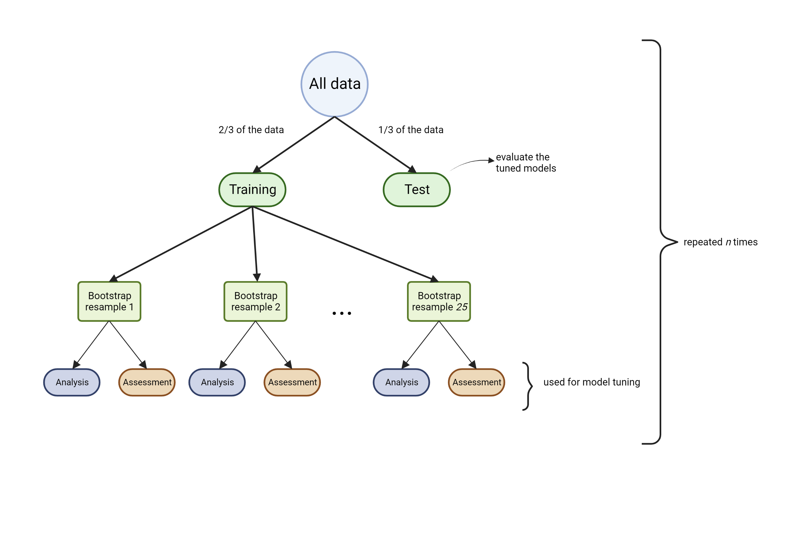

```{r setup, include=FALSE}
knitr::opts_chunk$set(message = FALSE, warning = FALSE)
```

```{r Libraries, eval=TRUE, echo=FALSE, message=FALSE}
library(tidyverse)
library(tidymodels)
library(corrr)
library(viridis)

library(janitor)

library(kableExtra)

library(wordcloud)
library(RColorBrewer)

library(themis)
library(OptimalCutpoints)
library(viridis)

library(Boruta)
library(rFerns)

library(parallel)
library(varSelRF)

library(VSURF)
library(ranger)

tidymodels_prefer()
```

\newpage

# Notes
**Tables S1 and S3** show the variables used by each of the respective varSelRF and VSURF models. **Table S5** lists the varSelRF and VSURF models that were used as base learners by any one of the three meta-learners (lasso, ridge or elastic net). <br/>

**Table S2** gives the metadata for the weather-based variables used by any of the varSelRF models, **Table S4** does the same for the VSURF models, as well as **Table S6** for the base learners used by any of the ensembles. <br/>


Source: <br/>
Refers to the paper in which the variables were first presented. <br/>

**DeWolf 2003** is [De Wolf, E. D., Madden, L. V., and Lipps, P. E. 2003. Risk assessment models for wheat Fusarium head blight epidemics based on within-season weather data. Phytopathology 93:428-435.
](https://apsjournals.apsnet.org/doi/abs/10.1094/PHYTO.2003.93.4.428)  <br/>

**Shah 2013** is [Shah, D. A., Molineros, J. E., Paul, P. A., Willyerd, K. T., Madden, L. V., and De Wolf, E. D. 2013. Predicting Fusarium head blight epidemics with weather-driven pre- and post-anthesis logistic regression models. Phytopathology 103:906-919.
](https://apsjournals.apsnet.org/doi/abs/10.1094/PHYTO-11-12-0304-R)  <br/>

**Shah 2019** is [Shah, D. A., Paul, P. A., De Wolf, E. D., and Madden, L. V. 2019. Predicting plant disease epidemics from functionally represented weather series. Philosophical Transactions of the Royal Society B: Biological Sciences. Online publication. doi:10.1098/rstb.2018.0273.
](https://royalsocietypublishing.org/doi/full/10.1098/rstb.2018.0273)  <br/>

Readers may also consult the Dryad repository (https://doi.org/10.5061/dryad.fn2z34trv) for further details on the FHB dataset.


Abbreviations used in the descriptions of the variables:  <br/>

T = air temperature (\textdegree{}C) <br/>

D = dewpoint (\textdegree{}C) <br/>

P = barometric pressure (hPa) <br/>

RH = relative humidity (%) <br/>

VPD = vapor pressure deficit (kPa) <br/>

TDD = temperature-dewpoint depression (\textdegree{}C) <br/>

sd = standard deviation <br/>

pre = pre-anthesis <br/>

post = post-anthesis <br/>


\newpage

# The observational data
```{r VariableSummary-Load-Data, echo=FALSE, eval=TRUE}
source("../ReadFHBDataset.R")

# Subset X to descriptive variables (not weather-based):
X1 <-
  X %>% 
  dplyr::select(id:S) %>%
  # add region as a variable:
  dplyr::left_join(tibble(state = state.abb, region = state.region), by = "state") %>%
  # add division as a variable (New England, Middle Atlantic, South Atlantic, East South Central, West South Central, East North Central, West North Central, Mountain, and Pacific):
  dplyr::left_join(tibble(state = state.abb, division = state.division), by = "state") %>%
  # Add US climate regions:
  # https://www.ncei.noaa.gov/access/monitoring/reference-maps/us-climate-regions 
  dplyr::mutate(climzone = "NA") %>%
  dplyr::mutate(climzone = replace(climzone, state %in% c("CT", "DE", "ME", "MD", "MA", "NH", "NJ", "NY", "PA", "RI", "VT"), "Northeast")) %>%
  dplyr::mutate(climzone = replace(climzone, state %in% c("IA", "MI", "MN", "WI"), "Upper Midwest")) %>%
  dplyr::mutate(climzone = replace(climzone, state %in% c("IL", "IN", "KY", "MO", "OH", "TN", "WV"), "Ohio Valley")) %>%
  dplyr::mutate(climzone = replace(climzone, state %in% c("MT", "NE", "ND", "SD", "WY"), "Northern Rockies and Plains")) %>%
  dplyr::mutate(climzone = replace(climzone, state %in% c("AR", "KS", "LA", "MS", "OK", "TX"), "South")) %>%
  dplyr::mutate(climzone = factor(climzone, levels = c("Northeast", "Upper Midwest", "Ohio Valley", "Northern Rockies and Plains", "South")))
```


<!-- By climate region -->
```{r Obs-matrix-by-climate-region-graph, eval=TRUE, echo=FALSE, fig.cap="The FHB observational data by U.S. climate region (https://www.ncei.noaa.gov/access/monitoring/reference-maps/us-climate-regions). Data came from five regions: (i) Northeast, (ii) Upper Midwest, (iii) Ohio Valley, (iv) Northern Rockies and Plains, and (v) South.", fig.height=5.0}

X1 %>%
  dplyr::count(climzone, state) %>%
  ggplot(aes(x = state, y = n)) +
  geom_segment(aes(xend = state, yend = 0)) +
  geom_point(size = 4, colour = "orange") +
  coord_flip() +
  facet_wrap(~climzone, scales = "free_y") +
  # This prevents the ND dot from being squooshed against the right side border: 
  scale_y_continuous(limits = c(-10, 300), expand = expansion(mult = c(0, 0))) +
  theme_bw() +
  xlab("State") +
  ylab("Frequency") +
  theme(# remove the grid lines for y:
    panel.grid.major.y = element_blank())
```


<!-- By region and division Graph -->
```{r Obs-matrix-by-region-division-graph, eval=FALSE, echo=FALSE, fig.cap="The FHB observational data by region and division. Data came from three regions (further divided into divisions) as defined by the US Census Bureau: the Northeast region, the South region, and the North Central region. Within the Northeast, all 68 observations came from the Middle Atlantic division. Three divisions were represented from the South region: South Atlantic (91 observations), East South Central (14 observations), and West South Central (4 observations). Most of the observational data (82%) came from two North Central divisions: East North Central (334 observations) and West North Central (488 observations)", fig.height=3.0}
X1 %>%
  dplyr::mutate(region = fct_drop(region)) %>%
  dplyr::mutate(division = forcats::fct_drop(division)) %>%
  dplyr::count(region, division) %>%
  ggplot(aes(x = division, y = n)) +
  geom_segment(aes(xend = division, yend = 0)) +
  geom_point(size = 4, colour = "orange") +
  coord_flip() +
  facet_wrap(~region, scales = "free_y") +
  theme_bw() +
  xlab("Division") +
  ylab("Frequency") +
  theme(# remove the grid lines for y:
    panel.grid.major.y = element_blank()) +
  theme(axis.text.x = element_text(angle = 90, vjust = 0.5, hjust = 1))
```


<!-- \newpage -->

<!-- By division and state Graph -->
```{r Obs-matrix-by-division-and-state-graph, eval=FALSE, echo=FALSE, fig.cap="The FHB observational data by division and state. The data came from 17 states. Within the Northeast, all 68 observations came from two Middle Atlantic states (NY, PA). Three divisions were represented from the South region: South Atlantic (91 observations from DE and MD), East South Central (14 observations from KY), and West South Central (4 observations from AR). There were two North Central divisions: East North Central (334 observations total from IL, IN, MI, OH, WI) and West North Central (488 observations from KS, MN, MO, ND, NE, SD)"}
X1 %>%
  dplyr::mutate(division = forcats::fct_drop(division)) %>%
  dplyr::count(division, state) %>%
  ggplot(aes(x = state, y = n)) +
  geom_segment(aes(xend = state, yend = 0)) +
  geom_point(size = 4, colour = "orange") +
  coord_flip() +
  facet_wrap(~division, scales = "free_y") +
  theme_bw() +
  xlab("State") +
  ylab("Frequency") +
  theme(# remove the grid lines for y:
    panel.grid.major.y = element_blank())
```


\newpage
# Resampling schemes


\newpage



\newpage
# The set of weather-based variables input to Boruta

```{r Boruta-Load-and-Process-Data, echo=FALSE, eval=TRUE}
source("../ReadFHBDataset.R")

# Some pre-processing:
X1 <- 
  X %>%
  # Set up Y as a factor (tidymodels):
  dplyr::mutate(Y = ifelse(S < 10, "Nonepi", "Epi")) %>%
  # The first level is the one you want to predict:
  dplyr::mutate(Y = factor(Y, levels = c("Epi", "Nonepi"))) %>%
  dplyr::mutate(sq.T.A.PRE7.24H = T.A.PRE7.24H^2) %>%
  # add region as a variable:
  dplyr::left_join(tibble(state = state.abb, region = state.region), by = "state") %>%
  # Set up for the wc variable as in Shah et al. (2013)
  dplyr::mutate(wc = "NA") %>%
  dplyr::mutate(wc = replace(wc, type == "spring", "sw")) %>%
  dplyr::mutate(wc = replace(wc, type == "winter" & corn == 0, "wwnoc")) %>%
  dplyr::mutate(wc = replace(wc, type == "winter" & corn == 1, "wwc")) %>%
  dplyr::mutate(wc = factor(wc, levels = c("sw", "wwnoc", "wwc"))) %>%
  # Arrange variables:
  dplyr::select(id:type, region, corn, S, Y, resist, wc, T.A.1:sq.T.A.PRE7.24H)

X2 <- 
  recipe(Y ~ ., data = X1) %>%
  update_role(c(id:S), new_role = "ID") %>%
  # remove any zero variance predictors:
  step_zv(all_predictors()) %>% 
  # remove any linear combinations:
  step_lincomb(all_numeric_predictors()) %>%
  # remove highly correlated variables:
  step_corr(all_numeric_predictors(), threshold = 0.9) %>%
  prep() %>%
  juice()
  
# Set up just the response and the predictors to feed into Boruta:
X3 <- 
  X2 %>% 
  dplyr::select(-c(id:S)) %>%
  # Only the weather-based variables:
  dplyr::select(-c(Y, wc, resist))
```


```{r Boruta-corr-vars, echo=FALSE, eval=TRUE, fig.cap="Pairwise Pearson correlations among 88 weather-based variables input into the Boruta algorithm for selecting those variables associated with Fusarium head blight epidemics. The bar colors are meant to help the reader distinguish the bins."}
# The correlation matrix:
foo_cor <- 
  X3 %>% 
  correlate(method = "pearson", quiet = TRUE) 

# A histogram of the pairwise correlations:
# This will be a supplementary figure -- jazz it up a bit with color

foo_cor %>%
  shave() %>%
  stretch(na.rm = TRUE) %>%
  ggplot(., aes(x = r)) +
  geom_histogram(binwidth = 0.1, aes(fill = ..count..)) +
  # geom_histogram(binwidth = 0.1, colour = "black") +
  scale_fill_viridis() +
  theme_bw() +
  labs(x = "Pearson correlation", y = "Count") +
  theme(legend.position = "none") +
  theme(axis.title = element_text(size = 12, face = "bold"))
```


\newpage
# Selected variables
```{r word-cloud, eval=TRUE, echo=FALSE, fig.cap="Cloud depiction of the frequency of selected variables across the 58 varSelRF and VSURF models. The font size is proportional to the frequency of selection. See Tables S2 and S4 for descriptions of the variables."}
# OBJECTIVE:
# A word cloud based on the frequency at which selected variables appeared in the 58 varSelRF and VSURF models.

## varSelRF models
# Code pulled from varSelRF1.Rmd

# Load the object (m1) containing the information on the models (see the script `varSelRF0.Rmd` in the varSelRF folder):
load("../varSelRF/varSelRFResII.RData")

# The data on the 20 models:
m2 <- 
   m1 %>%
   dplyr::select(max.vars, max.no.vars, max.fmla, auc.outer) %>%
   tidyr::unnest(cols = auc.outer) %>%
   tibble::rownames_to_column() %>%
   # 20 models:
   dplyr::filter(.estimate >= 0.92, max.no.vars >= 9, max.no.vars <= 14) %>%
   rename(vars = max.vars, no.vars = max.no.vars, fmla = max.fmla, auc = .estimate)

# Get the variables (as used across the 20 models):
vars <- 
   m2 %>%  
   dplyr::select(vars) %>%
   tidyr::unnest(cols = vars)

# tibble of the vars and their counts:
vars1 <- vars

## VSURF models
# Load the saved object with the VSURF results (see the script `VSURF0.Rmd` in the VSURF folder):
load("../VSURF/VSURF0Res.RData")

# This gets the rowid's of duplicate models:
dups <-
  vsurf %>%
  tibble::rowid_to_column() %>%
  dplyr::select(rowid, indx) %>%
  # Sort the indices:
  dplyr::mutate(sorted = map(indx, sort)) %>%
  # The filtering step identifies the duplicates:
  dplyr::group_by(sorted) %>%
  dplyr::filter(n() > 1) %>%
  # Arrange so that the duplicates are shown together:
  dplyr::arrange(sorted) %>%
  # and filter out every other:
  dplyr::filter(row_number() %% 2 == 1) %>%
  # the rowid's of the duplicates to remove:
  dplyr::pull(rowid)

# Now we filter to a subset of models to pursue further.
# Distinct, 6-9 vars, auc no less than 0.8
vsurf.filtered <-
  vsurf %>%
  tibble::rowid_to_column() %>%
  dplyr::mutate(no_vars = purrr::map(indx, length)) %>%
  dplyr::mutate(var = map2(splits, indx, function(.splits, .indx) {
    x <- analysis(.splits) %>% select(-Y)
    names(x)[.indx]})) %>%
  dplyr::select(rowid, no_vars, auc, var) %>%
  tidyr::unnest(cols = c(no_vars, auc)) %>%
  # just easier to call the column auc:
  dplyr::rename(auc = .estimate) %>%
  # apply our filtering criteria:
  dplyr::filter(!rowid %in% dups, no_vars %in% 6:9, auc > 0.8) %>%
  # arrange for better output representation:
  dplyr::arrange(no_vars, rowid) 


# tibble of the vars and their counts:
vars2 <-
  vsurf.filtered %>%
  select(var) %>%
  tidyr::unnest(cols = var)

all_vars <- 
  bind_rows(vars1, vars2) %>%
  dplyr::group_by(var) %>%
  dplyr::summarise(total_count = n())


set.seed(1234) # for reproducibility 
wordcloud(words = all_vars$var, freq = all_vars$total_count, min.freq = 1, max.words = 100, random.order = FALSE, rot.per = 0.35, colors = brewer.pal(8, "Dark2"), scale = c(3, 0.5))
```


\newpage

```{r All-Variables-Metadata, eval=TRUE, echo=FALSE}
# Get the meta-data...
io <- readr::read_csv("../Data/VariableMetaData.csv", show_col_types = FALSE)
```


# varSelRF models
```{r varSelRF-Models-Setup, eval=TRUE, echo=FALSE}
# Load the object (m1) containing the information on the models:
load("../varSelRF/varSelRFResII.RData")

# The data on the 20 models:
m2 <- 
   m1 %>%
   dplyr::select(max.vars, max.no.vars, max.fmla, auc.outer) %>%
   tidyr::unnest(cols = auc.outer) %>%
   tibble::rownames_to_column() %>%
   # 20 models:
   dplyr::filter(.estimate >= 0.92, max.no.vars >= 9, max.no.vars <= 14) %>%
   rename(vars = max.vars, no.vars = max.no.vars, fmla = max.fmla, auc = .estimate)

# Get the variables (as used across the 20 models):
varSelRF_vars <- 
   m2 %>%  
   dplyr::select(vars) %>%
   tidyr::unnest(cols = vars)
```

<!-- ## The models -->
```{r varSelRF-Models-Table, eval=TRUE, echo=FALSE}
m2 %>%
  mutate(model = stringr::str_c("varSelRF_M", 1:20), .before = rowname) %>%
  select(model, no.vars, vars) %>%
  mutate(vars = map(vars, function(x) x %>% pull(var))) %>%
  mutate(vars = map(vars, ~sort(.x))) %>%
  kable(., row.names = FALSE, booktabs = TRUE, caption = "Variables in random forest models proposed after evaluating and filtering the selections made by the varSelRF algorithm", col.names = c("Model", "No. variables", "Variables in the model")) %>% 
  kable_styling(position = "center", latex_options = c("scale_down", "striped", "HOLD_position"))
```


<!-- ## The variables -->
```{r varSelRF-Models-vars-Metadata, eval=TRUE, echo=FALSE}
# vars_sub is a character vector of the 32 distinct weather variables (resist is excluded) used among the 20 RF models
vars_sub <-
   varSelRF_vars %>%
   dplyr::distinct() %>%
   dplyr::filter(!var == "resist") %>%
   dplyr::pull(var)

# The meta-data associated with these 32 weather variables: 
io.s <-
   io %>% 
   dplyr::filter(variable_name %in% vars_sub)

io.s %>%
  dplyr::select(source, variable_name, summary, win_start_period, win_start_day, win_end_period, win_end_day, win_length) %>%
  arrange(variable_name) %>%
  kable(., row.names = TRUE, booktabs = TRUE, caption = "Descriptions of the weather-based variables used by the random forest models shown in Table S1", col.names = c("Source", "Name", "Summary", "Window start period", "Window start day", "Window end period", "Window end day", "Window length")) %>%
  kable_styling(latex_options = c("striped", "scale_down", "HOLD_position"), position = "center") %>%
  footnote(alphabet = c("Source: See the Notes section at the beginning of the document.", "D = dewpoint, T = air temperature, TDD = temperature-dewpoint depression, P = barometric pressure, RH = relative humidity, VPD = vapor pressure deficit, sd = standard deviation.", "Window start period & Window end period. Indicate whether the beginning (or end) of the weather time series summarized by the variable was pre-anthesis (pre), post-anthesis (post), or at anthesis.", "Window start day. The number of days relative to anthesis (which is 0) at which the window was begun.", " Window end day. The number of days relative to anthesis (which is 0) at which the window was ended.", "Window length. The length of the window (in days) over which the weather time series was summarized by the variable.") )
```


\newpage
# VSURF models

```{r VSURF-Models-Setup, eval=TRUE, echo=FALSE}
# Load the saved object with the VSURF results:
load("../VSURF/VSURF0Res.RData")

# This gets the rowid's of duplicate models in the vsurf object:
dups <-
  vsurf %>%
  tibble::rowid_to_column() %>%
  dplyr::select(rowid, indx) %>%
  # Sort the indices:
  dplyr::mutate(sorted = map(indx, sort)) %>%
  # The filtering step identifies the duplicates:
  dplyr::group_by(sorted) %>%
  dplyr::filter(n() > 1) %>%
  # Arrange so that the duplicates are shown together:
  dplyr::arrange(sorted) %>%
  # and filter out every other:
  dplyr::filter(row_number() %% 2 == 1) %>%
  # the rowid's of the duplicates to remove:
  dplyr::pull(rowid)

# Now we filter to a subset of models to pursue further.
# Distinct, 6-9 vars, auc no less than 0.8
vsurf.filtered <-
  vsurf %>%
  tibble::rowid_to_column() %>%
  dplyr::mutate(no_vars = purrr::map(indx, length)) %>%
  dplyr::mutate(vars = map2(splits, indx, function(.splits, .indx) {
    x <- analysis(.splits) %>% select(-Y)
    names(x)[.indx]})) %>%
  dplyr::select(rowid, no_vars, auc, vars) %>%
  tidyr::unnest(cols = c(no_vars, auc)) %>%
  # just easier to call the column auc:
  dplyr::rename(auc = .estimate) %>%
  # apply our filtering criteria:
  dplyr::filter(!rowid %in% dups, no_vars %in% 6:9, auc > 0.8) 
```


<!-- ## The models -->
```{r VSURF-Models-Table, eval=TRUE, echo=FALSE}
vsurf.filtered %>%
  mutate(model = stringr::str_c("VSURF_M", 1:38), .before = rowid) %>%
  select(model, no_vars, vars) %>%
  mutate(vars = map(vars, ~sort(.x))) %>%
  kable(., row.names = F, booktabs = TRUE, caption = "Variables in random forest models proposed after evaluating and filtering the selections made by the VSURF algorithm", col.names = c("Model", "No. variables", "Variables in the model")) %>% 
  kable_styling(position = "center", latex_options = c("scale_down", "striped", "HOLD_position"))
```


<!-- ## The variables -->
```{r VSURF-Models-vars-Metadata, eval=TRUE, echo=FALSE}
# Get the distinct variables (as used across the 38 models):
vars <- 
   vsurf.filtered %>%
      dplyr::select(vars) %>%
      tidyr::unnest(cols = vars) %>%
      distinct() %>%
      dplyr::filter(!vars == "resist") %>%
      dplyr::pull(vars)

# The meta-data associated with these 26 weather variables: 
io.s <-
   io %>% 
   dplyr::filter(variable_name %in% vars)

io.s %>%
  dplyr::select(source, variable_name, summary, win_start_period, win_start_day, win_end_period, win_end_day, win_length) %>%
  arrange(variable_name) %>%
  kable(., row.names = TRUE, booktabs = TRUE, caption = "Descriptions of the weather-based variables used by the random forest models shown in Table S3", col.names = c("Source", "Name", "Summary", "Window start period", "Window start day", "Window end period", "Window end day", "Window length")) %>%
  kable_styling(latex_options = c("striped", "scale_down", "HOLD_position"), position = "center") %>%
  footnote(alphabet = c("Source: See the Notes section at the beginning of the document.", "D = dewpoint, T = air temperature, TDD = temperature-dewpoint depression, P = barometric pressure, RH = relative humidity, VPD = vapor pressure deficit, sd = standard deviation.", "Window start period & Window end period: Indicate whether the beginning (or end) of the weather time series summarized by the variable was pre-anthesis (pre), post-anthesis (post), or at anthesis.", "Window start day: The number of days relative to anthesis (which is 0) at which the window was begun.", " Window end day: The number of days relative to anthesis (which is 0) at which the window was ended.", "Window length: The length of the window (in days) over which the weather time series was summarized by the variable.") )
```


\newpage
# Ensembles
<!-- ## The models -->
```{r Ensemble-Models-Table, eval=TRUE, echo=FALSE}
# varSelRF models
# Load the object (m1) containing the information on the models:
load("../varSelRF/varSelRFResII.RData")

# The data on varSelRF model M_19:
varSelRF_M19 <-
  m1 %>%
  dplyr::select(max.vars, max.no.vars, max.fmla, auc.outer) %>%
  tidyr::unnest(cols = auc.outer) %>%
  tibble::rownames_to_column() %>%
  # 20 models:
  dplyr::filter(.estimate >= 0.92, max.no.vars >= 9, max.no.vars <= 14) %>%
  rename(vars = max.vars, no.vars = max.no.vars, fmla = max.fmla, auc = .estimate) %>%
  # and we want model M19:
  slice(19) %>%
  mutate(model = "varSelRF_M19", .before = vars) %>%
  mutate(vars = map(vars, function(x) x %>% pull(var))) %>%
  select(model, no.vars, vars) %>%
  # to have the same column names for varSelRF and VSURF model lists:
  rename(no_vars = no.vars)


# VSURF models:
# Load the saved object with the VSURF results:
load("../VSURF/VSURF0Res.RData")

# This gets the rowid's of duplicate models in the vsurf object:
dups <-
  vsurf %>%
  tibble::rowid_to_column() %>%
  dplyr::select(rowid, indx) %>%
  # Sort the indices:
  dplyr::mutate(sorted = map(indx, sort)) %>%
  # The filtering step identifies the duplicates:
  dplyr::group_by(sorted) %>%
  dplyr::filter(n() > 1) %>%
  # Arrange so that the duplicates are shown together:
  dplyr::arrange(sorted) %>%
  # and filter out every other:
  dplyr::filter(row_number() %% 2 == 1) %>%
  # the rowid's of the duplicates to remove:
  dplyr::pull(rowid)

# Now we filter to a subset of models to pursue further.
# Distinct, 6-9 vars, auc no less than 0.8
vsurf.filtered <-
  vsurf %>%
  tibble::rowid_to_column() %>%
  dplyr::mutate(no_vars = purrr::map(indx, length)) %>%
  dplyr::mutate(vars = map2(splits, indx, function(.splits, .indx) {
    x <- analysis(.splits) %>% select(-Y)
    names(x)[.indx]})) %>%
  dplyr::select(rowid, no_vars, auc, vars) %>%
  tidyr::unnest(cols = c(no_vars, auc)) %>%
  # just easier to call the column auc:
  dplyr::rename(auc = .estimate) %>%
  # apply our filtering criteria:
  dplyr::filter(!rowid %in% dups, no_vars %in% 6:9, auc > 0.8) %>%
  mutate(model = stringr::str_c("VSURF_M", 1:38)) %>%
  slice(c(8:11, 13:15, 20, 21, 32)) %>%
  select(model, no_vars, vars)

# The model tibble:
rf_mods <- bind_rows(varSelRF_M19, vsurf.filtered)


# The table is sorted by the no. vars per model, and then the variables themselves are sorted by name.
rf_mods %>%
  mutate(vars = map(vars, ~sort(.x))) %>%
  arrange(desc(no_vars)) %>%
  kable(., row.names = FALSE, booktabs = TRUE, caption = "Random forest models used as base learners in logistic regression meta-learners", col.names = c("Model", "No. vars", "Variables")) %>% 
  kable_styling(position = "center", latex_options = c("scale_down", "striped", "HOLD_position"))
```

<!-- ## The variables -->
```{r Ensemble-Models-vars-Metadata, eval=TRUE, echo=FALSE}
# From the chunk Metadata-prep in RFEnsembles2.Rmd

# vars_sub is a character vector of the 22 distinct weather variables (resist is excluded) used among the RF models
vars_sub <-
  rf_mods %>%
  select(vars) %>%
  unnest(cols = vars) %>%
  dplyr::distinct() %>%
  dplyr::filter(!vars == "resist") %>%
  dplyr::pull(vars)

# The meta-data associated with these 22 weather variables: 
io.s <-
   io %>% 
   dplyr::filter(variable_name %in% vars_sub)


io.s %>%
  dplyr::select(source, variable_name, summary, win_start_period, win_start_day, win_end_period, win_end_day, win_length) %>%
  arrange(variable_name) %>%
  kable(., row.names = TRUE, booktabs = TRUE, caption = "Descriptions of the weather-based variables used by the random forest models shown in Table S5", col.names = c("Source", "Name", "Summary", "Window start period", "Window start day", "Window end period", "Window end day", "Window length")) %>%
  kable_styling(latex_options = c("striped", "scale_down", "HOLD_position"), position = "center") %>%
  footnote(alphabet = c("Source: See the Notes section at the beginning of the document.", "D = dewpoint, T = air temperature, TDD = temperature-dewpoint depression, P = barometric pressure, RH = relative humidity, VPD = vapor pressure deficit, sd = standard deviation.", "Window start period & Window end period: Indicate whether the beginning (or end) of the weather time series summarized by the variable was pre-anthesis (pre), post-anthesis (post), or at anthesis.", "Window start day: The number of days relative to anthesis (which is 0) at which the window was begun.", " Window end day: The number of days relative to anthesis (which is 0) at which the window was ended.", "Window length: The length of the window (in days) over which the weather time series was summarized by the variable.") )
```


<!-- The weights of the RF models in each ensemble -->
```{r Ensemble-Models-weights, eval=TRUE, echo=FALSE}
# The stacking coefs for the retained models:
lasso <- 
  tibble(learner = "lasso", model = c("varSelRF_M19", "VSURF_M21", "VSURF_M10", "VSURF_M11", "VSURF_M8", "VSURF_M20"), weight = c(2.92, 1.46, 1.20, 1.00, 0.319, 0.105))
  # %>%
  # add_row() %>%
  # mutate_all(~replace(., is.na(.), ""))

ridge <-
  tibble(learner = "ridge", model = c("varSelRF_M19", "VSURF_M21", "VSURF_M10", "VSURF_M11", "VSURF_M8", "VSURF_M13", "VSURF_M14", "VSURF_M9", "VSURF_M32", "VSURF_M20", "VSURF_M15"), weight = c(1.98, 1.21, 1.13, 0.892, 0.557, 0.402, 0.194, 0.156, 0.142, 0.128, 0.0548))
  # %>%
  # add_row() %>%
  # mutate_all(~replace(., is.na(.), ""))

en <-
  tibble(learner = "elastic net", model = c("varSelRF_M19", "VSURF_M21", "VSURF_M10", "VSURF_M11", "VSURF_M8", 'VSURF_M13', "VSURF_M20", "VSURF_M14", "VSURF_M9"), weight = c(2.25, 1.36, 1.14, 0.943, 0.541, 0.284, 0.0968, 0.0454, 0.0171))
  # %>%
  # add_row() %>%
  # mutate_all(~replace(., is.na(.), ""))


df <- bind_rows(lasso, ridge, en)


df %>%
  select(-learner) %>%
  kable(., row.names = FALSE, booktabs = TRUE, caption = "Weights applied to the probabilities given by the base learner members of the finalized meta-learners (lasso, ridge, elastic net). The weights are used in combining the probabilities output by the base learners to finalize a predicted probability returned by the meta-learner", col.names = c("Base learners", "Base learner weight")) %>% 
  pack_rows(index = c("lasso" = 6, "ridge" = 11, "elastic net" = 9)) %>%
  kable_styling(position = "center", latex_options = c("striped", "HOLD_position"), full_width = FALSE)
```


\newpage

# Computational time

All  scripts were executed on a machine running the Windows 10 64-bit operating system with 16 GB RAM and a 2.81 GHz processor. The Boruta algorithm run on the resampling scheme specified above took 3.7 hours to complete, varSelRF took 8.8 hours, and the VSURF algorithm (which was run on a simpler resampling scheme than that used for Boruta and varSelRF) took 6.6 hours. Computational time could be reduced by rewriting the scripts to take advantage of parallel processing where possible. 


# Computational environment
```{r SessionInfo, eval=TRUE, echo=FALSE}
R.Version()$version.string
R.Version()$system
sessionInfo()
```
