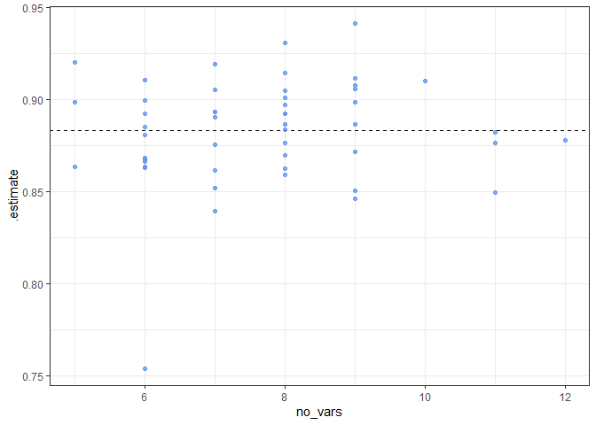

-   <a href="#variable-selection-with-vsurf"
    id="toc-variable-selection-with-vsurf">Variable selection with VSURF</a>
-   <a href="#objectives" id="toc-objectives">Objective(s)</a>
-   <a href="#notes" id="toc-notes">Notes</a>
-   <a href="#number-of-variables-selected"
    id="toc-number-of-variables-selected">Number of variables selected</a>
    -   <a href="#summary" id="toc-summary">Summary</a>
    -   <a href="#graphic" id="toc-graphic">Graphic</a>
-   <a href="#no-times-a-variable-was-selected-across-all-folds"
    id="toc-no-times-a-variable-was-selected-across-all-folds">No. times a
    variable was selected across all folds</a>
    -   <a href="#table" id="toc-table">Table</a>
    -   <a href="#graphic-1" id="toc-graphic-1">Graphic</a>
-   <a href="#duplicates" id="toc-duplicates">Duplicates</a>
-   <a href="#auc" id="toc-auc">AUC</a>
    -   <a href="#table-1" id="toc-table-1">Table</a>
    -   <a href="#histogram" id="toc-histogram">Histogram</a>
    -   <a href="#auc-and-no-of-variables" id="toc-auc-and-no-of-variables">AUC
        and no. of variables</a>
    -   <a href="#the-poor-performance-model"
        id="toc-the-poor-performance-model">The poor-performance model</a>
-   <a href="#filtering-models" id="toc-filtering-models">Filtering
    models</a>
-   <a href="#variables-used-by-the-filtered-models"
    id="toc-variables-used-by-the-filtered-models">Variables used by the
    filtered models</a>
    -   <a href="#no-unique-variables" id="toc-no-unique-variables">No. unique
        variables</a>
    -   <a href="#no-variables-per-model"
        id="toc-no-variables-per-model">No. variables per model</a>
    -   <a href="#no-times-each-variable-was-used"
        id="toc-no-times-each-variable-was-used">No. times each variable was
        used</a>
-   <a href="#computational-environment"
    id="toc-computational-environment">Computational environment</a>

# Variable selection with VSURF

<!-- Run on R 4.1.3 -->
<!-- Data files created with this script: -->
<!--   VSURF0Res.RData -->

# Objective(s)

-   variable selection with the VSURF algorithm

# Notes

-   some explanations on how this was set up
-   the VSURF algorithm is attractive, because it does variable
    screening in three steps, starting with eliminating variables that
    are not related to the response (removal of irrelevant variables)
    and ending with a set of uncorrelated variables that predict well
    (the end goal is predictive performance).
-   the downside is that the algorithm is computationally expensive. And
    we would want to run it several times to check for stability and
    variance in the set of predictors returned.
-   preliminary explorations showed that it would take too long to run
    (days) on the full set of 300+ predictors. In fact, [Speiser et
    al. 2019](https://doi.org/10.1016/j.eswa.2019.05.028) recommend
    using it on datasets with 50 or less predictors.
-   as a workaround (compromise), we apply the VSURF algorithm to the
    set of 77 predictors selected with the Boruta algorithm.
-   to get an idea of variable selection stability/variance, we use
    5-fold cross-validation folds, repeated 10 times. This gives us
    enough data in the assessment part of the split for testing (getting
    an estimate of auc), and running the algorithm 50 times gives us
    data for looking at variable selection frequency.
-   still took over 6 hr to complete.
-   however, we had variables selected in every run.

------------------------------------------------------------------------

    ## [conflicted] Will prefer readr::col_factor over any other package

<!-- ## Resamples -->

# Number of variables selected

-   the algorithm was run on each of 5 cross-validation folds, repeated
    10 times (hence run on a total of 50 folds)

## Summary

-   on average, 7-8 variables per model
-   no. of variables selected ranged from 5 to 12, but no more than 12

<!-- -->

    ## # A tibble: 1 x 3
    ##     min  mean   max
    ##   <int> <dbl> <int>
    ## 1     5  7.68    12

## Graphic

-   6-9 variables selected were the most common

<!-- -->

# No. times a variable was selected across all folds

-   Out of the 77 variables started with, only 31 were selected by
    VSURF, and some not that very often.
-   How does this compare to the variables selected by the varSelRF
    algorithm?

## Table

<table>
<thead>
<tr>
<th style="text-align:left;">
</th>
<th style="text-align:left;">
var
</th>
<th style="text-align:right;">
total_count
</th>
</tr>
</thead>
<tbody>
<tr>
<td style="text-align:left;">
1
</td>
<td style="text-align:left;">
D.A.1
</td>
<td style="text-align:right;">
44
</td>
</tr>
<tr>
<td style="text-align:left;">
2
</td>
<td style="text-align:left;">
D.A.2
</td>
<td style="text-align:right;">
1
</td>
</tr>
<tr>
<td style="text-align:left;">
3
</td>
<td style="text-align:left;">
D.SD.1
</td>
<td style="text-align:right;">
1
</td>
</tr>
<tr>
<td style="text-align:left;">
4
</td>
<td style="text-align:left;">
D.SD.2
</td>
<td style="text-align:right;">
22
</td>
</tr>
<tr>
<td style="text-align:left;">
5
</td>
<td style="text-align:left;">
MT10
</td>
<td style="text-align:right;">
5
</td>
</tr>
<tr>
<td style="text-align:left;">
6
</td>
<td style="text-align:left;">
P.A.1
</td>
<td style="text-align:right;">
1
</td>
</tr>
<tr>
<td style="text-align:left;">
7
</td>
<td style="text-align:left;">
P.A.3
</td>
<td style="text-align:right;">
3
</td>
</tr>
<tr>
<td style="text-align:left;">
8
</td>
<td style="text-align:left;">
P.A.5
</td>
<td style="text-align:right;">
1
</td>
</tr>
<tr>
<td style="text-align:left;">
9
</td>
<td style="text-align:left;">
resist
</td>
<td style="text-align:right;">
48
</td>
</tr>
<tr>
<td style="text-align:left;">
10
</td>
<td style="text-align:left;">
RH.G70.CD.2
</td>
<td style="text-align:right;">
8
</td>
</tr>
<tr>
<td style="text-align:left;">
11
</td>
<td style="text-align:left;">
RH.G70.CD.3
</td>
<td style="text-align:right;">
24
</td>
</tr>
<tr>
<td style="text-align:left;">
12
</td>
<td style="text-align:left;">
T.A.1
</td>
<td style="text-align:right;">
8
</td>
</tr>
<tr>
<td style="text-align:left;">
13
</td>
<td style="text-align:left;">
T.A.2
</td>
<td style="text-align:right;">
1
</td>
</tr>
<tr>
<td style="text-align:left;">
14
</td>
<td style="text-align:left;">
T.A.POST5.24H
</td>
<td style="text-align:right;">
10
</td>
</tr>
<tr>
<td style="text-align:left;">
15
</td>
<td style="text-align:left;">
T.SD.1
</td>
<td style="text-align:right;">
50
</td>
</tr>
<tr>
<td style="text-align:left;">
16
</td>
<td style="text-align:left;">
T.SD.2
</td>
<td style="text-align:right;">
1
</td>
</tr>
<tr>
<td style="text-align:left;">
17
</td>
<td style="text-align:left;">
TDD.A.2
</td>
<td style="text-align:right;">
20
</td>
</tr>
<tr>
<td style="text-align:left;">
18
</td>
<td style="text-align:left;">
TDD.SD.2
</td>
<td style="text-align:right;">
1
</td>
</tr>
<tr>
<td style="text-align:left;">
19
</td>
<td style="text-align:left;">
TDD.SD.3
</td>
<td style="text-align:right;">
2
</td>
</tr>
<tr>
<td style="text-align:left;">
20
</td>
<td style="text-align:left;">
TRH.15T30nRHG80.CHD.1
</td>
<td style="text-align:right;">
4
</td>
</tr>
<tr>
<td style="text-align:left;">
21
</td>
<td style="text-align:left;">
TRH.5T30nRHG75.CHD.1
</td>
<td style="text-align:right;">
24
</td>
</tr>
<tr>
<td style="text-align:left;">
22
</td>
<td style="text-align:left;">
TRH.9T30nRHG80.POST15.24H
</td>
<td style="text-align:right;">
6
</td>
</tr>
<tr>
<td style="text-align:left;">
23
</td>
<td style="text-align:left;">
TRH.9T30nRHG80.PRE14.24H
</td>
<td style="text-align:right;">
2
</td>
</tr>
<tr>
<td style="text-align:left;">
24
</td>
<td style="text-align:left;">
VPD.A.3
</td>
<td style="text-align:right;">
42
</td>
</tr>
<tr>
<td style="text-align:left;">
25
</td>
<td style="text-align:left;">
VPD.A.5
</td>
<td style="text-align:right;">
44
</td>
</tr>
<tr>
<td style="text-align:left;">
26
</td>
<td style="text-align:left;">
VPD.A.POST5.12H
</td>
<td style="text-align:right;">
1
</td>
</tr>
<tr>
<td style="text-align:left;">
27
</td>
<td style="text-align:left;">
VPD.A.PRE5.12H
</td>
<td style="text-align:right;">
2
</td>
</tr>
<tr>
<td style="text-align:left;">
28
</td>
<td style="text-align:left;">
VPD.L20.POST5.12H
</td>
<td style="text-align:right;">
3
</td>
</tr>
<tr>
<td style="text-align:left;">
29
</td>
<td style="text-align:left;">
VPD.L45.POST5.12H
</td>
<td style="text-align:right;">
2
</td>
</tr>
<tr>
<td style="text-align:left;">
30
</td>
<td style="text-align:left;">
VPD.SD.3
</td>
<td style="text-align:right;">
1
</td>
</tr>
<tr>
<td style="text-align:left;">
31
</td>
<td style="text-align:left;">
VPD.SD.4
</td>
<td style="text-align:right;">
2
</td>
</tr>
</tbody>
</table>

## Graphic

-   I think can be used as a variable importance measure…

<!-- -->

# Duplicates

-   there were 4 sets of selected variables that were the same (2
    duplicates per set). These are listed below. The duplicates do not
    have the same AUCs, because of being trained and tested on different
    folds.

<table>
<thead>
<tr>
<th style="text-align:left;">
</th>
<th style="text-align:left;">
Var index
</th>
<th style="text-align:left;">
auc
</th>
</tr>
</thead>
<tbody>
<tr>
<td style="text-align:left;">
1
</td>
<td style="text-align:left;">
1, 17, 38, 61, 62
</td>
<td style="text-align:left;">
0.92
</td>
</tr>
<tr>
<td style="text-align:left;">
2
</td>
<td style="text-align:left;">
1, 17, 38, 61, 62
</td>
<td style="text-align:left;">
0.898
</td>
</tr>
<tr>
<td style="text-align:left;">
3
</td>
<td style="text-align:left;">
1, 17, 38, 52, 61, 62
</td>
<td style="text-align:left;">
0.899
</td>
</tr>
<tr>
<td style="text-align:left;">
4
</td>
<td style="text-align:left;">
1, 17, 38, 52, 61, 62
</td>
<td style="text-align:left;">
0.892
</td>
</tr>
<tr>
<td style="text-align:left;">
5
</td>
<td style="text-align:left;">
1, 6, 17, 20, 38, 40, 61, 62
</td>
<td style="text-align:left;">
0.905
</td>
</tr>
<tr>
<td style="text-align:left;">
6
</td>
<td style="text-align:left;">
1, 6, 17, 20, 38, 40, 61, 62
</td>
<td style="text-align:left;">
0.883
</td>
</tr>
<tr>
<td style="text-align:left;">
7
</td>
<td style="text-align:left;">
1, 6, 17, 38, 52, 61, 62
</td>
<td style="text-align:left;">
0.852
</td>
</tr>
<tr>
<td style="text-align:left;">
8
</td>
<td style="text-align:left;">
1, 6, 17, 38, 52, 61, 62
</td>
<td style="text-align:left;">
0.875
</td>
</tr>
</tbody>
</table>

# AUC

## Table

<table>
<thead>
<tr>
<th style="text-align:left;">
</th>
<th style="text-align:right;">
min
</th>
<th style="text-align:right;">
mean
</th>
<th style="text-align:right;">
max
</th>
<th style="text-align:right;">
stddev
</th>
</tr>
</thead>
<tbody>
<tr>
<td style="text-align:left;">
1
</td>
<td style="text-align:right;">
0.754
</td>
<td style="text-align:right;">
0.883
</td>
<td style="text-align:right;">
0.941
</td>
<td style="text-align:right;">
0.029
</td>
</tr>
</tbody>
</table>

## Histogram

-   the AUCs on the assessment partition of the folds, after fitting RF
    models (based on the selected variables) on the analysis partitions.
-   one model is not doing so well

<!-- -->

## AUC and no. of variables

-   no discernible pattern between AUC and the no. of vars selected

<!-- -->

## The poor-performance model

-   the one model with low AUC. Maybe the combination of these six
    predictors is not the greatest.

<table>
<thead>
<tr>
<th style="text-align:left;">
</th>
<th style="text-align:right;">
auc
</th>
<th style="text-align:left;">
vars
</th>
</tr>
</thead>
<tbody>
<tr>
<td style="text-align:left;">
1
</td>
<td style="text-align:right;">
0.754
</td>
<td style="text-align:left;">
T.SD.1 , TDD.A.2 , T.A.POST5.24H , D.A.1 , TRH.5T30nRHG75.CHD.1, D.SD.2
</td>
</tr>
</tbody>
</table>

# Filtering models

-   distinct, 6-9 variables, auc not less than 0.8
-   this gives us a candidate set of 38 RF models to evaluate further
-   still a lot, but we have the code from the varSelRF model
    evaluations to draw on
-   we have 9 models listed here with 9 predictors each. From varSelRF,
    we also have 9 models with 9 predictors each. Are the two sets
    unique? Or are there overlaps?

<table>
<thead>
<tr>
<th style="text-align:left;">
</th>
<th style="text-align:right;">
rowid
</th>
<th style="text-align:right;">
no. vars
</th>
<th style="text-align:right;">
auc
</th>
<th style="text-align:left;">
vars
</th>
</tr>
</thead>
<tbody>
<tr>
<td style="text-align:left;">
1
</td>
<td style="text-align:right;">
14
</td>
<td style="text-align:right;">
6
</td>
<td style="text-align:right;">
0.881
</td>
<td style="text-align:left;">
T.SD.1 , D.A.1 , TDD.A.2 , RH.G70.CD.2, RH.G70.CD.3, resist
</td>
</tr>
<tr>
<td style="text-align:left;">
2
</td>
<td style="text-align:right;">
21
</td>
<td style="text-align:right;">
6
</td>
<td style="text-align:right;">
0.863
</td>
<td style="text-align:left;">
T.SD.1 , VPD.A.5 , VPD.A.3 , RH.G70.CD.2, D.SD.2 , resist
</td>
</tr>
<tr>
<td style="text-align:left;">
3
</td>
<td style="text-align:right;">
27
</td>
<td style="text-align:right;">
6
</td>
<td style="text-align:right;">
0.885
</td>
<td style="text-align:left;">
T.SD.1 , D.A.1 , VPD.A.3 , RH.G70.CD.3, TDD.A.2 , resist
</td>
</tr>
<tr>
<td style="text-align:left;">
4
</td>
<td style="text-align:right;">
28
</td>
<td style="text-align:right;">
6
</td>
<td style="text-align:right;">
0.863
</td>
<td style="text-align:left;">
T.SD.1 , D.A.1 , VPD.A.3 , T.A.1 , TRH.9T30nRHG80.PRE14.24H, resist
</td>
</tr>
<tr>
<td style="text-align:left;">
5
</td>
<td style="text-align:right;">
32
</td>
<td style="text-align:right;">
6
</td>
<td style="text-align:right;">
0.892
</td>
<td style="text-align:left;">
VPD.A.3 , T.SD.1 , VPD.A.5 , D.A.1 , TRH.5T30nRHG75.CHD.1, resist
</td>
</tr>
<tr>
<td style="text-align:left;">
6
</td>
<td style="text-align:right;">
38
</td>
<td style="text-align:right;">
6
</td>
<td style="text-align:right;">
0.867
</td>
<td style="text-align:left;">
T.SD.1 , VPD.A.5 , VPD.A.3 , D.A.1 , RH.G70.CD.3, resist
</td>
</tr>
<tr>
<td style="text-align:left;">
7
</td>
<td style="text-align:right;">
39
</td>
<td style="text-align:right;">
6
</td>
<td style="text-align:right;">
0.866
</td>
<td style="text-align:left;">
T.SD.1 , VPD.A.5, VPD.A.3, D.A.1 , MT10 , resist
</td>
</tr>
<tr>
<td style="text-align:left;">
8
</td>
<td style="text-align:right;">
40
</td>
<td style="text-align:right;">
6
</td>
<td style="text-align:right;">
0.911
</td>
<td style="text-align:left;">
T.SD.1 , D.A.1 , VPD.A.3, TDD.A.2, VPD.A.5, resist
</td>
</tr>
<tr>
<td style="text-align:left;">
9
</td>
<td style="text-align:right;">
47
</td>
<td style="text-align:right;">
6
</td>
<td style="text-align:right;">
0.868
</td>
<td style="text-align:left;">
T.SD.1 , VPD.A.5 , VPD.A.3 , RH.G70.CD.3, D.SD.2 , resist
</td>
</tr>
<tr>
<td style="text-align:left;">
10
</td>
<td style="text-align:right;">
3
</td>
<td style="text-align:right;">
7
</td>
<td style="text-align:right;">
0.862
</td>
<td style="text-align:left;">
T.SD.1 , VPD.A.5 , VPD.A.3 , RH.G70.CD.2 , TRH.9T30nRHG80.POST15.24H,
VPD.SD.4 , resist
</td>
</tr>
<tr>
<td style="text-align:left;">
11
</td>
<td style="text-align:right;">
6
</td>
<td style="text-align:right;">
7
</td>
<td style="text-align:right;">
0.893
</td>
<td style="text-align:left;">
T.SD.1 , VPD.A.5 , VPD.A.3 , D.A.1 , TDD.A.2 , T.A.POST5.24H, resist
</td>
</tr>
<tr>
<td style="text-align:left;">
12
</td>
<td style="text-align:right;">
13
</td>
<td style="text-align:right;">
7
</td>
<td style="text-align:right;">
0.839
</td>
<td style="text-align:left;">
T.SD.1 , VPD.A.5 , D.A.1 , VPD.L45.POST5.12H, TDD.SD.3 , T.A.1 ,
VPD.SD.3
</td>
</tr>
<tr>
<td style="text-align:left;">
13
</td>
<td style="text-align:right;">
25
</td>
<td style="text-align:right;">
7
</td>
<td style="text-align:right;">
0.891
</td>
<td style="text-align:left;">
T.SD.1 , VPD.A.5 , VPD.A.3 , D.A.1 , resist , TDD.A.2 , RH.G70.CD.3
</td>
</tr>
<tr>
<td style="text-align:left;">
14
</td>
<td style="text-align:right;">
34
</td>
<td style="text-align:right;">
7
</td>
<td style="text-align:right;">
0.919
</td>
<td style="text-align:left;">
VPD.A.5 , T.SD.1 , TDD.A.2 , D.A.1 , TRH.5T30nRHG75.CHD.1, RH.G70.CD.3 ,
resist
</td>
</tr>
<tr>
<td style="text-align:left;">
15
</td>
<td style="text-align:right;">
41
</td>
<td style="text-align:right;">
7
</td>
<td style="text-align:right;">
0.875
</td>
<td style="text-align:left;">
T.SD.1 , VPD.A.5 , TRH.5T30nRHG75.CHD.1, VPD.A.3 , D.A.1 , D.SD.2 ,
resist
</td>
</tr>
<tr>
<td style="text-align:left;">
16
</td>
<td style="text-align:right;">
45
</td>
<td style="text-align:right;">
7
</td>
<td style="text-align:right;">
0.905
</td>
<td style="text-align:left;">
T.SD.1 , VPD.A.5 , VPD.A.3 , TRH.5T30nRHG75.CHD.1 , resist , RH.G70.CD.3
, TRH.15T30nRHG80.CHD.1
</td>
</tr>
<tr>
<td style="text-align:left;">
17
</td>
<td style="text-align:right;">
46
</td>
<td style="text-align:right;">
7
</td>
<td style="text-align:right;">
0.893
</td>
<td style="text-align:left;">
T.SD.1 , D.A.1 , VPD.A.3 , TRH.5T30nRHG75.CHD.1, RH.G70.CD.3 , D.SD.2 ,
resist
</td>
</tr>
<tr>
<td style="text-align:left;">
18
</td>
<td style="text-align:right;">
1
</td>
<td style="text-align:right;">
8
</td>
<td style="text-align:right;">
0.870
</td>
<td style="text-align:left;">
T.SD.1 , VPD.A.5 , VPD.A.3 , D.A.1 , RH.G70.CD.3 , resist , D.SD.2 ,
VPD.L20.POST5.12H
</td>
</tr>
<tr>
<td style="text-align:left;">
19
</td>
<td style="text-align:right;">
4
</td>
<td style="text-align:right;">
8
</td>
<td style="text-align:right;">
0.892
</td>
<td style="text-align:left;">
T.SD.1 , VPD.A.5 , VPD.A.3 , D.A.1 , TRH.5T30nRHG75.CHD.1, RH.G70.CD.3 ,
T.A.1 , resist
</td>
</tr>
<tr>
<td style="text-align:left;">
20
</td>
<td style="text-align:right;">
16
</td>
<td style="text-align:right;">
8
</td>
<td style="text-align:right;">
0.931
</td>
<td style="text-align:left;">
T.SD.1 , VPD.A.3 , D.A.1 , TRH.9T30nRHG80.POST15.24H, T.A.POST5.24H ,
RH.G70.CD.3 , D.SD.2 , resist
</td>
</tr>
<tr>
<td style="text-align:left;">
21
</td>
<td style="text-align:right;">
19
</td>
<td style="text-align:right;">
8
</td>
<td style="text-align:right;">
0.862
</td>
<td style="text-align:left;">
T.SD.1 , TRH.5T30nRHG75.CHD.1, VPD.A.5 , D.A.1 , VPD.A.3 , D.SD.2 ,
VPD.L20.POST5.12H , resist
</td>
</tr>
<tr>
<td style="text-align:left;">
22
</td>
<td style="text-align:right;">
20
</td>
<td style="text-align:right;">
8
</td>
<td style="text-align:right;">
0.876
</td>
<td style="text-align:left;">
T.SD.1 , VPD.A.5 , TRH.5T30nRHG75.CHD.1 , D.A.1 , TRH.15T30nRHG80.CHD.1,
D.SD.2 , VPD.A.PRE5.12H , resist
</td>
</tr>
<tr>
<td style="text-align:left;">
23
</td>
<td style="text-align:right;">
30
</td>
<td style="text-align:right;">
8
</td>
<td style="text-align:right;">
0.892
</td>
<td style="text-align:left;">
T.SD.1 , VPD.A.5 , VPD.A.3 , TRH.5T30nRHG75.CHD.1, D.A.1 , RH.G70.CD.2 ,
MT10 , resist
</td>
</tr>
<tr>
<td style="text-align:left;">
24
</td>
<td style="text-align:right;">
31
</td>
<td style="text-align:right;">
8
</td>
<td style="text-align:right;">
0.859
</td>
<td style="text-align:left;">
T.SD.1 , VPD.A.5 , VPD.A.3 , D.A.1 , TDD.A.2 , RH.G70.CD.3, TDD.SD.2 ,
resist
</td>
</tr>
<tr>
<td style="text-align:left;">
25
</td>
<td style="text-align:right;">
35
</td>
<td style="text-align:right;">
8
</td>
<td style="text-align:right;">
0.886
</td>
<td style="text-align:left;">
T.SD.1 , VPD.A.5 , VPD.A.3 , D.A.1 , TDD.A.2 , RH.G70.CD.3 ,
T.A.POST5.24H, resist
</td>
</tr>
<tr>
<td style="text-align:left;">
26
</td>
<td style="text-align:right;">
42
</td>
<td style="text-align:right;">
8
</td>
<td style="text-align:right;">
0.901
</td>
<td style="text-align:left;">
T.SD.1 , VPD.A.3 , VPD.A.5 , D.A.1 , RH.G70.CD.3, RH.G70.CD.2, T.SD.2 ,
resist
</td>
</tr>
<tr>
<td style="text-align:left;">
27
</td>
<td style="text-align:right;">
44
</td>
<td style="text-align:right;">
8
</td>
<td style="text-align:right;">
0.883
</td>
<td style="text-align:left;">
T.SD.1 , VPD.A.5 , TDD.A.2 , D.A.1 , VPD.A.3 , RH.G70.CD.3, D.SD.2 ,
resist
</td>
</tr>
<tr>
<td style="text-align:left;">
28
</td>
<td style="text-align:right;">
48
</td>
<td style="text-align:right;">
8
</td>
<td style="text-align:right;">
0.914
</td>
<td style="text-align:left;">
T.SD.1 , VPD.A.5 , TRH.5T30nRHG75.CHD.1, D.A.1 , D.SD.2 , MT10 ,
RH.G70.CD.3 , resist
</td>
</tr>
<tr>
<td style="text-align:left;">
29
</td>
<td style="text-align:right;">
49
</td>
<td style="text-align:right;">
8
</td>
<td style="text-align:right;">
0.897
</td>
<td style="text-align:left;">
T.SD.1 , VPD.A.5 , VPD.A.3 , D.A.1 , TDD.A.2 , T.A.POST5.24H, D.SD.2 ,
resist
</td>
</tr>
<tr>
<td style="text-align:left;">
30
</td>
<td style="text-align:right;">
2
</td>
<td style="text-align:right;">
9
</td>
<td style="text-align:right;">
0.899
</td>
<td style="text-align:left;">
T.SD.1 , VPD.A.5 , TRH.5T30nRHG75.CHD.1, D.A.1 , TDD.A.2 , resist ,
T.A.1 , T.A.POST5.24H , MT10
</td>
</tr>
<tr>
<td style="text-align:left;">
31
</td>
<td style="text-align:right;">
5
</td>
<td style="text-align:right;">
9
</td>
<td style="text-align:right;">
0.908
</td>
<td style="text-align:left;">
T.SD.1 , VPD.A.5 , VPD.A.3 , D.A.1 , RH.G70.CD.3 , TRH.5T30nRHG75.CHD.1,
T.A.1 , T.A.2 , resist
</td>
</tr>
<tr>
<td style="text-align:left;">
32
</td>
<td style="text-align:right;">
7
</td>
<td style="text-align:right;">
9
</td>
<td style="text-align:right;">
0.850
</td>
<td style="text-align:left;">
T.SD.1 , VPD.A.5 , VPD.A.3 , RH.G70.CD.2 , D.A.1 , TRH.5T30nRHG75.CHD.1,
RH.G70.CD.3 , T.A.POST5.24H , resist
</td>
</tr>
<tr>
<td style="text-align:left;">
33
</td>
<td style="text-align:right;">
8
</td>
<td style="text-align:right;">
9
</td>
<td style="text-align:right;">
0.912
</td>
<td style="text-align:left;">
T.SD.1 , VPD.A.5 , TRH.5T30nRHG75.CHD.1 , D.A.1 , D.SD.2 , RH.G70.CD.3 ,
TRH.9T30nRHG80.PRE14.24H, P.A.5 , resist
</td>
</tr>
<tr>
<td style="text-align:left;">
34
</td>
<td style="text-align:right;">
12
</td>
<td style="text-align:right;">
9
</td>
<td style="text-align:right;">
0.871
</td>
<td style="text-align:left;">
T.SD.1 , VPD.A.5 , TRH.5T30nRHG75.CHD.1 , VPD.A.3 ,
TRH.9T30nRHG80.POST15.24H, D.A.1 , T.A.1 , D.SD.2 , resist
</td>
</tr>
<tr>
<td style="text-align:left;">
35
</td>
<td style="text-align:right;">
18
</td>
<td style="text-align:right;">
9
</td>
<td style="text-align:right;">
0.906
</td>
<td style="text-align:left;">
T.SD.1 , VPD.A.5 , VPD.A.3 , TDD.A.2 , D.A.1 , resist , T.A.1 ,
TRH.9T30nRHG80.POST15.24H, T.A.POST5.24H
</td>
</tr>
<tr>
<td style="text-align:left;">
36
</td>
<td style="text-align:right;">
22
</td>
<td style="text-align:right;">
9
</td>
<td style="text-align:right;">
0.941
</td>
<td style="text-align:left;">
T.SD.1 , D.A.1 , VPD.A.5 , VPD.A.3 , MT10 , TRH.5T30nRHG75.CHD.1 ,
D.SD.2 , TRH.15T30nRHG80.CHD.1, resist
</td>
</tr>
<tr>
<td style="text-align:left;">
37
</td>
<td style="text-align:right;">
29
</td>
<td style="text-align:right;">
9
</td>
<td style="text-align:right;">
0.887
</td>
<td style="text-align:left;">
T.SD.1 , VPD.A.5 , VPD.A.3 , TDD.A.2 , D.SD.2 , D.A.1 , P.A.3 ,
VPD.L45.POST5.12H, resist
</td>
</tr>
<tr>
<td style="text-align:left;">
38
</td>
<td style="text-align:right;">
50
</td>
<td style="text-align:right;">
9
</td>
<td style="text-align:right;">
0.846
</td>
<td style="text-align:left;">
T.SD.1 , VPD.A.5 , TDD.A.2 , VPD.A.3 , D.A.1 , TRH.5T30nRHG75.CHD.1,
RH.G70.CD.3 , P.A.3 , resist
</td>
</tr>
</tbody>
</table>

# Variables used by the filtered models

## No. unique variables

<table>
<thead>
<tr>
<th style="text-align:left;">
</th>
<th style="text-align:left;">
var
</th>
</tr>
</thead>
<tbody>
<tr>
<td style="text-align:left;">
1
</td>
<td style="text-align:left;">
D.A.1
</td>
</tr>
<tr>
<td style="text-align:left;">
2
</td>
<td style="text-align:left;">
D.SD.2
</td>
</tr>
<tr>
<td style="text-align:left;">
3
</td>
<td style="text-align:left;">
MT10
</td>
</tr>
<tr>
<td style="text-align:left;">
4
</td>
<td style="text-align:left;">
P.A.3
</td>
</tr>
<tr>
<td style="text-align:left;">
5
</td>
<td style="text-align:left;">
P.A.5
</td>
</tr>
<tr>
<td style="text-align:left;">
6
</td>
<td style="text-align:left;">
resist
</td>
</tr>
<tr>
<td style="text-align:left;">
7
</td>
<td style="text-align:left;">
RH.G70.CD.2
</td>
</tr>
<tr>
<td style="text-align:left;">
8
</td>
<td style="text-align:left;">
RH.G70.CD.3
</td>
</tr>
<tr>
<td style="text-align:left;">
9
</td>
<td style="text-align:left;">
T.A.1
</td>
</tr>
<tr>
<td style="text-align:left;">
10
</td>
<td style="text-align:left;">
T.A.2
</td>
</tr>
<tr>
<td style="text-align:left;">
11
</td>
<td style="text-align:left;">
T.A.POST5.24H
</td>
</tr>
<tr>
<td style="text-align:left;">
12
</td>
<td style="text-align:left;">
T.SD.1
</td>
</tr>
<tr>
<td style="text-align:left;">
13
</td>
<td style="text-align:left;">
T.SD.2
</td>
</tr>
<tr>
<td style="text-align:left;">
14
</td>
<td style="text-align:left;">
TDD.A.2
</td>
</tr>
<tr>
<td style="text-align:left;">
15
</td>
<td style="text-align:left;">
TDD.SD.2
</td>
</tr>
<tr>
<td style="text-align:left;">
16
</td>
<td style="text-align:left;">
TDD.SD.3
</td>
</tr>
<tr>
<td style="text-align:left;">
17
</td>
<td style="text-align:left;">
TRH.15T30nRHG80.CHD.1
</td>
</tr>
<tr>
<td style="text-align:left;">
18
</td>
<td style="text-align:left;">
TRH.5T30nRHG75.CHD.1
</td>
</tr>
<tr>
<td style="text-align:left;">
19
</td>
<td style="text-align:left;">
TRH.9T30nRHG80.POST15.24H
</td>
</tr>
<tr>
<td style="text-align:left;">
20
</td>
<td style="text-align:left;">
TRH.9T30nRHG80.PRE14.24H
</td>
</tr>
<tr>
<td style="text-align:left;">
21
</td>
<td style="text-align:left;">
VPD.A.3
</td>
</tr>
<tr>
<td style="text-align:left;">
22
</td>
<td style="text-align:left;">
VPD.A.5
</td>
</tr>
<tr>
<td style="text-align:left;">
23
</td>
<td style="text-align:left;">
VPD.A.PRE5.12H
</td>
</tr>
<tr>
<td style="text-align:left;">
24
</td>
<td style="text-align:left;">
VPD.L20.POST5.12H
</td>
</tr>
<tr>
<td style="text-align:left;">
25
</td>
<td style="text-align:left;">
VPD.L45.POST5.12H
</td>
</tr>
<tr>
<td style="text-align:left;">
26
</td>
<td style="text-align:left;">
VPD.SD.3
</td>
</tr>
<tr>
<td style="text-align:left;">
27
</td>
<td style="text-align:left;">
VPD.SD.4
</td>
</tr>
</tbody>
</table>

## No. variables per model

<!-- -->

## No. times each variable was used

<!-- -->

# Computational environment

    ## [1] "R version 4.1.3 (2022-03-10)"

    ## [1] "x86_64, mingw32"

    ## R version 4.1.3 (2022-03-10)
    ## Platform: x86_64-w64-mingw32/x64 (64-bit)
    ## Running under: Windows 10 x64 (build 19044)
    ## 
    ## Matrix products: default
    ## 
    ## locale:
    ## [1] LC_COLLATE=English_United States.1252 
    ## [2] LC_CTYPE=English_United States.1252   
    ## [3] LC_MONETARY=English_United States.1252
    ## [4] LC_NUMERIC=C                          
    ## [5] LC_TIME=English_United States.1252    
    ## 
    ## attached base packages:
    ## [1] stats     graphics  grDevices utils     datasets  methods   base     
    ## 
    ## other attached packages:
    ##  [1] conflicted_1.1.0       kableExtra_1.3.4       ranger_0.13.1         
    ##  [4] VSURF_1.1.0            viridis_0.6.2          viridisLite_0.4.0     
    ##  [7] OptimalCutpoints_1.1-5 themis_0.2.0           yardstick_0.0.9       
    ## [10] workflowsets_0.2.1     workflows_0.2.6        tune_0.2.0            
    ## [13] rsample_0.1.1          recipes_0.2.0          parsnip_0.2.1         
    ## [16] modeldata_0.1.1        infer_1.0.0            dials_0.1.1           
    ## [19] scales_1.1.1           broom_1.0.0            tidymodels_0.2.0      
    ## [22] forcats_0.5.1          stringr_1.4.0          dplyr_1.0.8           
    ## [25] purrr_0.3.4            readr_2.1.2            tidyr_1.2.0           
    ## [28] tibble_3.1.6           ggplot2_3.3.5          tidyverse_1.3.1       
    ## [31] knitr_1.38            
    ## 
    ## loaded via a namespace (and not attached):
    ##   [1] readxl_1.4.0       mlr_2.19.0         backports_1.4.1   
    ##   [4] fastmatch_1.1-3    systemfonts_1.0.4  plyr_1.8.7        
    ##   [7] splines_4.1.3      listenv_0.8.0      digest_0.6.29     
    ##  [10] foreach_1.5.2      htmltools_0.5.2    fansi_1.0.3       
    ##  [13] magrittr_2.0.3     checkmate_2.0.0    memoise_2.0.1     
    ##  [16] BBmisc_1.12        unbalanced_2.0     doParallel_1.0.17 
    ##  [19] tzdb_0.3.0         globals_0.14.0     modelr_0.1.8      
    ##  [22] gower_1.0.0        vroom_1.5.7        svglite_2.1.0     
    ##  [25] hardhat_0.2.0      colorspace_2.0-3   rvest_1.0.2       
    ##  [28] haven_2.4.3        xfun_0.30          crayon_1.5.1      
    ##  [31] jsonlite_1.8.0     survival_3.2-13    iterators_1.0.14  
    ##  [34] glue_1.6.2         gtable_0.3.0       ipred_0.9-12      
    ##  [37] webshot_0.5.2      future.apply_1.8.1 DBI_1.1.2         
    ##  [40] Rcpp_1.0.8.3       GPfit_1.0-8        bit_4.0.4         
    ##  [43] lava_1.6.10        prodlim_2019.11.13 Rborist_0.2-3     
    ##  [46] httr_1.4.2         FNN_1.1.3          ellipsis_0.3.2    
    ##  [49] farver_2.1.0       pkgconfig_2.0.3    ParamHelpers_1.14 
    ##  [52] nnet_7.3-17        dbplyr_2.1.1       utf8_1.2.2        
    ##  [55] tidyselect_1.1.2   labeling_0.4.2     rlang_1.0.2       
    ##  [58] DiceDesign_1.9     munsell_0.5.0      cellranger_1.1.0  
    ##  [61] tools_4.1.3        cachem_1.0.6       cli_3.2.0         
    ##  [64] generics_0.1.2     evaluate_0.15      fastmap_1.1.0     
    ##  [67] yaml_2.3.5         bit64_4.0.5        fs_1.5.2          
    ##  [70] randomForest_4.7-1 RANN_2.6.1         future_1.24.0     
    ##  [73] xml2_1.3.3         compiler_4.1.3     rstudioapi_0.13   
    ##  [76] reprex_2.0.1       lhs_1.1.5          stringi_1.7.6     
    ##  [79] highr_0.9          lattice_0.20-45    Matrix_1.4-0      
    ##  [82] vctrs_0.4.0        pillar_1.7.0       lifecycle_1.0.1   
    ##  [85] furrr_0.2.3        data.table_1.14.2  R6_2.5.1          
    ##  [88] gridExtra_2.3      parallelly_1.31.0  codetools_0.2-18  
    ##  [91] MASS_7.3-55        assertthat_0.2.1   ROSE_0.0-4        
    ##  [94] withr_2.5.0        parallel_4.1.3     hms_1.1.1         
    ##  [97] grid_4.1.3         rpart_4.1.16       timeDate_3043.102 
    ## [100] class_7.3-20       rmarkdown_2.13     parallelMap_1.5.1 
    ## [103] pROC_1.18.0        lubridate_1.8.0
