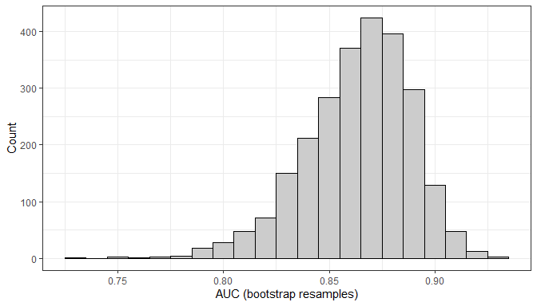
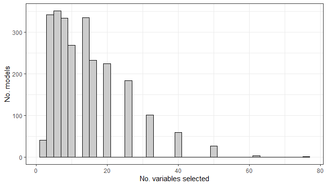
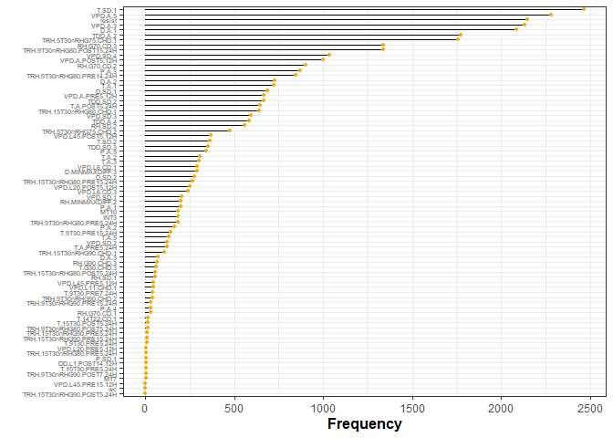
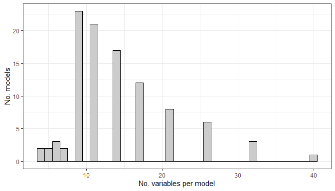
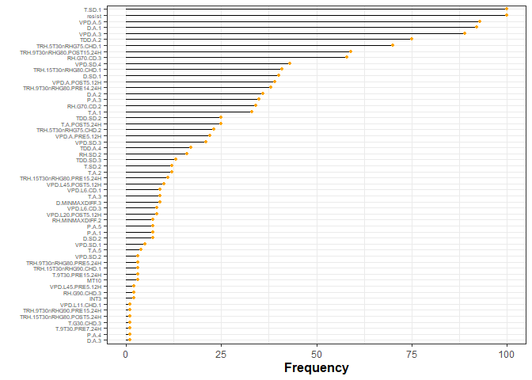
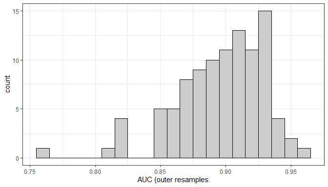

-   <a href="#variable-selection-with-varselrf"
    id="toc-variable-selection-with-varselrf">Variable selection with
    varSelRF</a>
-   <a href="#objectives" id="toc-objectives">Objective(s)</a>
-   <a href="#inner-resamples-aucs" id="toc-inner-resamples-aucs">Inner
    resamples AUCs</a>
    -   <a href="#histogram" id="toc-histogram">Histogram</a>
    -   <a href="#tabular-summary" id="toc-tabular-summary">Tabular summary</a>
-   <a href="#the-number-of-variables-selected-per-bootstrap-resample"
    id="toc-the-number-of-variables-selected-per-bootstrap-resample">The
    number of variables selected per bootstrap resample</a>
    -   <a href="#table" id="toc-table">Table</a>
    -   <a href="#graphical-summary" id="toc-graphical-summary">Graphical
        summary</a>
-   <a href="#variable-selection-frequency"
    id="toc-variable-selection-frequency">Variable selection frequency</a>
-   <a href="#inner-resamples-statistics"
    id="toc-inner-resamples-statistics">Inner resamples statistics</a>
-   <a href="#outer-resample-performance"
    id="toc-outer-resample-performance">Outer resample performance</a>
    -   <a href="#histogram-1" id="toc-histogram-1">Histogram</a>
    -   <a href="#table-1" id="toc-table-1">Table</a>
    -   <a href="#stats" id="toc-stats">Stats</a>
    -   <a href="#list-of-models" id="toc-list-of-models">List of models</a>
    -   <a href="#the-duplicates" id="toc-the-duplicates">The duplicates</a>
    -   <a href="#some-filtering" id="toc-some-filtering">Some filtering</a>
-   <a href="#computational-environment"
    id="toc-computational-environment">Computational environment</a>

# Variable selection with varSelRF

<!-- Data files created with this script: -->
<!--  varSelRFResII.RData -->

# Objective(s)

-   use the `varSelRF` algorithm to reduce the set of variables returned
    by Boruta
-   hopefully without a loss of predictive performance

The `varSelRF` algorithm is described in [this
paper](https://bmcbioinformatics.biomedcentral.com/articles/10.1186/1471-2105-8-328).

<!-- NOTE: run on R 4.1.3 -->

------------------------------------------------------------------------

    ## [conflicted] Will prefer readr::col_factor over any other package

# Inner resamples AUCs

After running the `varSelRF` algorithm on the analysis part of the
bootstrap resamples, the variables selected were used to fit a RF model
on the analysis data. The fitted model was then used to predict on the
assessment part of the data; and it is the AUCs for the predictions on
the assessment data that are reported here.

## Histogram

Rather high, but notice the skew on the left (some models returned a
relatively low AUC on the assessment data).

<!-- -->

## Tabular summary

    ## # A tibble: 1 x 5
    ##     min   max  mean     sd median
    ##   <dbl> <dbl> <dbl>  <dbl>  <dbl>
    ## 1 0.732 0.927 0.864 0.0251  0.867

# The number of variables selected per bootstrap resample

The average number of variables selected per bootstrap resample.

There is a wide range in the number of variables selected per bootstrap
sample, all the way from 2 to 77! Which is basically from the minimum of
2 that `varSelRF` will fit down to, to the complete set of variables
started with!

## Table

    ## # A tibble: 1 x 5
    ##     min   max  mean    sd median
    ##   <int> <int> <dbl> <dbl>  <dbl>
    ## 1     2    77  14.1  9.47     11

## Graphical summary

<!-- -->

# Variable selection frequency

The frequency at which variables were selected across all 2500 bootstrap
resamples.

In some sense, this could be viewed as a variable importance measure.

<!-- -->

So, how do we proceed? An ad-hoc approach would be to take the *x* top
variables, and use those for a new RF model. But we need a more
principled approach.

There could be several competing models. Another way to look at things
is to filter by the inner-resamples AUC being above some threshold *x*,
and looking at the variables that are in each of those models.

# Inner resamples statistics

The inner resample AUCs are high. For example, the 95<sup>th</sup>
quantile auc is 0.899.

<table>
<thead>
<tr>
<th style="text-align:left;">
</th>
<th style="text-align:right;">
auc
</th>
<th style="text-align:right;">
quantile
</th>
</tr>
</thead>
<tbody>
<tr>
<td style="text-align:left;">
1
</td>
<td style="text-align:right;">
0.848
</td>
<td style="text-align:right;">
0.25
</td>
</tr>
<tr>
<td style="text-align:left;">
2
</td>
<td style="text-align:right;">
0.867
</td>
<td style="text-align:right;">
0.50
</td>
</tr>
<tr>
<td style="text-align:left;">
3
</td>
<td style="text-align:right;">
0.881
</td>
<td style="text-align:right;">
0.75
</td>
</tr>
<tr>
<td style="text-align:left;">
4
</td>
<td style="text-align:right;">
0.885
</td>
<td style="text-align:right;">
0.80
</td>
</tr>
<tr>
<td style="text-align:left;">
5
</td>
<td style="text-align:right;">
0.893
</td>
<td style="text-align:right;">
0.90
</td>
</tr>
<tr>
<td style="text-align:left;">
6
</td>
<td style="text-align:right;">
0.899
</td>
<td style="text-align:right;">
0.95
</td>
</tr>
</tbody>
</table>

…but even at the 95<sup>th</sup> quantile, this is still a lot of models
(128)! Too many.

<table>
<thead>
<tr>
<th style="text-align:left;">
</th>
<th style="text-align:left;">
fmla
</th>
<th style="text-align:right;">
.estimate
</th>
</tr>
</thead>
<tbody>
<tr>
<td style="text-align:left;">
1
</td>
<td style="text-align:left;">
Y \~ D.A.1 + P.A.3 + resist + RH.G70.CD.3 + T.SD.1 + TDD.A.2 + ,
TRH.5T30nRHG75.CHD.1 + TRH.9T30nRHG80.POST15.24H + VPD.A.3 + , VPD.A.5 +
VPD.A.POST5.12H
</td>
<td style="text-align:right;">
0.904
</td>
</tr>
<tr>
<td style="text-align:left;">
2
</td>
<td style="text-align:left;">
Y \~ D.A.1 + D.SD.1 + resist + RH.G70.CD.2 + T.A.POST5.24H + T.SD.1 + ,
TDD.A.2 + TRH.5T30nRHG75.CHD.1 + TRH.9T30nRHG80.POST15.24H + , VPD.A.3 +
VPD.A.5 + VPD.A.POST5.12H + VPD.SD.3 + VPD.SD.4
</td>
<td style="text-align:right;">
0.904
</td>
</tr>
<tr>
<td style="text-align:left;">
3
</td>
<td style="text-align:left;">
Y \~ D.A.1 + D.A.2 + D.MINMAXDIFF.3 + D.SD.1 + D.SD.2 + INT3 + , MT10 +
P.A.3 + P.A.5 + resist + RH.G70.CD.2 + RH.G70.CD.3 + , RH.MINMAXDIFF.2 +
RH.SD.1 + RH.SD.2 + T.A.1 + T.A.2 + T.A.POST5.24H + , T.SD.1 + T.SD.2 +
TDD.A.2 + TDD.A.4 + TDD.SD.2 + TDD.SD.3 + , TRH.15T30nRHG80.CHD.1 +
TRH.15T30nRHG80.PRE5.24H + TRH.15T30nRHG90.CHD.1 + ,
TRH.5T30nRHG75.CHD.1 + TRH.5T30nRHG75.CHD.2 +
TRH.9T30nRHG80.POST15.24H + , TRH.9T30nRHG80.PRE14.24H +
TRH.9T30nRHG80.PRE5.24H + VPD.A.3 + , VPD.A.5 + VPD.A.PRE5.12H +
VPD.L6.CD.3 + VPD.SD.1 + VPD.SD.2 + , VPD.SD.3 + VPD.SD.4
</td>
<td style="text-align:right;">
0.904
</td>
</tr>
<tr>
<td style="text-align:left;">
4
</td>
<td style="text-align:left;">
Y \~ D.A.1 + P.A.3 + resist + T.SD.1 + TDD.A.2 + VPD.A.3 + VPD.A.5
</td>
<td style="text-align:right;">
0.900
</td>
</tr>
<tr>
<td style="text-align:left;">
5
</td>
<td style="text-align:left;">
Y \~ D.A.1 + D.SD.1 + P.A.3 + resist + RH.G70.CD.3 + T.A.1 + T.SD.1 + ,
TDD.A.2 + TRH.5T30nRHG75.CHD.1 + TRH.9T30nRHG80.POST15.24H + , VPD.A.5
</td>
<td style="text-align:right;">
0.912
</td>
</tr>
<tr>
<td style="text-align:left;">
6
</td>
<td style="text-align:left;">
Y \~ D.A.1 + D.SD.1 + P.A.3 + resist + RH.G70.CD.2 + T.SD.1 + ,
TDD.A.2 + TRH.5T30nRHG75.CHD.1 + TRH.9T30nRHG80.POST15.24H + , VPD.A.3 +
VPD.A.5
</td>
<td style="text-align:right;">
0.900
</td>
</tr>
<tr>
<td style="text-align:left;">
7
</td>
<td style="text-align:left;">
Y \~ D.A.1 + resist + T.SD.1 + TDD.A.2 + TRH.5T30nRHG75.CHD.1 + ,
TRH.5T30nRHG75.CHD.2 + VPD.A.3 + VPD.A.POST5.12H + VPD.L45.POST5.12H
</td>
<td style="text-align:right;">
0.901
</td>
</tr>
<tr>
<td style="text-align:left;">
8
</td>
<td style="text-align:left;">
Y \~ D.A.1 + resist + T.SD.1 + TDD.A.2 + TDD.SD.2 +
TRH.9T30nRHG80.POST15.24H + , VPD.A.3 + VPD.A.5 + VPD.A.POST5.12H
</td>
<td style="text-align:right;">
0.925
</td>
</tr>
<tr>
<td style="text-align:left;">
9
</td>
<td style="text-align:left;">
Y \~ D.A.1 + resist + RH.G70.CD.3 + T.SD.1 + TRH.9T30nRHG80.PRE14.24H +
, VPD.A.3 + VPD.A.5
</td>
<td style="text-align:right;">
0.907
</td>
</tr>
<tr>
<td style="text-align:left;">
10
</td>
<td style="text-align:left;">
Y \~ D.A.1 + P.A.3 + resist + RH.G70.CD.3 + T.SD.1 + TDD.A.2 + ,
VPD.A.3 + VPD.A.5 + VPD.SD.4
</td>
<td style="text-align:right;">
0.900
</td>
</tr>
<tr>
<td style="text-align:left;">
11
</td>
<td style="text-align:left;">
Y \~ D.A.1 + D.A.2 + D.MINMAXDIFF.3 + MT10 + P.A.3 + P.A.5 + resist + ,
RH.G70.CD.2 + RH.G70.CD.3 + RH.G90.CHD.3 + RH.SD.2 + T.A.1 + , T.A.3 +
T.A.5 + T.A.POST5.24H + T.SD.1 + TDD.A.2 + TRH.15T30nRHG80.CHD.1 + ,
TRH.15T30nRHG80.POST5.24H + TRH.15T30nRHG80.PRE15.24H +
TRH.5T30nRHG75.CHD.1 + , TRH.9T30nRHG80.POST15.24H +
TRH.9T30nRHG80.PRE14.24H + VPD.A.3 + , VPD.A.5 + VPD.SD.4
</td>
<td style="text-align:right;">
0.906
</td>
</tr>
<tr>
<td style="text-align:left;">
12
</td>
<td style="text-align:left;">
Y \~ D.A.1 + D.A.2 + D.MINMAXDIFF.3 + D.SD.1 + D.SD.2 + INT3 + , P.A.3 +
resist + RH.G70.CD.2 + RH.G70.CD.3 + RH.G90.CHD.3 + , RH.SD.2 + T.A.1 +
T.A.2 + T.A.POST5.24H + T.SD.1 + T.SD.2 + , TDD.A.2 + TDD.A.4 +
TDD.SD.2 + TRH.15T30nRHG80.CHD.1 + TRH.15T30nRHG80.POST5.24H + ,
TRH.15T30nRHG80.PRE15.24H + TRH.15T30nRHG90.CHD.1 +
TRH.5T30nRHG75.CHD.1 + , TRH.5T30nRHG75.CHD.2 +
TRH.9T30nRHG80.POST15.24H + TRH.9T30nRHG80.PRE14.24H + ,
TRH.9T30nRHG80.PRE5.24H + VPD.A.3 + VPD.A.5 + VPD.A.POST5.12H + ,
VPD.A.PRE5.12H + VPD.L20.POST5.12H + VPD.L45.POST5.12H + ,
VPD.L45.PRE5.12H + VPD.L6.CD.3 + VPD.SD.1 + VPD.SD.3 + VPD.SD.4
</td>
<td style="text-align:right;">
0.910
</td>
</tr>
<tr>
<td style="text-align:left;">
13
</td>
<td style="text-align:left;">
Y \~ resist + RH.G70.CD.3 + T.SD.1 + TDD.A.2 + TDD.A.4 +
TRH.9T30nRHG80.POST15.24H + , VPD.A.3 + VPD.A.5 + VPD.SD.4
</td>
<td style="text-align:right;">
0.899
</td>
</tr>
<tr>
<td style="text-align:left;">
14
</td>
<td style="text-align:left;">
Y \~ D.A.1 + D.MINMAXDIFF.3 + resist + RH.G70.CD.2 + RH.G70.CD.3 + ,
T.A.POST5.24H + T.SD.1 + T.SD.2 + TDD.A.2 + TDD.SD.2 +
TRH.5T30nRHG75.CHD.1 + , TRH.9T30nRHG80.POST15.24H +
TRH.9T30nRHG80.PRE14.24H + VPD.A.3 + , VPD.A.5 + VPD.A.POST5.12H +
VPD.SD.4
</td>
<td style="text-align:right;">
0.914
</td>
</tr>
<tr>
<td style="text-align:left;">
15
</td>
<td style="text-align:left;">
Y \~ D.A.1 + resist + T.SD.1 + TDD.A.2 + VPD.A.5
</td>
<td style="text-align:right;">
0.906
</td>
</tr>
<tr>
<td style="text-align:left;">
16
</td>
<td style="text-align:left;">
Y \~ D.A.1 + D.SD.1 + resist + RH.G70.CD.2 + RH.G70.CD.3 + T.SD.1 + ,
TDD.A.2 + TDD.SD.2 + TRH.15T30nRHG80.CHD.1 + TRH.5T30nRHG75.CHD.1 + ,
TRH.9T30nRHG80.PRE14.24H + VPD.A.5 + VPD.A.POST5.12H + VPD.A.PRE5.12H
</td>
<td style="text-align:right;">
0.900
</td>
</tr>
<tr>
<td style="text-align:left;">
17
</td>
<td style="text-align:left;">
Y \~ D.A.1 + D.SD.1 + P.A.3 + resist + RH.G70.CD.2 + T.A.1 + T.SD.1 + ,
T.SD.2 + TRH.5T30nRHG75.CHD.1 + TRH.9T30nRHG80.POST15.24H + ,
TRH.9T30nRHG80.PRE14.24H + VPD.A.3 + VPD.A.5 + VPD.A.POST5.12H
</td>
<td style="text-align:right;">
0.903
</td>
</tr>
<tr>
<td style="text-align:left;">
18
</td>
<td style="text-align:left;">
Y \~ D.A.1 + resist + RH.G70.CD.2 + RH.G70.CD.3 + T.SD.1 +
TRH.15T30nRHG80.CHD.1 + , TRH.5T30nRHG75.CHD.1 +
TRH.9T30nRHG80.POST15.24H + VPD.A.5
</td>
<td style="text-align:right;">
0.901
</td>
</tr>
<tr>
<td style="text-align:left;">
19
</td>
<td style="text-align:left;">
Y \~ D.A.1 + resist + RH.G70.CD.3 + T.9T30.PRE15.24H + T.A.1 + ,
T.SD.1 + TDD.A.2 + TDD.A.4 + TRH.15T30nRHG80.CHD.1 +
TRH.5T30nRHG75.CHD.1 + , TRH.5T30nRHG75.CHD.2 +
TRH.9T30nRHG80.POST15.24H + TRH.9T30nRHG80.PRE14.24H + , VPD.A.3 +
VPD.A.5 + VPD.A.POST5.12H + VPD.SD.4
</td>
<td style="text-align:right;">
0.913
</td>
</tr>
<tr>
<td style="text-align:left;">
20
</td>
<td style="text-align:left;">
Y \~ D.A.1 + D.A.2 + D.SD.1 + P.A.1 + resist + T.9T30.PRE15.24H + ,
T.A.1 + T.A.2 + T.SD.1 + TRH.5T30nRHG75.CHD.1 +
TRH.9T30nRHG80.POST15.24H + , TRH.9T30nRHG80.PRE14.24H + VPD.A.3 +
VPD.A.5
</td>
<td style="text-align:right;">
0.905
</td>
</tr>
<tr>
<td style="text-align:left;">
21
</td>
<td style="text-align:left;">
Y \~ D.A.1 + resist + RH.G70.CD.2 + T.A.1 + T.SD.1 + TDD.A.2 + ,
TDD.SD.3 + TRH.15T30nRHG80.CHD.1 + TRH.5T30nRHG75.CHD.1 + ,
TRH.5T30nRHG75.CHD.2 + TRH.9T30nRHG80.POST15.24H + VPD.A.3 + , VPD.A.5 +
VPD.A.POST5.12H + VPD.L6.CD.3 + VPD.SD.3 + VPD.SD.4
</td>
<td style="text-align:right;">
0.916
</td>
</tr>
<tr>
<td style="text-align:left;">
22
</td>
<td style="text-align:left;">
Y \~ D.A.1 + resist + T.9T30.PRE15.24H + T.A.1 + T.SD.1 + TDD.A.2 + ,
TRH.5T30nRHG75.CHD.1 + TRH.9T30nRHG80.PRE5.24H + VPD.A.3 + , VPD.A.5 +
VPD.A.PRE5.12H
</td>
<td style="text-align:right;">
0.909
</td>
</tr>
<tr>
<td style="text-align:left;">
23
</td>
<td style="text-align:left;">
Y \~ D.A.1 + D.A.2 + P.A.3 + resist + RH.G70.CD.2 + RH.G70.CD.3 + ,
RH.SD.2 + T.A.1 + T.SD.1 + T.SD.2 + TDD.A.2 + TRH.5T30nRHG75.CHD.1 + ,
TRH.9T30nRHG80.POST15.24H + TRH.9T30nRHG80.PRE14.24H +
TRH.9T30nRHG80.PRE5.24H + , VPD.A.3 + VPD.A.5 + VPD.A.POST5.12H +
VPD.A.PRE5.12H + VPD.L6.CD.1 + , VPD.SD.4
</td>
<td style="text-align:right;">
0.913
</td>
</tr>
<tr>
<td style="text-align:left;">
24
</td>
<td style="text-align:left;">
Y \~ D.A.1 + D.A.2 + D.A.3 + P.A.3 + P.A.5 + resist + RH.G70.CD.3 + ,
RH.MINMAXDIFF.2 + RH.SD.2 + T.A.1 + T.A.3 + T.SD.1 + TDD.A.2 + ,
TDD.A.4 + TDD.SD.2 + TRH.15T30nRHG80.CHD.1 + TRH.15T30nRHG80.PRE15.24H +
, TRH.5T30nRHG75.CHD.1 + TRH.9T30nRHG80.POST15.24H + VPD.A.3 + ,
VPD.A.5 + VPD.A.POST5.12H + VPD.A.PRE5.12H + VPD.L6.CD.1 + , VPD.SD.3 +
VPD.SD.4
</td>
<td style="text-align:right;">
0.903
</td>
</tr>
<tr>
<td style="text-align:left;">
25
</td>
<td style="text-align:left;">
Y \~ D.A.1 + resist + RH.G70.CD.3 + T.SD.1 + TDD.A.2 + TDD.SD.2 + ,
TRH.5T30nRHG75.CHD.1 + TRH.9T30nRHG80.POST15.24H + VPD.A.3 + , VPD.A.5 +
VPD.A.POST5.12H
</td>
<td style="text-align:right;">
0.915
</td>
</tr>
<tr>
<td style="text-align:left;">
26
</td>
<td style="text-align:left;">
Y \~ D.A.1 + D.SD.1 + P.A.3 + resist + T.A.1 + T.SD.1 + TDD.SD.2 + ,
TRH.5T30nRHG75.CHD.1 + TRH.9T30nRHG80.POST15.24H + VPD.A.3 + , VPD.A.5
</td>
<td style="text-align:right;">
0.900
</td>
</tr>
<tr>
<td style="text-align:left;">
27
</td>
<td style="text-align:left;">
Y \~ D.SD.1 + resist + RH.G70.CD.2 + T.SD.1 + TDD.A.2 +
TRH.5T30nRHG75.CHD.1 + , TRH.9T30nRHG80.POST15.24H
</td>
<td style="text-align:right;">
0.902
</td>
</tr>
<tr>
<td style="text-align:left;">
28
</td>
<td style="text-align:left;">
Y \~ D.A.1 + D.SD.1 + P.A.3 + resist + RH.G70.CD.3 + T.A.POST5.24H + ,
T.SD.1 + T.SD.2 + TDD.A.4 + TRH.5T30nRHG75.CHD.1 +
TRH.9T30nRHG80.POST15.24H + , TRH.9T30nRHG80.PRE14.24H + VPD.A.3 +
VPD.A.5 + VPD.A.POST5.12H + , VPD.L6.CD.3 + VPD.SD.3
</td>
<td style="text-align:right;">
0.902
</td>
</tr>
<tr>
<td style="text-align:left;">
29
</td>
<td style="text-align:left;">
Y \~ D.A.1 + D.A.2 + D.MINMAXDIFF.3 + D.SD.1 + D.SD.2 + P.A.3 + ,
resist + RH.G70.CD.2 + RH.G70.CD.3 + T.A.2 + T.SD.1 + T.SD.2 + ,
TDD.A.2 + TDD.A.4 + TRH.5T30nRHG75.CHD.1 + TRH.9T30nRHG80.POST15.24H + ,
VPD.A.3 + VPD.A.5 + VPD.A.POST5.12H + VPD.SD.3 + VPD.SD.4
</td>
<td style="text-align:right;">
0.899
</td>
</tr>
<tr>
<td style="text-align:left;">
30
</td>
<td style="text-align:left;">
Y \~ D.A.1 + resist + RH.G70.CD.2 + RH.G70.CD.3 + T.SD.1 + TDD.A.2 + ,
TRH.5T30nRHG75.CHD.1 + TRH.9T30nRHG80.POST15.24H + VPD.A.3 + , VPD.A.5 +
VPD.A.POST5.12H
</td>
<td style="text-align:right;">
0.908
</td>
</tr>
<tr>
<td style="text-align:left;">
31
</td>
<td style="text-align:left;">
Y \~ D.A.1 + P.A.3 + resist + RH.G70.CD.3 + T.SD.1 +
TRH.15T30nRHG80.CHD.1 + , TRH.5T30nRHG75.CHD.1 + TRH.5T30nRHG75.CHD.2 +
TRH.9T30nRHG80.POST15.24H + , VPD.A.3 + VPD.A.5
</td>
<td style="text-align:right;">
0.916
</td>
</tr>
<tr>
<td style="text-align:left;">
32
</td>
<td style="text-align:left;">
Y \~ D.A.1 + D.A.2 + P.A.3 + resist + RH.G70.CD.3 + RH.SD.2 + , T.SD.1 +
TDD.A.2 + TRH.5T30nRHG75.CHD.1
</td>
<td style="text-align:right;">
0.904
</td>
</tr>
<tr>
<td style="text-align:left;">
33
</td>
<td style="text-align:left;">
Y \~ D.A.1 + D.A.2 + resist + RH.G70.CD.2 + RH.MINMAXDIFF.2 + ,
RH.SD.2 + T.SD.1 + TDD.A.4 + TDD.SD.3 + VPD.A.3 + VPD.A.5 + ,
VPD.A.PRE5.12H + VPD.SD.3 + VPD.SD.4
</td>
<td style="text-align:right;">
0.910
</td>
</tr>
<tr>
<td style="text-align:left;">
34
</td>
<td style="text-align:left;">
Y \~ D.A.1 + resist + T.SD.1 + TRH.5T30nRHG75.CHD.1 + VPD.A.5
</td>
<td style="text-align:right;">
0.911
</td>
</tr>
<tr>
<td style="text-align:left;">
35
</td>
<td style="text-align:left;">
Y \~ D.A.1 + resist + T.SD.1 + TRH.5T30nRHG75.CHD.1 + VPD.A.5
</td>
<td style="text-align:right;">
0.905
</td>
</tr>
<tr>
<td style="text-align:left;">
36
</td>
<td style="text-align:left;">
Y \~ D.A.1 + P.A.3 + resist + RH.G70.CD.2 + RH.G70.CD.3 + T.SD.1 + ,
TRH.15T30nRHG80.CHD.1 + TRH.5T30nRHG75.CHD.1 +
TRH.9T30nRHG80.POST15.24H + , VPD.A.3 + VPD.A.5
</td>
<td style="text-align:right;">
0.907
</td>
</tr>
<tr>
<td style="text-align:left;">
37
</td>
<td style="text-align:left;">
Y \~ D.A.1 + P.A.3 + resist + RH.G70.CD.3 + T.A.1 + T.A.3 +
T.G30.CHD.3 + , T.SD.1 + TDD.A.2 + TRH.5T30nRHG75.CHD.1 +
TRH.5T30nRHG75.CHD.2 + , TRH.9T30nRHG80.POST15.24H +
TRH.9T30nRHG80.PRE14.24H + VPD.A.3 + , VPD.A.5 + VPD.L6.CD.1 + VPD.SD.4
</td>
<td style="text-align:right;">
0.904
</td>
</tr>
<tr>
<td style="text-align:left;">
38
</td>
<td style="text-align:left;">
Y \~ D.A.1 + resist + RH.G70.CD.2 + RH.G70.CD.3 + T.SD.1 +
TRH.5T30nRHG75.CHD.1 + , TRH.9T30nRHG80.POST15.24H + VPD.A.3 + VPD.A.5
</td>
<td style="text-align:right;">
0.909
</td>
</tr>
<tr>
<td style="text-align:left;">
39
</td>
<td style="text-align:left;">
Y \~ D.A.1 + P.A.3 + resist + RH.G70.CD.3 + T.SD.1 + TDD.A.2 + ,
TRH.9T30nRHG80.POST15.24H + VPD.A.3 + VPD.A.5
</td>
<td style="text-align:right;">
0.900
</td>
</tr>
<tr>
<td style="text-align:left;">
40
</td>
<td style="text-align:left;">
Y \~ D.A.1 + D.SD.1 + P.A.3 + P.A.5 + resist + T.SD.1 +
TRH.9T30nRHG80.POST15.24H + , VPD.A.3 + VPD.A.POST5.12H
</td>
<td style="text-align:right;">
0.905
</td>
</tr>
<tr>
<td style="text-align:left;">
41
</td>
<td style="text-align:left;">
Y \~ D.A.1 + D.A.2 + D.MINMAXDIFF.3 + P.A.3 + resist + RH.G70.CD.2 + ,
RH.G70.CD.3 + T.A.2 + T.A.3 + T.A.POST5.24H + T.SD.1 + TDD.A.2 + ,
TDD.A.4 + TDD.SD.2 + TRH.15T30nRHG80.CHD.1 + TRH.15T30nRHG80.PRE15.24H +
, TRH.15T30nRHG90.CHD.1 + TRH.5T30nRHG75.CHD.1 + TRH.5T30nRHG75.CHD.2 +
, TRH.9T30nRHG80.POST15.24H + VPD.A.3 + VPD.A.5 + VPD.A.POST5.12H + ,
VPD.A.PRE5.12H + VPD.L6.CD.1 + VPD.SD.4
</td>
<td style="text-align:right;">
0.900
</td>
</tr>
<tr>
<td style="text-align:left;">
42
</td>
<td style="text-align:left;">
Y \~ D.A.1 + D.SD.1 + P.A.3 + resist + RH.G70.CD.3 + T.SD.1 + ,
TDD.A.2 + TRH.5T30nRHG75.CHD.1 + TRH.9T30nRHG80.POST15.24H + , VPD.A.3 +
VPD.A.5
</td>
<td style="text-align:right;">
0.923
</td>
</tr>
<tr>
<td style="text-align:left;">
43
</td>
<td style="text-align:left;">
Y \~ D.A.1 + resist + T.SD.1 + TRH.5T30nRHG75.CHD.1 + VPD.A.3 + ,
VPD.A.5 + VPD.SD.4
</td>
<td style="text-align:right;">
0.920
</td>
</tr>
<tr>
<td style="text-align:left;">
44
</td>
<td style="text-align:left;">
Y \~ D.A.1 + resist + RH.G70.CD.2 + RH.G70.CD.3 + TDD.A.2 +
TRH.5T30nRHG75.CHD.1 + , TRH.9T30nRHG80.POST15.24H + VPD.A.3 + VPD.A.5
</td>
<td style="text-align:right;">
0.902
</td>
</tr>
<tr>
<td style="text-align:left;">
45
</td>
<td style="text-align:left;">
Y \~ D.A.1 + D.A.2 + MT10 + P.A.1 + resist + RH.G70.CD.3 + T.A.1 + ,
T.A.2 + T.A.POST5.24H + T.G30.CHD.3 + T.SD.1 + TDD.A.2 + , TDD.A.4 +
TDD.SD.2 + TDD.SD.3 + TRH.15T30nRHG80.CHD.1 +
TRH.15T30nRHG80.PRE15.24H + , TRH.5T30nRHG75.CHD.1 +
TRH.5T30nRHG75.CHD.2 + TRH.9T30nRHG80.PRE14.24H + ,
TRH.9T30nRHG80.PRE5.24H + VPD.A.3 + VPD.A.5 + VPD.A.POST5.12H + ,
VPD.SD.3 + VPD.SD.4
</td>
<td style="text-align:right;">
0.913
</td>
</tr>
<tr>
<td style="text-align:left;">
46
</td>
<td style="text-align:left;">
Y \~ D.A.1 + resist + RH.G70.CD.2 + RH.G70.CD.3 + T.A.1 + T.SD.1 + ,
TDD.A.2 + TRH.5T30nRHG75.CHD.1 + TRH.9T30nRHG80.POST15.24H + ,
TRH.9T30nRHG80.PRE14.24H + VPD.A.3 + VPD.A.5 + VPD.A.PRE5.12H + ,
VPD.SD.4
</td>
<td style="text-align:right;">
0.903
</td>
</tr>
<tr>
<td style="text-align:left;">
47
</td>
<td style="text-align:left;">
Y \~ D.A.1 + D.SD.1 + P.A.3 + resist + RH.G70.CD.2 + RH.G70.CD.3 + ,
T.A.POST5.24H + T.SD.1 + TDD.A.2 + TRH.15T30nRHG80.PRE15.24H + ,
TRH.5T30nRHG75.CHD.1 + TRH.9T30nRHG80.POST15.24H +
TRH.9T30nRHG80.PRE14.24H + , VPD.A.3 + VPD.A.5 + VPD.A.POST5.12H +
VPD.SD.3
</td>
<td style="text-align:right;">
0.912
</td>
</tr>
<tr>
<td style="text-align:left;">
48
</td>
<td style="text-align:left;">
Y \~ D.A.1 + D.SD.1 + P.A.3 + resist + T.SD.1 + TDD.A.2 +
TRH.5T30nRHG75.CHD.1 + , VPD.A.3 + VPD.A.POST5.12H
</td>
<td style="text-align:right;">
0.899
</td>
</tr>
<tr>
<td style="text-align:left;">
49
</td>
<td style="text-align:left;">
Y \~ D.A.1 + P.A.3 + resist + T.SD.1 + TDD.A.2 + TRH.15T30nRHG80.CHD.1 +
, TRH.15T30nRHG80.PRE15.24H + VPD.A.3 + VPD.A.5
</td>
<td style="text-align:right;">
0.900
</td>
</tr>
<tr>
<td style="text-align:left;">
50
</td>
<td style="text-align:left;">
Y \~ resist + RH.G70.CD.3 + T.A.1 + T.A.POST5.24H + T.SD.1 + TDD.A.2 + ,
TRH.5T30nRHG75.CHD.1 + TRH.9T30nRHG80.POST15.24H +
TRH.9T30nRHG80.PRE14.24H + , VPD.A.3 + VPD.A.5
</td>
<td style="text-align:right;">
0.904
</td>
</tr>
<tr>
<td style="text-align:left;">
51
</td>
<td style="text-align:left;">
Y \~ D.A.1 + D.A.2 + D.SD.1 + resist + RH.G70.CD.2 + T.SD.1 + ,
TDD.A.2 + TRH.5T30nRHG75.CHD.1 + TRH.5T30nRHG75.CHD.2 + VPD.A.3 + ,
VPD.A.5 + VPD.A.POST5.12H + VPD.A.PRE5.12H + VPD.SD.4
</td>
<td style="text-align:right;">
0.901
</td>
</tr>
<tr>
<td style="text-align:left;">
52
</td>
<td style="text-align:left;">
Y \~ D.A.1 + D.A.2 + P.A.3 + resist + RH.G70.CD.2 + RH.G70.CD.3 + ,
RH.SD.2 + T.A.POST5.24H + T.SD.1 + TDD.SD.2 + TRH.5T30nRHG75.CHD.1 + ,
TRH.9T30nRHG80.POST15.24H + VPD.A.3 + VPD.A.5 + VPD.A.POST5.12H + ,
VPD.A.PRE5.12H + VPD.SD.3
</td>
<td style="text-align:right;">
0.907
</td>
</tr>
<tr>
<td style="text-align:left;">
53
</td>
<td style="text-align:left;">
Y \~ D.A.1 + D.SD.1 + resist + RH.G70.CD.3 + T.SD.1 +
TRH.9T30nRHG80.POST15.24H + , VPD.A.3 + VPD.A.5 + VPD.A.POST5.12H +
VPD.A.PRE5.12H + VPD.L20.POST5.12H
</td>
<td style="text-align:right;">
0.915
</td>
</tr>
<tr>
<td style="text-align:left;">
54
</td>
<td style="text-align:left;">
Y \~ P.A.3 + resist + RH.G70.CD.3 + T.SD.1 + TDD.A.2 +
TRH.5T30nRHG75.CHD.1 + , TRH.9T30nRHG80.PRE14.24H + VPD.A.3 + VPD.A.5
</td>
<td style="text-align:right;">
0.906
</td>
</tr>
<tr>
<td style="text-align:left;">
55
</td>
<td style="text-align:left;">
Y \~ D.A.1 + D.A.2 + resist + T.A.POST5.24H + T.SD.1 +
TRH.15T30nRHG80.CHD.1 + , TRH.5T30nRHG75.CHD.1 + VPD.A.3 + VPD.A.5 +
VPD.L45.POST5.12H + , VPD.SD.3
</td>
<td style="text-align:right;">
0.905
</td>
</tr>
<tr>
<td style="text-align:left;">
56
</td>
<td style="text-align:left;">
Y \~ D.A.1 + D.A.2 + D.A.3 + D.MINMAXDIFF.3 + D.SD.1 + D.SD.2 + , INT3 +
MT10 + P.A.1 + P.A.2 + P.A.5 + resist + RH.G70.CD.2 + , RH.G70.CD.3 +
T.9T30.PRE15.24H + T.A.1 + T.A.2 + T.A.POST5.24H + , T.A.PRE5.24H +
T.SD.1 + T.SD.2 + TDD.A.2 + TDD.A.4 + TDD.SD.3 + ,
TRH.15T30nRHG80.CHD.1 + TRH.15T30nRHG80.PRE15.24H +
TRH.15T30nRHG90.CHD.1 + , TRH.5T30nRHG75.CHD.1 + TRH.5T30nRHG75.CHD.2 +
TRH.9T30nRHG80.POST15.24H + , TRH.9T30nRHG80.PRE14.24H + VPD.A.3 +
VPD.A.5 + VPD.A.POST5.12H + , VPD.A.PRE5.12H + VPD.L11.CHD.1 +
VPD.L45.POST5.12H + VPD.L6.CD.3 + , VPD.SD.1 + VPD.SD.3
</td>
<td style="text-align:right;">
0.911
</td>
</tr>
<tr>
<td style="text-align:left;">
57
</td>
<td style="text-align:left;">
Y \~ D.A.1 + D.A.2 + D.SD.1 + resist + T.A.1 + T.SD.1 + VPD.A.3 + ,
VPD.A.5 + VPD.A.PRE5.12H
</td>
<td style="text-align:right;">
0.927
</td>
</tr>
<tr>
<td style="text-align:left;">
58
</td>
<td style="text-align:left;">
Y \~ resist + RH.G70.CD.2 + T.SD.1 + TRH.9T30nRHG80.POST15.24H + ,
VPD.A.3 + VPD.A.5
</td>
<td style="text-align:right;">
0.908
</td>
</tr>
<tr>
<td style="text-align:left;">
59
</td>
<td style="text-align:left;">
Y \~ P.A.3 + resist + RH.G70.CD.3 + T.SD.1 + TDD.A.2 +
TRH.15T30nRHG80.CHD.1 + , TRH.9T30nRHG80.POST15.24H + VPD.A.3 + VPD.A.5
</td>
<td style="text-align:right;">
0.911
</td>
</tr>
<tr>
<td style="text-align:left;">
60
</td>
<td style="text-align:left;">
Y \~ D.A.1 + D.A.2 + resist + RH.G70.CD.3 + T.SD.1 + TDD.A.2 + ,
TRH.15T30nRHG80.CHD.1 + TRH.5T30nRHG75.CHD.1 + TRH.5T30nRHG75.CHD.2 + ,
VPD.A.3 + VPD.A.5 + VPD.A.POST5.12H + VPD.L45.POST5.12H + , VPD.SD.4
</td>
<td style="text-align:right;">
0.903
</td>
</tr>
<tr>
<td style="text-align:left;">
61
</td>
<td style="text-align:left;">
Y \~ D.A.1 + D.A.2 + MT10 + P.A.3 + resist + RH.G70.CD.2 + RH.G70.CD.3 +
, T.A.1 + T.A.2 + T.SD.1 + TDD.A.2 + TRH.15T30nRHG80.CHD.1 + ,
TRH.15T30nRHG90.CHD.1 + TRH.5T30nRHG75.CHD.1 +
TRH.9T30nRHG80.POST15.24H + , TRH.9T30nRHG80.PRE14.24H + VPD.A.3 +
VPD.A.5 + VPD.A.POST5.12H + , VPD.L20.POST5.12H + VPD.L45.POST5.12H
</td>
<td style="text-align:right;">
0.902
</td>
</tr>
<tr>
<td style="text-align:left;">
62
</td>
<td style="text-align:left;">
Y \~ D.A.1 + D.A.2 + D.MINMAXDIFF.3 + D.SD.1 + P.A.1 + P.A.3 + ,
resist + RH.SD.2 + T.A.1 + T.SD.1 + T.SD.2 + TDD.A.2 +
TRH.5T30nRHG75.CHD.1 + , TRH.9T30nRHG80.POST15.24H +
TRH.9T30nRHG80.PRE14.24H + VPD.A.3 + , VPD.A.5 + VPD.A.POST5.12H +
VPD.L6.CD.3 + VPD.SD.3 + VPD.SD.4
</td>
<td style="text-align:right;">
0.899
</td>
</tr>
<tr>
<td style="text-align:left;">
63
</td>
<td style="text-align:left;">
Y \~ D.A.1 + resist + T.SD.1 + TDD.A.2 + TDD.SD.2 +
TRH.15T30nRHG80.CHD.1 + , TRH.5T30nRHG75.CHD.1 + TRH.5T30nRHG75.CHD.2 +
TRH.9T30nRHG80.PRE14.24H + , VPD.A.3 + VPD.A.5 + VPD.SD.1 + VPD.SD.3 +
VPD.SD.4
</td>
<td style="text-align:right;">
0.906
</td>
</tr>
<tr>
<td style="text-align:left;">
64
</td>
<td style="text-align:left;">
Y \~ D.A.1 + D.A.2 + resist + RH.G70.CD.2 + RH.G70.CD.3 +
RH.MINMAXDIFF.2 + , T.SD.1 + TDD.A.2 + TDD.A.4 + TDD.SD.2 +
TRH.5T30nRHG75.CHD.1 + , TRH.5T30nRHG75.CHD.2 + VPD.A.3 + VPD.A.5 +
VPD.A.POST5.12H + , VPD.A.PRE5.12H + VPD.L45.POST5.12H
</td>
<td style="text-align:right;">
0.902
</td>
</tr>
<tr>
<td style="text-align:left;">
65
</td>
<td style="text-align:left;">
Y \~ D.A.1 + D.SD.1 + resist + RH.G70.CD.2 + RH.G70.CD.3 +
RH.MINMAXDIFF.2 + , T.A.1 + T.SD.1 + TDD.A.2 + TRH.15T30nRHG80.CHD.1 +
TRH.5T30nRHG75.CHD.1 + , TRH.9T30nRHG80.POST15.24H +
TRH.9T30nRHG80.PRE14.24H + VPD.A.3 + , VPD.A.5 + VPD.A.PRE5.12H +
VPD.SD.1
</td>
<td style="text-align:right;">
0.914
</td>
</tr>
<tr>
<td style="text-align:left;">
66
</td>
<td style="text-align:left;">
Y \~ D.A.1 + D.SD.1 + resist + T.A.1 + T.SD.1 + TDD.A.2 +
TRH.5T30nRHG75.CHD.1 + , VPD.A.3 + VPD.A.5
</td>
<td style="text-align:right;">
0.901
</td>
</tr>
<tr>
<td style="text-align:left;">
67
</td>
<td style="text-align:left;">
Y \~ D.A.1 + D.A.2 + D.SD.1 + P.A.1 + P.A.2 + P.A.3 + P.A.5 + , resist +
RH.G70.CD.2 + T.A.POST5.24H + T.SD.1 + TDD.A.2 + , TDD.A.4 +
TRH.15T30nRHG80.CHD.1 + TRH.5T30nRHG75.CHD.1 + ,
TRH.9T30nRHG80.POST15.24H + VPD.A.3 + VPD.A.5 + VPD.L6.CD.1 + ,
VPD.L6.CD.3 + VPD.SD.4
</td>
<td style="text-align:right;">
0.899
</td>
</tr>
<tr>
<td style="text-align:left;">
68
</td>
<td style="text-align:left;">
Y \~ D.A.1 + D.SD.1 + resist + RH.G70.CD.3 + T.SD.1 + TDD.A.2 + ,
TDD.A.4 + TRH.5T30nRHG75.CHD.1 + TRH.9T30nRHG80.POST15.24H + , VPD.A.3 +
VPD.A.5
</td>
<td style="text-align:right;">
0.901
</td>
</tr>
<tr>
<td style="text-align:left;">
69
</td>
<td style="text-align:left;">
Y \~ D.A.1 + P.A.3 + resist + T.SD.1 + TDD.A.2 + TRH.5T30nRHG75.CHD.1 +
, VPD.A.3 + VPD.A.5 + VPD.SD.4
</td>
<td style="text-align:right;">
0.912
</td>
</tr>
<tr>
<td style="text-align:left;">
70
</td>
<td style="text-align:left;">
Y \~ D.A.1 + resist + RH.G70.CD.2 + RH.G70.CD.3 + T.SD.1 + TDD.A.2 + ,
TRH.5T30nRHG75.CHD.1 + TRH.9T30nRHG80.POST15.24H +
TRH.9T30nRHG80.PRE14.24H + , VPD.A.3 + VPD.A.5
</td>
<td style="text-align:right;">
0.917
</td>
</tr>
<tr>
<td style="text-align:left;">
71
</td>
<td style="text-align:left;">
Y \~ D.A.1 + resist + T.SD.1 + TDD.A.2 + TDD.A.4 +
TRH.5T30nRHG75.CHD.1 + , TRH.9T30nRHG80.POST15.24H + VPD.A.3 + VPD.A.5
</td>
<td style="text-align:right;">
0.899
</td>
</tr>
<tr>
<td style="text-align:left;">
72
</td>
<td style="text-align:left;">
Y \~ D.A.1 + D.SD.1 + P.A.3 + resist + RH.G70.CD.3 + RH.SD.2 + ,
T.SD.1 + TDD.A.2 + TRH.15T30nRHG80.CHD.1 + TRH.15T30nRHG80.PRE15.24H + ,
TRH.5T30nRHG75.CHD.1 + VPD.A.3 + VPD.A.5 + VPD.SD.4
</td>
<td style="text-align:right;">
0.903
</td>
</tr>
<tr>
<td style="text-align:left;">
73
</td>
<td style="text-align:left;">
Y \~ D.A.1 + D.SD.1 + P.A.3 + P.A.5 + RH.G70.CD.2 + RH.SD.2 + ,
T.A.PRE5.24H + T.SD.1 + TDD.A.2 + TDD.A.4 + TDD.SD.2 +
TRH.15T30nRHG80.CHD.1 + , TRH.15T30nRHG90.CHD.1 + TRH.5T30nRHG75.CHD.1 +
TRH.9T30nRHG80.PRE14.24H + , VPD.A.3 + VPD.A.5 + VPD.A.PRE5.12H +
VPD.L6.CD.3 + VPD.SD.3 + , VPD.SD.4
</td>
<td style="text-align:right;">
0.900
</td>
</tr>
<tr>
<td style="text-align:left;">
74
</td>
<td style="text-align:left;">
Y \~ D.A.1 + P.A.5 + resist + RH.G70.CD.3 + T.SD.1 + TDD.A.2 + ,
TRH.5T30nRHG75.CHD.1 + TRH.9T30nRHG80.POST15.24H +
TRH.9T30nRHG80.PRE14.24H + , VPD.A.3 + VPD.A.5
</td>
<td style="text-align:right;">
0.900
</td>
</tr>
<tr>
<td style="text-align:left;">
75
</td>
<td style="text-align:left;">
Y \~ D.A.1 + P.A.1 + resist + RH.G70.CD.3 + T.SD.1 + TDD.A.2 + ,
TRH.5T30nRHG75.CHD.1 + TRH.5T30nRHG75.CHD.2 + TRH.9T30nRHG80.PRE14.24H +
, VPD.A.3 + VPD.A.5
</td>
<td style="text-align:right;">
0.913
</td>
</tr>
<tr>
<td style="text-align:left;">
76
</td>
<td style="text-align:left;">
Y \~ D.A.1 + D.SD.1 + resist + RH.G70.CD.3 + RH.MINMAXDIFF.2 + ,
T.SD.1 + TDD.SD.2 + TRH.15T30nRHG80.CHD.1 + TRH.9T30nRHG80.POST15.24H +
, VPD.A.3 + VPD.A.5 + VPD.A.POST5.12H + VPD.A.PRE5.12H + VPD.SD.3
</td>
<td style="text-align:right;">
0.913
</td>
</tr>
<tr>
<td style="text-align:left;">
77
</td>
<td style="text-align:left;">
Y \~ D.A.1 + D.SD.1 + P.A.1 + P.A.3 + P.A.5 + resist + RH.G70.CD.2 + ,
RH.G70.CD.3 + T.A.1 + T.A.POST5.24H + T.SD.1 + T.SD.2 + TDD.A.2 + ,
TDD.A.4 + TDD.SD.2 + TDD.SD.3 + TRH.15T30nRHG80.CHD.1 +
TRH.5T30nRHG75.CHD.1 + , TRH.5T30nRHG75.CHD.2 +
TRH.9T30nRHG80.POST15.24H + TRH.9T30nRHG80.PRE14.24H + , VPD.A.3 +
VPD.A.5 + VPD.A.POST5.12H + VPD.SD.3 + VPD.SD.4
</td>
<td style="text-align:right;">
0.906
</td>
</tr>
<tr>
<td style="text-align:left;">
78
</td>
<td style="text-align:left;">
Y \~ D.A.1 + resist + T.A.POST5.24H + T.SD.1 + TDD.A.2 + VPD.A.3
</td>
<td style="text-align:right;">
0.909
</td>
</tr>
<tr>
<td style="text-align:left;">
79
</td>
<td style="text-align:left;">
Y \~ D.A.1 + D.A.2 + D.SD.1 + D.SD.2 + MT10 + P.A.3 + resist + ,
RH.G70.CD.2 + RH.G70.CD.3 + RH.MINMAXDIFF.2 + RH.SD.2 + T.A.1 + ,
T.A.2 + T.A.3 + T.A.POST5.24H + T.SD.1 + TDD.A.2 + TDD.A.4 + ,
TDD.SD.2 + TDD.SD.3 + TRH.15T30nRHG80.CHD.1 + TRH.5T30nRHG75.CHD.1 + ,
TRH.5T30nRHG75.CHD.2 + TRH.9T30nRHG80.POST15.24H +
TRH.9T30nRHG80.PRE14.24H + , VPD.A.3 + VPD.A.5 + VPD.A.POST5.12H +
VPD.A.PRE5.12H + VPD.L11.CHD.1 + , VPD.L6.CD.3 + VPD.SD.2
</td>
<td style="text-align:right;">
0.909
</td>
</tr>
<tr>
<td style="text-align:left;">
80
</td>
<td style="text-align:left;">
Y \~ D.A.1 + D.SD.1 + resist + T.SD.1 + TDD.A.2 + TRH.5T30nRHG75.CHD.1 +
, TRH.5T30nRHG75.CHD.2 + TRH.9T30nRHG80.PRE14.24H + VPD.A.3 + ,
VPD.A.5 + VPD.SD.4
</td>
<td style="text-align:right;">
0.908
</td>
</tr>
<tr>
<td style="text-align:left;">
81
</td>
<td style="text-align:left;">
Y \~ D.A.1 + resist + T.SD.1 + TDD.A.2 + TRH.5T30nRHG75.CHD.1 + ,
TRH.9T30nRHG80.POST15.24H + VPD.A.3 + VPD.A.5 + VPD.A.POST5.12H
</td>
<td style="text-align:right;">
0.904
</td>
</tr>
<tr>
<td style="text-align:left;">
82
</td>
<td style="text-align:left;">
Y \~ D.A.1 + D.A.2 + D.MINMAXDIFF.3 + resist + RH.G70.CD.2 +
T.9T30.PRE7.24H + , T.SD.1 + TDD.A.2 + TRH.15T30nRHG80.CHD.1 +
TRH.5T30nRHG75.CHD.1 + , TRH.9T30nRHG80.POST15.24H + VPD.A.3 + VPD.A.5 +
VPD.A.PRE5.12H
</td>
<td style="text-align:right;">
0.913
</td>
</tr>
<tr>
<td style="text-align:left;">
83
</td>
<td style="text-align:left;">
Y \~ D.A.1 + D.A.2 + resist + RH.G70.CD.2 + RH.G70.CD.3 + T.A.1 + ,
T.SD.1 + TDD.A.2 + TRH.15T30nRHG80.CHD.1 + TRH.15T30nRHG80.PRE15.24H + ,
TRH.5T30nRHG75.CHD.1 + TRH.9T30nRHG80.POST15.24H +
TRH.9T30nRHG80.PRE14.24H + , VPD.A.3 + VPD.A.5 + VPD.A.PRE5.12H +
VPD.SD.4
</td>
<td style="text-align:right;">
0.910
</td>
</tr>
<tr>
<td style="text-align:left;">
84
</td>
<td style="text-align:left;">
Y \~ D.A.1 + D.A.2 + D.A.3 + D.SD.1 + P.A.3 + resist + RH.G70.CD.3 + ,
RH.SD.2 + T.A.1 + T.A.2 + T.A.3 + T.A.POST5.24H + T.SD.1 + , TDD.A.2 +
TDD.A.4 + TRH.15T30nRHG80.CHD.1 + TRH.5T30nRHG75.CHD.1 + ,
TRH.5T30nRHG75.CHD.2 + TRH.9T30nRHG80.POST15.24H +
TRH.9T30nRHG80.PRE14.24H + , TRH.9T30nRHG80.PRE5.24H + VPD.A.3 +
VPD.A.5 + VPD.A.POST5.12H + , VPD.A.PRE5.12H + VPD.L20.POST5.12H +
VPD.L45.POST5.12H + , VPD.L6.CD.1 + VPD.L6.CD.3 + VPD.SD.1 + VPD.SD.3 +
VPD.SD.4
</td>
<td style="text-align:right;">
0.900
</td>
</tr>
<tr>
<td style="text-align:left;">
85
</td>
<td style="text-align:left;">
Y \~ D.A.1 + D.SD.1 + resist + RH.G70.CD.2 + RH.G70.CD.3 + RH.SD.2 + ,
T.A.1 + T.A.POST5.24H + T.SD.1 + T.SD.2 + TDD.A.2 + TDD.A.4 + ,
TDD.SD.2 + TDD.SD.3 + TRH.5T30nRHG75.CHD.1 + TRH.5T30nRHG75.CHD.2 + ,
TRH.9T30nRHG80.POST15.24H + VPD.A.3 + VPD.A.5 + VPD.A.PRE5.12H + ,
VPD.SD.2
</td>
<td style="text-align:right;">
0.900
</td>
</tr>
<tr>
<td style="text-align:left;">
86
</td>
<td style="text-align:left;">
Y \~ D.A.1 + D.SD.1 + resist + T.SD.1 + TDD.A.2 + TRH.5T30nRHG75.CHD.1 +
, TRH.9T30nRHG80.PRE14.24H + VPD.A.3 + VPD.A.5 + VPD.A.POST5.12H + ,
VPD.SD.3
</td>
<td style="text-align:right;">
0.900
</td>
</tr>
<tr>
<td style="text-align:left;">
87
</td>
<td style="text-align:left;">
Y \~ D.A.1 + resist + T.SD.1 + VPD.A.3
</td>
<td style="text-align:right;">
0.904
</td>
</tr>
<tr>
<td style="text-align:left;">
88
</td>
<td style="text-align:left;">
Y \~ D.A.1 + resist + T.SD.1 + VPD.A.POST5.12H
</td>
<td style="text-align:right;">
0.920
</td>
</tr>
<tr>
<td style="text-align:left;">
89
</td>
<td style="text-align:left;">
Y \~ D.A.1 + D.SD.1 + P.A.3 + resist + RH.G70.CD.2 + RH.G70.CD.3 + ,
T.SD.1 + TDD.A.2 + TRH.5T30nRHG75.CHD.1 + TRH.9T30nRHG80.POST15.24H + ,
VPD.A.3 + VPD.A.5 + VPD.A.POST5.12H + VPD.A.PRE5.12H +
VPD.L45.POST5.12H + , VPD.SD.1 + VPD.SD.4
</td>
<td style="text-align:right;">
0.906
</td>
</tr>
<tr>
<td style="text-align:left;">
90
</td>
<td style="text-align:left;">
Y \~ D.A.1 + D.A.3 + D.SD.1 + D.SD.2 + MT10 + P.A.1 + P.A.2 + , P.A.3 +
resist + RH.G70.CD.2 + RH.G70.CD.3 + RH.MINMAXDIFF.2 + ,
T.9T30.PRE15.24H + T.9T30.PRE7.24H + T.A.1 + T.A.3 + T.A.POST5.24H + ,
T.SD.1 + T.SD.2 + TDD.A.2 + TDD.SD.2 + TDD.SD.3 +
TRH.15T30nRHG80.CHD.1 + , TRH.15T30nRHG80.POST5.24H +
TRH.15T30nRHG90.CHD.1 + TRH.5T30nRHG75.CHD.1 + , TRH.5T30nRHG75.CHD.2 +
TRH.9T30nRHG80.POST15.24H + TRH.9T30nRHG80.PRE14.24H + ,
TRH.9T30nRHG90.CHD.2 + VPD.A.3 + VPD.A.5 + VPD.A.POST5.12H + ,
VPD.A.PRE5.12H + VPD.L20.POST5.12H + VPD.L45.POST5.12H + , VPD.SD.1 +
VPD.SD.2 + VPD.SD.3 + VPD.SD.4
</td>
<td style="text-align:right;">
0.901
</td>
</tr>
<tr>
<td style="text-align:left;">
91
</td>
<td style="text-align:left;">
Y \~ D.A.1 + D.SD.1 + P.A.3 + resist + RH.G70.CD.3 + T.SD.1 + ,
TDD.A.2 + TRH.5T30nRHG75.CHD.1 + TRH.9T30nRHG80.PRE14.24H + , VPD.A.3 +
VPD.A.5 + VPD.A.POST5.12H + VPD.SD.3 + VPD.SD.4
</td>
<td style="text-align:right;">
0.904
</td>
</tr>
<tr>
<td style="text-align:left;">
92
</td>
<td style="text-align:left;">
Y \~ D.A.1 + resist + T.A.1 + T.SD.1 + TRH.5T30nRHG75.CHD.1 + , VPD.A.5
</td>
<td style="text-align:right;">
0.907
</td>
</tr>
<tr>
<td style="text-align:left;">
93
</td>
<td style="text-align:left;">
Y \~ D.A.1 + D.MINMAXDIFF.3 + resist + RH.G70.CD.3 + T.SD.1 + ,
TDD.A.2 + TRH.15T30nRHG80.CHD.1 + TRH.5T30nRHG75.CHD.1 + ,
TRH.5T30nRHG75.CHD.2 + TRH.9T30nRHG80.POST15.24H +
TRH.9T30nRHG80.PRE14.24H + , VPD.A.3 + VPD.A.5 + VPD.A.PRE5.12H
</td>
<td style="text-align:right;">
0.902
</td>
</tr>
<tr>
<td style="text-align:left;">
94
</td>
<td style="text-align:left;">
Y \~ D.A.1 + resist + RH.G70.CD.2 + T.SD.1 + TRH.9T30nRHG80.POST15.24H +
, VPD.A.3 + VPD.A.5 + VPD.A.POST5.12H + VPD.L20.POST5.12H
</td>
<td style="text-align:right;">
0.903
</td>
</tr>
<tr>
<td style="text-align:left;">
95
</td>
<td style="text-align:left;">
Y \~ D.A.1 + D.A.2 + resist + RH.G70.CD.2 + RH.G70.CD.3 + T.SD.1 + ,
T.SD.2 + TDD.A.2 + TDD.A.4 + TRH.15T30nRHG80.CHD.1 +
TRH.5T30nRHG75.CHD.1 + , TRH.5T30nRHG75.CHD.2 +
TRH.9T30nRHG80.POST15.24H + VPD.A.3 + , VPD.A.5 + VPD.A.POST5.12H +
VPD.SD.4
</td>
<td style="text-align:right;">
0.908
</td>
</tr>
<tr>
<td style="text-align:left;">
96
</td>
<td style="text-align:left;">
Y \~ D.A.1 + D.SD.1 + P.A.3 + resist + RH.G70.CD.3 + T.SD.1 + ,
VPD.A.3 + VPD.A.5 + VPD.SD.4
</td>
<td style="text-align:right;">
0.908
</td>
</tr>
<tr>
<td style="text-align:left;">
97
</td>
<td style="text-align:left;">
Y \~ D.A.1 + D.A.2 + D.MINMAXDIFF.3 + D.SD.1 + D.SD.2 + P.A.3 + ,
resist + RH.G70.CD.3 + RH.SD.2 + T.A.POST5.24H + T.SD.1 + , TDD.A.2 +
TDD.A.4 + TDD.SD.2 + TRH.5T30nRHG75.CHD.1 + TRH.5T30nRHG75.CHD.2 + ,
TRH.9T30nRHG80.POST15.24H + TRH.9T30nRHG80.PRE14.24H +
TRH.9T30nRHG80.PRE5.24H + , VPD.A.3 + VPD.A.5 + VPD.A.POST5.12H +
VPD.L20.POST5.12H + , VPD.L45.POST5.12H + VPD.L6.CD.1 + VPD.SD.4
</td>
<td style="text-align:right;">
0.903
</td>
</tr>
<tr>
<td style="text-align:left;">
98
</td>
<td style="text-align:left;">
Y \~ D.A.1 + resist + RH.G70.CD.2 + RH.G70.CD.3 + T.A.1 + T.SD.1 + ,
TDD.A.2 + TRH.5T30nRHG75.CHD.1 + TRH.9T30nRHG80.POST15.24H + , VPD.A.3 +
VPD.A.5
</td>
<td style="text-align:right;">
0.910
</td>
</tr>
<tr>
<td style="text-align:left;">
99
</td>
<td style="text-align:left;">
Y \~ D.A.1 + resist + RH.G70.CD.3 + T.SD.1 + TDD.A.2 +
TRH.9T30nRHG80.POST15.24H + , VPD.A.3 + VPD.A.5 + VPD.SD.3
</td>
<td style="text-align:right;">
0.923
</td>
</tr>
<tr>
<td style="text-align:left;">
100
</td>
<td style="text-align:left;">
Y \~ D.A.1 + resist + T.SD.1 + TDD.A.2 + TRH.5T30nRHG75.CHD.1 + ,
TRH.9T30nRHG80.POST15.24H + VPD.A.3
</td>
<td style="text-align:right;">
0.915
</td>
</tr>
<tr>
<td style="text-align:left;">
101
</td>
<td style="text-align:left;">
Y \~ D.A.1 + D.A.2 + D.SD.1 + resist + RH.G70.CD.2 + RH.G70.CD.3 + ,
RH.SD.2 + T.A.POST5.24H + T.SD.1 + TDD.A.2 + TDD.SD.2 +
TRH.5T30nRHG75.CHD.1 + , TRH.5T30nRHG75.CHD.2 +
TRH.9T30nRHG80.POST15.24H + VPD.A.3 + , VPD.A.5 + VPD.A.POST5.12H +
VPD.L6.CD.1 + VPD.L6.CD.3 + VPD.SD.3 + , VPD.SD.4
</td>
<td style="text-align:right;">
0.902
</td>
</tr>
<tr>
<td style="text-align:left;">
102
</td>
<td style="text-align:left;">
Y \~ D.A.1 + D.SD.2 + MT10 + P.A.3 + resist + RH.G70.CD.3 + RH.SD.1 + ,
RH.SD.2 + T.A.1 + T.A.POST5.24H + T.SD.1 + TDD.A.2 + TDD.SD.2 + ,
TRH.15T30nRHG80.CHD.1 + TRH.15T30nRHG80.PRE15.24H +
TRH.5T30nRHG75.CHD.1 + , TRH.5T30nRHG75.CHD.2 +
TRH.9T30nRHG80.POST15.24H + TRH.9T30nRHG80.PRE14.24H + ,
TRH.9T30nRHG80.PRE5.24H + VPD.A.3 + VPD.A.5 + VPD.A.POST5.12H + ,
VPD.A.PRE5.12H + VPD.L45.POST5.12H + VPD.SD.2
</td>
<td style="text-align:right;">
0.908
</td>
</tr>
<tr>
<td style="text-align:left;">
103
</td>
<td style="text-align:left;">
Y \~ D.A.1 + P.A.3 + resist + RH.G70.CD.3 + T.SD.1 + TDD.A.2 + ,
TDD.A.4 + TRH.5T30nRHG75.CHD.1 + TRH.9T30nRHG80.POST15.24H + ,
TRH.9T30nRHG80.PRE14.24H + VPD.A.3 + VPD.A.5 + VPD.A.POST5.12H + ,
VPD.SD.3
</td>
<td style="text-align:right;">
0.914
</td>
</tr>
<tr>
<td style="text-align:left;">
104
</td>
<td style="text-align:left;">
Y \~ D.A.1 + resist + RH.G70.CD.2 + RH.G70.CD.3 + T.A.5 + T.SD.1 + ,
TDD.A.2 + TRH.5T30nRHG75.CHD.1 + TRH.9T30nRHG80.POST15.24H + , VPD.A.3 +
VPD.A.5
</td>
<td style="text-align:right;">
0.903
</td>
</tr>
<tr>
<td style="text-align:left;">
105
</td>
<td style="text-align:left;">
Y \~ D.A.1 + resist + T.SD.1 + TRH.15T30nRHG80.PRE15.24H +
TRH.9T30nRHG80.PRE14.24H + , VPD.A.3
</td>
<td style="text-align:right;">
0.902
</td>
</tr>
<tr>
<td style="text-align:left;">
106
</td>
<td style="text-align:left;">
Y \~ D.SD.1 + D.SD.2 + P.A.3 + resist + RH.G70.CD.2 + RH.G70.CD.3 + ,
T.SD.1 + TDD.A.2 + TDD.SD.3 + TRH.15T30nRHG80.CHD.1 +
TRH.9T30nRHG80.POST15.24H + , VPD.A.3 + VPD.A.5 + VPD.L45.POST5.12H
</td>
<td style="text-align:right;">
0.899
</td>
</tr>
<tr>
<td style="text-align:left;">
107
</td>
<td style="text-align:left;">
Y \~ D.A.1 + D.A.2 + P.A.3 + P.A.5 + resist + RH.G70.CD.2 +
RH.G70.CD.3 + , T.A.1 + T.A.POST5.24H + T.SD.1 + TDD.A.2 +
TRH.15T30nRHG80.CHD.1 + , TRH.15T30nRHG80.PRE15.24H +
TRH.5T30nRHG75.CHD.1 + TRH.9T30nRHG80.POST15.24H + ,
TRH.9T30nRHG80.PRE14.24H + VPD.A.3 + VPD.A.5 + VPD.A.POST5.12H + ,
VPD.L20.POST5.12H + VPD.L45.POST5.12H
</td>
<td style="text-align:right;">
0.902
</td>
</tr>
<tr>
<td style="text-align:left;">
108
</td>
<td style="text-align:left;">
Y \~ D.A.1 + D.A.2 + P.A.3 + resist + T.A.1 + T.A.2 + T.SD.1 + ,
TDD.A.2 + TRH.5T30nRHG75.CHD.1 + VPD.A.3 + VPD.A.5
</td>
<td style="text-align:right;">
0.909
</td>
</tr>
<tr>
<td style="text-align:left;">
109
</td>
<td style="text-align:left;">
Y \~ D.A.1 + resist + T.SD.1 + TRH.5T30nRHG75.CHD.1 +
TRH.9T30nRHG80.POST15.24H + , VPD.A.3 + VPD.A.5 + VPD.SD.3 + VPD.SD.4
</td>
<td style="text-align:right;">
0.907
</td>
</tr>
<tr>
<td style="text-align:left;">
110
</td>
<td style="text-align:left;">
Y \~ D.A.1 + resist + T.SD.1 + TDD.A.2 + TRH.5T30nRHG75.CHD.1 + ,
TRH.9T30nRHG80.POST15.24H + VPD.A.3 + VPD.A.5 + VPD.SD.4
</td>
<td style="text-align:right;">
0.913
</td>
</tr>
<tr>
<td style="text-align:left;">
111
</td>
<td style="text-align:left;">
Y \~ D.A.1 + D.A.2 + D.SD.1 + resist + RH.G70.CD.3 + T.SD.1 + ,
TDD.A.2 + TRH.5T30nRHG75.CHD.1 + VPD.A.3 + VPD.A.5 + VPD.SD.4
</td>
<td style="text-align:right;">
0.900
</td>
</tr>
<tr>
<td style="text-align:left;">
112
</td>
<td style="text-align:left;">
Y \~ D.A.1 + D.A.2 + P.A.3 + resist + T.A.1 + T.SD.1 + TDD.A.2 + ,
TRH.9T30nRHG80.POST15.24H + VPD.A.3 + VPD.A.5 + VPD.SD.4
</td>
<td style="text-align:right;">
0.903
</td>
</tr>
<tr>
<td style="text-align:left;">
113
</td>
<td style="text-align:left;">
Y \~ D.A.1 + D.A.2 + D.SD.1 + P.A.3 + resist + RH.G70.CD.2 + RH.SD.2 + ,
T.A.3 + T.SD.1 + T.SD.2 + TDD.SD.2 + TRH.5T30nRHG75.CHD.1 + ,
TRH.9T30nRHG80.PRE14.24H + VPD.A.3 + VPD.A.5 + VPD.L45.PRE5.12H + ,
VPD.SD.4
</td>
<td style="text-align:right;">
0.906
</td>
</tr>
<tr>
<td style="text-align:left;">
114
</td>
<td style="text-align:left;">
Y \~ D.A.1 + resist + T.SD.1 + VPD.A.3 + VPD.A.5 + VPD.A.POST5.12H
</td>
<td style="text-align:right;">
0.900
</td>
</tr>
<tr>
<td style="text-align:left;">
115
</td>
<td style="text-align:left;">
Y \~ D.A.1 + D.A.2 + D.SD.1 + P.A.3 + P.A.5 + resist + RH.G70.CD.2 + ,
RH.SD.2 + T.A.1 + T.A.POST5.24H + T.SD.1 + TDD.SD.3 +
TRH.15T30nRHG80.PRE15.24H + , TRH.9T30nRHG80.POST15.24H +
TRH.9T30nRHG80.PRE14.24H + VPD.A.3 + , VPD.A.5 + VPD.A.POST5.12H +
VPD.A.PRE5.12H + VPD.L45.POST5.12H + , VPD.L6.CD.1
</td>
<td style="text-align:right;">
0.905
</td>
</tr>
<tr>
<td style="text-align:left;">
116
</td>
<td style="text-align:left;">
Y \~ D.A.1 + D.A.2 + P.A.1 + P.A.3 + resist + RH.G70.CD.3 + T.A.2 + ,
T.A.3 + T.A.POST5.24H + T.SD.1 + TDD.A.2 + TDD.A.4 + TDD.SD.2 + ,
TRH.15T30nRHG80.CHD.1 + TRH.5T30nRHG75.CHD.1 + TRH.5T30nRHG75.CHD.2 + ,
TRH.9T30nRHG80.POST15.24H + TRH.9T30nRHG80.PRE14.24H + VPD.A.3 + ,
VPD.A.5 + VPD.A.POST5.12H + VPD.A.PRE5.12H + VPD.L6.CD.1 + ,
VPD.L6.CD.3 + VPD.SD.3 + VPD.SD.4
</td>
<td style="text-align:right;">
0.903
</td>
</tr>
<tr>
<td style="text-align:left;">
117
</td>
<td style="text-align:left;">
Y \~ D.A.1 + D.A.2 + D.SD.1 + resist + RH.G70.CD.2 + RH.G70.CD.3 + ,
T.SD.1 + TDD.A.2 + TDD.A.4 + TRH.15T30nRHG80.CHD.1 +
TRH.9T30nRHG80.POST15.24H + , TRH.9T30nRHG80.PRE14.24H + VPD.A.3 +
VPD.A.5
</td>
<td style="text-align:right;">
0.917
</td>
</tr>
<tr>
<td style="text-align:left;">
118
</td>
<td style="text-align:left;">
Y \~ D.A.1 + resist + RH.G70.CD.2 + RH.G70.CD.3 + T.SD.1 + TDD.A.2 + ,
TRH.5T30nRHG75.CHD.1 + TRH.9T30nRHG80.POST15.24H + VPD.A.3 + , VPD.A.5 +
VPD.SD.4
</td>
<td style="text-align:right;">
0.905
</td>
</tr>
<tr>
<td style="text-align:left;">
119
</td>
<td style="text-align:left;">
Y \~ D.A.1 + resist + RH.G70.CD.2 + RH.G70.CD.3 + T.SD.1 +
TRH.5T30nRHG75.CHD.1 + , TRH.9T30nRHG80.POST15.24H + VPD.A.3 + VPD.A.5
</td>
<td style="text-align:right;">
0.910
</td>
</tr>
<tr>
<td style="text-align:left;">
120
</td>
<td style="text-align:left;">
Y \~ D.A.1 + resist + RH.G70.CD.2 + T.SD.1 + TRH.15T30nRHG80.CHD.1 + ,
VPD.A.5 + VPD.L45.POST5.12H
</td>
<td style="text-align:right;">
0.904
</td>
</tr>
<tr>
<td style="text-align:left;">
121
</td>
<td style="text-align:left;">
Y \~ D.A.1 + P.A.3 + resist + RH.G70.CD.3 + RH.SD.2 + T.SD.1 + ,
TDD.SD.2 + TRH.9T30nRHG80.POST15.24H + VPD.A.3 + VPD.A.5 + , VPD.SD.4
</td>
<td style="text-align:right;">
0.919
</td>
</tr>
<tr>
<td style="text-align:left;">
122
</td>
<td style="text-align:left;">
Y \~ P.A.3 + resist + T.SD.1 + TRH.5T30nRHG75.CHD.1 +
TRH.9T30nRHG80.POST15.24H + , VPD.A.3 + VPD.A.5 + VPD.A.POST5.12H +
VPD.A.PRE5.12H
</td>
<td style="text-align:right;">
0.903
</td>
</tr>
<tr>
<td style="text-align:left;">
123
</td>
<td style="text-align:left;">
Y \~ P.A.3 + resist + T.SD.1 + TDD.A.2 + TRH.15T30nRHG80.CHD.1 + ,
TRH.5T30nRHG75.CHD.1 + TRH.9T30nRHG80.PRE14.24H + VPD.A.3 + , VPD.A.5
</td>
<td style="text-align:right;">
0.910
</td>
</tr>
<tr>
<td style="text-align:left;">
124
</td>
<td style="text-align:left;">
Y \~ D.A.1 + resist + T.A.3 + T.SD.1 + TRH.15T30nRHG80.CHD.1 + ,
TRH.5T30nRHG75.CHD.1 + TRH.5T30nRHG75.CHD.2 +
TRH.9T30nRHG80.POST15.24H + , VPD.A.POST5.12H
</td>
<td style="text-align:right;">
0.901
</td>
</tr>
<tr>
<td style="text-align:left;">
125
</td>
<td style="text-align:left;">
Y \~ D.A.1 + resist + RH.G70.CD.3 + T.SD.1 + TDD.A.2 +
TRH.5T30nRHG75.CHD.1 + , TRH.9T30nRHG80.POST15.24H + VPD.A.3 + VPD.A.5
</td>
<td style="text-align:right;">
0.901
</td>
</tr>
<tr>
<td style="text-align:left;">
126
</td>
<td style="text-align:left;">
Y \~ D.A.1 + D.SD.1 + resist + RH.G70.CD.3 + T.SD.1 + TDD.A.2 + ,
TDD.SD.3 + TRH.5T30nRHG75.CHD.2 + VPD.A.3 + VPD.A.5 + VPD.SD.4
</td>
<td style="text-align:right;">
0.902
</td>
</tr>
<tr>
<td style="text-align:left;">
127
</td>
<td style="text-align:left;">
Y \~ D.A.1 + resist + RH.G70.CD.3 + T.SD.1 + TDD.A.2 +
TRH.5T30nRHG75.CHD.1 + , TRH.9T30nRHG80.PRE14.24H + VPD.A.3 + VPD.A.5
</td>
<td style="text-align:right;">
0.901
</td>
</tr>
<tr>
<td style="text-align:left;">
128
</td>
<td style="text-align:left;">
Y \~ D.A.1 + D.A.2 + resist + T.9T30.PRE15.24H + T.A.1 + T.A.POST5.24H +
, T.SD.1 + TDD.A.2 + TRH.15T30nRHG80.CHD.1 + TRH.5T30nRHG75.CHD.1 + ,
VPD.A.3 + VPD.A.5 + VPD.SD.1 + VPD.SD.4
</td>
<td style="text-align:right;">
0.904
</td>
</tr>
</tbody>
</table>

So, what we can do is pick out the model with the highest auc within
each set of 25 bootstrap inner resamples.

As the outer folds were set up using 10-fold cross-validation repeated
10 times, it means we have 100 sets of 25 bootstrap inner resamples.
Therefore, if we pick out the model with the highest AUC (prediction on
the assessment part of the inner resamples) from within each of those
inner resample sets we end up with 100 models.

The AUCs are high.

    ## # A tibble: 1 x 5
    ##     min   max  mean      sd median
    ##   <dbl> <dbl> <dbl>   <dbl>  <dbl>
    ## 1 0.882 0.927 0.903 0.00935  0.903

The number of variables per model is shown next. There is a wide range,
but on average 14 variables per model, which is much lower than the full
set of 77 variables we started with.

Still, it is hard to believe that a model with only 4 predictors could
have had a very high AUC (but this is on the inner bootstrap resamples),
will have to see if this holds up on the outer resamples.

    ## # A tibble: 1 x 5
    ##     min   max  mean    sd median
    ##   <dbl> <dbl> <dbl> <dbl>  <dbl>
    ## 1     4    40  13.9  6.69     11

Frequency distribution of the number of variables per model. Discrete –
there are only 12 categories. If we had to select, perhaps go for the
consensus (middle of the distribution) rather than the tails (models
with very few or many variables).

<!-- -->

Look at the mean AUC and std dev AUC for the models grouped by the
number of variables.

<table>
<thead>
<tr>
<th style="text-align:left;">
</th>
<th style="text-align:right;">
max.no.vars
</th>
<th style="text-align:right;">
no.models
</th>
<th style="text-align:right;">
mean.auc
</th>
<th style="text-align:right;">
sd.auc
</th>
</tr>
</thead>
<tbody>
<tr>
<td style="text-align:left;">
1
</td>
<td style="text-align:right;">
4
</td>
<td style="text-align:right;">
2
</td>
<td style="text-align:right;">
0.912
</td>
<td style="text-align:right;">
0.011
</td>
</tr>
<tr>
<td style="text-align:left;">
2
</td>
<td style="text-align:right;">
5
</td>
<td style="text-align:right;">
2
</td>
<td style="text-align:right;">
0.908
</td>
<td style="text-align:right;">
0.005
</td>
</tr>
<tr>
<td style="text-align:left;">
3
</td>
<td style="text-align:right;">
6
</td>
<td style="text-align:right;">
3
</td>
<td style="text-align:right;">
0.903
</td>
<td style="text-align:right;">
0.009
</td>
</tr>
<tr>
<td style="text-align:left;">
4
</td>
<td style="text-align:right;">
7
</td>
<td style="text-align:right;">
2
</td>
<td style="text-align:right;">
0.904
</td>
<td style="text-align:right;">
0.003
</td>
</tr>
<tr>
<td style="text-align:left;">
5
</td>
<td style="text-align:right;">
9
</td>
<td style="text-align:right;">
23
</td>
<td style="text-align:right;">
0.904
</td>
<td style="text-align:right;">
0.011
</td>
</tr>
<tr>
<td style="text-align:left;">
6
</td>
<td style="text-align:right;">
11
</td>
<td style="text-align:right;">
21
</td>
<td style="text-align:right;">
0.906
</td>
<td style="text-align:right;">
0.010
</td>
</tr>
<tr>
<td style="text-align:left;">
7
</td>
<td style="text-align:right;">
14
</td>
<td style="text-align:right;">
17
</td>
<td style="text-align:right;">
0.902
</td>
<td style="text-align:right;">
0.008
</td>
</tr>
<tr>
<td style="text-align:left;">
8
</td>
<td style="text-align:right;">
17
</td>
<td style="text-align:right;">
12
</td>
<td style="text-align:right;">
0.905
</td>
<td style="text-align:right;">
0.009
</td>
</tr>
<tr>
<td style="text-align:left;">
9
</td>
<td style="text-align:right;">
21
</td>
<td style="text-align:right;">
8
</td>
<td style="text-align:right;">
0.897
</td>
<td style="text-align:right;">
0.005
</td>
</tr>
<tr>
<td style="text-align:left;">
10
</td>
<td style="text-align:right;">
26
</td>
<td style="text-align:right;">
6
</td>
<td style="text-align:right;">
0.901
</td>
<td style="text-align:right;">
0.008
</td>
</tr>
<tr>
<td style="text-align:left;">
11
</td>
<td style="text-align:right;">
32
</td>
<td style="text-align:right;">
3
</td>
<td style="text-align:right;">
0.899
</td>
<td style="text-align:right;">
0.011
</td>
</tr>
<tr>
<td style="text-align:left;">
12
</td>
<td style="text-align:right;">
40
</td>
<td style="text-align:right;">
1
</td>
<td style="text-align:right;">
0.910
</td>
<td style="text-align:right;">
NA
</td>
</tr>
</tbody>
</table>

The frequency at which variables were selected among these 100 models.
There are 56 variables. Again, some appear quite frequently, others just
a few times.

<!-- -->

> Data science provides solutions to problems by using probabilistic and
> machine learning algorithms. Often, multiple solutions to a problem
> are provided and a degree of confidence is associated with each
> solution.

The above quote is from an [interview with C.R.
Rao](https://magazine.amstat.org/blog/2016/12/01/raointerview/). The
multiplicity of solutions.

We can ask how many of these 100 models were unique. In fact, there was
only one duplicate, as shown by the output below.

``` r
m %>%
  dplyr::mutate(fmla2 = purrr::map(max.vars, function(.maxvars) {zee <- .maxvars %>%
    dplyr::pull(var) %>% sort(); return(paste(zee, collapse = " + ")) })) %>%
  dplyr::select(fmla2) %>%
  tidyr::unnest(cols = fmla2) %>%
  dplyr::distinct() %>%
  nrow()
```

    ## [1] 99

Identify the duplicated models. Their inner resample AUCs are close.

``` r
m1 %>%
  dplyr::mutate(fmla2 = purrr::map(max.vars, function(.maxvars) {zee <- .maxvars %>%
    dplyr::pull(var) %>% sort(); return(paste(zee, collapse = " + ")) })) %>%
  dplyr::select(fmla2, max.auc) %>%
  tidyr::unnest(cols = fmla2) %>%
  tibble::rownames_to_column() %>%
  dplyr::group_by(fmla2) %>% 
  dplyr::filter(n() > 1) %>%
  kable(., row.names = TRUE, col.names = c("ID", "Model", "Inner AUC"))
```

<table>
<thead>
<tr>
<th style="text-align:left;">
</th>
<th style="text-align:left;">
ID
</th>
<th style="text-align:left;">
Model
</th>
<th style="text-align:right;">
Inner AUC
</th>
</tr>
</thead>
<tbody>
<tr>
<td style="text-align:left;">
1
</td>
<td style="text-align:left;">
27
</td>
<td style="text-align:left;">
D.A.1 + resist + T.SD.1 + TRH.5T30nRHG75.CHD.1 + VPD.A.5
</td>
<td style="text-align:right;">
0.911
</td>
</tr>
<tr>
<td style="text-align:left;">
2
</td>
<td style="text-align:left;">
29
</td>
<td style="text-align:left;">
D.A.1 + resist + T.SD.1 + TRH.5T30nRHG75.CHD.1 + VPD.A.5
</td>
<td style="text-align:right;">
0.905
</td>
</tr>
</tbody>
</table>

List the 100 models, sorted by AUC.

5<sup>th</sup> on the list is one of the models with only 4 predictors.
Too good to be true?

``` r
m %>%
  dplyr::select(max.fmla, max.no.vars, max.auc) %>%
  tibble::rownames_to_column() %>%
  dplyr::arrange(desc(max.auc)) %>%
  kable(., row.names = TRUE, col.names = c("ID", "Model", "No. of vars", "Inner AUC"))
```

<table>
<thead>
<tr>
<th style="text-align:left;">
</th>
<th style="text-align:left;">
ID
</th>
<th style="text-align:left;">
Model
</th>
<th style="text-align:right;">
No. of vars
</th>
<th style="text-align:right;">
Inner AUC
</th>
</tr>
</thead>
<tbody>
<tr>
<td style="text-align:left;">
1
</td>
<td style="text-align:left;">
42
</td>
<td style="text-align:left;">
Y \~ D.A.1 + D.A.2 + D.SD.1 + resist + T.A.1 + T.SD.1 + VPD.A.3 + ,
VPD.A.5 + VPD.A.PRE5.12H
</td>
<td style="text-align:right;">
9
</td>
<td style="text-align:right;">
0.927
</td>
</tr>
<tr>
<td style="text-align:left;">
2
</td>
<td style="text-align:left;">
6
</td>
<td style="text-align:left;">
Y \~ D.A.1 + resist + T.SD.1 + TDD.A.2 + TDD.SD.2 +
TRH.9T30nRHG80.POST15.24H + , VPD.A.3 + VPD.A.5 + VPD.A.POST5.12H
</td>
<td style="text-align:right;">
9
</td>
<td style="text-align:right;">
0.925
</td>
</tr>
<tr>
<td style="text-align:left;">
3
</td>
<td style="text-align:left;">
78
</td>
<td style="text-align:left;">
Y \~ D.A.1 + resist + RH.G70.CD.3 + T.SD.1 + TDD.A.2 +
TRH.9T30nRHG80.POST15.24H + , VPD.A.3 + VPD.A.5 + VPD.SD.3
</td>
<td style="text-align:right;">
9
</td>
<td style="text-align:right;">
0.923
</td>
</tr>
<tr>
<td style="text-align:left;">
4
</td>
<td style="text-align:left;">
34
</td>
<td style="text-align:left;">
Y \~ D.A.1 + D.SD.1 + P.A.3 + resist + RH.G70.CD.3 + T.SD.1 + ,
TDD.A.2 + TRH.5T30nRHG75.CHD.1 + TRH.9T30nRHG80.POST15.24H + , VPD.A.3 +
VPD.A.5
</td>
<td style="text-align:right;">
11
</td>
<td style="text-align:right;">
0.923
</td>
</tr>
<tr>
<td style="text-align:left;">
5
</td>
<td style="text-align:left;">
70
</td>
<td style="text-align:left;">
Y \~ D.A.1 + resist + T.SD.1 + VPD.A.POST5.12H
</td>
<td style="text-align:right;">
4
</td>
<td style="text-align:right;">
0.920
</td>
</tr>
<tr>
<td style="text-align:left;">
6
</td>
<td style="text-align:left;">
96
</td>
<td style="text-align:left;">
Y \~ D.A.1 + P.A.3 + resist + RH.G70.CD.3 + RH.SD.2 + T.SD.1 + ,
TDD.SD.2 + TRH.9T30nRHG80.POST15.24H + VPD.A.3 + VPD.A.5 + , VPD.SD.4
</td>
<td style="text-align:right;">
11
</td>
<td style="text-align:right;">
0.919
</td>
</tr>
<tr>
<td style="text-align:left;">
7
</td>
<td style="text-align:left;">
95
</td>
<td style="text-align:left;">
Y \~ D.A.1 + D.A.2 + D.SD.1 + resist + RH.G70.CD.2 + RH.G70.CD.3 + ,
T.SD.1 + TDD.A.2 + TDD.A.4 + TRH.15T30nRHG80.CHD.1 +
TRH.9T30nRHG80.POST15.24H + , TRH.9T30nRHG80.PRE14.24H + VPD.A.3 +
VPD.A.5
</td>
<td style="text-align:right;">
14
</td>
<td style="text-align:right;">
0.917
</td>
</tr>
<tr>
<td style="text-align:left;">
8
</td>
<td style="text-align:left;">
53
</td>
<td style="text-align:left;">
Y \~ D.A.1 + resist + RH.G70.CD.2 + RH.G70.CD.3 + T.SD.1 + TDD.A.2 + ,
TRH.5T30nRHG75.CHD.1 + TRH.9T30nRHG80.POST15.24H +
TRH.9T30nRHG80.PRE14.24H + , VPD.A.3 + VPD.A.5
</td>
<td style="text-align:right;">
11
</td>
<td style="text-align:right;">
0.917
</td>
</tr>
<tr>
<td style="text-align:left;">
9
</td>
<td style="text-align:left;">
21
</td>
<td style="text-align:left;">
Y \~ D.A.1 + P.A.3 + resist + RH.G70.CD.3 + T.SD.1 +
TRH.15T30nRHG80.CHD.1 + , TRH.5T30nRHG75.CHD.1 + TRH.5T30nRHG75.CHD.2 +
TRH.9T30nRHG80.POST15.24H + , VPD.A.3 + VPD.A.5
</td>
<td style="text-align:right;">
11
</td>
<td style="text-align:right;">
0.916
</td>
</tr>
<tr>
<td style="text-align:left;">
10
</td>
<td style="text-align:left;">
15
</td>
<td style="text-align:left;">
Y \~ D.A.1 + resist + RH.G70.CD.2 + T.A.1 + T.SD.1 + TDD.A.2 + ,
TDD.SD.3 + TRH.15T30nRHG80.CHD.1 + TRH.5T30nRHG75.CHD.1 + ,
TRH.5T30nRHG75.CHD.2 + TRH.9T30nRHG80.POST15.24H + VPD.A.3 + , VPD.A.5 +
VPD.A.POST5.12H + VPD.L6.CD.3 + VPD.SD.3 + VPD.SD.4
</td>
<td style="text-align:right;">
17
</td>
<td style="text-align:right;">
0.916
</td>
</tr>
<tr>
<td style="text-align:left;">
11
</td>
<td style="text-align:left;">
17
</td>
<td style="text-align:left;">
Y \~ D.A.1 + resist + RH.G70.CD.3 + T.SD.1 + TDD.A.2 + TDD.SD.2 + ,
TRH.5T30nRHG75.CHD.1 + TRH.9T30nRHG80.POST15.24H + VPD.A.3 + , VPD.A.5 +
VPD.A.POST5.12H
</td>
<td style="text-align:right;">
11
</td>
<td style="text-align:right;">
0.915
</td>
</tr>
<tr>
<td style="text-align:left;">
12
</td>
<td style="text-align:left;">
41
</td>
<td style="text-align:left;">
Y \~ D.A.1 + D.SD.1 + resist + RH.G70.CD.3 + T.SD.1 +
TRH.9T30nRHG80.POST15.24H + , VPD.A.3 + VPD.A.5 + VPD.A.POST5.12H +
VPD.A.PRE5.12H + VPD.L20.POST5.12H
</td>
<td style="text-align:right;">
11
</td>
<td style="text-align:right;">
0.915
</td>
</tr>
<tr>
<td style="text-align:left;">
13
</td>
<td style="text-align:left;">
48
</td>
<td style="text-align:left;">
Y \~ D.A.1 + D.SD.1 + resist + RH.G70.CD.2 + RH.G70.CD.3 +
RH.MINMAXDIFF.2 + , T.A.1 + T.SD.1 + TDD.A.2 + TRH.15T30nRHG80.CHD.1 +
TRH.5T30nRHG75.CHD.1 + , TRH.9T30nRHG80.POST15.24H +
TRH.9T30nRHG80.PRE14.24H + VPD.A.3 + , VPD.A.5 + VPD.A.PRE5.12H +
VPD.SD.1
</td>
<td style="text-align:right;">
17
</td>
<td style="text-align:right;">
0.914
</td>
</tr>
<tr>
<td style="text-align:left;">
14
</td>
<td style="text-align:left;">
11
</td>
<td style="text-align:left;">
Y \~ D.A.1 + D.MINMAXDIFF.3 + resist + RH.G70.CD.2 + RH.G70.CD.3 + ,
T.A.POST5.24H + T.SD.1 + T.SD.2 + TDD.A.2 + TDD.SD.2 +
TRH.5T30nRHG75.CHD.1 + , TRH.9T30nRHG80.POST15.24H +
TRH.9T30nRHG80.PRE14.24H + VPD.A.3 + , VPD.A.5 + VPD.A.POST5.12H +
VPD.SD.4
</td>
<td style="text-align:right;">
17
</td>
<td style="text-align:right;">
0.914
</td>
</tr>
<tr>
<td style="text-align:left;">
15
</td>
<td style="text-align:left;">
55
</td>
<td style="text-align:left;">
Y \~ D.A.1 + P.A.1 + resist + RH.G70.CD.3 + T.SD.1 + TDD.A.2 + ,
TRH.5T30nRHG75.CHD.1 + TRH.5T30nRHG75.CHD.2 + TRH.9T30nRHG80.PRE14.24H +
, VPD.A.3 + VPD.A.5
</td>
<td style="text-align:right;">
11
</td>
<td style="text-align:right;">
0.913
</td>
</tr>
<tr>
<td style="text-align:left;">
16
</td>
<td style="text-align:left;">
35
</td>
<td style="text-align:left;">
Y \~ D.A.1 + D.A.2 + MT10 + P.A.1 + resist + RH.G70.CD.3 + T.A.1 + ,
T.A.2 + T.A.POST5.24H + T.G30.CHD.3 + T.SD.1 + TDD.A.2 + , TDD.A.4 +
TDD.SD.2 + TDD.SD.3 + TRH.15T30nRHG80.CHD.1 +
TRH.15T30nRHG80.PRE15.24H + , TRH.5T30nRHG75.CHD.1 +
TRH.5T30nRHG75.CHD.2 + TRH.9T30nRHG80.PRE14.24H + ,
TRH.9T30nRHG80.PRE5.24H + VPD.A.3 + VPD.A.5 + VPD.A.POST5.12H + ,
VPD.SD.3 + VPD.SD.4
</td>
<td style="text-align:right;">
26
</td>
<td style="text-align:right;">
0.913
</td>
</tr>
<tr>
<td style="text-align:left;">
17
</td>
<td style="text-align:left;">
86
</td>
<td style="text-align:left;">
Y \~ D.A.1 + resist + T.SD.1 + TDD.A.2 + TRH.5T30nRHG75.CHD.1 + ,
TRH.9T30nRHG80.POST15.24H + VPD.A.3 + VPD.A.5 + VPD.SD.4
</td>
<td style="text-align:right;">
9
</td>
<td style="text-align:right;">
0.913
</td>
</tr>
<tr>
<td style="text-align:left;">
18
</td>
<td style="text-align:left;">
56
</td>
<td style="text-align:left;">
Y \~ D.A.1 + D.SD.1 + resist + RH.G70.CD.3 + RH.MINMAXDIFF.2 + ,
T.SD.1 + TDD.SD.2 + TRH.15T30nRHG80.CHD.1 + TRH.9T30nRHG80.POST15.24H +
, VPD.A.3 + VPD.A.5 + VPD.A.POST5.12H + VPD.A.PRE5.12H + VPD.SD.3
</td>
<td style="text-align:right;">
14
</td>
<td style="text-align:right;">
0.913
</td>
</tr>
<tr>
<td style="text-align:left;">
19
</td>
<td style="text-align:left;">
64
</td>
<td style="text-align:left;">
Y \~ D.A.1 + D.A.2 + D.MINMAXDIFF.3 + resist + RH.G70.CD.2 +
T.9T30.PRE7.24H + , T.SD.1 + TDD.A.2 + TRH.15T30nRHG80.CHD.1 +
TRH.5T30nRHG75.CHD.1 + , TRH.9T30nRHG80.POST15.24H + VPD.A.3 + VPD.A.5 +
VPD.A.PRE5.12H
</td>
<td style="text-align:right;">
14
</td>
<td style="text-align:right;">
0.913
</td>
</tr>
<tr>
<td style="text-align:left;">
20
</td>
<td style="text-align:left;">
52
</td>
<td style="text-align:left;">
Y \~ D.A.1 + P.A.3 + resist + T.SD.1 + TDD.A.2 + TRH.5T30nRHG75.CHD.1 +
, VPD.A.3 + VPD.A.5 + VPD.SD.4
</td>
<td style="text-align:right;">
9
</td>
<td style="text-align:right;">
0.912
</td>
</tr>
<tr>
<td style="text-align:left;">
21
</td>
<td style="text-align:left;">
4
</td>
<td style="text-align:left;">
Y \~ D.A.1 + D.SD.1 + P.A.3 + resist + RH.G70.CD.3 + T.A.1 + T.SD.1 + ,
TDD.A.2 + TRH.5T30nRHG75.CHD.1 + TRH.9T30nRHG80.POST15.24H + , VPD.A.5
</td>
<td style="text-align:right;">
11
</td>
<td style="text-align:right;">
0.912
</td>
</tr>
<tr>
<td style="text-align:left;">
22
</td>
<td style="text-align:left;">
37
</td>
<td style="text-align:left;">
Y \~ D.A.1 + D.SD.1 + P.A.3 + resist + RH.G70.CD.2 + RH.G70.CD.3 + ,
T.A.POST5.24H + T.SD.1 + TDD.A.2 + TRH.15T30nRHG80.PRE15.24H + ,
TRH.5T30nRHG75.CHD.1 + TRH.9T30nRHG80.POST15.24H +
TRH.9T30nRHG80.PRE14.24H + , VPD.A.3 + VPD.A.5 + VPD.A.POST5.12H +
VPD.SD.3
</td>
<td style="text-align:right;">
17
</td>
<td style="text-align:right;">
0.912
</td>
</tr>
<tr>
<td style="text-align:left;">
23
</td>
<td style="text-align:left;">
43
</td>
<td style="text-align:left;">
Y \~ P.A.3 + resist + RH.G70.CD.3 + T.SD.1 + TDD.A.2 +
TRH.15T30nRHG80.CHD.1 + , TRH.9T30nRHG80.POST15.24H + VPD.A.3 + VPD.A.5
</td>
<td style="text-align:right;">
9
</td>
<td style="text-align:right;">
0.911
</td>
</tr>
<tr>
<td style="text-align:left;">
24
</td>
<td style="text-align:left;">
27
</td>
<td style="text-align:left;">
Y \~ D.A.1 + resist + T.SD.1 + TRH.5T30nRHG75.CHD.1 + VPD.A.5
</td>
<td style="text-align:right;">
5
</td>
<td style="text-align:right;">
0.911
</td>
</tr>
<tr>
<td style="text-align:left;">
25
</td>
<td style="text-align:left;">
25
</td>
<td style="text-align:left;">
Y \~ D.A.1 + D.A.2 + resist + RH.G70.CD.2 + RH.MINMAXDIFF.2 + ,
RH.SD.2 + T.SD.1 + TDD.A.4 + TDD.SD.3 + VPD.A.3 + VPD.A.5 + ,
VPD.A.PRE5.12H + VPD.SD.3 + VPD.SD.4
</td>
<td style="text-align:right;">
14
</td>
<td style="text-align:right;">
0.910
</td>
</tr>
<tr>
<td style="text-align:left;">
26
</td>
<td style="text-align:left;">
10
</td>
<td style="text-align:left;">
Y \~ D.A.1 + D.A.2 + D.MINMAXDIFF.3 + D.SD.1 + D.SD.2 + INT3 + , P.A.3 +
resist + RH.G70.CD.2 + RH.G70.CD.3 + RH.G90.CHD.3 + , RH.SD.2 + T.A.1 +
T.A.2 + T.A.POST5.24H + T.SD.1 + T.SD.2 + , TDD.A.2 + TDD.A.4 +
TDD.SD.2 + TRH.15T30nRHG80.CHD.1 + TRH.15T30nRHG80.POST5.24H + ,
TRH.15T30nRHG80.PRE15.24H + TRH.15T30nRHG90.CHD.1 +
TRH.5T30nRHG75.CHD.1 + , TRH.5T30nRHG75.CHD.2 +
TRH.9T30nRHG80.POST15.24H + TRH.9T30nRHG80.PRE14.24H + ,
TRH.9T30nRHG80.PRE5.24H + VPD.A.3 + VPD.A.5 + VPD.A.POST5.12H + ,
VPD.A.PRE5.12H + VPD.L20.POST5.12H + VPD.L45.POST5.12H + ,
VPD.L45.PRE5.12H + VPD.L6.CD.3 + VPD.SD.1 + VPD.SD.3 + VPD.SD.4
</td>
<td style="text-align:right;">
40
</td>
<td style="text-align:right;">
0.910
</td>
</tr>
<tr>
<td style="text-align:left;">
27
</td>
<td style="text-align:left;">
65
</td>
<td style="text-align:left;">
Y \~ D.A.1 + D.A.2 + resist + RH.G70.CD.2 + RH.G70.CD.3 + T.A.1 + ,
T.SD.1 + TDD.A.2 + TRH.15T30nRHG80.CHD.1 + TRH.15T30nRHG80.PRE15.24H + ,
TRH.5T30nRHG75.CHD.1 + TRH.9T30nRHG80.POST15.24H +
TRH.9T30nRHG80.PRE14.24H + , VPD.A.3 + VPD.A.5 + VPD.A.PRE5.12H +
VPD.SD.4
</td>
<td style="text-align:right;">
17
</td>
<td style="text-align:right;">
0.910
</td>
</tr>
<tr>
<td style="text-align:left;">
28
</td>
<td style="text-align:left;">
30
</td>
<td style="text-align:left;">
Y \~ D.A.1 + resist + RH.G70.CD.2 + RH.G70.CD.3 + T.SD.1 +
TRH.5T30nRHG75.CHD.1 + , TRH.9T30nRHG80.POST15.24H + VPD.A.3 + VPD.A.5
</td>
<td style="text-align:right;">
9
</td>
<td style="text-align:right;">
0.909
</td>
</tr>
<tr>
<td style="text-align:left;">
29
</td>
<td style="text-align:left;">
85
</td>
<td style="text-align:left;">
Y \~ D.A.1 + D.A.2 + P.A.3 + resist + T.A.1 + T.A.2 + T.SD.1 + ,
TDD.A.2 + TRH.5T30nRHG75.CHD.1 + VPD.A.3 + VPD.A.5
</td>
<td style="text-align:right;">
11
</td>
<td style="text-align:right;">
0.909
</td>
</tr>
<tr>
<td style="text-align:left;">
30
</td>
<td style="text-align:left;">
60
</td>
<td style="text-align:left;">
Y \~ D.A.1 + D.A.2 + D.SD.1 + D.SD.2 + MT10 + P.A.3 + resist + ,
RH.G70.CD.2 + RH.G70.CD.3 + RH.MINMAXDIFF.2 + RH.SD.2 + T.A.1 + ,
T.A.2 + T.A.3 + T.A.POST5.24H + T.SD.1 + TDD.A.2 + TDD.A.4 + ,
TDD.SD.2 + TDD.SD.3 + TRH.15T30nRHG80.CHD.1 + TRH.5T30nRHG75.CHD.1 + ,
TRH.5T30nRHG75.CHD.2 + TRH.9T30nRHG80.POST15.24H +
TRH.9T30nRHG80.PRE14.24H + , VPD.A.3 + VPD.A.5 + VPD.A.POST5.12H +
VPD.A.PRE5.12H + VPD.L11.CHD.1 + , VPD.L6.CD.3 + VPD.SD.2
</td>
<td style="text-align:right;">
32
</td>
<td style="text-align:right;">
0.909
</td>
</tr>
<tr>
<td style="text-align:left;">
31
</td>
<td style="text-align:left;">
58
</td>
<td style="text-align:left;">
Y \~ D.A.1 + resist + T.A.POST5.24H + T.SD.1 + TDD.A.2 + VPD.A.3
</td>
<td style="text-align:right;">
6
</td>
<td style="text-align:right;">
0.909
</td>
</tr>
<tr>
<td style="text-align:left;">
32
</td>
<td style="text-align:left;">
75
</td>
<td style="text-align:left;">
Y \~ D.A.1 + D.A.2 + resist + RH.G70.CD.2 + RH.G70.CD.3 + T.SD.1 + ,
T.SD.2 + TDD.A.2 + TDD.A.4 + TRH.15T30nRHG80.CHD.1 +
TRH.5T30nRHG75.CHD.1 + , TRH.5T30nRHG75.CHD.2 +
TRH.9T30nRHG80.POST15.24H + VPD.A.3 + , VPD.A.5 + VPD.A.POST5.12H +
VPD.SD.4
</td>
<td style="text-align:right;">
17
</td>
<td style="text-align:right;">
0.908
</td>
</tr>
<tr>
<td style="text-align:left;">
33
</td>
<td style="text-align:left;">
76
</td>
<td style="text-align:left;">
Y \~ D.A.1 + D.SD.1 + P.A.3 + resist + RH.G70.CD.3 + T.SD.1 + ,
VPD.A.3 + VPD.A.5 + VPD.SD.4
</td>
<td style="text-align:right;">
9
</td>
<td style="text-align:right;">
0.908
</td>
</tr>
<tr>
<td style="text-align:left;">
34
</td>
<td style="text-align:left;">
7
</td>
<td style="text-align:left;">
Y \~ D.A.1 + resist + RH.G70.CD.3 + T.SD.1 + TRH.9T30nRHG80.PRE14.24H +
, VPD.A.3 + VPD.A.5
</td>
<td style="text-align:right;">
7
</td>
<td style="text-align:right;">
0.907
</td>
</tr>
<tr>
<td style="text-align:left;">
35
</td>
<td style="text-align:left;">
71
</td>
<td style="text-align:left;">
Y \~ D.A.1 + resist + T.A.1 + T.SD.1 + TRH.5T30nRHG75.CHD.1 + , VPD.A.5
</td>
<td style="text-align:right;">
6
</td>
<td style="text-align:right;">
0.907
</td>
</tr>
<tr>
<td style="text-align:left;">
36
</td>
<td style="text-align:left;">
47
</td>
<td style="text-align:left;">
Y \~ D.A.1 + resist + T.SD.1 + TDD.A.2 + TDD.SD.2 +
TRH.15T30nRHG80.CHD.1 + , TRH.5T30nRHG75.CHD.1 + TRH.5T30nRHG75.CHD.2 +
TRH.9T30nRHG80.PRE14.24H + , VPD.A.3 + VPD.A.5 + VPD.SD.1 + VPD.SD.3 +
VPD.SD.4
</td>
<td style="text-align:right;">
14
</td>
<td style="text-align:right;">
0.906
</td>
</tr>
<tr>
<td style="text-align:left;">
37
</td>
<td style="text-align:left;">
90
</td>
<td style="text-align:left;">
Y \~ D.A.1 + D.A.2 + D.SD.1 + P.A.3 + resist + RH.G70.CD.2 + RH.SD.2 + ,
T.A.3 + T.SD.1 + T.SD.2 + TDD.SD.2 + TRH.5T30nRHG75.CHD.1 + ,
TRH.9T30nRHG80.PRE14.24H + VPD.A.3 + VPD.A.5 + VPD.L45.PRE5.12H + ,
VPD.SD.4
</td>
<td style="text-align:right;">
17
</td>
<td style="text-align:right;">
0.906
</td>
</tr>
<tr>
<td style="text-align:left;">
38
</td>
<td style="text-align:left;">
57
</td>
<td style="text-align:left;">
Y \~ D.A.1 + D.SD.1 + P.A.1 + P.A.3 + P.A.5 + resist + RH.G70.CD.2 + ,
RH.G70.CD.3 + T.A.1 + T.A.POST5.24H + T.SD.1 + T.SD.2 + TDD.A.2 + ,
TDD.A.4 + TDD.SD.2 + TDD.SD.3 + TRH.15T30nRHG80.CHD.1 +
TRH.5T30nRHG75.CHD.1 + , TRH.5T30nRHG75.CHD.2 +
TRH.9T30nRHG80.POST15.24H + TRH.9T30nRHG80.PRE14.24H + , VPD.A.3 +
VPD.A.5 + VPD.A.POST5.12H + VPD.SD.3 + VPD.SD.4
</td>
<td style="text-align:right;">
26
</td>
<td style="text-align:right;">
0.906
</td>
</tr>
<tr>
<td style="text-align:left;">
39
</td>
<td style="text-align:left;">
32
</td>
<td style="text-align:left;">
Y \~ D.A.1 + D.SD.1 + P.A.3 + P.A.5 + resist + T.SD.1 +
TRH.9T30nRHG80.POST15.24H + , VPD.A.3 + VPD.A.POST5.12H
</td>
<td style="text-align:right;">
9
</td>
<td style="text-align:right;">
0.905
</td>
</tr>
<tr>
<td style="text-align:left;">
40
</td>
<td style="text-align:left;">
29
</td>
<td style="text-align:left;">
Y \~ D.A.1 + resist + T.SD.1 + TRH.5T30nRHG75.CHD.1 + VPD.A.5
</td>
<td style="text-align:right;">
5
</td>
<td style="text-align:right;">
0.905
</td>
</tr>
<tr>
<td style="text-align:left;">
41
</td>
<td style="text-align:left;">
91
</td>
<td style="text-align:left;">
Y \~ D.A.1 + D.A.2 + D.SD.1 + P.A.3 + P.A.5 + resist + RH.G70.CD.2 + ,
RH.SD.2 + T.A.1 + T.A.POST5.24H + T.SD.1 + TDD.SD.3 +
TRH.15T30nRHG80.PRE15.24H + , TRH.9T30nRHG80.POST15.24H +
TRH.9T30nRHG80.PRE14.24H + VPD.A.3 + , VPD.A.5 + VPD.A.POST5.12H +
VPD.A.PRE5.12H + VPD.L45.POST5.12H + , VPD.L6.CD.1
</td>
<td style="text-align:right;">
21
</td>
<td style="text-align:right;">
0.905
</td>
</tr>
<tr>
<td style="text-align:left;">
42
</td>
<td style="text-align:left;">
40
</td>
<td style="text-align:left;">
Y \~ resist + RH.G70.CD.3 + T.A.1 + T.A.POST5.24H + T.SD.1 + TDD.A.2 + ,
TRH.5T30nRHG75.CHD.1 + TRH.9T30nRHG80.POST15.24H +
TRH.9T30nRHG80.PRE14.24H + , VPD.A.3 + VPD.A.5
</td>
<td style="text-align:right;">
11
</td>
<td style="text-align:right;">
0.904
</td>
</tr>
<tr>
<td style="text-align:left;">
43
</td>
<td style="text-align:left;">
100
</td>
<td style="text-align:left;">
Y \~ D.A.1 + D.A.2 + resist + T.9T30.PRE15.24H + T.A.1 + T.A.POST5.24H +
, T.SD.1 + TDD.A.2 + TRH.15T30nRHG80.CHD.1 + TRH.5T30nRHG75.CHD.1 + ,
VPD.A.3 + VPD.A.5 + VPD.SD.1 + VPD.SD.4
</td>
<td style="text-align:right;">
14
</td>
<td style="text-align:right;">
0.904
</td>
</tr>
<tr>
<td style="text-align:left;">
44
</td>
<td style="text-align:left;">
69
</td>
<td style="text-align:left;">
Y \~ D.A.1 + resist + T.SD.1 + VPD.A.3
</td>
<td style="text-align:right;">
4
</td>
<td style="text-align:right;">
0.904
</td>
</tr>
<tr>
<td style="text-align:left;">
45
</td>
<td style="text-align:left;">
23
</td>
<td style="text-align:left;">
Y \~ D.A.1 + D.A.2 + P.A.3 + resist + RH.G70.CD.3 + RH.SD.2 + , T.SD.1 +
TDD.A.2 + TRH.5T30nRHG75.CHD.1
</td>
<td style="text-align:right;">
9
</td>
<td style="text-align:right;">
0.904
</td>
</tr>
<tr>
<td style="text-align:left;">
46
</td>
<td style="text-align:left;">
3
</td>
<td style="text-align:left;">
Y \~ D.A.1 + P.A.3 + resist + RH.G70.CD.3 + T.SD.1 + TDD.A.2 + ,
TRH.5T30nRHG75.CHD.1 + TRH.9T30nRHG80.POST15.24H + VPD.A.3 + , VPD.A.5 +
VPD.A.POST5.12H
</td>
<td style="text-align:right;">
11
</td>
<td style="text-align:right;">
0.904
</td>
</tr>
<tr>
<td style="text-align:left;">
47
</td>
<td style="text-align:left;">
13
</td>
<td style="text-align:left;">
Y \~ D.A.1 + D.SD.1 + P.A.3 + resist + RH.G70.CD.2 + T.A.1 + T.SD.1 + ,
T.SD.2 + TRH.5T30nRHG75.CHD.1 + TRH.9T30nRHG80.POST15.24H + ,
TRH.9T30nRHG80.PRE14.24H + VPD.A.3 + VPD.A.5 + VPD.A.POST5.12H
</td>
<td style="text-align:right;">
14
</td>
<td style="text-align:right;">
0.903
</td>
</tr>
<tr>
<td style="text-align:left;">
48
</td>
<td style="text-align:left;">
44
</td>
<td style="text-align:left;">
Y \~ D.A.1 + D.A.2 + resist + RH.G70.CD.3 + T.SD.1 + TDD.A.2 + ,
TRH.15T30nRHG80.CHD.1 + TRH.5T30nRHG75.CHD.1 + TRH.5T30nRHG75.CHD.2 + ,
VPD.A.3 + VPD.A.5 + VPD.A.POST5.12H + VPD.L45.POST5.12H + , VPD.SD.4
</td>
<td style="text-align:right;">
14
</td>
<td style="text-align:right;">
0.903
</td>
</tr>
<tr>
<td style="text-align:left;">
49
</td>
<td style="text-align:left;">
74
</td>
<td style="text-align:left;">
Y \~ D.A.1 + resist + RH.G70.CD.2 + T.SD.1 + TRH.9T30nRHG80.POST15.24H +
, VPD.A.3 + VPD.A.5 + VPD.A.POST5.12H + VPD.L20.POST5.12H
</td>
<td style="text-align:right;">
9
</td>
<td style="text-align:right;">
0.903
</td>
</tr>
<tr>
<td style="text-align:left;">
50
</td>
<td style="text-align:left;">
93
</td>
<td style="text-align:left;">
Y \~ D.A.1 + D.A.2 + P.A.1 + P.A.3 + resist + RH.G70.CD.3 + T.A.2 + ,
T.A.3 + T.A.POST5.24H + T.SD.1 + TDD.A.2 + TDD.A.4 + TDD.SD.2 + ,
TRH.15T30nRHG80.CHD.1 + TRH.5T30nRHG75.CHD.1 + TRH.5T30nRHG75.CHD.2 + ,
TRH.9T30nRHG80.POST15.24H + TRH.9T30nRHG80.PRE14.24H + VPD.A.3 + ,
VPD.A.5 + VPD.A.POST5.12H + VPD.A.PRE5.12H + VPD.L6.CD.1 + ,
VPD.L6.CD.3 + VPD.SD.3 + VPD.SD.4
</td>
<td style="text-align:right;">
26
</td>
<td style="text-align:right;">
0.903
</td>
</tr>
<tr>
<td style="text-align:left;">
51
</td>
<td style="text-align:left;">
54
</td>
<td style="text-align:left;">
Y \~ D.A.1 + D.SD.1 + P.A.3 + resist + RH.G70.CD.3 + RH.SD.2 + ,
T.SD.1 + TDD.A.2 + TRH.15T30nRHG80.CHD.1 + TRH.15T30nRHG80.PRE15.24H + ,
TRH.5T30nRHG75.CHD.1 + VPD.A.3 + VPD.A.5 + VPD.SD.4
</td>
<td style="text-align:right;">
14
</td>
<td style="text-align:right;">
0.903
</td>
</tr>
<tr>
<td style="text-align:left;">
52
</td>
<td style="text-align:left;">
81
</td>
<td style="text-align:left;">
Y \~ D.A.1 + resist + RH.G70.CD.2 + RH.G70.CD.3 + T.A.5 + T.SD.1 + ,
TDD.A.2 + TRH.5T30nRHG75.CHD.1 + TRH.9T30nRHG80.POST15.24H + , VPD.A.3 +
VPD.A.5
</td>
<td style="text-align:right;">
11
</td>
<td style="text-align:right;">
0.903
</td>
</tr>
<tr>
<td style="text-align:left;">
53
</td>
<td style="text-align:left;">
36
</td>
<td style="text-align:left;">
Y \~ D.A.1 + resist + RH.G70.CD.2 + RH.G70.CD.3 + T.A.1 + T.SD.1 + ,
TDD.A.2 + TRH.5T30nRHG75.CHD.1 + TRH.9T30nRHG80.POST15.24H + ,
TRH.9T30nRHG80.PRE14.24H + VPD.A.3 + VPD.A.5 + VPD.A.PRE5.12H + ,
VPD.SD.4
</td>
<td style="text-align:right;">
14
</td>
<td style="text-align:right;">
0.903
</td>
</tr>
<tr>
<td style="text-align:left;">
54
</td>
<td style="text-align:left;">
84
</td>
<td style="text-align:left;">
Y \~ D.A.1 + D.A.2 + P.A.3 + P.A.5 + resist + RH.G70.CD.2 +
RH.G70.CD.3 + , T.A.1 + T.A.POST5.24H + T.SD.1 + TDD.A.2 +
TRH.15T30nRHG80.CHD.1 + , TRH.15T30nRHG80.PRE15.24H +
TRH.5T30nRHG75.CHD.1 + TRH.9T30nRHG80.POST15.24H + ,
TRH.9T30nRHG80.PRE14.24H + VPD.A.3 + VPD.A.5 + VPD.A.POST5.12H + ,
VPD.L20.POST5.12H + VPD.L45.POST5.12H
</td>
<td style="text-align:right;">
21
</td>
<td style="text-align:right;">
0.902
</td>
</tr>
<tr>
<td style="text-align:left;">
55
</td>
<td style="text-align:left;">
99
</td>
<td style="text-align:left;">
Y \~ D.A.1 + D.SD.1 + resist + RH.G70.CD.3 + T.SD.1 + TDD.A.2 + ,
TDD.SD.3 + TRH.5T30nRHG75.CHD.2 + VPD.A.3 + VPD.A.5 + VPD.SD.4
</td>
<td style="text-align:right;">
11
</td>
<td style="text-align:right;">
0.902
</td>
</tr>
<tr>
<td style="text-align:left;">
56
</td>
<td style="text-align:left;">
20
</td>
<td style="text-align:left;">
Y \~ D.SD.1 + resist + RH.G70.CD.2 + T.SD.1 + TDD.A.2 +
TRH.5T30nRHG75.CHD.1 + , TRH.9T30nRHG80.POST15.24H
</td>
<td style="text-align:right;">
7
</td>
<td style="text-align:right;">
0.902
</td>
</tr>
<tr>
<td style="text-align:left;">
57
</td>
<td style="text-align:left;">
49
</td>
<td style="text-align:left;">
Y \~ D.A.1 + D.SD.1 + resist + T.A.1 + T.SD.1 + TDD.A.2 +
TRH.5T30nRHG75.CHD.1 + , VPD.A.3 + VPD.A.5
</td>
<td style="text-align:right;">
9
</td>
<td style="text-align:right;">
0.901
</td>
</tr>
<tr>
<td style="text-align:left;">
58
</td>
<td style="text-align:left;">
50
</td>
<td style="text-align:left;">
Y \~ D.A.1 + D.SD.1 + resist + RH.G70.CD.3 + T.SD.1 + TDD.A.2 + ,
TDD.A.4 + TRH.5T30nRHG75.CHD.1 + TRH.9T30nRHG80.POST15.24H + , VPD.A.3 +
VPD.A.5
</td>
<td style="text-align:right;">
11
</td>
<td style="text-align:right;">
0.901
</td>
</tr>
<tr>
<td style="text-align:left;">
59
</td>
<td style="text-align:left;">
14
</td>
<td style="text-align:left;">
Y \~ D.A.1 + resist + RH.G70.CD.2 + RH.G70.CD.3 + T.SD.1 +
TRH.15T30nRHG80.CHD.1 + , TRH.5T30nRHG75.CHD.1 +
TRH.9T30nRHG80.POST15.24H + VPD.A.5
</td>
<td style="text-align:right;">
9
</td>
<td style="text-align:right;">
0.901
</td>
</tr>
<tr>
<td style="text-align:left;">
60
</td>
<td style="text-align:left;">
98
</td>
<td style="text-align:left;">
Y \~ D.A.1 + resist + T.A.3 + T.SD.1 + TRH.15T30nRHG80.CHD.1 + ,
TRH.5T30nRHG75.CHD.1 + TRH.5T30nRHG75.CHD.2 +
TRH.9T30nRHG80.POST15.24H + , VPD.A.POST5.12H
</td>
<td style="text-align:right;">
9
</td>
<td style="text-align:right;">
0.901
</td>
</tr>
<tr>
<td style="text-align:left;">
61
</td>
<td style="text-align:left;">
8
</td>
<td style="text-align:left;">
Y \~ D.A.1 + P.A.3 + resist + RH.G70.CD.3 + T.SD.1 + TDD.A.2 + ,
VPD.A.3 + VPD.A.5 + VPD.SD.4
</td>
<td style="text-align:right;">
9
</td>
<td style="text-align:right;">
0.900
</td>
</tr>
<tr>
<td style="text-align:left;">
62
</td>
<td style="text-align:left;">
88
</td>
<td style="text-align:left;">
Y \~ D.A.1 + D.A.2 + D.SD.1 + resist + RH.G70.CD.3 + T.SD.1 + ,
TDD.A.2 + TRH.5T30nRHG75.CHD.1 + VPD.A.3 + VPD.A.5 + VPD.SD.4
</td>
<td style="text-align:right;">
11
</td>
<td style="text-align:right;">
0.900
</td>
</tr>
<tr>
<td style="text-align:left;">
63
</td>
<td style="text-align:left;">
31
</td>
<td style="text-align:left;">
Y \~ D.A.1 + P.A.3 + resist + RH.G70.CD.3 + T.SD.1 + TDD.A.2 + ,
TRH.9T30nRHG80.POST15.24H + VPD.A.3 + VPD.A.5
</td>
<td style="text-align:right;">
9
</td>
<td style="text-align:right;">
0.900
</td>
</tr>
<tr>
<td style="text-align:left;">
64
</td>
<td style="text-align:left;">
66
</td>
<td style="text-align:left;">
Y \~ D.A.1 + D.A.2 + D.A.3 + D.SD.1 + P.A.3 + resist + RH.G70.CD.3 + ,
RH.SD.2 + T.A.1 + T.A.2 + T.A.3 + T.A.POST5.24H + T.SD.1 + , TDD.A.2 +
TDD.A.4 + TRH.15T30nRHG80.CHD.1 + TRH.5T30nRHG75.CHD.1 + ,
TRH.5T30nRHG75.CHD.2 + TRH.9T30nRHG80.POST15.24H +
TRH.9T30nRHG80.PRE14.24H + , TRH.9T30nRHG80.PRE5.24H + VPD.A.3 +
VPD.A.5 + VPD.A.POST5.12H + , VPD.A.PRE5.12H + VPD.L20.POST5.12H +
VPD.L45.POST5.12H + , VPD.L6.CD.1 + VPD.L6.CD.3 + VPD.SD.1 + VPD.SD.3 +
VPD.SD.4
</td>
<td style="text-align:right;">
32
</td>
<td style="text-align:right;">
0.900
</td>
</tr>
<tr>
<td style="text-align:left;">
65
</td>
<td style="text-align:left;">
12
</td>
<td style="text-align:left;">
Y \~ D.A.1 + D.SD.1 + resist + RH.G70.CD.2 + RH.G70.CD.3 + T.SD.1 + ,
TDD.A.2 + TDD.SD.2 + TRH.15T30nRHG80.CHD.1 + TRH.5T30nRHG75.CHD.1 + ,
TRH.9T30nRHG80.PRE14.24H + VPD.A.5 + VPD.A.POST5.12H + VPD.A.PRE5.12H
</td>
<td style="text-align:right;">
14
</td>
<td style="text-align:right;">
0.900
</td>
</tr>
<tr>
<td style="text-align:left;">
66
</td>
<td style="text-align:left;">
67
</td>
<td style="text-align:left;">
Y \~ D.A.1 + D.SD.1 + resist + T.SD.1 + TDD.A.2 + TRH.5T30nRHG75.CHD.1 +
, TRH.9T30nRHG80.PRE14.24H + VPD.A.3 + VPD.A.5 + VPD.A.POST5.12H + ,
VPD.SD.3
</td>
<td style="text-align:right;">
11
</td>
<td style="text-align:right;">
0.900
</td>
</tr>
<tr>
<td style="text-align:left;">
67
</td>
<td style="text-align:left;">
82
</td>
<td style="text-align:left;">
Y \~ D.SD.1 + D.SD.2 + P.A.3 + resist + RH.G70.CD.2 + RH.G70.CD.3 + ,
T.SD.1 + TDD.A.2 + TDD.SD.3 + TRH.15T30nRHG80.CHD.1 +
TRH.9T30nRHG80.POST15.24H + , VPD.A.3 + VPD.A.5 + VPD.L45.POST5.12H
</td>
<td style="text-align:right;">
14
</td>
<td style="text-align:right;">
0.899
</td>
</tr>
<tr>
<td style="text-align:left;">
68
</td>
<td style="text-align:left;">
46
</td>
<td style="text-align:left;">
Y \~ D.A.1 + D.A.2 + D.MINMAXDIFF.3 + D.SD.1 + P.A.1 + P.A.3 + ,
resist + RH.SD.2 + T.A.1 + T.SD.1 + T.SD.2 + TDD.A.2 +
TRH.5T30nRHG75.CHD.1 + , TRH.9T30nRHG80.POST15.24H +
TRH.9T30nRHG80.PRE14.24H + VPD.A.3 + , VPD.A.5 + VPD.A.POST5.12H +
VPD.L6.CD.3 + VPD.SD.3 + VPD.SD.4
</td>
<td style="text-align:right;">
21
</td>
<td style="text-align:right;">
0.899
</td>
</tr>
<tr>
<td style="text-align:left;">
69
</td>
<td style="text-align:left;">
83
</td>
<td style="text-align:left;">
Y \~ D.MINMAXDIFF.3 + D.SD.1 + P.A.1 + P.A.3 + P.A.5 + resist + ,
RH.G70.CD.3 + T.SD.1 + TDD.A.2 + TRH.5T30nRHG75.CHD.1 +
TRH.9T30nRHG80.PRE14.24H + , VPD.A.3 + VPD.A.5 + VPD.SD.4
</td>
<td style="text-align:right;">
14
</td>
<td style="text-align:right;">
0.899
</td>
</tr>
<tr>
<td style="text-align:left;">
70
</td>
<td style="text-align:left;">
51
</td>
<td style="text-align:left;">
Y \~ D.A.1 + D.A.2 + resist + RH.G70.CD.2 + RH.G70.CD.3 + T.A.1 + ,
T.SD.1 + T.SD.2 + TDD.A.4 + TRH.5T30nRHG75.CHD.1 +
TRH.9T30nRHG80.POST15.24H + , TRH.9T30nRHG80.PRE14.24H + VPD.A.3 +
VPD.A.5 + VPD.A.POST5.12H + , VPD.SD.3 + VPD.SD.4
</td>
<td style="text-align:right;">
17
</td>
<td style="text-align:right;">
0.899
</td>
</tr>
<tr>
<td style="text-align:left;">
71
</td>
<td style="text-align:left;">
68
</td>
<td style="text-align:left;">
Y \~ D.A.1 + resist + T.SD.1 + TDD.A.2 + TDD.SD.2 +
TRH.5T30nRHG75.CHD.1 + , VPD.A.3 + VPD.A.5 + VPD.A.PRE5.12H
</td>
<td style="text-align:right;">
9
</td>
<td style="text-align:right;">
0.898
</td>
</tr>
<tr>
<td style="text-align:left;">
72
</td>
<td style="text-align:left;">
63
</td>
<td style="text-align:left;">
Y \~ D.A.1 + D.SD.1 + D.SD.2 + resist + RH.G70.CD.2 + RH.G70.CD.3 + ,
T.A.POST5.24H + T.SD.1 + TDD.A.2 + TRH.15T30nRHG80.CHD.1 + ,
TRH.5T30nRHG75.CHD.1 + TRH.5T30nRHG75.CHD.2 +
TRH.9T30nRHG80.POST15.24H + , VPD.A.3 + VPD.A.5 + VPD.SD.3 + VPD.SD.4
</td>
<td style="text-align:right;">
17
</td>
<td style="text-align:right;">
0.898
</td>
</tr>
<tr>
<td style="text-align:left;">
73
</td>
<td style="text-align:left;">
92
</td>
<td style="text-align:left;">
Y \~ D.A.1 + D.A.2 + D.SD.1 + P.A.3 + resist + RH.G70.CD.2 +
RH.G70.CD.3 + , RH.SD.2 + T.9T30.PRE15.24H + T.A.1 + T.A.2 + T.A.3 +
T.A.POST5.24H + , T.SD.1 + TDD.A.2 + TDD.SD.3 + TRH.15T30nRHG80.CHD.1 +
TRH.15T30nRHG80.PRE15.24H + , TRH.5T30nRHG75.CHD.1 +
TRH.9T30nRHG80.PRE14.24H + VPD.A.3 + , VPD.A.5 + VPD.A.POST5.12H +
VPD.L45.POST5.12H + VPD.SD.3 + , VPD.SD.4
</td>
<td style="text-align:right;">
26
</td>
<td style="text-align:right;">
0.897
</td>
</tr>
<tr>
<td style="text-align:left;">
74
</td>
<td style="text-align:left;">
80
</td>
<td style="text-align:left;">
Y \~ D.A.1 + D.MINMAXDIFF.3 + D.SD.1 + resist + T.A.5 + T.SD.1 + ,
TDD.A.2 + TDD.A.4 + TRH.5T30nRHG75.CHD.1 + TRH.9T30nRHG80.POST15.24H + ,
VPD.A.3 + VPD.A.5 + VPD.A.POST5.12H + VPD.SD.4
</td>
<td style="text-align:right;">
14
</td>
<td style="text-align:right;">
0.897
</td>
</tr>
<tr>
<td style="text-align:left;">
75
</td>
<td style="text-align:left;">
77
</td>
<td style="text-align:left;">
Y \~ D.A.1 + D.A.2 + resist + RH.G70.CD.3 + T.SD.1 + TDD.A.2 + ,
TRH.5T30nRHG75.CHD.1 + TRH.9T30nRHG80.PRE14.24H + VPD.A.3 + , VPD.A.5 +
VPD.A.PRE5.12H
</td>
<td style="text-align:right;">
11
</td>
<td style="text-align:right;">
0.897
</td>
</tr>
<tr>
<td style="text-align:left;">
76
</td>
<td style="text-align:left;">
73
</td>
<td style="text-align:left;">
Y \~ D.A.1 + resist + RH.G70.CD.3 + T.A.POST5.24H + T.SD.1 + TDD.A.2 + ,
TRH.15T30nRHG80.CHD.1 + VPD.A.3 + VPD.A.5 + VPD.SD.3 + VPD.SD.4
</td>
<td style="text-align:right;">
11
</td>
<td style="text-align:right;">
0.897
</td>
</tr>
<tr>
<td style="text-align:left;">
77
</td>
<td style="text-align:left;">
79
</td>
<td style="text-align:left;">
Y \~ D.A.1 + D.A.2 + D.SD.1 + resist + RH.G70.CD.3 + T.A.POST5.24H + ,
T.SD.1 + TDD.A.2 + TRH.5T30nRHG75.CHD.1 + TRH.5T30nRHG75.CHD.2 + ,
TRH.9T30nRHG80.POST15.24H + VPD.A.3 + VPD.A.5 + VPD.L6.CD.1
</td>
<td style="text-align:right;">
14
</td>
<td style="text-align:right;">
0.897
</td>
</tr>
<tr>
<td style="text-align:left;">
78
</td>
<td style="text-align:left;">
24
</td>
<td style="text-align:left;">
Y \~ D.A.1 + D.A.2 + resist + RH.G70.CD.2 + RH.G70.CD.3 + T.A.1 + ,
T.A.2 + T.SD.1 + TDD.A.2 + TDD.A.4 + TRH.15T30nRHG80.PRE15.24H + ,
TRH.9T30nRHG80.POST15.24H + VPD.A.3 + VPD.A.5 + VPD.A.POST5.12H + ,
VPD.SD.3 + VPD.SD.4
</td>
<td style="text-align:right;">
17
</td>
<td style="text-align:right;">
0.896
</td>
</tr>
<tr>
<td style="text-align:left;">
79
</td>
<td style="text-align:left;">
62
</td>
<td style="text-align:left;">
Y \~ D.A.1 + D.A.2 + D.MINMAXDIFF.3 + D.SD.1 + resist + RH.G70.CD.3 + ,
RH.MINMAXDIFF.2 + T.9T30.PRE15.24H + T.A.1 + T.A.2 + T.SD.1 + ,
TDD.A.2 + TDD.SD.2 + TRH.15T30nRHG80.CHD.1 + TRH.5T30nRHG75.CHD.1 + ,
TRH.5T30nRHG75.CHD.2 + TRH.9T30nRHG80.PRE14.24H + VPD.A.3 + , VPD.A.5 +
VPD.A.PRE5.12H + VPD.SD.4
</td>
<td style="text-align:right;">
21
</td>
<td style="text-align:right;">
0.896
</td>
</tr>
<tr>
<td style="text-align:left;">
80
</td>
<td style="text-align:left;">
1
</td>
<td style="text-align:left;">
Y \~ D.A.1 + resist + RH.G70.CD.3 + T.SD.1 + TDD.A.2 +
TRH.9T30nRHG80.POST15.24H + , TRH.9T30nRHG80.PRE14.24H + VPD.A.3 +
VPD.A.5
</td>
<td style="text-align:right;">
9
</td>
<td style="text-align:right;">
0.896
</td>
</tr>
<tr>
<td style="text-align:left;">
81
</td>
<td style="text-align:left;">
59
</td>
<td style="text-align:left;">
Y \~ D.A.1 + D.MINMAXDIFF.3 + D.SD.1 + resist + RH.G70.CD.3 + , T.A.1 +
T.SD.1 + T.SD.2 + TDD.A.2 + TDD.SD.2 + TDD.SD.3 + ,
TRH.5T30nRHG75.CHD.1 + TRH.5T30nRHG75.CHD.2 +
TRH.9T30nRHG80.POST15.24H + , TRH.9T30nRHG80.PRE14.24H + VPD.A.3 +
VPD.A.5 + VPD.A.PRE5.12H + , VPD.L6.CD.1 + VPD.SD.3 + VPD.SD.4
</td>
<td style="text-align:right;">
21
</td>
<td style="text-align:right;">
0.896
</td>
</tr>
<tr>
<td style="text-align:left;">
82
</td>
<td style="text-align:left;">
16
</td>
<td style="text-align:left;">
Y \~ resist + RH.G70.CD.2 + T.SD.1 + TDD.A.2 + TRH.15T30nRHG80.CHD.1 + ,
TRH.9T30nRHG80.POST15.24H + VPD.A.3 + VPD.A.5 + VPD.L6.CD.3
</td>
<td style="text-align:right;">
9
</td>
<td style="text-align:right;">
0.895
</td>
</tr>
<tr>
<td style="text-align:left;">
83
</td>
<td style="text-align:left;">
22
</td>
<td style="text-align:left;">
Y \~ D.A.1 + D.SD.1 + P.A.3 + resist + RH.G70.CD.3 + T.A.1 + T.A.2 + ,
T.A.3 + T.SD.1 + TDD.A.2 + TRH.15T30nRHG80.CHD.1 +
TRH.15T30nRHG80.PRE15.24H + , TRH.5T30nRHG75.CHD.1 +
TRH.5T30nRHG75.CHD.2 + TRH.9T30nRHG80.POST15.24H + ,
TRH.9T30nRHG80.PRE14.24H + VPD.A.3 + VPD.A.5 + VPD.A.POST5.12H + ,
VPD.L45.POST5.12H + VPD.SD.4
</td>
<td style="text-align:right;">
21
</td>
<td style="text-align:right;">
0.894
</td>
</tr>
<tr>
<td style="text-align:left;">
84
</td>
<td style="text-align:left;">
97
</td>
<td style="text-align:left;">
Y \~ D.A.1 + D.SD.1 + P.A.3 + P.A.5 + resist + RH.G70.CD.2 +
T.A.POST5.24H + , T.SD.1 + TDD.A.2 + TDD.SD.2 + TRH.15T30nRHG80.CHD.1 +
TRH.9T30nRHG80.POST15.24H + , VPD.A.3 + VPD.A.5 + VPD.A.POST5.12H +
VPD.L20.POST5.12H + , VPD.L45.POST5.12H
</td>
<td style="text-align:right;">
17
</td>
<td style="text-align:right;">
0.894
</td>
</tr>
<tr>
<td style="text-align:left;">
85
</td>
<td style="text-align:left;">
39
</td>
<td style="text-align:left;">
Y \~ D.A.1 + resist + T.A.1 + T.SD.1 + TDD.A.2 + TRH.15T30nRHG80.CHD.1 +
, TRH.5T30nRHG75.CHD.1 + TRH.9T30nRHG80.PRE14.24H + VPD.A.5
</td>
<td style="text-align:right;">
9
</td>
<td style="text-align:right;">
0.894
</td>
</tr>
<tr>
<td style="text-align:left;">
86
</td>
<td style="text-align:left;">
28
</td>
<td style="text-align:left;">
Y \~ D.A.1 + D.A.2 + resist + T.SD.1 + VPD.A.3 + VPD.A.5
</td>
<td style="text-align:right;">
6
</td>
<td style="text-align:right;">
0.893
</td>
</tr>
<tr>
<td style="text-align:left;">
87
</td>
<td style="text-align:left;">
26
</td>
<td style="text-align:left;">
Y \~ D.A.1 + D.A.2 + D.SD.2 + resist + RH.SD.2 + T.A.1 + T.A.5 + ,
T.A.POST5.24H + T.SD.1 + T.SD.2 + TDD.A.2 + TDD.A.4 + TDD.SD.2 + ,
TDD.SD.3 + TRH.15T30nRHG80.CHD.1 + TRH.5T30nRHG75.CHD.1 + ,
TRH.5T30nRHG75.CHD.2 + TRH.9T30nRHG80.POST15.24H + VPD.A.3 + , VPD.A.5 +
VPD.A.POST5.12H + VPD.A.PRE5.12H + VPD.L20.POST5.12H + , VPD.SD.2 +
VPD.SD.3 + VPD.SD.4
</td>
<td style="text-align:right;">
26
</td>
<td style="text-align:right;">
0.893
</td>
</tr>
<tr>
<td style="text-align:left;">
88
</td>
<td style="text-align:left;">
2
</td>
<td style="text-align:left;">
Y \~ D.A.1 + D.SD.2 + P.A.3 + resist + T.SD.1 + TDD.A.2 +
TRH.15T30nRHG80.CHD.1 + , TRH.9T30nRHG80.POST15.24H + VPD.A.3 +
VPD.A.5 + VPD.A.POST5.12H
</td>
<td style="text-align:right;">
11
</td>
<td style="text-align:right;">
0.892
</td>
</tr>
<tr>
<td style="text-align:left;">
89
</td>
<td style="text-align:left;">
94
</td>
<td style="text-align:left;">
Y \~ D.A.1 + resist + T.SD.1 + TDD.A.2 + TDD.SD.2 +
TRH.15T30nRHG80.CHD.1 + , VPD.A.3 + VPD.A.5 + VPD.SD.4
</td>
<td style="text-align:right;">
9
</td>
<td style="text-align:right;">
0.892
</td>
</tr>
<tr>
<td style="text-align:left;">
90
</td>
<td style="text-align:left;">
72
</td>
<td style="text-align:left;">
Y \~ D.A.1 + MT10 + resist + T.SD.1 + TDD.SD.2 + TRH.5T30nRHG75.CHD.1 +
, VPD.A.3 + VPD.A.5 + VPD.A.PRE5.12H + VPD.L6.CD.1 + VPD.SD.4
</td>
<td style="text-align:right;">
11
</td>
<td style="text-align:right;">
0.892
</td>
</tr>
<tr>
<td style="text-align:left;">
91
</td>
<td style="text-align:left;">
18
</td>
<td style="text-align:left;">
Y \~ D.A.1 + D.A.2 + D.SD.1 + P.A.3 + P.A.4 + P.A.5 + resist + ,
RH.G70.CD.3 + RH.MINMAXDIFF.2 + RH.SD.2 + T.A.1 + T.A.3 + ,
T.A.POST5.24H + T.SD.1 + T.SD.2 + TDD.A.2 + TDD.SD.2 +
TRH.15T30nRHG80.CHD.1 + , TRH.15T30nRHG90.CHD.1 + TRH.5T30nRHG75.CHD.1 +
TRH.5T30nRHG75.CHD.2 + , TRH.9T30nRHG80.POST15.24H +
TRH.9T30nRHG80.PRE14.24H + VPD.A.3 + , VPD.A.5 + VPD.L6.CD.3
</td>
<td style="text-align:right;">
26
</td>
<td style="text-align:right;">
0.892
</td>
</tr>
<tr>
<td style="text-align:left;">
92
</td>
<td style="text-align:left;">
89
</td>
<td style="text-align:left;">
Y \~ D.A.1 + D.A.2 + D.SD.1 + resist + RH.SD.2 + T.A.2 + T.A.5 + ,
T.A.POST5.24H + T.SD.1 + TDD.A.2 + TDD.SD.2 + TRH.15T30nRHG80.CHD.1 + ,
TRH.5T30nRHG75.CHD.1 + TRH.9T30nRHG80.POST15.24H +
TRH.9T30nRHG80.PRE14.24H + , TRH.9T30nRHG90.PRE15.24H + VPD.A.3 +
VPD.A.5 + VPD.A.POST5.12H + , VPD.L6.CD.1 + VPD.SD.4
</td>
<td style="text-align:right;">
21
</td>
<td style="text-align:right;">
0.890
</td>
</tr>
<tr>
<td style="text-align:left;">
93
</td>
<td style="text-align:left;">
9
</td>
<td style="text-align:left;">
Y \~ D.A.2 + resist + RH.G70.CD.3 + T.A.POST5.24H + T.SD.1 + TDD.A.2 + ,
TDD.A.4 + TRH.5T30nRHG75.CHD.1 + TRH.5T30nRHG75.CHD.2 +
TRH.9T30nRHG80.POST15.24H + , VPD.A.3 + VPD.A.5 + VPD.A.POST5.12H +
VPD.SD.4
</td>
<td style="text-align:right;">
14
</td>
<td style="text-align:right;">
0.890
</td>
</tr>
<tr>
<td style="text-align:left;">
94
</td>
<td style="text-align:left;">
19
</td>
<td style="text-align:left;">
Y \~ D.A.1 + D.A.2 + D.SD.1 + P.A.1 + P.A.3 + resist + RH.G70.CD.2 + ,
RH.SD.2 + T.A.1 + T.A.POST5.24H + T.SD.1 + TDD.A.2 + TDD.A.4 + ,
TDD.SD.2 + TDD.SD.3 + TRH.5T30nRHG75.CHD.1 + VPD.A.3 + VPD.A.5 + ,
VPD.L6.CD.1 + VPD.SD.3 + VPD.SD.4
</td>
<td style="text-align:right;">
21
</td>
<td style="text-align:right;">
0.889
</td>
</tr>
<tr>
<td style="text-align:left;">
95
</td>
<td style="text-align:left;">
45
</td>
<td style="text-align:left;">
Y \~ resist + RH.G70.CD.2 + RH.G70.CD.3 + T.SD.1 + TDD.A.2 + TDD.SD.2 +
, VPD.A.3 + VPD.A.5 + VPD.A.POST5.12H
</td>
<td style="text-align:right;">
9
</td>
<td style="text-align:right;">
0.889
</td>
</tr>
<tr>
<td style="text-align:left;">
96
</td>
<td style="text-align:left;">
87
</td>
<td style="text-align:left;">
Y \~ D.A.1 + D.A.2 + D.MINMAXDIFF.3 + D.SD.1 + D.SD.2 + INT3 + ,
resist + RH.G70.CD.2 + RH.G70.CD.3 + RH.G90.CHD.3 + T.A.1 + , T.A.2 +
T.A.3 + T.A.POST5.24H + T.SD.1 + T.SD.2 + TDD.A.2 + , TDD.A.4 +
TDD.SD.3 + TRH.15T30nRHG80.CHD.1 + TRH.15T30nRHG80.PRE15.24H + ,
TRH.15T30nRHG90.CHD.1 + TRH.5T30nRHG75.CHD.1 +
TRH.9T30nRHG80.POST15.24H + , TRH.9T30nRHG80.PRE14.24H + VPD.A.3 +
VPD.A.5 + VPD.A.POST5.12H + , VPD.A.PRE5.12H + VPD.L20.POST5.12H +
VPD.L45.POST5.12H + , VPD.SD.4
</td>
<td style="text-align:right;">
32
</td>
<td style="text-align:right;">
0.888
</td>
</tr>
<tr>
<td style="text-align:left;">
97
</td>
<td style="text-align:left;">
5
</td>
<td style="text-align:left;">
Y \~ D.A.1 + D.A.2 + P.A.3 + resist + RH.MINMAXDIFF.2 + RH.SD.2 + ,
T.A.1 + T.SD.1 + TDD.A.2 + TDD.SD.2 + TRH.15T30nRHG80.CHD.1 + ,
TRH.5T30nRHG75.CHD.1 + TRH.9T30nRHG80.PRE14.24H + VPD.A.3 + , VPD.A.5 +
VPD.A.PRE5.12H + VPD.SD.2
</td>
<td style="text-align:right;">
17
</td>
<td style="text-align:right;">
0.888
</td>
</tr>
<tr>
<td style="text-align:left;">
98
</td>
<td style="text-align:left;">
33
</td>
<td style="text-align:left;">
Y \~ D.A.1 + D.A.2 + resist + T.A.POST5.24H + T.SD.1 + TDD.A.2 + ,
TRH.5T30nRHG75.CHD.1 + TRH.5T30nRHG75.CHD.2 + VPD.A.3 + VPD.A.5 + ,
VPD.SD.4
</td>
<td style="text-align:right;">
11
</td>
<td style="text-align:right;">
0.887
</td>
</tr>
<tr>
<td style="text-align:left;">
99
</td>
<td style="text-align:left;">
61
</td>
<td style="text-align:left;">
Y \~ D.A.1 + D.A.2 + P.A.3 + resist + T.A.1 + T.SD.1 + TDD.A.2 + ,
TRH.15T30nRHG80.CHD.1 + TRH.5T30nRHG75.CHD.1 + VPD.A.3 + , VPD.A.5 +
VPD.A.POST5.12H + VPD.L6.CD.1 + VPD.SD.4
</td>
<td style="text-align:right;">
14
</td>
<td style="text-align:right;">
0.885
</td>
</tr>
<tr>
<td style="text-align:left;">
100
</td>
<td style="text-align:left;">
38
</td>
<td style="text-align:left;">
Y \~ D.A.1 + resist + T.SD.1 + TRH.15T30nRHG80.CHD.1 +
TRH.5T30nRHG75.CHD.1 + , TRH.9T30nRHG80.POST15.24H +
TRH.9T30nRHG80.PRE14.24H + VPD.A.3 + , VPD.A.5
</td>
<td style="text-align:right;">
9
</td>
<td style="text-align:right;">
0.882
</td>
</tr>
</tbody>
</table>

# Outer resample performance

Use the model formulas to fit a RF to the analysis part of the outer
(cross-validation) splits, and predict on the assessment part. Use the
default RF settings, no tuning.

That is, we have used the inner resamples for selecting models. Once we
have those, we examine their performance on a part of the data the
models have not seen. We use AUC as the measure of predictive
performance.

## Histogram

We see there is a range, and a few models have not done very well.

<!-- -->

## Table

    ## # A tibble: 1 x 5
    ##     min   max  mean     sd median
    ##   <dbl> <dbl> <dbl>  <dbl>  <dbl>
    ## 1 0.756 0.964 0.896 0.0349  0.901

## Stats

    ## # A tibble: 12 x 4
    ##    max.no.vars no.models mean.auc  sd.auc
    ##          <dbl>     <int>    <dbl>   <dbl>
    ##  1           4         2    0.833  0.108 
    ##  2           5         2    0.866  0.0600
    ##  3           6         3    0.900  0.0120
    ##  4           7         2    0.857  0.0518
    ##  5           9        23    0.907  0.0325
    ##  6          11        21    0.891  0.0281
    ##  7          14        17    0.903  0.0330
    ##  8          17        12    0.899  0.0396
    ##  9          21         8    0.899  0.0203
    ## 10          26         6    0.889  0.0310
    ## 11          32         3    0.896  0.0133
    ## 12          40         1    0.847 NA

## List of models

Here we list the models (including the two duplicates) sorted by outer
AUC. At the top of the list, it seems the outer AUCs were better than
the inner resample AUCs, whereas at the bottom of the list the inner
resample AUCs were over-optimistic.

<table>
<thead>
<tr>
<th style="text-align:left;">
</th>
<th style="text-align:left;">
ID
</th>
<th style="text-align:left;">
Model
</th>
<th style="text-align:right;">
No. of vars
</th>
<th style="text-align:right;">
Inner AUC
</th>
<th style="text-align:right;">
Outer AUC
</th>
</tr>
</thead>
<tbody>
<tr>
<td style="text-align:left;">
1
</td>
<td style="text-align:left;">
14
</td>
<td style="text-align:left;">
Y \~ D.A.1 + resist + RH.G70.CD.2 + RH.G70.CD.3 + T.SD.1 +
TRH.15T30nRHG80.CHD.1 + , TRH.5T30nRHG75.CHD.1 +
TRH.9T30nRHG80.POST15.24H + VPD.A.5
</td>
<td style="text-align:right;">
9
</td>
<td style="text-align:right;">
0.901
</td>
<td style="text-align:right;">
0.964
</td>
</tr>
<tr>
<td style="text-align:left;">
2
</td>
<td style="text-align:left;">
76
</td>
<td style="text-align:left;">
Y \~ D.A.1 + D.SD.1 + P.A.3 + resist + RH.G70.CD.3 + T.SD.1 + ,
VPD.A.3 + VPD.A.5 + VPD.SD.4
</td>
<td style="text-align:right;">
9
</td>
<td style="text-align:right;">
0.908
</td>
<td style="text-align:right;">
0.948
</td>
</tr>
<tr>
<td style="text-align:left;">
3
</td>
<td style="text-align:left;">
21
</td>
<td style="text-align:left;">
Y \~ D.A.1 + P.A.3 + resist + RH.G70.CD.3 + T.SD.1 +
TRH.15T30nRHG80.CHD.1 + , TRH.5T30nRHG75.CHD.1 + TRH.5T30nRHG75.CHD.2 +
TRH.9T30nRHG80.POST15.24H + , VPD.A.3 + VPD.A.5
</td>
<td style="text-align:right;">
11
</td>
<td style="text-align:right;">
0.916
</td>
<td style="text-align:right;">
0.945
</td>
</tr>
<tr>
<td style="text-align:left;">
4
</td>
<td style="text-align:left;">
6
</td>
<td style="text-align:left;">
Y \~ D.A.1 + resist + T.SD.1 + TDD.A.2 + TDD.SD.2 +
TRH.9T30nRHG80.POST15.24H + , VPD.A.3 + VPD.A.5 + VPD.A.POST5.12H
</td>
<td style="text-align:right;">
9
</td>
<td style="text-align:right;">
0.925
</td>
<td style="text-align:right;">
0.943
</td>
</tr>
<tr>
<td style="text-align:left;">
5
</td>
<td style="text-align:left;">
61
</td>
<td style="text-align:left;">
Y \~ D.A.1 + D.A.2 + P.A.3 + resist + T.A.1 + T.SD.1 + TDD.A.2 + ,
TRH.15T30nRHG80.CHD.1 + TRH.5T30nRHG75.CHD.1 + VPD.A.3 + , VPD.A.5 +
VPD.A.POST5.12H + VPD.L6.CD.1 + VPD.SD.4
</td>
<td style="text-align:right;">
14
</td>
<td style="text-align:right;">
0.885
</td>
<td style="text-align:right;">
0.942
</td>
</tr>
<tr>
<td style="text-align:left;">
6
</td>
<td style="text-align:left;">
97
</td>
<td style="text-align:left;">
Y \~ D.A.1 + D.SD.1 + P.A.3 + P.A.5 + resist + RH.G70.CD.2 +
T.A.POST5.24H + , T.SD.1 + TDD.A.2 + TDD.SD.2 + TRH.15T30nRHG80.CHD.1 +
TRH.9T30nRHG80.POST15.24H + , VPD.A.3 + VPD.A.5 + VPD.A.POST5.12H +
VPD.L20.POST5.12H + , VPD.L45.POST5.12H
</td>
<td style="text-align:right;">
17
</td>
<td style="text-align:right;">
0.894
</td>
<td style="text-align:right;">
0.942
</td>
</tr>
<tr>
<td style="text-align:left;">
7
</td>
<td style="text-align:left;">
63
</td>
<td style="text-align:left;">
Y \~ D.A.1 + D.SD.1 + D.SD.2 + resist + RH.G70.CD.2 + RH.G70.CD.3 + ,
T.A.POST5.24H + T.SD.1 + TDD.A.2 + TRH.15T30nRHG80.CHD.1 + ,
TRH.5T30nRHG75.CHD.1 + TRH.5T30nRHG75.CHD.2 +
TRH.9T30nRHG80.POST15.24H + , VPD.A.3 + VPD.A.5 + VPD.SD.3 + VPD.SD.4
</td>
<td style="text-align:right;">
17
</td>
<td style="text-align:right;">
0.898
</td>
<td style="text-align:right;">
0.939
</td>
</tr>
<tr>
<td style="text-align:left;">
8
</td>
<td style="text-align:left;">
92
</td>
<td style="text-align:left;">
Y \~ D.A.1 + D.A.2 + D.SD.1 + P.A.3 + resist + RH.G70.CD.2 +
RH.G70.CD.3 + , RH.SD.2 + T.9T30.PRE15.24H + T.A.1 + T.A.2 + T.A.3 +
T.A.POST5.24H + , T.SD.1 + TDD.A.2 + TDD.SD.3 + TRH.15T30nRHG80.CHD.1 +
TRH.15T30nRHG80.PRE15.24H + , TRH.5T30nRHG75.CHD.1 +
TRH.9T30nRHG80.PRE14.24H + VPD.A.3 + , VPD.A.5 + VPD.A.POST5.12H +
VPD.L45.POST5.12H + VPD.SD.3 + , VPD.SD.4
</td>
<td style="text-align:right;">
26
</td>
<td style="text-align:right;">
0.897
</td>
<td style="text-align:right;">
0.934
</td>
</tr>
<tr>
<td style="text-align:left;">
9
</td>
<td style="text-align:left;">
48
</td>
<td style="text-align:left;">
Y \~ D.A.1 + D.SD.1 + resist + RH.G70.CD.2 + RH.G70.CD.3 +
RH.MINMAXDIFF.2 + , T.A.1 + T.SD.1 + TDD.A.2 + TRH.15T30nRHG80.CHD.1 +
TRH.5T30nRHG75.CHD.1 + , TRH.9T30nRHG80.POST15.24H +
TRH.9T30nRHG80.PRE14.24H + VPD.A.3 + , VPD.A.5 + VPD.A.PRE5.12H +
VPD.SD.1
</td>
<td style="text-align:right;">
17
</td>
<td style="text-align:right;">
0.914
</td>
<td style="text-align:right;">
0.934
</td>
</tr>
<tr>
<td style="text-align:left;">
10
</td>
<td style="text-align:left;">
31
</td>
<td style="text-align:left;">
Y \~ D.A.1 + P.A.3 + resist + RH.G70.CD.3 + T.SD.1 + TDD.A.2 + ,
TRH.9T30nRHG80.POST15.24H + VPD.A.3 + VPD.A.5
</td>
<td style="text-align:right;">
9
</td>
<td style="text-align:right;">
0.900
</td>
<td style="text-align:right;">
0.934
</td>
</tr>
<tr>
<td style="text-align:left;">
11
</td>
<td style="text-align:left;">
43
</td>
<td style="text-align:left;">
Y \~ P.A.3 + resist + RH.G70.CD.3 + T.SD.1 + TDD.A.2 +
TRH.15T30nRHG80.CHD.1 + , TRH.9T30nRHG80.POST15.24H + VPD.A.3 + VPD.A.5
</td>
<td style="text-align:right;">
9
</td>
<td style="text-align:right;">
0.911
</td>
<td style="text-align:right;">
0.932
</td>
</tr>
<tr>
<td style="text-align:left;">
12
</td>
<td style="text-align:left;">
82
</td>
<td style="text-align:left;">
Y \~ D.SD.1 + D.SD.2 + P.A.3 + resist + RH.G70.CD.2 + RH.G70.CD.3 + ,
T.SD.1 + TDD.A.2 + TDD.SD.3 + TRH.15T30nRHG80.CHD.1 +
TRH.9T30nRHG80.POST15.24H + , VPD.A.3 + VPD.A.5 + VPD.L45.POST5.12H
</td>
<td style="text-align:right;">
14
</td>
<td style="text-align:right;">
0.899
</td>
<td style="text-align:right;">
0.932
</td>
</tr>
<tr>
<td style="text-align:left;">
13
</td>
<td style="text-align:left;">
47
</td>
<td style="text-align:left;">
Y \~ D.A.1 + resist + T.SD.1 + TDD.A.2 + TDD.SD.2 +
TRH.15T30nRHG80.CHD.1 + , TRH.5T30nRHG75.CHD.1 + TRH.5T30nRHG75.CHD.2 +
TRH.9T30nRHG80.PRE14.24H + , VPD.A.3 + VPD.A.5 + VPD.SD.1 + VPD.SD.3 +
VPD.SD.4
</td>
<td style="text-align:right;">
14
</td>
<td style="text-align:right;">
0.906
</td>
<td style="text-align:right;">
0.931
</td>
</tr>
<tr>
<td style="text-align:left;">
14
</td>
<td style="text-align:left;">
73
</td>
<td style="text-align:left;">
Y \~ D.A.1 + resist + RH.G70.CD.3 + T.A.POST5.24H + T.SD.1 + TDD.A.2 + ,
TRH.15T30nRHG80.CHD.1 + VPD.A.3 + VPD.A.5 + VPD.SD.3 + VPD.SD.4
</td>
<td style="text-align:right;">
11
</td>
<td style="text-align:right;">
0.897
</td>
<td style="text-align:right;">
0.931
</td>
</tr>
<tr>
<td style="text-align:left;">
15
</td>
<td style="text-align:left;">
72
</td>
<td style="text-align:left;">
Y \~ D.A.1 + MT10 + resist + T.SD.1 + TDD.SD.2 + TRH.5T30nRHG75.CHD.1 +
, VPD.A.3 + VPD.A.5 + VPD.A.PRE5.12H + VPD.L6.CD.1 + VPD.SD.4
</td>
<td style="text-align:right;">
11
</td>
<td style="text-align:right;">
0.892
</td>
<td style="text-align:right;">
0.931
</td>
</tr>
<tr>
<td style="text-align:left;">
16
</td>
<td style="text-align:left;">
45
</td>
<td style="text-align:left;">
Y \~ resist + RH.G70.CD.2 + RH.G70.CD.3 + T.SD.1 + TDD.A.2 + TDD.SD.2 +
, VPD.A.3 + VPD.A.5 + VPD.A.POST5.12H
</td>
<td style="text-align:right;">
9
</td>
<td style="text-align:right;">
0.889
</td>
<td style="text-align:right;">
0.930
</td>
</tr>
<tr>
<td style="text-align:left;">
17
</td>
<td style="text-align:left;">
79
</td>
<td style="text-align:left;">
Y \~ D.A.1 + D.A.2 + D.SD.1 + resist + RH.G70.CD.3 + T.A.POST5.24H + ,
T.SD.1 + TDD.A.2 + TRH.5T30nRHG75.CHD.1 + TRH.5T30nRHG75.CHD.2 + ,
TRH.9T30nRHG80.POST15.24H + VPD.A.3 + VPD.A.5 + VPD.L6.CD.1
</td>
<td style="text-align:right;">
14
</td>
<td style="text-align:right;">
0.897
</td>
<td style="text-align:right;">
0.930
</td>
</tr>
<tr>
<td style="text-align:left;">
18
</td>
<td style="text-align:left;">
38
</td>
<td style="text-align:left;">
Y \~ D.A.1 + resist + T.SD.1 + TRH.15T30nRHG80.CHD.1 +
TRH.5T30nRHG75.CHD.1 + , TRH.9T30nRHG80.POST15.24H +
TRH.9T30nRHG80.PRE14.24H + VPD.A.3 + , VPD.A.5
</td>
<td style="text-align:right;">
9
</td>
<td style="text-align:right;">
0.882
</td>
<td style="text-align:right;">
0.930
</td>
</tr>
<tr>
<td style="text-align:left;">
19
</td>
<td style="text-align:left;">
22
</td>
<td style="text-align:left;">
Y \~ D.A.1 + D.SD.1 + P.A.3 + resist + RH.G70.CD.3 + T.A.1 + T.A.2 + ,
T.A.3 + T.SD.1 + TDD.A.2 + TRH.15T30nRHG80.CHD.1 +
TRH.15T30nRHG80.PRE15.24H + , TRH.5T30nRHG75.CHD.1 +
TRH.5T30nRHG75.CHD.2 + TRH.9T30nRHG80.POST15.24H + ,
TRH.9T30nRHG80.PRE14.24H + VPD.A.3 + VPD.A.5 + VPD.A.POST5.12H + ,
VPD.L45.POST5.12H + VPD.SD.4
</td>
<td style="text-align:right;">
21
</td>
<td style="text-align:right;">
0.894
</td>
<td style="text-align:right;">
0.928
</td>
</tr>
<tr>
<td style="text-align:left;">
20
</td>
<td style="text-align:left;">
12
</td>
<td style="text-align:left;">
Y \~ D.A.1 + D.SD.1 + resist + RH.G70.CD.2 + RH.G70.CD.3 + T.SD.1 + ,
TDD.A.2 + TDD.SD.2 + TRH.15T30nRHG80.CHD.1 + TRH.5T30nRHG75.CHD.1 + ,
TRH.9T30nRHG80.PRE14.24H + VPD.A.5 + VPD.A.POST5.12H + VPD.A.PRE5.12H
</td>
<td style="text-align:right;">
14
</td>
<td style="text-align:right;">
0.900
</td>
<td style="text-align:right;">
0.927
</td>
</tr>
<tr>
<td style="text-align:left;">
21
</td>
<td style="text-align:left;">
68
</td>
<td style="text-align:left;">
Y \~ D.A.1 + resist + T.SD.1 + TDD.A.2 + TDD.SD.2 +
TRH.5T30nRHG75.CHD.1 + , VPD.A.3 + VPD.A.5 + VPD.A.PRE5.12H
</td>
<td style="text-align:right;">
9
</td>
<td style="text-align:right;">
0.898
</td>
<td style="text-align:right;">
0.926
</td>
</tr>
<tr>
<td style="text-align:left;">
22
</td>
<td style="text-align:left;">
85
</td>
<td style="text-align:left;">
Y \~ D.A.1 + D.A.2 + P.A.3 + resist + T.A.1 + T.A.2 + T.SD.1 + ,
TDD.A.2 + TRH.5T30nRHG75.CHD.1 + VPD.A.3 + VPD.A.5
</td>
<td style="text-align:right;">
11
</td>
<td style="text-align:right;">
0.909
</td>
<td style="text-align:right;">
0.926
</td>
</tr>
<tr>
<td style="text-align:left;">
23
</td>
<td style="text-align:left;">
5
</td>
<td style="text-align:left;">
Y \~ D.A.1 + D.A.2 + P.A.3 + resist + RH.MINMAXDIFF.2 + RH.SD.2 + ,
T.A.1 + T.SD.1 + TDD.A.2 + TDD.SD.2 + TRH.15T30nRHG80.CHD.1 + ,
TRH.5T30nRHG75.CHD.1 + TRH.9T30nRHG80.PRE14.24H + VPD.A.3 + , VPD.A.5 +
VPD.A.PRE5.12H + VPD.SD.2
</td>
<td style="text-align:right;">
17
</td>
<td style="text-align:right;">
0.888
</td>
<td style="text-align:right;">
0.924
</td>
</tr>
<tr>
<td style="text-align:left;">
24
</td>
<td style="text-align:left;">
54
</td>
<td style="text-align:left;">
Y \~ D.A.1 + D.SD.1 + P.A.3 + resist + RH.G70.CD.3 + RH.SD.2 + ,
T.SD.1 + TDD.A.2 + TRH.15T30nRHG80.CHD.1 + TRH.15T30nRHG80.PRE15.24H + ,
TRH.5T30nRHG75.CHD.1 + VPD.A.3 + VPD.A.5 + VPD.SD.4
</td>
<td style="text-align:right;">
14
</td>
<td style="text-align:right;">
0.903
</td>
<td style="text-align:right;">
0.923
</td>
</tr>
<tr>
<td style="text-align:left;">
25
</td>
<td style="text-align:left;">
32
</td>
<td style="text-align:left;">
Y \~ D.A.1 + D.SD.1 + P.A.3 + P.A.5 + resist + T.SD.1 +
TRH.9T30nRHG80.POST15.24H + , VPD.A.3 + VPD.A.POST5.12H
</td>
<td style="text-align:right;">
9
</td>
<td style="text-align:right;">
0.905
</td>
<td style="text-align:right;">
0.922
</td>
</tr>
<tr>
<td style="text-align:left;">
26
</td>
<td style="text-align:left;">
11
</td>
<td style="text-align:left;">
Y \~ D.A.1 + D.MINMAXDIFF.3 + resist + RH.G70.CD.2 + RH.G70.CD.3 + ,
T.A.POST5.24H + T.SD.1 + T.SD.2 + TDD.A.2 + TDD.SD.2 +
TRH.5T30nRHG75.CHD.1 + , TRH.9T30nRHG80.POST15.24H +
TRH.9T30nRHG80.PRE14.24H + VPD.A.3 + , VPD.A.5 + VPD.A.POST5.12H +
VPD.SD.4
</td>
<td style="text-align:right;">
17
</td>
<td style="text-align:right;">
0.914
</td>
<td style="text-align:right;">
0.920
</td>
</tr>
<tr>
<td style="text-align:left;">
27
</td>
<td style="text-align:left;">
33
</td>
<td style="text-align:left;">
Y \~ D.A.1 + D.A.2 + resist + T.A.POST5.24H + T.SD.1 + TDD.A.2 + ,
TRH.5T30nRHG75.CHD.1 + TRH.5T30nRHG75.CHD.2 + VPD.A.3 + VPD.A.5 + ,
VPD.SD.4
</td>
<td style="text-align:right;">
11
</td>
<td style="text-align:right;">
0.887
</td>
<td style="text-align:right;">
0.920
</td>
</tr>
<tr>
<td style="text-align:left;">
28
</td>
<td style="text-align:left;">
94
</td>
<td style="text-align:left;">
Y \~ D.A.1 + resist + T.SD.1 + TDD.A.2 + TDD.SD.2 +
TRH.15T30nRHG80.CHD.1 + , VPD.A.3 + VPD.A.5 + VPD.SD.4
</td>
<td style="text-align:right;">
9
</td>
<td style="text-align:right;">
0.892
</td>
<td style="text-align:right;">
0.919
</td>
</tr>
<tr>
<td style="text-align:left;">
29
</td>
<td style="text-align:left;">
16
</td>
<td style="text-align:left;">
Y \~ resist + RH.G70.CD.2 + T.SD.1 + TDD.A.2 + TRH.15T30nRHG80.CHD.1 + ,
TRH.9T30nRHG80.POST15.24H + VPD.A.3 + VPD.A.5 + VPD.L6.CD.3
</td>
<td style="text-align:right;">
9
</td>
<td style="text-align:right;">
0.895
</td>
<td style="text-align:right;">
0.917
</td>
</tr>
<tr>
<td style="text-align:left;">
30
</td>
<td style="text-align:left;">
9
</td>
<td style="text-align:left;">
Y \~ D.A.2 + resist + RH.G70.CD.3 + T.A.POST5.24H + T.SD.1 + TDD.A.2 + ,
TDD.A.4 + TRH.5T30nRHG75.CHD.1 + TRH.5T30nRHG75.CHD.2 +
TRH.9T30nRHG80.POST15.24H + , VPD.A.3 + VPD.A.5 + VPD.A.POST5.12H +
VPD.SD.4
</td>
<td style="text-align:right;">
14
</td>
<td style="text-align:right;">
0.890
</td>
<td style="text-align:right;">
0.916
</td>
</tr>
<tr>
<td style="text-align:left;">
31
</td>
<td style="text-align:left;">
89
</td>
<td style="text-align:left;">
Y \~ D.A.1 + D.A.2 + D.SD.1 + resist + RH.SD.2 + T.A.2 + T.A.5 + ,
T.A.POST5.24H + T.SD.1 + TDD.A.2 + TDD.SD.2 + TRH.15T30nRHG80.CHD.1 + ,
TRH.5T30nRHG75.CHD.1 + TRH.9T30nRHG80.POST15.24H +
TRH.9T30nRHG80.PRE14.24H + , TRH.9T30nRHG90.PRE15.24H + VPD.A.3 +
VPD.A.5 + VPD.A.POST5.12H + , VPD.L6.CD.1 + VPD.SD.4
</td>
<td style="text-align:right;">
21
</td>
<td style="text-align:right;">
0.890
</td>
<td style="text-align:right;">
0.916
</td>
</tr>
<tr>
<td style="text-align:left;">
32
</td>
<td style="text-align:left;">
90
</td>
<td style="text-align:left;">
Y \~ D.A.1 + D.A.2 + D.SD.1 + P.A.3 + resist + RH.G70.CD.2 + RH.SD.2 + ,
T.A.3 + T.SD.1 + T.SD.2 + TDD.SD.2 + TRH.5T30nRHG75.CHD.1 + ,
TRH.9T30nRHG80.PRE14.24H + VPD.A.3 + VPD.A.5 + VPD.L45.PRE5.12H + ,
VPD.SD.4
</td>
<td style="text-align:right;">
17
</td>
<td style="text-align:right;">
0.906
</td>
<td style="text-align:right;">
0.916
</td>
</tr>
<tr>
<td style="text-align:left;">
33
</td>
<td style="text-align:left;">
62
</td>
<td style="text-align:left;">
Y \~ D.A.1 + D.A.2 + D.MINMAXDIFF.3 + D.SD.1 + resist + RH.G70.CD.3 + ,
RH.MINMAXDIFF.2 + T.9T30.PRE15.24H + T.A.1 + T.A.2 + T.SD.1 + ,
TDD.A.2 + TDD.SD.2 + TRH.15T30nRHG80.CHD.1 + TRH.5T30nRHG75.CHD.1 + ,
TRH.5T30nRHG75.CHD.2 + TRH.9T30nRHG80.PRE14.24H + VPD.A.3 + , VPD.A.5 +
VPD.A.PRE5.12H + VPD.SD.4
</td>
<td style="text-align:right;">
21
</td>
<td style="text-align:right;">
0.896
</td>
<td style="text-align:right;">
0.915
</td>
</tr>
<tr>
<td style="text-align:left;">
34
</td>
<td style="text-align:left;">
80
</td>
<td style="text-align:left;">
Y \~ D.A.1 + D.MINMAXDIFF.3 + D.SD.1 + resist + T.A.5 + T.SD.1 + ,
TDD.A.2 + TDD.A.4 + TRH.5T30nRHG75.CHD.1 + TRH.9T30nRHG80.POST15.24H + ,
VPD.A.3 + VPD.A.5 + VPD.A.POST5.12H + VPD.SD.4
</td>
<td style="text-align:right;">
14
</td>
<td style="text-align:right;">
0.897
</td>
<td style="text-align:right;">
0.915
</td>
</tr>
<tr>
<td style="text-align:left;">
35
</td>
<td style="text-align:left;">
56
</td>
<td style="text-align:left;">
Y \~ D.A.1 + D.SD.1 + resist + RH.G70.CD.3 + RH.MINMAXDIFF.2 + ,
T.SD.1 + TDD.SD.2 + TRH.15T30nRHG80.CHD.1 + TRH.9T30nRHG80.POST15.24H +
, VPD.A.3 + VPD.A.5 + VPD.A.POST5.12H + VPD.A.PRE5.12H + VPD.SD.3
</td>
<td style="text-align:right;">
14
</td>
<td style="text-align:right;">
0.913
</td>
<td style="text-align:right;">
0.913
</td>
</tr>
<tr>
<td style="text-align:left;">
36
</td>
<td style="text-align:left;">
23
</td>
<td style="text-align:left;">
Y \~ D.A.1 + D.A.2 + P.A.3 + resist + RH.G70.CD.3 + RH.SD.2 + , T.SD.1 +
TDD.A.2 + TRH.5T30nRHG75.CHD.1
</td>
<td style="text-align:right;">
9
</td>
<td style="text-align:right;">
0.904
</td>
<td style="text-align:right;">
0.912
</td>
</tr>
<tr>
<td style="text-align:left;">
37
</td>
<td style="text-align:left;">
26
</td>
<td style="text-align:left;">
Y \~ D.A.1 + D.A.2 + D.SD.2 + resist + RH.SD.2 + T.A.1 + T.A.5 + ,
T.A.POST5.24H + T.SD.1 + T.SD.2 + TDD.A.2 + TDD.A.4 + TDD.SD.2 + ,
TDD.SD.3 + TRH.15T30nRHG80.CHD.1 + TRH.5T30nRHG75.CHD.1 + ,
TRH.5T30nRHG75.CHD.2 + TRH.9T30nRHG80.POST15.24H + VPD.A.3 + , VPD.A.5 +
VPD.A.POST5.12H + VPD.A.PRE5.12H + VPD.L20.POST5.12H + , VPD.SD.2 +
VPD.SD.3 + VPD.SD.4
</td>
<td style="text-align:right;">
26
</td>
<td style="text-align:right;">
0.893
</td>
<td style="text-align:right;">
0.912
</td>
</tr>
<tr>
<td style="text-align:left;">
38
</td>
<td style="text-align:left;">
95
</td>
<td style="text-align:left;">
Y \~ D.A.1 + D.A.2 + D.SD.1 + resist + RH.G70.CD.2 + RH.G70.CD.3 + ,
T.SD.1 + TDD.A.2 + TDD.A.4 + TRH.15T30nRHG80.CHD.1 +
TRH.9T30nRHG80.POST15.24H + , TRH.9T30nRHG80.PRE14.24H + VPD.A.3 +
VPD.A.5
</td>
<td style="text-align:right;">
14
</td>
<td style="text-align:right;">
0.917
</td>
<td style="text-align:right;">
0.910
</td>
</tr>
<tr>
<td style="text-align:left;">
39
</td>
<td style="text-align:left;">
98
</td>
<td style="text-align:left;">
Y \~ D.A.1 + resist + T.A.3 + T.SD.1 + TRH.15T30nRHG80.CHD.1 + ,
TRH.5T30nRHG75.CHD.1 + TRH.5T30nRHG75.CHD.2 +
TRH.9T30nRHG80.POST15.24H + , VPD.A.POST5.12H
</td>
<td style="text-align:right;">
9
</td>
<td style="text-align:right;">
0.901
</td>
<td style="text-align:right;">
0.910
</td>
</tr>
<tr>
<td style="text-align:left;">
40
</td>
<td style="text-align:left;">
77
</td>
<td style="text-align:left;">
Y \~ D.A.1 + D.A.2 + resist + RH.G70.CD.3 + T.SD.1 + TDD.A.2 + ,
TRH.5T30nRHG75.CHD.1 + TRH.9T30nRHG80.PRE14.24H + VPD.A.3 + , VPD.A.5 +
VPD.A.PRE5.12H
</td>
<td style="text-align:right;">
11
</td>
<td style="text-align:right;">
0.897
</td>
<td style="text-align:right;">
0.910
</td>
</tr>
<tr>
<td style="text-align:left;">
41
</td>
<td style="text-align:left;">
58
</td>
<td style="text-align:left;">
Y \~ D.A.1 + resist + T.A.POST5.24H + T.SD.1 + TDD.A.2 + VPD.A.3
</td>
<td style="text-align:right;">
6
</td>
<td style="text-align:right;">
0.909
</td>
<td style="text-align:right;">
0.909
</td>
</tr>
<tr>
<td style="text-align:left;">
42
</td>
<td style="text-align:left;">
69
</td>
<td style="text-align:left;">
Y \~ D.A.1 + resist + T.SD.1 + VPD.A.3
</td>
<td style="text-align:right;">
4
</td>
<td style="text-align:right;">
0.904
</td>
<td style="text-align:right;">
0.909
</td>
</tr>
<tr>
<td style="text-align:left;">
43
</td>
<td style="text-align:left;">
44
</td>
<td style="text-align:left;">
Y \~ D.A.1 + D.A.2 + resist + RH.G70.CD.3 + T.SD.1 + TDD.A.2 + ,
TRH.15T30nRHG80.CHD.1 + TRH.5T30nRHG75.CHD.1 + TRH.5T30nRHG75.CHD.2 + ,
VPD.A.3 + VPD.A.5 + VPD.A.POST5.12H + VPD.L45.POST5.12H + , VPD.SD.4
</td>
<td style="text-align:right;">
14
</td>
<td style="text-align:right;">
0.903
</td>
<td style="text-align:right;">
0.909
</td>
</tr>
<tr>
<td style="text-align:left;">
44
</td>
<td style="text-align:left;">
27
</td>
<td style="text-align:left;">
Y \~ D.A.1 + resist + T.SD.1 + TRH.5T30nRHG75.CHD.1 + VPD.A.5
</td>
<td style="text-align:right;">
5
</td>
<td style="text-align:right;">
0.911
</td>
<td style="text-align:right;">
0.908
</td>
</tr>
<tr>
<td style="text-align:left;">
45
</td>
<td style="text-align:left;">
60
</td>
<td style="text-align:left;">
Y \~ D.A.1 + D.A.2 + D.SD.1 + D.SD.2 + MT10 + P.A.3 + resist + ,
RH.G70.CD.2 + RH.G70.CD.3 + RH.MINMAXDIFF.2 + RH.SD.2 + T.A.1 + ,
T.A.2 + T.A.3 + T.A.POST5.24H + T.SD.1 + TDD.A.2 + TDD.A.4 + ,
TDD.SD.2 + TDD.SD.3 + TRH.15T30nRHG80.CHD.1 + TRH.5T30nRHG75.CHD.1 + ,
TRH.5T30nRHG75.CHD.2 + TRH.9T30nRHG80.POST15.24H +
TRH.9T30nRHG80.PRE14.24H + , VPD.A.3 + VPD.A.5 + VPD.A.POST5.12H +
VPD.A.PRE5.12H + VPD.L11.CHD.1 + , VPD.L6.CD.3 + VPD.SD.2
</td>
<td style="text-align:right;">
32
</td>
<td style="text-align:right;">
0.909
</td>
<td style="text-align:right;">
0.908
</td>
</tr>
<tr>
<td style="text-align:left;">
46
</td>
<td style="text-align:left;">
65
</td>
<td style="text-align:left;">
Y \~ D.A.1 + D.A.2 + resist + RH.G70.CD.2 + RH.G70.CD.3 + T.A.1 + ,
T.SD.1 + TDD.A.2 + TRH.15T30nRHG80.CHD.1 + TRH.15T30nRHG80.PRE15.24H + ,
TRH.5T30nRHG75.CHD.1 + TRH.9T30nRHG80.POST15.24H +
TRH.9T30nRHG80.PRE14.24H + , VPD.A.3 + VPD.A.5 + VPD.A.PRE5.12H +
VPD.SD.4
</td>
<td style="text-align:right;">
17
</td>
<td style="text-align:right;">
0.910
</td>
<td style="text-align:right;">
0.905
</td>
</tr>
<tr>
<td style="text-align:left;">
47
</td>
<td style="text-align:left;">
51
</td>
<td style="text-align:left;">
Y \~ D.A.1 + D.A.2 + resist + RH.G70.CD.2 + RH.G70.CD.3 + T.A.1 + ,
T.SD.1 + T.SD.2 + TDD.A.4 + TRH.5T30nRHG75.CHD.1 +
TRH.9T30nRHG80.POST15.24H + , TRH.9T30nRHG80.PRE14.24H + VPD.A.3 +
VPD.A.5 + VPD.A.POST5.12H + , VPD.SD.3 + VPD.SD.4
</td>
<td style="text-align:right;">
17
</td>
<td style="text-align:right;">
0.899
</td>
<td style="text-align:right;">
0.904
</td>
</tr>
<tr>
<td style="text-align:left;">
48
</td>
<td style="text-align:left;">
71
</td>
<td style="text-align:left;">
Y \~ D.A.1 + resist + T.A.1 + T.SD.1 + TRH.5T30nRHG75.CHD.1 + , VPD.A.5
</td>
<td style="text-align:right;">
6
</td>
<td style="text-align:right;">
0.907
</td>
<td style="text-align:right;">
0.903
</td>
</tr>
<tr>
<td style="text-align:left;">
49
</td>
<td style="text-align:left;">
74
</td>
<td style="text-align:left;">
Y \~ D.A.1 + resist + RH.G70.CD.2 + T.SD.1 + TRH.9T30nRHG80.POST15.24H +
, VPD.A.3 + VPD.A.5 + VPD.A.POST5.12H + VPD.L20.POST5.12H
</td>
<td style="text-align:right;">
9
</td>
<td style="text-align:right;">
0.903
</td>
<td style="text-align:right;">
0.903
</td>
</tr>
<tr>
<td style="text-align:left;">
50
</td>
<td style="text-align:left;">
36
</td>
<td style="text-align:left;">
Y \~ D.A.1 + resist + RH.G70.CD.2 + RH.G70.CD.3 + T.A.1 + T.SD.1 + ,
TDD.A.2 + TRH.5T30nRHG75.CHD.1 + TRH.9T30nRHG80.POST15.24H + ,
TRH.9T30nRHG80.PRE14.24H + VPD.A.3 + VPD.A.5 + VPD.A.PRE5.12H + ,
VPD.SD.4
</td>
<td style="text-align:right;">
14
</td>
<td style="text-align:right;">
0.903
</td>
<td style="text-align:right;">
0.902
</td>
</tr>
<tr>
<td style="text-align:left;">
51
</td>
<td style="text-align:left;">
2
</td>
<td style="text-align:left;">
Y \~ D.A.1 + D.SD.2 + P.A.3 + resist + T.SD.1 + TDD.A.2 +
TRH.15T30nRHG80.CHD.1 + , TRH.9T30nRHG80.POST15.24H + VPD.A.3 +
VPD.A.5 + VPD.A.POST5.12H
</td>
<td style="text-align:right;">
11
</td>
<td style="text-align:right;">
0.892
</td>
<td style="text-align:right;">
0.901
</td>
</tr>
<tr>
<td style="text-align:left;">
52
</td>
<td style="text-align:left;">
39
</td>
<td style="text-align:left;">
Y \~ D.A.1 + resist + T.A.1 + T.SD.1 + TDD.A.2 + TRH.15T30nRHG80.CHD.1 +
, TRH.5T30nRHG75.CHD.1 + TRH.9T30nRHG80.PRE14.24H + VPD.A.5
</td>
<td style="text-align:right;">
9
</td>
<td style="text-align:right;">
0.894
</td>
<td style="text-align:right;">
0.901
</td>
</tr>
<tr>
<td style="text-align:left;">
53
</td>
<td style="text-align:left;">
40
</td>
<td style="text-align:left;">
Y \~ resist + RH.G70.CD.3 + T.A.1 + T.A.POST5.24H + T.SD.1 + TDD.A.2 + ,
TRH.5T30nRHG75.CHD.1 + TRH.9T30nRHG80.POST15.24H +
TRH.9T30nRHG80.PRE14.24H + , VPD.A.3 + VPD.A.5
</td>
<td style="text-align:right;">
11
</td>
<td style="text-align:right;">
0.904
</td>
<td style="text-align:right;">
0.899
</td>
</tr>
<tr>
<td style="text-align:left;">
54
</td>
<td style="text-align:left;">
87
</td>
<td style="text-align:left;">
Y \~ D.A.1 + D.A.2 + D.MINMAXDIFF.3 + D.SD.1 + D.SD.2 + INT3 + ,
resist + RH.G70.CD.2 + RH.G70.CD.3 + RH.G90.CHD.3 + T.A.1 + , T.A.2 +
T.A.3 + T.A.POST5.24H + T.SD.1 + T.SD.2 + TDD.A.2 + , TDD.A.4 +
TDD.SD.3 + TRH.15T30nRHG80.CHD.1 + TRH.15T30nRHG80.PRE15.24H + ,
TRH.15T30nRHG90.CHD.1 + TRH.5T30nRHG75.CHD.1 +
TRH.9T30nRHG80.POST15.24H + , TRH.9T30nRHG80.PRE14.24H + VPD.A.3 +
VPD.A.5 + VPD.A.POST5.12H + , VPD.A.PRE5.12H + VPD.L20.POST5.12H +
VPD.L45.POST5.12H + , VPD.SD.4
</td>
<td style="text-align:right;">
32
</td>
<td style="text-align:right;">
0.888
</td>
<td style="text-align:right;">
0.899
</td>
</tr>
<tr>
<td style="text-align:left;">
55
</td>
<td style="text-align:left;">
84
</td>
<td style="text-align:left;">
Y \~ D.A.1 + D.A.2 + P.A.3 + P.A.5 + resist + RH.G70.CD.2 +
RH.G70.CD.3 + , T.A.1 + T.A.POST5.24H + T.SD.1 + TDD.A.2 +
TRH.15T30nRHG80.CHD.1 + , TRH.15T30nRHG80.PRE15.24H +
TRH.5T30nRHG75.CHD.1 + TRH.9T30nRHG80.POST15.24H + ,
TRH.9T30nRHG80.PRE14.24H + VPD.A.3 + VPD.A.5 + VPD.A.POST5.12H + ,
VPD.L20.POST5.12H + VPD.L45.POST5.12H
</td>
<td style="text-align:right;">
21
</td>
<td style="text-align:right;">
0.902
</td>
<td style="text-align:right;">
0.899
</td>
</tr>
<tr>
<td style="text-align:left;">
56
</td>
<td style="text-align:left;">
52
</td>
<td style="text-align:left;">
Y \~ D.A.1 + P.A.3 + resist + T.SD.1 + TDD.A.2 + TRH.5T30nRHG75.CHD.1 +
, VPD.A.3 + VPD.A.5 + VPD.SD.4
</td>
<td style="text-align:right;">
9
</td>
<td style="text-align:right;">
0.912
</td>
<td style="text-align:right;">
0.898
</td>
</tr>
<tr>
<td style="text-align:left;">
57
</td>
<td style="text-align:left;">
59
</td>
<td style="text-align:left;">
Y \~ D.A.1 + D.MINMAXDIFF.3 + D.SD.1 + resist + RH.G70.CD.3 + , T.A.1 +
T.SD.1 + T.SD.2 + TDD.A.2 + TDD.SD.2 + TDD.SD.3 + ,
TRH.5T30nRHG75.CHD.1 + TRH.5T30nRHG75.CHD.2 +
TRH.9T30nRHG80.POST15.24H + , TRH.9T30nRHG80.PRE14.24H + VPD.A.3 +
VPD.A.5 + VPD.A.PRE5.12H + , VPD.L6.CD.1 + VPD.SD.3 + VPD.SD.4
</td>
<td style="text-align:right;">
21
</td>
<td style="text-align:right;">
0.896
</td>
<td style="text-align:right;">
0.896
</td>
</tr>
<tr>
<td style="text-align:left;">
58
</td>
<td style="text-align:left;">
7
</td>
<td style="text-align:left;">
Y \~ D.A.1 + resist + RH.G70.CD.3 + T.SD.1 + TRH.9T30nRHG80.PRE14.24H +
, VPD.A.3 + VPD.A.5
</td>
<td style="text-align:right;">
7
</td>
<td style="text-align:right;">
0.907
</td>
<td style="text-align:right;">
0.894
</td>
</tr>
<tr>
<td style="text-align:left;">
59
</td>
<td style="text-align:left;">
99
</td>
<td style="text-align:left;">
Y \~ D.A.1 + D.SD.1 + resist + RH.G70.CD.3 + T.SD.1 + TDD.A.2 + ,
TDD.SD.3 + TRH.5T30nRHG75.CHD.2 + VPD.A.3 + VPD.A.5 + VPD.SD.4
</td>
<td style="text-align:right;">
11
</td>
<td style="text-align:right;">
0.902
</td>
<td style="text-align:right;">
0.894
</td>
</tr>
<tr>
<td style="text-align:left;">
60
</td>
<td style="text-align:left;">
46
</td>
<td style="text-align:left;">
Y \~ D.A.1 + D.A.2 + D.MINMAXDIFF.3 + D.SD.1 + P.A.1 + P.A.3 + ,
resist + RH.SD.2 + T.A.1 + T.SD.1 + T.SD.2 + TDD.A.2 +
TRH.5T30nRHG75.CHD.1 + , TRH.9T30nRHG80.POST15.24H +
TRH.9T30nRHG80.PRE14.24H + VPD.A.3 + , VPD.A.5 + VPD.A.POST5.12H +
VPD.L6.CD.3 + VPD.SD.3 + VPD.SD.4
</td>
<td style="text-align:right;">
21
</td>
<td style="text-align:right;">
0.899
</td>
<td style="text-align:right;">
0.892
</td>
</tr>
<tr>
<td style="text-align:left;">
61
</td>
<td style="text-align:left;">
8
</td>
<td style="text-align:left;">
Y \~ D.A.1 + P.A.3 + resist + RH.G70.CD.3 + T.SD.1 + TDD.A.2 + ,
VPD.A.3 + VPD.A.5 + VPD.SD.4
</td>
<td style="text-align:right;">
9
</td>
<td style="text-align:right;">
0.900
</td>
<td style="text-align:right;">
0.891
</td>
</tr>
<tr>
<td style="text-align:left;">
62
</td>
<td style="text-align:left;">
49
</td>
<td style="text-align:left;">
Y \~ D.A.1 + D.SD.1 + resist + T.A.1 + T.SD.1 + TDD.A.2 +
TRH.5T30nRHG75.CHD.1 + , VPD.A.3 + VPD.A.5
</td>
<td style="text-align:right;">
9
</td>
<td style="text-align:right;">
0.901
</td>
<td style="text-align:right;">
0.891
</td>
</tr>
<tr>
<td style="text-align:left;">
63
</td>
<td style="text-align:left;">
57
</td>
<td style="text-align:left;">
Y \~ D.A.1 + D.SD.1 + P.A.1 + P.A.3 + P.A.5 + resist + RH.G70.CD.2 + ,
RH.G70.CD.3 + T.A.1 + T.A.POST5.24H + T.SD.1 + T.SD.2 + TDD.A.2 + ,
TDD.A.4 + TDD.SD.2 + TDD.SD.3 + TRH.15T30nRHG80.CHD.1 +
TRH.5T30nRHG75.CHD.1 + , TRH.5T30nRHG75.CHD.2 +
TRH.9T30nRHG80.POST15.24H + TRH.9T30nRHG80.PRE14.24H + , VPD.A.3 +
VPD.A.5 + VPD.A.POST5.12H + VPD.SD.3 + VPD.SD.4
</td>
<td style="text-align:right;">
26
</td>
<td style="text-align:right;">
0.906
</td>
<td style="text-align:right;">
0.890
</td>
</tr>
<tr>
<td style="text-align:left;">
64
</td>
<td style="text-align:left;">
55
</td>
<td style="text-align:left;">
Y \~ D.A.1 + P.A.1 + resist + RH.G70.CD.3 + T.SD.1 + TDD.A.2 + ,
TRH.5T30nRHG75.CHD.1 + TRH.5T30nRHG75.CHD.2 + TRH.9T30nRHG80.PRE14.24H +
, VPD.A.3 + VPD.A.5
</td>
<td style="text-align:right;">
11
</td>
<td style="text-align:right;">
0.913
</td>
<td style="text-align:right;">
0.890
</td>
</tr>
<tr>
<td style="text-align:left;">
65
</td>
<td style="text-align:left;">
64
</td>
<td style="text-align:left;">
Y \~ D.A.1 + D.A.2 + D.MINMAXDIFF.3 + resist + RH.G70.CD.2 +
T.9T30.PRE7.24H + , T.SD.1 + TDD.A.2 + TRH.15T30nRHG80.CHD.1 +
TRH.5T30nRHG75.CHD.1 + , TRH.9T30nRHG80.POST15.24H + VPD.A.3 + VPD.A.5 +
VPD.A.PRE5.12H
</td>
<td style="text-align:right;">
14
</td>
<td style="text-align:right;">
0.913
</td>
<td style="text-align:right;">
0.889
</td>
</tr>
<tr>
<td style="text-align:left;">
66
</td>
<td style="text-align:left;">
28
</td>
<td style="text-align:left;">
Y \~ D.A.1 + D.A.2 + resist + T.SD.1 + VPD.A.3 + VPD.A.5
</td>
<td style="text-align:right;">
6
</td>
<td style="text-align:right;">
0.893
</td>
<td style="text-align:right;">
0.886
</td>
</tr>
<tr>
<td style="text-align:left;">
67
</td>
<td style="text-align:left;">
1
</td>
<td style="text-align:left;">
Y \~ D.A.1 + resist + RH.G70.CD.3 + T.SD.1 + TDD.A.2 +
TRH.9T30nRHG80.POST15.24H + , TRH.9T30nRHG80.PRE14.24H + VPD.A.3 +
VPD.A.5
</td>
<td style="text-align:right;">
9
</td>
<td style="text-align:right;">
0.896
</td>
<td style="text-align:right;">
0.885
</td>
</tr>
<tr>
<td style="text-align:left;">
68
</td>
<td style="text-align:left;">
3
</td>
<td style="text-align:left;">
Y \~ D.A.1 + P.A.3 + resist + RH.G70.CD.3 + T.SD.1 + TDD.A.2 + ,
TRH.5T30nRHG75.CHD.1 + TRH.9T30nRHG80.POST15.24H + VPD.A.3 + , VPD.A.5 +
VPD.A.POST5.12H
</td>
<td style="text-align:right;">
11
</td>
<td style="text-align:right;">
0.904
</td>
<td style="text-align:right;">
0.884
</td>
</tr>
<tr>
<td style="text-align:left;">
69
</td>
<td style="text-align:left;">
17
</td>
<td style="text-align:left;">
Y \~ D.A.1 + resist + RH.G70.CD.3 + T.SD.1 + TDD.A.2 + TDD.SD.2 + ,
TRH.5T30nRHG75.CHD.1 + TRH.9T30nRHG80.POST15.24H + VPD.A.3 + , VPD.A.5 +
VPD.A.POST5.12H
</td>
<td style="text-align:right;">
11
</td>
<td style="text-align:right;">
0.915
</td>
<td style="text-align:right;">
0.883
</td>
</tr>
<tr>
<td style="text-align:left;">
70
</td>
<td style="text-align:left;">
67
</td>
<td style="text-align:left;">
Y \~ D.A.1 + D.SD.1 + resist + T.SD.1 + TDD.A.2 + TRH.5T30nRHG75.CHD.1 +
, TRH.9T30nRHG80.PRE14.24H + VPD.A.3 + VPD.A.5 + VPD.A.POST5.12H + ,
VPD.SD.3
</td>
<td style="text-align:right;">
11
</td>
<td style="text-align:right;">
0.900
</td>
<td style="text-align:right;">
0.883
</td>
</tr>
<tr>
<td style="text-align:left;">
71
</td>
<td style="text-align:left;">
66
</td>
<td style="text-align:left;">
Y \~ D.A.1 + D.A.2 + D.A.3 + D.SD.1 + P.A.3 + resist + RH.G70.CD.3 + ,
RH.SD.2 + T.A.1 + T.A.2 + T.A.3 + T.A.POST5.24H + T.SD.1 + , TDD.A.2 +
TDD.A.4 + TRH.15T30nRHG80.CHD.1 + TRH.5T30nRHG75.CHD.1 + ,
TRH.5T30nRHG75.CHD.2 + TRH.9T30nRHG80.POST15.24H +
TRH.9T30nRHG80.PRE14.24H + , TRH.9T30nRHG80.PRE5.24H + VPD.A.3 +
VPD.A.5 + VPD.A.POST5.12H + , VPD.A.PRE5.12H + VPD.L20.POST5.12H +
VPD.L45.POST5.12H + , VPD.L6.CD.1 + VPD.L6.CD.3 + VPD.SD.1 + VPD.SD.3 +
VPD.SD.4
</td>
<td style="text-align:right;">
32
</td>
<td style="text-align:right;">
0.900
</td>
<td style="text-align:right;">
0.882
</td>
</tr>
<tr>
<td style="text-align:left;">
72
</td>
<td style="text-align:left;">
13
</td>
<td style="text-align:left;">
Y \~ D.A.1 + D.SD.1 + P.A.3 + resist + RH.G70.CD.2 + T.A.1 + T.SD.1 + ,
T.SD.2 + TRH.5T30nRHG75.CHD.1 + TRH.9T30nRHG80.POST15.24H + ,
TRH.9T30nRHG80.PRE14.24H + VPD.A.3 + VPD.A.5 + VPD.A.POST5.12H
</td>
<td style="text-align:right;">
14
</td>
<td style="text-align:right;">
0.903
</td>
<td style="text-align:right;">
0.881
</td>
</tr>
<tr>
<td style="text-align:left;">
73
</td>
<td style="text-align:left;">
18
</td>
<td style="text-align:left;">
Y \~ D.A.1 + D.A.2 + D.SD.1 + P.A.3 + P.A.4 + P.A.5 + resist + ,
RH.G70.CD.3 + RH.MINMAXDIFF.2 + RH.SD.2 + T.A.1 + T.A.3 + ,
T.A.POST5.24H + T.SD.1 + T.SD.2 + TDD.A.2 + TDD.SD.2 +
TRH.15T30nRHG80.CHD.1 + , TRH.15T30nRHG90.CHD.1 + TRH.5T30nRHG75.CHD.1 +
TRH.5T30nRHG75.CHD.2 + , TRH.9T30nRHG80.POST15.24H +
TRH.9T30nRHG80.PRE14.24H + VPD.A.3 + , VPD.A.5 + VPD.L6.CD.3
</td>
<td style="text-align:right;">
26
</td>
<td style="text-align:right;">
0.892
</td>
<td style="text-align:right;">
0.880
</td>
</tr>
<tr>
<td style="text-align:left;">
74
</td>
<td style="text-align:left;">
24
</td>
<td style="text-align:left;">
Y \~ D.A.1 + D.A.2 + resist + RH.G70.CD.2 + RH.G70.CD.3 + T.A.1 + ,
T.A.2 + T.SD.1 + TDD.A.2 + TDD.A.4 + TRH.15T30nRHG80.PRE15.24H + ,
TRH.9T30nRHG80.POST15.24H + VPD.A.3 + VPD.A.5 + VPD.A.POST5.12H + ,
VPD.SD.3 + VPD.SD.4
</td>
<td style="text-align:right;">
17
</td>
<td style="text-align:right;">
0.896
</td>
<td style="text-align:right;">
0.878
</td>
</tr>
<tr>
<td style="text-align:left;">
75
</td>
<td style="text-align:left;">
50
</td>
<td style="text-align:left;">
Y \~ D.A.1 + D.SD.1 + resist + RH.G70.CD.3 + T.SD.1 + TDD.A.2 + ,
TDD.A.4 + TRH.5T30nRHG75.CHD.1 + TRH.9T30nRHG80.POST15.24H + , VPD.A.3 +
VPD.A.5
</td>
<td style="text-align:right;">
11
</td>
<td style="text-align:right;">
0.901
</td>
<td style="text-align:right;">
0.878
</td>
</tr>
<tr>
<td style="text-align:left;">
76
</td>
<td style="text-align:left;">
19
</td>
<td style="text-align:left;">
Y \~ D.A.1 + D.A.2 + D.SD.1 + P.A.1 + P.A.3 + resist + RH.G70.CD.2 + ,
RH.SD.2 + T.A.1 + T.A.POST5.24H + T.SD.1 + TDD.A.2 + TDD.A.4 + ,
TDD.SD.2 + TDD.SD.3 + TRH.5T30nRHG75.CHD.1 + VPD.A.3 + VPD.A.5 + ,
VPD.L6.CD.1 + VPD.SD.3 + VPD.SD.4
</td>
<td style="text-align:right;">
21
</td>
<td style="text-align:right;">
0.889
</td>
<td style="text-align:right;">
0.877
</td>
</tr>
<tr>
<td style="text-align:left;">
77
</td>
<td style="text-align:left;">
53
</td>
<td style="text-align:left;">
Y \~ D.A.1 + resist + RH.G70.CD.2 + RH.G70.CD.3 + T.SD.1 + TDD.A.2 + ,
TRH.5T30nRHG75.CHD.1 + TRH.9T30nRHG80.POST15.24H +
TRH.9T30nRHG80.PRE14.24H + , VPD.A.3 + VPD.A.5
</td>
<td style="text-align:right;">
11
</td>
<td style="text-align:right;">
0.917
</td>
<td style="text-align:right;">
0.875
</td>
</tr>
<tr>
<td style="text-align:left;">
78
</td>
<td style="text-align:left;">
83
</td>
<td style="text-align:left;">
Y \~ D.MINMAXDIFF.3 + D.SD.1 + P.A.1 + P.A.3 + P.A.5 + resist + ,
RH.G70.CD.3 + T.SD.1 + TDD.A.2 + TRH.5T30nRHG75.CHD.1 +
TRH.9T30nRHG80.PRE14.24H + , VPD.A.3 + VPD.A.5 + VPD.SD.4
</td>
<td style="text-align:right;">
14
</td>
<td style="text-align:right;">
0.899
</td>
<td style="text-align:right;">
0.869
</td>
</tr>
<tr>
<td style="text-align:left;">
79
</td>
<td style="text-align:left;">
34
</td>
<td style="text-align:left;">
Y \~ D.A.1 + D.SD.1 + P.A.3 + resist + RH.G70.CD.3 + T.SD.1 + ,
TDD.A.2 + TRH.5T30nRHG75.CHD.1 + TRH.9T30nRHG80.POST15.24H + , VPD.A.3 +
VPD.A.5
</td>
<td style="text-align:right;">
11
</td>
<td style="text-align:right;">
0.923
</td>
<td style="text-align:right;">
0.869
</td>
</tr>
<tr>
<td style="text-align:left;">
80
</td>
<td style="text-align:left;">
35
</td>
<td style="text-align:left;">
Y \~ D.A.1 + D.A.2 + MT10 + P.A.1 + resist + RH.G70.CD.3 + T.A.1 + ,
T.A.2 + T.A.POST5.24H + T.G30.CHD.3 + T.SD.1 + TDD.A.2 + , TDD.A.4 +
TDD.SD.2 + TDD.SD.3 + TRH.15T30nRHG80.CHD.1 +
TRH.15T30nRHG80.PRE15.24H + , TRH.5T30nRHG75.CHD.1 +
TRH.5T30nRHG75.CHD.2 + TRH.9T30nRHG80.PRE14.24H + ,
TRH.9T30nRHG80.PRE5.24H + VPD.A.3 + VPD.A.5 + VPD.A.POST5.12H + ,
VPD.SD.3 + VPD.SD.4
</td>
<td style="text-align:right;">
26
</td>
<td style="text-align:right;">
0.913
</td>
<td style="text-align:right;">
0.869
</td>
</tr>
<tr>
<td style="text-align:left;">
81
</td>
<td style="text-align:left;">
81
</td>
<td style="text-align:left;">
Y \~ D.A.1 + resist + RH.G70.CD.2 + RH.G70.CD.3 + T.A.5 + T.SD.1 + ,
TDD.A.2 + TRH.5T30nRHG75.CHD.1 + TRH.9T30nRHG80.POST15.24H + , VPD.A.3 +
VPD.A.5
</td>
<td style="text-align:right;">
11
</td>
<td style="text-align:right;">
0.903
</td>
<td style="text-align:right;">
0.869
</td>
</tr>
<tr>
<td style="text-align:left;">
82
</td>
<td style="text-align:left;">
91
</td>
<td style="text-align:left;">
Y \~ D.A.1 + D.A.2 + D.SD.1 + P.A.3 + P.A.5 + resist + RH.G70.CD.2 + ,
RH.SD.2 + T.A.1 + T.A.POST5.24H + T.SD.1 + TDD.SD.3 +
TRH.15T30nRHG80.PRE15.24H + , TRH.9T30nRHG80.POST15.24H +
TRH.9T30nRHG80.PRE14.24H + VPD.A.3 + , VPD.A.5 + VPD.A.POST5.12H +
VPD.A.PRE5.12H + VPD.L45.POST5.12H + , VPD.L6.CD.1
</td>
<td style="text-align:right;">
21
</td>
<td style="text-align:right;">
0.905
</td>
<td style="text-align:right;">
0.868
</td>
</tr>
<tr>
<td style="text-align:left;">
83
</td>
<td style="text-align:left;">
42
</td>
<td style="text-align:left;">
Y \~ D.A.1 + D.A.2 + D.SD.1 + resist + T.A.1 + T.SD.1 + VPD.A.3 + ,
VPD.A.5 + VPD.A.PRE5.12H
</td>
<td style="text-align:right;">
9
</td>
<td style="text-align:right;">
0.927
</td>
<td style="text-align:right;">
0.867
</td>
</tr>
<tr>
<td style="text-align:left;">
84
</td>
<td style="text-align:left;">
30
</td>
<td style="text-align:left;">
Y \~ D.A.1 + resist + RH.G70.CD.2 + RH.G70.CD.3 + T.SD.1 +
TRH.5T30nRHG75.CHD.1 + , TRH.9T30nRHG80.POST15.24H + VPD.A.3 + VPD.A.5
</td>
<td style="text-align:right;">
9
</td>
<td style="text-align:right;">
0.909
</td>
<td style="text-align:right;">
0.866
</td>
</tr>
<tr>
<td style="text-align:left;">
85
</td>
<td style="text-align:left;">
96
</td>
<td style="text-align:left;">
Y \~ D.A.1 + P.A.3 + resist + RH.G70.CD.3 + RH.SD.2 + T.SD.1 + ,
TDD.SD.2 + TRH.9T30nRHG80.POST15.24H + VPD.A.3 + VPD.A.5 + , VPD.SD.4
</td>
<td style="text-align:right;">
11
</td>
<td style="text-align:right;">
0.919
</td>
<td style="text-align:right;">
0.861
</td>
</tr>
<tr>
<td style="text-align:left;">
86
</td>
<td style="text-align:left;">
4
</td>
<td style="text-align:left;">
Y \~ D.A.1 + D.SD.1 + P.A.3 + resist + RH.G70.CD.3 + T.A.1 + T.SD.1 + ,
TDD.A.2 + TRH.5T30nRHG75.CHD.1 + TRH.9T30nRHG80.POST15.24H + , VPD.A.5
</td>
<td style="text-align:right;">
11
</td>
<td style="text-align:right;">
0.912
</td>
<td style="text-align:right;">
0.859
</td>
</tr>
<tr>
<td style="text-align:left;">
87
</td>
<td style="text-align:left;">
100
</td>
<td style="text-align:left;">
Y \~ D.A.1 + D.A.2 + resist + T.9T30.PRE15.24H + T.A.1 + T.A.POST5.24H +
, T.SD.1 + TDD.A.2 + TRH.15T30nRHG80.CHD.1 + TRH.5T30nRHG75.CHD.1 + ,
VPD.A.3 + VPD.A.5 + VPD.SD.1 + VPD.SD.4
</td>
<td style="text-align:right;">
14
</td>
<td style="text-align:right;">
0.904
</td>
<td style="text-align:right;">
0.858
</td>
</tr>
<tr>
<td style="text-align:left;">
88
</td>
<td style="text-align:left;">
75
</td>
<td style="text-align:left;">
Y \~ D.A.1 + D.A.2 + resist + RH.G70.CD.2 + RH.G70.CD.3 + T.SD.1 + ,
T.SD.2 + TDD.A.2 + TDD.A.4 + TRH.15T30nRHG80.CHD.1 +
TRH.5T30nRHG75.CHD.1 + , TRH.5T30nRHG75.CHD.2 +
TRH.9T30nRHG80.POST15.24H + VPD.A.3 + , VPD.A.5 + VPD.A.POST5.12H +
VPD.SD.4
</td>
<td style="text-align:right;">
17
</td>
<td style="text-align:right;">
0.908
</td>
<td style="text-align:right;">
0.856
</td>
</tr>
<tr>
<td style="text-align:left;">
89
</td>
<td style="text-align:left;">
86
</td>
<td style="text-align:left;">
Y \~ D.A.1 + resist + T.SD.1 + TDD.A.2 + TRH.5T30nRHG75.CHD.1 + ,
TRH.9T30nRHG80.POST15.24H + VPD.A.3 + VPD.A.5 + VPD.SD.4
</td>
<td style="text-align:right;">
9
</td>
<td style="text-align:right;">
0.913
</td>
<td style="text-align:right;">
0.856
</td>
</tr>
<tr>
<td style="text-align:left;">
90
</td>
<td style="text-align:left;">
88
</td>
<td style="text-align:left;">
Y \~ D.A.1 + D.A.2 + D.SD.1 + resist + RH.G70.CD.3 + T.SD.1 + ,
TDD.A.2 + TRH.5T30nRHG75.CHD.1 + VPD.A.3 + VPD.A.5 + VPD.SD.4
</td>
<td style="text-align:right;">
11
</td>
<td style="text-align:right;">
0.900
</td>
<td style="text-align:right;">
0.852
</td>
</tr>
<tr>
<td style="text-align:left;">
91
</td>
<td style="text-align:left;">
93
</td>
<td style="text-align:left;">
Y \~ D.A.1 + D.A.2 + P.A.1 + P.A.3 + resist + RH.G70.CD.3 + T.A.2 + ,
T.A.3 + T.A.POST5.24H + T.SD.1 + TDD.A.2 + TDD.A.4 + TDD.SD.2 + ,
TRH.15T30nRHG80.CHD.1 + TRH.5T30nRHG75.CHD.1 + TRH.5T30nRHG75.CHD.2 + ,
TRH.9T30nRHG80.POST15.24H + TRH.9T30nRHG80.PRE14.24H + VPD.A.3 + ,
VPD.A.5 + VPD.A.POST5.12H + VPD.A.PRE5.12H + VPD.L6.CD.1 + ,
VPD.L6.CD.3 + VPD.SD.3 + VPD.SD.4
</td>
<td style="text-align:right;">
26
</td>
<td style="text-align:right;">
0.903
</td>
<td style="text-align:right;">
0.847
</td>
</tr>
<tr>
<td style="text-align:left;">
92
</td>
<td style="text-align:left;">
10
</td>
<td style="text-align:left;">
Y \~ D.A.1 + D.A.2 + D.MINMAXDIFF.3 + D.SD.1 + D.SD.2 + INT3 + , P.A.3 +
resist + RH.G70.CD.2 + RH.G70.CD.3 + RH.G90.CHD.3 + , RH.SD.2 + T.A.1 +
T.A.2 + T.A.POST5.24H + T.SD.1 + T.SD.2 + , TDD.A.2 + TDD.A.4 +
TDD.SD.2 + TRH.15T30nRHG80.CHD.1 + TRH.15T30nRHG80.POST5.24H + ,
TRH.15T30nRHG80.PRE15.24H + TRH.15T30nRHG90.CHD.1 +
TRH.5T30nRHG75.CHD.1 + , TRH.5T30nRHG75.CHD.2 +
TRH.9T30nRHG80.POST15.24H + TRH.9T30nRHG80.PRE14.24H + ,
TRH.9T30nRHG80.PRE5.24H + VPD.A.3 + VPD.A.5 + VPD.A.POST5.12H + ,
VPD.A.PRE5.12H + VPD.L20.POST5.12H + VPD.L45.POST5.12H + ,
VPD.L45.PRE5.12H + VPD.L6.CD.3 + VPD.SD.1 + VPD.SD.3 + VPD.SD.4
</td>
<td style="text-align:right;">
40
</td>
<td style="text-align:right;">
0.910
</td>
<td style="text-align:right;">
0.847
</td>
</tr>
<tr>
<td style="text-align:left;">
93
</td>
<td style="text-align:left;">
41
</td>
<td style="text-align:left;">
Y \~ D.A.1 + D.SD.1 + resist + RH.G70.CD.3 + T.SD.1 +
TRH.9T30nRHG80.POST15.24H + , VPD.A.3 + VPD.A.5 + VPD.A.POST5.12H +
VPD.A.PRE5.12H + VPD.L20.POST5.12H
</td>
<td style="text-align:right;">
11
</td>
<td style="text-align:right;">
0.915
</td>
<td style="text-align:right;">
0.846
</td>
</tr>
<tr>
<td style="text-align:left;">
94
</td>
<td style="text-align:left;">
15
</td>
<td style="text-align:left;">
Y \~ D.A.1 + resist + RH.G70.CD.2 + T.A.1 + T.SD.1 + TDD.A.2 + ,
TDD.SD.3 + TRH.15T30nRHG80.CHD.1 + TRH.5T30nRHG75.CHD.1 + ,
TRH.5T30nRHG75.CHD.2 + TRH.9T30nRHG80.POST15.24H + VPD.A.3 + , VPD.A.5 +
VPD.A.POST5.12H + VPD.L6.CD.3 + VPD.SD.3 + VPD.SD.4
</td>
<td style="text-align:right;">
17
</td>
<td style="text-align:right;">
0.916
</td>
<td style="text-align:right;">
0.846
</td>
</tr>
<tr>
<td style="text-align:left;">
95
</td>
<td style="text-align:left;">
78
</td>
<td style="text-align:left;">
Y \~ D.A.1 + resist + RH.G70.CD.3 + T.SD.1 + TDD.A.2 +
TRH.9T30nRHG80.POST15.24H + , VPD.A.3 + VPD.A.5 + VPD.SD.3
</td>
<td style="text-align:right;">
9
</td>
<td style="text-align:right;">
0.923
</td>
<td style="text-align:right;">
0.825
</td>
</tr>
<tr>
<td style="text-align:left;">
96
</td>
<td style="text-align:left;">
29
</td>
<td style="text-align:left;">
Y \~ D.A.1 + resist + T.SD.1 + TRH.5T30nRHG75.CHD.1 + VPD.A.5
</td>
<td style="text-align:right;">
5
</td>
<td style="text-align:right;">
0.905
</td>
<td style="text-align:right;">
0.824
</td>
</tr>
<tr>
<td style="text-align:left;">
97
</td>
<td style="text-align:left;">
37
</td>
<td style="text-align:left;">
Y \~ D.A.1 + D.SD.1 + P.A.3 + resist + RH.G70.CD.2 + RH.G70.CD.3 + ,
T.A.POST5.24H + T.SD.1 + TDD.A.2 + TRH.15T30nRHG80.PRE15.24H + ,
TRH.5T30nRHG75.CHD.1 + TRH.9T30nRHG80.POST15.24H +
TRH.9T30nRHG80.PRE14.24H + , VPD.A.3 + VPD.A.5 + VPD.A.POST5.12H +
VPD.SD.3
</td>
<td style="text-align:right;">
17
</td>
<td style="text-align:right;">
0.912
</td>
<td style="text-align:right;">
0.821
</td>
</tr>
<tr>
<td style="text-align:left;">
98
</td>
<td style="text-align:left;">
20
</td>
<td style="text-align:left;">
Y \~ D.SD.1 + resist + RH.G70.CD.2 + T.SD.1 + TDD.A.2 +
TRH.5T30nRHG75.CHD.1 + , TRH.9T30nRHG80.POST15.24H
</td>
<td style="text-align:right;">
7
</td>
<td style="text-align:right;">
0.902
</td>
<td style="text-align:right;">
0.820
</td>
</tr>
<tr>
<td style="text-align:left;">
99
</td>
<td style="text-align:left;">
25
</td>
<td style="text-align:left;">
Y \~ D.A.1 + D.A.2 + resist + RH.G70.CD.2 + RH.MINMAXDIFF.2 + ,
RH.SD.2 + T.SD.1 + TDD.A.4 + TDD.SD.3 + VPD.A.3 + VPD.A.5 + ,
VPD.A.PRE5.12H + VPD.SD.3 + VPD.SD.4
</td>
<td style="text-align:right;">
14
</td>
<td style="text-align:right;">
0.910
</td>
<td style="text-align:right;">
0.812
</td>
</tr>
<tr>
<td style="text-align:left;">
100
</td>
<td style="text-align:left;">
70
</td>
<td style="text-align:left;">
Y \~ D.A.1 + resist + T.SD.1 + VPD.A.POST5.12H
</td>
<td style="text-align:right;">
4
</td>
<td style="text-align:right;">
0.920
</td>
<td style="text-align:right;">
0.756
</td>
</tr>
</tbody>
</table>

## The duplicates

How about those two duplicated models? Recall these are fit on different
outer resample folds. In the 2<sup>nd</sup> case, the outer AUC is far
lower than the inner AUC. Same model! This does hint at possible model
instability (or high variance), and is something to be aware of as we
proceed.

<table>
<thead>
<tr>
<th style="text-align:left;">
</th>
<th style="text-align:left;">
ID
</th>
<th style="text-align:left;">
Model
</th>
<th style="text-align:right;">
No. of vars
</th>
<th style="text-align:right;">
Inner AUC
</th>
<th style="text-align:right;">
Outer AUC
</th>
</tr>
</thead>
<tbody>
<tr>
<td style="text-align:left;">
1
</td>
<td style="text-align:left;">
27
</td>
<td style="text-align:left;">
D.A.1 + resist + T.SD.1 + TRH.5T30nRHG75.CHD.1 + VPD.A.5
</td>
<td style="text-align:right;">
5
</td>
<td style="text-align:right;">
0.911
</td>
<td style="text-align:right;">
0.908
</td>
</tr>
<tr>
<td style="text-align:left;">
2
</td>
<td style="text-align:left;">
29
</td>
<td style="text-align:left;">
D.A.1 + resist + T.SD.1 + TRH.5T30nRHG75.CHD.1 + VPD.A.5
</td>
<td style="text-align:right;">
5
</td>
<td style="text-align:right;">
0.905
</td>
<td style="text-align:right;">
0.824
</td>
</tr>
</tbody>
</table>

## Some filtering

Target models with an outer AUC \>= 0.92, with between 9 and 14
variables. This gives us a (manageable) set of 20 models.

<table>
<thead>
<tr>
<th style="text-align:left;">
</th>
<th style="text-align:left;">
ID
</th>
<th style="text-align:right;">
No. of vars
</th>
<th style="text-align:right;">
Outer AUC
</th>
<th style="text-align:left;">
Model
</th>
</tr>
</thead>
<tbody>
<tr>
<td style="text-align:left;">
1
</td>
<td style="text-align:left;">
6
</td>
<td style="text-align:right;">
9
</td>
<td style="text-align:right;">
0.943
</td>
<td style="text-align:left;">
D.A.1 + resist + T.SD.1 + TDD.A.2 + TDD.SD.2 +
TRH.9T30nRHG80.POST15.24H + VPD.A.3 + VPD.A.5 + VPD.A.POST5.12H
</td>
</tr>
<tr>
<td style="text-align:left;">
2
</td>
<td style="text-align:left;">
12
</td>
<td style="text-align:right;">
14
</td>
<td style="text-align:right;">
0.927
</td>
<td style="text-align:left;">
D.A.1 + D.SD.1 + resist + RH.G70.CD.2 + RH.G70.CD.3 + T.SD.1 + TDD.A.2 +
TDD.SD.2 + TRH.15T30nRHG80.CHD.1 + TRH.5T30nRHG75.CHD.1 +
TRH.9T30nRHG80.PRE14.24H + VPD.A.5 + VPD.A.POST5.12H + VPD.A.PRE5.12H
</td>
</tr>
<tr>
<td style="text-align:left;">
3
</td>
<td style="text-align:left;">
14
</td>
<td style="text-align:right;">
9
</td>
<td style="text-align:right;">
0.964
</td>
<td style="text-align:left;">
D.A.1 + resist + RH.G70.CD.2 + RH.G70.CD.3 + T.SD.1 +
TRH.15T30nRHG80.CHD.1 + TRH.5T30nRHG75.CHD.1 +
TRH.9T30nRHG80.POST15.24H + VPD.A.5
</td>
</tr>
<tr>
<td style="text-align:left;">
4
</td>
<td style="text-align:left;">
21
</td>
<td style="text-align:right;">
11
</td>
<td style="text-align:right;">
0.945
</td>
<td style="text-align:left;">
D.A.1 + P.A.3 + resist + RH.G70.CD.3 + T.SD.1 + TRH.15T30nRHG80.CHD.1 +
TRH.5T30nRHG75.CHD.1 + TRH.5T30nRHG75.CHD.2 +
TRH.9T30nRHG80.POST15.24H + VPD.A.3 + VPD.A.5
</td>
</tr>
<tr>
<td style="text-align:left;">
5
</td>
<td style="text-align:left;">
31
</td>
<td style="text-align:right;">
9
</td>
<td style="text-align:right;">
0.934
</td>
<td style="text-align:left;">
D.A.1 + P.A.3 + resist + RH.G70.CD.3 + T.SD.1 + TDD.A.2 +
TRH.9T30nRHG80.POST15.24H + VPD.A.3 + VPD.A.5
</td>
</tr>
<tr>
<td style="text-align:left;">
6
</td>
<td style="text-align:left;">
32
</td>
<td style="text-align:right;">
9
</td>
<td style="text-align:right;">
0.922
</td>
<td style="text-align:left;">
D.A.1 + D.SD.1 + P.A.3 + P.A.5 + resist + T.SD.1 +
TRH.9T30nRHG80.POST15.24H + VPD.A.3 + VPD.A.POST5.12H
</td>
</tr>
<tr>
<td style="text-align:left;">
7
</td>
<td style="text-align:left;">
33
</td>
<td style="text-align:right;">
11
</td>
<td style="text-align:right;">
0.920
</td>
<td style="text-align:left;">
D.A.1 + D.A.2 + resist + T.A.POST5.24H + T.SD.1 + TDD.A.2 +
TRH.5T30nRHG75.CHD.1 + TRH.5T30nRHG75.CHD.2 + VPD.A.3 + VPD.A.5 +
VPD.SD.4
</td>
</tr>
<tr>
<td style="text-align:left;">
8
</td>
<td style="text-align:left;">
38
</td>
<td style="text-align:right;">
9
</td>
<td style="text-align:right;">
0.930
</td>
<td style="text-align:left;">
D.A.1 + resist + T.SD.1 + TRH.15T30nRHG80.CHD.1 + TRH.5T30nRHG75.CHD.1 +
TRH.9T30nRHG80.POST15.24H + TRH.9T30nRHG80.PRE14.24H + VPD.A.3 + VPD.A.5
</td>
</tr>
<tr>
<td style="text-align:left;">
9
</td>
<td style="text-align:left;">
43
</td>
<td style="text-align:right;">
9
</td>
<td style="text-align:right;">
0.932
</td>
<td style="text-align:left;">
P.A.3 + resist + RH.G70.CD.3 + T.SD.1 + TDD.A.2 +
TRH.15T30nRHG80.CHD.1 + TRH.9T30nRHG80.POST15.24H + VPD.A.3 + VPD.A.5
</td>
</tr>
<tr>
<td style="text-align:left;">
10
</td>
<td style="text-align:left;">
45
</td>
<td style="text-align:right;">
9
</td>
<td style="text-align:right;">
0.930
</td>
<td style="text-align:left;">
resist + RH.G70.CD.2 + RH.G70.CD.3 + T.SD.1 + TDD.A.2 + TDD.SD.2 +
VPD.A.3 + VPD.A.5 + VPD.A.POST5.12H
</td>
</tr>
<tr>
<td style="text-align:left;">
11
</td>
<td style="text-align:left;">
47
</td>
<td style="text-align:right;">
14
</td>
<td style="text-align:right;">
0.931
</td>
<td style="text-align:left;">
D.A.1 + resist + T.SD.1 + TDD.A.2 + TDD.SD.2 + TRH.15T30nRHG80.CHD.1 +
TRH.5T30nRHG75.CHD.1 + TRH.5T30nRHG75.CHD.2 + TRH.9T30nRHG80.PRE14.24H +
VPD.A.3 + VPD.A.5 + VPD.SD.1 + VPD.SD.3 + VPD.SD.4
</td>
</tr>
<tr>
<td style="text-align:left;">
12
</td>
<td style="text-align:left;">
54
</td>
<td style="text-align:right;">
14
</td>
<td style="text-align:right;">
0.923
</td>
<td style="text-align:left;">
D.A.1 + D.SD.1 + P.A.3 + resist + RH.G70.CD.3 + RH.SD.2 + T.SD.1 +
TDD.A.2 + TRH.15T30nRHG80.CHD.1 + TRH.15T30nRHG80.PRE15.24H +
TRH.5T30nRHG75.CHD.1 + VPD.A.3 + VPD.A.5 + VPD.SD.4
</td>
</tr>
<tr>
<td style="text-align:left;">
13
</td>
<td style="text-align:left;">
61
</td>
<td style="text-align:right;">
14
</td>
<td style="text-align:right;">
0.942
</td>
<td style="text-align:left;">
D.A.1 + D.A.2 + P.A.3 + resist + T.A.1 + T.SD.1 + TDD.A.2 +
TRH.15T30nRHG80.CHD.1 + TRH.5T30nRHG75.CHD.1 + VPD.A.3 + VPD.A.5 +
VPD.A.POST5.12H + VPD.L6.CD.1 + VPD.SD.4
</td>
</tr>
<tr>
<td style="text-align:left;">
14
</td>
<td style="text-align:left;">
68
</td>
<td style="text-align:right;">
9
</td>
<td style="text-align:right;">
0.926
</td>
<td style="text-align:left;">
D.A.1 + resist + T.SD.1 + TDD.A.2 + TDD.SD.2 + TRH.5T30nRHG75.CHD.1 +
VPD.A.3 + VPD.A.5 + VPD.A.PRE5.12H
</td>
</tr>
<tr>
<td style="text-align:left;">
15
</td>
<td style="text-align:left;">
72
</td>
<td style="text-align:right;">
11
</td>
<td style="text-align:right;">
0.931
</td>
<td style="text-align:left;">
D.A.1 + MT10 + resist + T.SD.1 + TDD.SD.2 + TRH.5T30nRHG75.CHD.1 +
VPD.A.3 + VPD.A.5 + VPD.A.PRE5.12H + VPD.L6.CD.1 + VPD.SD.4
</td>
</tr>
<tr>
<td style="text-align:left;">
16
</td>
<td style="text-align:left;">
73
</td>
<td style="text-align:right;">
11
</td>
<td style="text-align:right;">
0.931
</td>
<td style="text-align:left;">
D.A.1 + resist + RH.G70.CD.3 + T.A.POST5.24H + T.SD.1 + TDD.A.2 +
TRH.15T30nRHG80.CHD.1 + VPD.A.3 + VPD.A.5 + VPD.SD.3 + VPD.SD.4
</td>
</tr>
<tr>
<td style="text-align:left;">
17
</td>
<td style="text-align:left;">
76
</td>
<td style="text-align:right;">
9
</td>
<td style="text-align:right;">
0.948
</td>
<td style="text-align:left;">
D.A.1 + D.SD.1 + P.A.3 + resist + RH.G70.CD.3 + T.SD.1 + VPD.A.3 +
VPD.A.5 + VPD.SD.4
</td>
</tr>
<tr>
<td style="text-align:left;">
18
</td>
<td style="text-align:left;">
79
</td>
<td style="text-align:right;">
14
</td>
<td style="text-align:right;">
0.930
</td>
<td style="text-align:left;">
D.A.1 + D.A.2 + D.SD.1 + resist + RH.G70.CD.3 + T.A.POST5.24H + T.SD.1 +
TDD.A.2 + TRH.5T30nRHG75.CHD.1 + TRH.5T30nRHG75.CHD.2 +
TRH.9T30nRHG80.POST15.24H + VPD.A.3 + VPD.A.5 + VPD.L6.CD.1
</td>
</tr>
<tr>
<td style="text-align:left;">
19
</td>
<td style="text-align:left;">
82
</td>
<td style="text-align:right;">
14
</td>
<td style="text-align:right;">
0.932
</td>
<td style="text-align:left;">
D.SD.1 + D.SD.2 + P.A.3 + resist + RH.G70.CD.2 + RH.G70.CD.3 + T.SD.1 +
TDD.A.2 + TDD.SD.3 + TRH.15T30nRHG80.CHD.1 + TRH.9T30nRHG80.POST15.24H +
VPD.A.3 + VPD.A.5 + VPD.L45.POST5.12H
</td>
</tr>
<tr>
<td style="text-align:left;">
20
</td>
<td style="text-align:left;">
85
</td>
<td style="text-align:right;">
11
</td>
<td style="text-align:right;">
0.926
</td>
<td style="text-align:left;">
D.A.1 + D.A.2 + P.A.3 + resist + T.A.1 + T.A.2 + T.SD.1 + TDD.A.2 +
TRH.5T30nRHG75.CHD.1 + VPD.A.3 + VPD.A.5
</td>
</tr>
</tbody>
</table>

# Computational environment

    ## [1] "R version 4.1.3 (2022-03-10)"

    ## [1] "x86_64, mingw32"

    ## R version 4.1.3 (2022-03-10)
    ## Platform: x86_64-w64-mingw32/x64 (64-bit)
    ## Running under: Windows 10 x64 (build 19044)
    ## 
    ## Matrix products: default
    ## 
    ## locale:
    ## [1] LC_COLLATE=English_United States.1252 
    ## [2] LC_CTYPE=English_United States.1252   
    ## [3] LC_MONETARY=English_United States.1252
    ## [4] LC_NUMERIC=C                          
    ## [5] LC_TIME=English_United States.1252    
    ## 
    ## attached base packages:
    ## [1] parallel  stats     graphics  grDevices utils     datasets  methods  
    ## [8] base     
    ## 
    ## other attached packages:
    ##  [1] conflicted_1.1.0   kableExtra_1.3.4   varSelRF_0.7-8     randomForest_4.7-1
    ##  [5] yardstick_0.0.9    workflowsets_0.2.1 workflows_0.2.6    tune_0.2.0        
    ##  [9] rsample_0.1.1      recipes_0.2.0      parsnip_0.2.1      modeldata_0.1.1   
    ## [13] infer_1.0.0        dials_0.1.1        scales_1.1.1       broom_1.0.0       
    ## [17] tidymodels_0.2.0   forcats_0.5.1      stringr_1.4.0      dplyr_1.0.8       
    ## [21] purrr_0.3.4        readr_2.1.2        tidyr_1.2.0        tibble_3.1.6      
    ## [25] ggplot2_3.3.5      tidyverse_1.3.1    knitr_1.38        
    ## 
    ## loaded via a namespace (and not attached):
    ##  [1] colorspace_2.0-3   ellipsis_0.3.2     class_7.3-20       fs_1.5.2          
    ##  [5] rstudioapi_0.13    farver_2.1.0       listenv_0.8.0      furrr_0.2.3       
    ##  [9] bit64_4.0.5        prodlim_2019.11.13 fansi_1.0.3        lubridate_1.8.0   
    ## [13] xml2_1.3.3         codetools_0.2-18   splines_4.1.3      cachem_1.0.6      
    ## [17] jsonlite_1.8.0     pROC_1.18.0        dbplyr_2.1.1       compiler_4.1.3    
    ## [21] httr_1.4.2         backports_1.4.1    assertthat_0.2.1   Matrix_1.4-0      
    ## [25] fastmap_1.1.0      cli_3.2.0          htmltools_0.5.2    tools_4.1.3       
    ## [29] gtable_0.3.0       glue_1.6.2         Rcpp_1.0.8.3       cellranger_1.1.0  
    ## [33] DiceDesign_1.9     vctrs_0.4.0        svglite_2.1.0      iterators_1.0.14  
    ## [37] timeDate_3043.102  gower_1.0.0        xfun_0.30          globals_0.14.0    
    ## [41] rvest_1.0.2        lifecycle_1.0.1    future_1.24.0      MASS_7.3-55       
    ## [45] ipred_0.9-12       vroom_1.5.7        hms_1.1.1          yaml_2.3.5        
    ## [49] memoise_2.0.1      rpart_4.1.16       stringi_1.7.6      highr_0.9         
    ## [53] foreach_1.5.2      lhs_1.1.5          hardhat_0.2.0      lava_1.6.10       
    ## [57] rlang_1.0.2        pkgconfig_2.0.3    systemfonts_1.0.4  evaluate_0.15     
    ## [61] lattice_0.20-45    labeling_0.4.2     bit_4.0.4          tidyselect_1.1.2  
    ## [65] parallelly_1.31.0  plyr_1.8.7         magrittr_2.0.3     R6_2.5.1          
    ## [69] generics_0.1.2     DBI_1.1.2          pillar_1.7.0       haven_2.4.3       
    ## [73] withr_2.5.0        survival_3.2-13    nnet_7.3-17        future.apply_1.8.1
    ## [77] modelr_0.1.8       crayon_1.5.1       utf8_1.2.2         tzdb_0.3.0        
    ## [81] rmarkdown_2.13     grid_4.1.3         readxl_1.4.0       reprex_2.0.1      
    ## [85] digest_0.6.29      webshot_0.5.2      munsell_0.5.0      GPfit_1.0-8       
    ## [89] viridisLite_0.4.0
